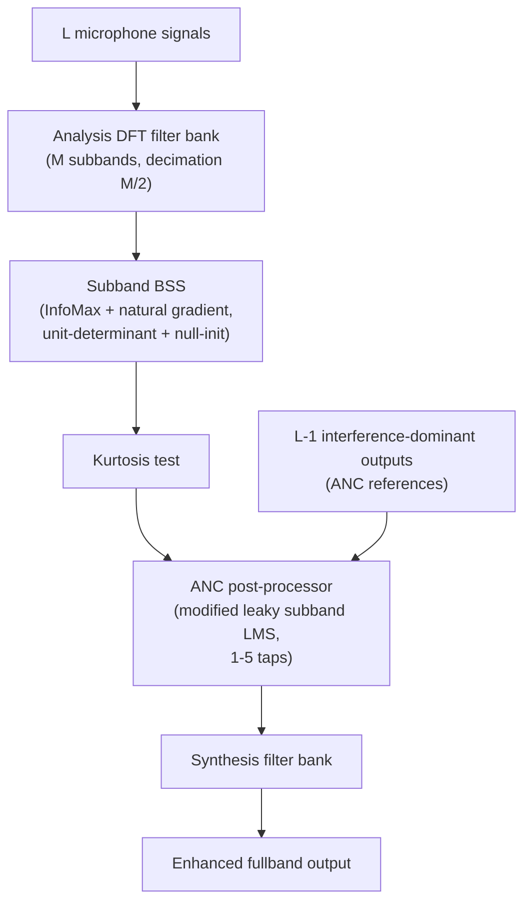

# Hybrid BSS-ANC Speech Enhancement

**Hybrid BSS-ANC speech enhancement** is the subband cascade structure introduced by [[sources/low-2004-hybrid-bss-anc|Low & Nordholm 2004]] in which [[concepts/blind-source-separation|blind source separation]] performs the spatial separation of target speech from interference and an adaptive noise canceller (ANC) then performs temporal noise cancellation on the speech-dominant BSS output — using the BSS's own $L-1$ interference-dominant outputs as reference signals. The key idea is to view the system as a **spatio-temporal processor**: "the BSS looking across the sensors (spatial) and the ANC looking across the time (temporal)".

## Motivation

BSS primarily exploits spatial diversity: it imposes (spatial) independence among the sources but leaves temporal residual interference in its outputs. Rather than discarding the $L-1$ interference-dominant outputs of an $L$-microphone BSS, the hybrid reuses them as ANC references — information that a plain BSS or a plain ANC would waste. The structure also bypasses all a priori information needed by conventional beamforming (array geometry, source localization), avoiding steering-vector errors.

## Architecture

Per subband $m$:

1. **Filter bank**: uniform over-sampled DFT analysis/synthesis banks ($M$ subbands, decimation $M/2$, Hamming prototype with cut-off $\pi/M$) make the convolutive mixture instantaneously mixable per subband.
2. **BSS**: InfoMax with natural-gradient update, $\Delta\mathbf{V}^{(m)} \propto \eta[\mathbf{I} - 2\varphi(\mathbf{y})(\mathbf{y})^{H}]\mathbf{V}^{(m)}$, with $\varphi = \tanh(\Re\cdot) + j\tanh(\Im\cdot)$; scaling fixed by $\det\mathbf{V}^{(m)}=1$ (volume conservation), permutation avoided by beamformer-like initialization toward an arbitrary jammer direction.
3. **Output selection**: [[concepts/kurtosis-based-output-selection|kurtosis-based output selection]] labels the speech-dominant output.
4. **ANC**: modified subband leaky LMS (Greenberg-style) with a power-normalized step size that shrinks during strong-speech intervals (excess MSE of LMS grows with target power); because processing is subband, 1–5 taps suffice. Output: $z^{(m)}(k) = y_{\mathrm{speech}}^{(m)}(k) - \sum_{l=1}^{L-1}\mathbf{w}_l^{(m)H}(k)\mathbf{y}_{l,\mathrm{ref}}^{(m)}(k)$.

## Reported Performance

With 2–5 microphones (5 cm spacing, 64 subbands), in a real car at 110 km/h (input SNR −7 dB) and a simulated multi-babble room (input SNR 0 dB, $T_{60}$ = 100 ms):

| No. microphones | Car | Room |
|-----------------|-----|------|
| 2 | 8.7 dB | 11.6 dB |
| 3 | 13.4 dB | 15.6 dB |
| 4 | 15.5 dB | 17.7 dB |
| 5 | 17.2 dB | 20.6 dB |

Even two microphones yield >10 dB SNR improvement; babble interference (speech-like) was chosen deliberately to stress robustness.

## Relation to Other Hybrid Structures

- Versus GSC-style beamformers (e.g., [[concepts/adaptive-blocking-matrix|adaptive blocking matrix]] routes): the hybrid needs no steering vector or array calibration — separation is blind; the ANC plays a role analogous to the interference canceller, but its references come from BSS outputs rather than a blocking matrix.
- Versus purely classical BSS: the ANC stage adds the temporal dimension that spatial-independence-based BSS does not exploit.
- The structure is a classical (non-neural) precursor of the hybrid data-driven + classical-structure family surveyed in [[synthesis/multi-channel-speech-enhancement|Multi-Channel Speech Enhancement]].

## Related Concepts

- [[concepts/blind-source-separation|Blind Source Separation]]
- [[concepts/kurtosis-based-output-selection|Kurtosis-Based Output Selection]]
- [[concepts/subband-adaptive-filter|Subband Adaptive Filter]]
- [[concepts/speech-enhancement|Speech Enhancement]]
- [[concepts/permutation-alignment|Permutation Alignment]]
- [[concepts/natural-gradient|Natural Gradient]]

## Related Sources

- [[sources/low-2004-hybrid-bss-anc|Low & Nordholm 2004: A Hybrid Speech Enhancement System Employing Blind Source Separation and Adaptive Noise Cancellation]]
