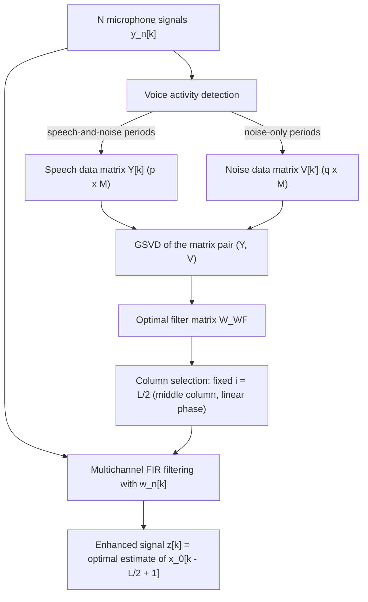

# Doclo & Moonen 2002: GSVD-Based Optimal Filtering for Single and Multimicrophone Speech Enhancement

- **Authors**: [[entities/simon-doclo|Simon Doclo]], [[entities/marc-moonen|Marc Moonen]]
- **Affiliations**: Katholieke Universiteit Leuven, ESAT-SISTA, Leuven, Belgium
- **Venue**: IEEE Transactions on Signal Processing, vol. 50, no. 9, pp. 2230–2244, Sept. 2002
- **Type**: Journal article
- **DOI**: [10.1109/TSP.2002.801937](https://doi.org/10.1109/TSP.2002.801937)
- **Zotero**: [Q8A6MGV4](zotero://select/items/0_Q8A6MGV4)

## Summary

This paper proposes a generalized singular value decomposition (GSVD) based algorithm for enhancing multimicrophone speech signals degraded by additive colored noise, unifying single-microphone signal subspace techniques and multichannel optimal filtering in one framework. The optimal filter matrix is written as a function of the generalized singular vectors and singular values of a speech and noise data matrix, and a number of symmetry properties are derived (valid for white and colored noise), leading to the conclusion that the averaging step used by some single-microphone subspace algorithms is unnecessary and even suboptimal. Simulations show the technique outperforms delay-and-sum and GSC beamforming for all reverberation times and is more robust to deviations from the nominal situation (uncalibrated arrays, microphone displacement, gain mismatch).

## Problem Formulation

Each of $N$ microphone signals is a filtered version of the clean speech plus additive noise,

$$y_n[k] = h_n[k] \otimes s[k] + v_n[k] = x_n[k] + v_n[k]$$

where $h_n[k]$ is the acoustic room impulse response between the speech source and microphone $n$. The noise can be colored and is assumed uncorrelated with the speech. With per-microphone FIR filters of length $L$, the stacked filter $\mathbf{w}[k]$ and stacked data vector $\mathbf{y}[k]$ have dimension $M = LN$.

![[raw/papers/doclo-2002-gsvd-optimal-filtering/figures/56f03d7dc430c42c8514894c1c175cc56963562eaf61c3dced85e590b8ffa576.jpg|Typical speech communication environment]]
*Figure 1: Typical speech communication environment with desired speech source and undesired noise sources recorded with a microphone array.*

The key twist versus textbook optimal filtering: the desired response $\mathbf{d}[k] = \mathbf{x}[k]$ (the received speech component) is **unobservable**. Two assumptions make the problem solvable:

1. **Short-term stationarity of the noise**, so the noise correlation matrix can be estimated during speech pauses identified by a [[concepts/voice-activity-detection|voice activity detection]] algorithm: $\mathbf{R}_{vv}[k] = \mathbf{R}_{vv}[k']$;
2. **Statistical independence** of speech and noise, $\mathbf{R}_{xv}[k] = \mathbf{0}$, which gives $\mathbf{R}_{yx}[k] = \mathbf{R}_{xx}[k] = \mathbf{R}_{yy}[k] - \mathbf{R}_{vv}[k]$.

Minimizing the MSE then yields the multidimensional Wiener filter in statistics-only form:

$$\mathbf{W}_{WF} = \mathbf{R}_{yy}^{-1}[k]\left(\mathbf{R}_{yy}[k] - \mathbf{R}_{vv}[k]\right)$$

Unlike the frequency-domain [[concepts/multi-channel-wiener-filter|multi-channel Wiener filter]] operating on spatial covariance matrices per T-F bin, this is a **time-domain spatio-temporal** filter matrix: both $\mathbf{R}_{yy}$ and $\mathbf{R}_{vv}$ contain temporal *and* spatial correlation information across the $M$-dimensional stacked vector.

If the clean speech admits a low-rank model of rank $R \le M$ (a standard assumption for clean speech, cf. Flanagan 1980, McAulay & Quatieri 1986), the joint diagonalization of $(\mathbf{R}_{xx}, \mathbf{R}_{vv})$ splits the space into a signal-plus-noise subspace (dimension $R$) and a noise subspace, with $\bar{\sigma}_i^2 > \bar{\eta}_i^2$ for $i \le R$ and $\bar{\sigma}_i^2 = \bar{\eta}_i^2$ for $i > R$ — the signal subspace idea lifted to the spatio-temporal domain.

## Methodology

### General Class of Estimators

All subspace-based estimators (single- and multi-microphone) share the form

$$\mathbf{W} = \bar{\mathbf{Q}}^{-T}\,\mathrm{diag}\left\{f\left(\bar{\sigma}_i^2, \bar{\eta}_i^2\right)\right\}\,\bar{\mathbf{Q}}^{T}$$

interpretable as a signal-dependent **analysis filterbank** $\bar{\mathbf{Q}}^{-T}$, a **gain function** $f(\cdot)$ on the transform-domain parameters, and a **synthesis filterbank** $\bar{\mathbf{Q}}^T$. Minimizing signal distortion subject to a residual-noise threshold (the perceptually motivated criterion of Ephraim & Van Trees) gives the parameterized family

$$\mathbf{W} = \bar{\mathbf{Q}}^{-T}\,\mathrm{diag}\left\{\frac{\bar{\sigma}_i^2 - \bar{\eta}_i^2}{\bar{\sigma}_i^2 + (\mu - 1)\bar{\eta}_i^2}\right\}\bar{\mathbf{Q}}^{T}$$

with $\mu = 1$ recovering the MSE/Wiener solution — the time-domain ancestor of the [[concepts/speech-distortion-constrained-noise-reduction|speech-distortion-constrained]] parameterization later formalized in the frequency domain.

### Practical Computation via GSVD

In practice $\bar{\mathbf{Q}}$, $\bar{\sigma}_i$, $\bar{\eta}_i$ are estimated from a $p \times M$ **speech data matrix** $\mathbf{Y}[k]$ (stacked data vectors during speech-and-noise periods) and a $q \times M$ **noise data matrix** $\mathbf{V}[k']$ (during noise-only periods), whose GSVD is

$$\mathbf{Y}[k] = \mathbf{U}_Y\boldsymbol{\Sigma}_Y\mathbf{Q}^T, \qquad \mathbf{V}[k'] = \mathbf{U}_V\boldsymbol{\Sigma}_V\mathbf{Q}^T$$

giving the filter estimate

$$\mathbf{W}_{WF} \simeq \mathbf{Q}^{-T}\,\mathrm{diag}\left\{1 - \frac{p}{q}\frac{\eta_i^2}{\sigma_i^2}\right\}\mathbf{Q}^{T}$$

Negative diagonal elements (zero estimates arising from finite-sample estimation) are clamped to zero.

### Which Estimate to Use

The filtering produces $M$ different estimates (one per column of $\mathbf{W}_{WF}$) for each delayed speech sample. The MSE-optimal choice is the column corresponding to the smallest diagonal element of the error covariance matrix $\mathbf{R}_{ee} = (\mathbf{R}_{yy} - \mathbf{R}_{vv})(\mathbf{I} - \mathbf{W}_{WF})$, but computing $\mathbf{R}_{ee}$ every time step is expensive; simulations show the fixed middle column $i = L/2$ performs nearly as well.

### Symmetry Properties and the Suboptimality of Averaging

Because the single-channel correlation matrices are symmetric Toeplitz (hence **double symmetric / centrosymmetric**), every eigenvector is symmetric or skew-symmetric, and the filter matrix satisfies

$$\mathbf{W} = J\mathbf{W}J, \qquad \mathbf{W}^T = J\mathbf{W}^TJ$$

with $J$ the reverse identity — valid for white *and* colored noise, for any gain function $f$. The $i$-th row/column equals the $(L+1-i)$-th in reversed order; for odd $L$ the middle column is a **linear phase filter** (extending the zero-phase property of averaged SVD truncation estimators to colored noise and general $f$). In the multichannel case, additional block symmetry $\mathbf{W} = S\mathbf{W}S$ (with the reverse block-identity $S$) holds under symmetric array conditions, implying $\mathbf{W}^{11} = \mathbf{W}^{22}$ and $\mathbf{W}^{12} = \mathbf{W}^{21}$.

Some single-microphone algorithms (Dendrinos et al.; Jensen et al.) average over all available estimates of a speech sample, producing a $(2L-1)$-tap zero-phase filter. The paper shows this averaging is:
- **not the $(2L-1)$-dimensional optimal filter** (it averages $L$-dimensional optimal filters rather than applying the optimal-filter formulas to the longer vector), and
- **suboptimal** — simulations ($L = 9$, $\eta^2 = 2$) show there always exists an $L$-dimensional column filter with lower error variance than the averaged filter, which also doubles the filter length.

The recommendation: use the middle column of $\mathbf{W}_{WF}$ (low error variance + linear phase) instead of averaging.

![[raw/papers/doclo-2002-gsvd-optimal-filtering/figures/98c51d4db1e81ec63b59689cb29f5f8169cb03cd8baf0bfad59f9f9645001d86.jpg|Error variance comparison between the averaged filter and individual column filters]]
*Figure 4: Error variance comparison between the $(2L-1)$-dimensional averaged filter $\tilde{\mathbf{w}}$ and the $L$-dimensional filters $\mathbf{w}_{WF}^i$ ($L = 9$, $\eta^2 = 2$) — some individual column filters always beat the averaged filter.*

### Computational Complexity

A full GSVD of two $p \times M$ matrices via Jacobi rotations costs $17M^3 + 3pM^2$ operations — infeasible per sample. Recursive Jacobi-type GSVD-updating (Moonen, Van Dooren & Vandewalle) reduces this to $27.5M^2$ per update including the $4M^2$ column computation ($21.5M^2$ square-root-free), and subsampling (updating every $r$ samples) cuts it further by $r$. For $N = 4$, $L = 20$, $p = 4000$, $f_s = 8$ kHz:

| Scheme | $r = 1$ | $r = 20$ |
|:-------|:--------|:---------|
| Non-recursive | 684 Gflops | 34.2 Gflops |
| Recursive updating | 1408 Mflops | 70.4 Mflops |
| Square-root-free updating | 1101 Mflops | 55.0 Mflops |

The algorithm was implemented in real time on a Pentium-III 450 MHz PC; a subband variant (Spriet, Moonen & Wouters 2002) improves performance at further reduced cost.

## Experimental Setup

| Item | Value |
|:-----|:------|
| Room | $6 \times 3 \times 2.5$ m, image-method RIRs, 1500 taps |
| Array | Linear equispaced, $N = 4$, 5 cm spacing |
| Speech source | 0.6 m from array, 8 kHz clean speech |
| Input SNR (first microphone) | 0 dB |
| Reverberation times | up to $T_{60} = 1500$ ms |
| Filter lengths | $L = 5, 20, 50, 80$ |
| Metric | Unbiased SNR (speech/noise components known in simulation) |
| Baselines | Delay-and-sum; GSC (NLMS, step size 0.2, 800-tap adaptive filter, no adaptation during speech) |
| Nonstationary noise | White noise filtered by time-varying FIR (lowpass 2400 Hz ↔ highpass 1600 Hz), $T_{60} = 300$ ms |

![[raw/papers/doclo-2002-gsvd-optimal-filtering/figures/2d63edc813bbef9cef230ed3a55a0c242b1c3f1ef879e5952e346c1c8b913d62.jpg|Simulation environment]]
*Figure 5: Simulation environment — room with microphone array, speech source, and noise source.*

## Results

- **Beamforming behavior**: For localized sources without multipath, the GSVD-based filter exhibits a spatial directivity pattern that automatically maximizes gain toward the speech direction (speech at 45° found without any steering information) and places nulls at noise-source directions (60°, 150°); spatial selectivity is poor at low frequencies. Unlike a GSC, the gain toward the speech source is not constrained to unity — it depends on the frequency content of speech and noise.

![[raw/papers/doclo-2002-gsvd-optimal-filtering/figures/5cd47e52d7177c35f4168cae8ed94d839bb3a8b488aa4a8c21e5679baa8f41a9.jpg|Spatial directivity patterns]]
*Figure 7: Spatial directivity pattern $|H(f, \theta)|$ for (a) spatio-temporal white noise with the speech source at 45° — the filter automatically finds the speech direction; (b) two localized noise sources at 60° and 150° with speech at 90° — nulls form at the noise directions.*
- **Noise reduction**: For all reverberation times, the GSVD-based technique outperforms the GSC (with sufficiently large $L$) and delay-and-sum. The GSC degrades markedly at high $T_{60}$ (diffuse, uncorrelated noise), while GSVD-based filtering still performs well — it does not rely on correlated noise across microphones.

![[raw/papers/doclo-2002-gsvd-optimal-filtering/figures/86137a5bccc8ed725261137afae6a6fd96e5381c2f90f843f49d292cb2642527.jpg|Generalized sidelobe canceller block diagram]]
*Figure 8: The generalized sidelobe canceller (GSC) — the adaptive-beamforming baseline: fixed delay-and-sum beamformer + blocking matrix + multichannel adaptive noise canceller.*

![[raw/papers/doclo-2002-gsvd-optimal-filtering/figures/e5e5ac4d102d32723f6562dc8712293e13fbea93cbc4f9af5fdbf3cca56a33fb.jpg|Unbiased SNR comparison]]
*Figure 9: Unbiased SNR for delay-and-sum, GSC, and GSVD-based optimal filtering ($N = 4$, SNR = 0 dB) — GSVD-based filtering outperforms both beamformers for all reverberation times when the filter length is large enough.*
- **Nonstationary noise**: Performance is practically independent of the temporal nonstationarity of the noise source; the procedure mainly exploits the **spatial** characteristics of the noise rather than its spectral characteristics.
- **Robustness**: The technique makes no a priori assumptions about source position or array geometry. It is more robust than the GSC against speech-source position errors, microphone displacement, and microphone gain mismatch; performance is provably insensitive to variations in microphone amplification and phase.

![[raw/papers/doclo-2002-gsvd-optimal-filtering/figures/f90d4b75ea3467bf3a331087cb8c94c5122f035e4ffa51a8448d510ddfc07752.jpg|Robustness to microphone displacement]]
*Figure 12: Unbiased SNR difference between GSVD-based optimal filtering and the GSC ($N = 4$, $L = 80$, SNR = 0 dB) for displaced second-microphone positions — the advantage grows with displacement.*

![[raw/papers/doclo-2002-gsvd-optimal-filtering/figures/d5168cde42499c39118bd342ed80b4dffc6709a2d0a52a0f04a4dbde3aed2024.jpg|Robustness to microphone amplification mismatch]]
*Figure 13: Unbiased SNR difference for different amplifications $g_2$ of the second microphone — at higher reverberation the advantage grows with gain mismatch; GSVD-based filtering is provably insensitive to microphone gain/phase variations.*
- **VAD sensitivity**: Misclassifying speech as noise causes signal cancellation (analogous to signal leakage in GSC noise references); misclassifying noise as speech merely reduces noise reduction.

## Key Contributions

1. **Multimicrophone signal subspace framework**: extends single-microphone SVD/KLT signal subspace enhancement to an integrated spatio-temporal technique that exploits both frequency and spatial characteristics of speech and noise — in contrast to prior combinations of single-channel subspace filters with delay-and-sum beamforming (Hansen; Jabloun & Champagne).
2. **GSVD-based practical computation**: expresses the optimal filter matrix as a function of the generalized singular vectors/values of the speech and noise data matrices, jointly diagonalizing the empirical correlation estimates.
3. **Symmetry properties**: proves centrosymmetric ($\mathbf{W} = J\mathbf{W}J$) and block-symmetric ($\mathbf{W} = S\mathbf{W}S$) structure of the filter matrix for white *and* colored noise and arbitrary gain functions, implying the linear-phase property of the middle column.
4. **Averaging suboptimality**: demonstrates that the diagonal-averaging step of Dendrinos-type and Jensen-type algorithms is unnecessary and even suboptimal, and recommends the middle-column filter instead.
5. **Beamformer-level performance without steering**: shows the technique autonomously forms directivity patterns toward the speech source and nulls toward noise sources, without source-position estimation or array calibration.
6. **Robustness + real-time feasibility**: outperforms GSC for all reverberation times, tolerates uncalibrated arrays (gain/phase insensitivity), and is real-time implementable via recursive GSVD updating and subsampling (684 Gflops → 55 Mflops).

## Related Concepts

- [[concepts/gsvd-based-optimal-filtering|GSVD-Based Optimal Filtering]] — the method introduced by this paper
- [[concepts/signal-subspace-speech-enhancement|Signal Subspace Speech Enhancement]] — the single-microphone family this work extends
- [[concepts/multi-channel-wiener-filter|Multi-Channel Wiener Filter]] — the time-domain spatio-temporal instantiation
- [[concepts/gevd-spatial-filtering|GEVD-Based Spatial Filtering]] — the frequency-domain/SCM descendant of the same joint-diagonalization idea
- [[concepts/gsc-beamformer|Generalized Sidelobe Canceller (GSC)]] — the main adaptive-beamforming baseline
- [[concepts/singular-value-decomposition|Singular Value Decomposition]] — GSVD generalizes SVD to a matrix pair
- [[concepts/speech-distortion-constrained-noise-reduction|Speech-Distortion-Constrained Noise Reduction]] — the $\mu$-parameterized distortion/residual-noise trade-off
- [[concepts/voice-activity-detection|Voice Activity Detection]] — gates the speech/noise data matrices
- [[concepts/beamforming|Beamforming]] — the spatial-filtering interpretation

## Related Synthesis

- [[synthesis/multi-channel-speech-enhancement|Multi-Channel Speech Enhancement]] — classical model-based axis: time-domain GSVD optimal filtering as a robust, calibration-free alternative to GSC-type adaptive beamforming
