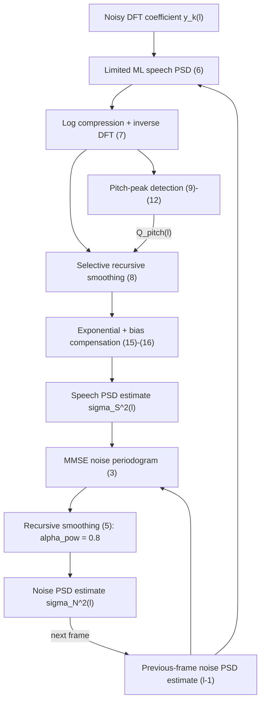

# Gerkmann & Hendriks 2012: Improved MMSE-Based Noise PSD Tracking Using Temporal Cepstrum Smoothing

**Authors**: [[entities/timo-gerkmann|Timo Gerkmann]], [[entities/richard-c-hendriks|Richard C. Hendriks]]
**Affiliations**: Speech Signal Processing, Universität Oldenburg, Germany (Gerkmann); Signal and Information Processing Lab, Delft University of Technology, The Netherlands (Hendriks)
**Venue**: IEEE International Conference on Acoustics, Speech and Signal Processing (ICASSP) 2012, Kyoto, Japan
**Type**: Conference paper (4 pages)
**DOI**: [10.1109/ICASSP.2012.6287828](https://doi.org/10.1109/ICASSP.2012.6287828)
**Zotero**: `zotero://select/items/0_UXNT8S25`

> **Note on the Zotero record**: the Zotero abstract field is truncated mid-sentence ("The MMSE-based approach em…"); the full abstract was taken from the extracted paper text. The extraction (MinerU) dropped the closing section numbering and no page range was available from the metadata — the venue/year above were confirmed from the title page and publisher DOI.

## Summary

This paper revisits [[concepts/mmse-based-noise-psd-estimation|MMSE-based noise PSD estimation]] (Hendriks, Heusdens & Jensen, ICASSP 2010), which tracks the noise power spectral density (PSD) faster than [[concepts/minimum-statistics|minimum statistics]] (MS) but requires **two** speech PSD estimates: a limited maximum-likelihood (ML) estimate to evaluate the conditional noise-periodogram expectation, plus a [[concepts/decision-directed-a-priori-snr|decision-directed (DD)]] estimate used solely to compensate the bias that the limited ML estimate introduces.

The authors replace both with a **single** speech PSD estimate obtained by [[concepts/temporal-cepstrum-smoothing|temporal cepstrum smoothing]] (TCS), which exploits a priori knowledge of speech spectral structure — the few low cepstral coefficients carrying the spectral envelope and the cepstral peak carrying the fundamental period of voiced speech. Because the TCS estimate is largely bias-free (up to a known, analytically computable scaling $B$), the separate bias-compensation branch and the DD estimate become unnecessary. On TIMIT with modulated white Gaussian noise and babble noise, the proposed estimator achieves a lower log noise-estimation error (LogErr) than both the original MMSE approach and MS, produces the largest noise reduction and the largest segmental-SNR gain at comparable speech distortion, and gains roughly **1 dB** of segmental SNR in babble noise at 0 dB input SNR. The cost is two additional real-valued Fourier transforms (cepstral transform and its inverse).

## Problem Formulation

The signal model is the standard additive STFT model. With $S_k(l)$, $N_k(l)$ and $Y_k(l)$ the complex speech, noise and noisy DFT coefficients at frequency bin $k$ and frame $l$:

$$Y_k(l) = S_k(l) + N_k(l) \tag{1}$$

Speech and noise are assumed zero-mean, mutually independent and uncorrelated, so that the periodogram decomposes:

$$\mathrm{E}\left[|Y_k(l)|^2\right] = \mathrm{E}\left[|S_k(l)|^2\right] + \mathrm{E}\left[|N_k(l)|^2\right] \tag{2}$$

with speech PSD $\sigma_{\mathrm{S}}^2 = \mathrm{E}[|S|^2]$, noise PSD $\sigma_{\mathrm{N}}^2 = \mathrm{E}[|N|^2]$ and a priori SNR $\xi = \sigma_{\mathrm{S}}^2 / \sigma_{\mathrm{N}}^2$. Hats denote estimates.

The noise PSD is the crucial parameter of any spectral-domain noise-reduction system, and it is unknown in practice. The problem addressed here is: **given only the noisy periodogram, track $\sigma_{\mathrm{N}}^2$ accurately and quickly** — including for noise that changes within the time span of one second, where MS-based estimators degrade.

## Methodology

### Baseline: MMSE-based noise PSD estimation (Hendriks et al. 2010)

The estimator is built on the MMSE estimate of the noise periodogram, i.e. the conditional expectation $\mathrm{E}\left[|N|^2 \mid y\right]$. Assuming complex Gaussian speech and noise DFT coefficients with variances $\sigma_{\mathrm{S}}^2$ and $\sigma_{\mathrm{N}}^2$:

$$\mathrm{E}\left[|N|^2 \mid y\right] = \left(\frac{\sigma_{\mathrm{N}}^2}{\sigma_{\mathrm{N}}^2 + \sigma_{\mathrm{S}}^2}\right)^{2} |y|^{2} + \frac{\sigma_{\mathrm{S}}^2}{\sigma_{\mathrm{N}}^2 + \sigma_{\mathrm{S}}^2}\, \sigma_{\mathrm{N}}^2 \tag{3}$$

Both PSDs in (3) are unknown expected values that must themselves be estimated. The noise PSD is taken from the previous frame, $\widehat{\sigma_{\mathrm{N}}^2} = \widehat{\sigma_{\mathrm{N}}^2}(l-1)$, relying on the noise changing slowly from frame to frame. For the speech PSD a **limited ML estimate** is used:

$$\widehat{\sigma_{\mathrm{S,ML}}^2} = \max\left(0,\; |y|^2 - \widehat{\sigma_{\mathrm{N}}^2}\right) \tag{4}$$

Because the ML estimate is biased, $\mathrm{E}\left[|N|^2 \mid y\right]$ inherits a bias that can be computed analytically as a function $B(\sigma_{\mathrm{S}}^2, \sigma_{\mathrm{N}}^2)$ of the two PSDs. Evaluating that bias requires a *second*, different speech PSD estimate — obtained via the [[concepts/decision-directed-a-priori-snr|decision-directed (DD)]] approach, $\widehat{\sigma_{\mathrm{S,DD}}^2}$ — so the corrected noise periodogram estimate is

$$\widetilde{\sigma_{\mathrm{N}}^2} = \mathrm{E}\left[|N|^2 \mid y, \widehat{\sigma_{\mathrm{S,ML}}^2}, \widehat{\sigma_{\mathrm{N}}^2}\right] B\!\left(\widehat{\sigma_{\mathrm{S,DD}}^2}, \widehat{\sigma_{\mathrm{N}}^2}\right)$$

followed by recursive temporal smoothing to suppress small frame-to-frame variations:

$$\widehat{\sigma_{\mathrm{N}}^2}(l) = \alpha_{\mathrm{pow}}\, \widehat{\sigma_{\mathrm{N}}^2}(l-1) + (1 - \alpha_{\mathrm{pow}})\, \widetilde{\sigma_{\mathrm{N}}^2}, \qquad \alpha_{\mathrm{pow}} = 0.8 \tag{5}$$

To prevent the estimator from locking onto a too-low value, the current estimate is additionally forced to be at least the minimum of the noisy periodograms of the last **0.8 s**.

The key structural weakness this paper attacks: the baseline exploits **two different speech PSD estimators** (limited ML *and* DD) purely because of the ML bias, and therefore carries a dedicated bias-compensation branch.

### Proposed approach: speech PSD estimation via temporal cepstrum smoothing

The proposal keeps the MMSE machinery of (3) and (5) intact and replaces only the speech PSD estimation feeding (3) — with a TCS-based estimate, in the spirit of the selective cepstro-temporal smoothing of Breithaupt, Gerkmann & Martin (ICASSP 2008). The rationale: in the cepstral domain speech occupies a *small, known* set of coefficients (low quefrency → spectral envelope; a peak → the fundamental period of voiced speech), while non-speech-like spectral structures map elsewhere. Selective smoothing — little or no smoothing on speech-related coefficients, strong smoothing on the rest — therefore removes non-speech outliers while preserving speech structure.

**Step 1 — preliminary (limited ML) speech PSD.** As in (4), but with a lower limit that reduces speech distortion:

$$\widehat{\sigma_{\mathrm{S},k}^2}^{\mathrm{pre}} = \max\left(\widehat{\sigma_{\mathrm{N},k}^2}\, \xi_{\min},\; |y_k(l)|^2 - \widehat{\sigma_{\mathrm{N},k}^2}\right), \qquad 10\log_{10}(\xi_{\min}) = -30\ \mathrm{dB} \tag{6}$$

**Step 2 — cepstral transform.** With transform length $K$ and cepstral index $q$, the real cepstrum is the inverse Fourier transform of the log spectrum:

$$\widehat{\sigma_{\mathrm{S},q}^2}^{\mathrm{pre,ceps}} = \frac{1}{K} \sum_{k=0}^{K-1} \log\left(\widehat{\sigma_{\mathrm{S},k}^2}^{\mathrm{pre}}\right) \mathrm{e}^{\,\mathrm{j}2\pi kq/K} \tag{7}$$

Only the lower symmetric part $q \in \{0, \dots, K/2\}$ is used.

**Step 3 — selective recursive smoothing across time**, per cepstral bin, with a bin- and frame-dependent smoothing factor $0 \le \alpha_q(l) \le 1$:

$$\widehat{\sigma_{\mathrm{S},q}^2}^{\mathrm{ceps}}(l) = \alpha_q(l)\, \widehat{\sigma_{\mathrm{S},q}^2}^{\mathrm{ceps}}(l-1) + \left(1 - \alpha_q(l)\right) \widehat{\sigma_{\mathrm{S},q}^2}^{\mathrm{pre,ceps}}(l) \tag{8}$$

**Step 4 — fundamental-period (pitch) detection.** The speech-related bins must be identified before $\alpha_q$ can be set. Because voiced power is lower at high frequencies, the cepstrum is first smoothed by convolution with a short Hamming window $w_{\mathrm{H},q}$ of length $\tau_{\mathrm{H}} = f_{\mathrm{s}}/2000\ \mathrm{Hz} = 8$ (a filtering of the cepstrum that de-emphasizes high frequencies and makes peak picking more robust):

$$\overline{\sigma_{\mathrm{S},q}^2}^{\mathrm{ceps}}(l) = \widehat{\sigma_{\mathrm{S},q}^2}^{\mathrm{ceps}}(l) * w_{\mathrm{H},q} * w_{\mathrm{H},-q} \tag{9}$$

$$w_{\mathrm{H},q} = \begin{cases} 0.54 - 0.46\cos\left(2\pi \dfrac{q + \tau_{\mathrm{H}}/2}{\tau_{\mathrm{H}}}\right) & \text{for } -\tau_{\mathrm{H}}/2 \le q < \tau_{\mathrm{H}}/2 \\ 0 & \text{else} \end{cases} \tag{10}$$

The cepstral index most likely representing the fundamental period is the maximum of the smoothed cepstrum within a quefrency window derived from the admissible pitch range $f_{0,\mathrm{low}} = 70$ Hz to $f_{0,\mathrm{high}} = 300$ Hz, i.e. $q_{\mathrm{low}} = \lfloor f_{\mathrm{s}} / f_{0,\mathrm{high}} \rfloor$ to $q_{\mathrm{high}} = \lfloor f_{\mathrm{s}} / f_{0,\mathrm{low}} \rfloor$:

$$q_0(l) = \arg\max_q \left\{\overline{\sigma_{\mathrm{S},q}^2}^{\mathrm{ceps}}(l) \;\middle|\; q_{\mathrm{low}} \le q \le q_{\mathrm{high}}\right\} \tag{11}$$

The peak is compared against a threshold $\Lambda^{\mathrm{thr}}$ to decide whether it really represents a voiced fundamental; the set of pitch-related cepstral bins is

$$\mathbb{Q}_{\mathrm{pitch}}(l) = \begin{cases} \left\{q_0(l) - \Delta q_0, \dots, q_0(l) + \Delta q_0\right\} & \text{if } \overline{\sigma_{\mathrm{S},q_0}^2}^{\mathrm{ceps}}(l) \ge \Lambda^{\mathrm{thr}} \\ \emptyset & \text{otherwise} \end{cases} \tag{12}$$

with a small margin $\Delta q_0 = 2$ and $\Lambda^{\mathrm{thr}} = 0.1$. Lowering $\Lambda^{\mathrm{thr}}$ protects the fundamental period better but reduces outlier suppression in unvoiced speech and speech pauses; $0.1$ is reported as a good trade-off.

**Step 5 — adaptive smoothing factor.** Pitch-related bins receive a fixed small smoothing factor; all other bins relax back toward a quefrency-dependent constant with a forgetting factor $\beta$, so that a *pitch-detection error in one frame does not immediately cause strong smoothing of the fundamental-period peak*:

$$\alpha_q(l) = \begin{cases} \alpha_{\mathrm{pitch}} & \text{if } q \in \mathbb{Q}_{\mathrm{pitch}} \\ \beta\, \alpha_q(l-1) + (1-\beta)\, \alpha_q^{\mathrm{const}} & \text{otherwise} \end{cases} \tag{13}$$

with $\alpha_{\mathrm{pitch}} = 0.2$ and $\beta = 0.96$. The quefrency-dependent constant makes smoothing weak for the low (envelope) coefficients and strong for the upper coefficients that carry non-speech-like structure:

$$\alpha_q^{\mathrm{const}} = \begin{cases} 0 & q < 3 \\ 0.2 & 3 \le q < 20 \\ 0.85 & 20 \le q \le 256 \end{cases} \tag{14}$$

(the bound 256 corresponds to $K/2$ for the $K = 512$ transform used in the evaluation). The algorithm is reported as insensitive to the exact choice of $\alpha_q^{\mathrm{const}}$.

**Step 6 — back-transform and bias compensation.** The smoothed cepstrum is mapped back to the frequency domain:

$$\widehat{\sigma_{\mathrm{S},k}^2}(l) = \mathcal{B} \cdot \exp\left(\sum_{q=0}^{K-1} \widehat{\sigma_{\mathrm{S},q}^2}^{\mathrm{ceps}}(l)\, \mathrm{e}^{-\mathrm{j}2\pi kq/K}\right) \tag{15}$$

The factor $\mathcal{B}$ compensates the bias introduced by the non-linear log compression in (7) followed by smoothing in the log domain. Gerkmann & Martin (IEEE TSP 2009) derived it analytically under distributional assumptions on the speech DFT coefficients and Hann-windowed frames:

$$\mathcal{B} = \frac{\exp\left(\psi(\bar{\mu}) + C\right)}{\bar{\mu}} \tag{16}$$

where $C = 0.5772$ is Euler's constant and $\psi(\cdot)$ is Euler's psi function; the parameter $\bar{\mu}$ follows from the amount of cepstral smoothing $\alpha_q(l)$. For the chosen $\alpha_q^{\mathrm{const}}$ the resulting bias typically lies in $1.45 < \mathcal{B} < 1.55$.

Finally, $\widehat{\sigma_{\mathrm{S},k}^2}(l)$ from (15) is substituted into (3) to estimate the noise periodogram, followed by the same recursive smoothing (5). **No DD estimate and no separate ML-bias compensation are needed.**

### Algorithm data flow

*Figure: the proposed estimator. Only the speech-PSD branch differs from the baseline of Hendriks et al. (2010); the MMSE noise-periodogram estimate (3) and the recursive power smoothing (5) are unchanged.*

## Experimental Setup

| Aspect | Setting |
|---|---|
| Spectral analysis | 32 ms Hann windows, 50% overlap |
| DFT length | $K = 512$ |
| Sampling rate | $f_{\mathrm{s}} = 16$ kHz |
| Speech material | 320 sentences from the TIMIT database |
| Noise types | Modulated white Gaussian noise ($f(m) = 1 + 0.5\sin(2\pi m f_{\mathrm{mod}}/f_{\mathrm{s}})$, $f_{\mathrm{mod}} = 0.5$ Hz) and babble noise |
| Input SNR | Segmental SNRs between −10 dB and 15 dB |
| Acoustic conditions | Free field |
| Noise-PSD metrics | LogErrOver and LogErrUnder (log-domain over-/underestimation of the noise power, summed to LogErr); lower is better |
| Noise reference | True noise power for modulated Gaussian noise; periodogram of the noise-only signal for babble |
| Enhancement framework | Super-Gaussian spectral amplitude estimator (Erkelens et al. 2007) with $\gamma = 1$, $\nu = 0.6$; a priori SNR via [[concepts/decision-directed-a-priori-snr|decision-directed]] updating with $\alpha_{\mathrm{dd}} = 0.98$ |
| Enhancement metrics | Segmental SNR, segmental speech SNR, amount of noise reduction (all: larger is better) |
| Baselines | MMSE-ref (Hendriks, Heusdens & Jensen, ICASSP 2010) and MS ([[sources/martin-2001-noise-psd-estimation-optimal-smoothing\|Martin 2001]]) |

## Results

The results are reported graphically as grouped bar charts (Fig. 1 for modulated white Gaussian noise, Fig. 2 for babble); the paper's own discussion is qualitative and is summarized here rather than transcribing bar heights.

**Noise tracking accuracy.** The proposed TCS-based estimator yields **lower LogErr** than both MMSE-ref and MS, for both noise types.

**Speech distortion vs. noise reduction.** MS produces the highest segmental speech SNR but the **lowest amount of noise reduction** — it preserves speech at the cost of leaving noise behind. The MMSE-based approaches achieve a better trade-off, indicated by a larger segmental-SNR gain. Among them, the proposed estimator gives the **largest noise reduction and the largest segmental-SNR improvement while maintaining a speech SNR similar to MMSE-ref**.

**Babble noise.** The advantage is largest in babble: approximately **1 dB** of segmental-SNR improvement at 0 dB input SNR relative to the competing approaches.

**Complexity.** The additional cost is dominated by **two real-valued Fourier transforms** for the cepstral transform and its inverse. The paper notes this can be reduced using pruned Fourier transforms (Gerkmann & Martin, ITG Sprachkommunikation 2010).

### Figure 1 — Modulated white Gaussian noise

![[raw/papers/gerkmann-2012-mmse-noise-psd-tracking/figures/921c4c394b5886d7dcc500319f3d3379523fe2fe0a7273ff37f9a402c5827049.jpg|(a) Log estimation error]]
![[raw/papers/gerkmann-2012-mmse-noise-psd-tracking/figures/687de355ab782c7d351dfee55898a5957cfa8c3dc48d6451f7d405092f67af65.jpg|(b) Segmental SNR improvement]]
![[raw/papers/gerkmann-2012-mmse-noise-psd-tracking/figures/d53d7f42a7fb946d25edfe272fca4acf02e184b2ad53f293ae46eaae53d2b047.jpg|(c) Segmental speech SNR]]
![[raw/papers/gerkmann-2012-mmse-noise-psd-tracking/figures/8886d9f265326a1da62dd197d9d312520eb6c0db45b2263e8aa116f366c15454.jpg|(d) Segmental noise reduction]]

*Figure 1: Quality measures for modulated white Gaussian noise. In subfigure (a) the lower part of each bar is the noise overestimation LogErrOver and the upper part the underestimation LogErrUnder; total bar height is the LogErr.*

### Figure 2 — Babble noise

![[raw/papers/gerkmann-2012-mmse-noise-psd-tracking/figures/289275e6e46f547a3f6b24abaef6a170ddfcbd3226f4cdd67fda2965b0049e0b.jpg|(a) Log estimation error]]
![[raw/papers/gerkmann-2012-mmse-noise-psd-tracking/figures/19392abbabf4468414f2986002ced1ca30d6dd00a9393d82bb5a2e5565bfacee.jpg|(b) Segmental SNR improvement]]
![[raw/papers/gerkmann-2012-mmse-noise-psd-tracking/figures/884630ba52689b017a6a634999871fcd48edee002ec7d3872cd54f91a62d2b9c.jpg|(c) Segmental speech SNR]]
![[raw/papers/gerkmann-2012-mmse-noise-psd-tracking/figures/1fb627c312bab650c8c4cb9911603df101006e058df6e357f96792330fbd7099.jpg|(d) Segmental noise reduction]]

*Figure 2: Quality measures for babble noise. As in Figure 1, the bars in subfigure (a) indicate noise overestimation and underestimation.*

## Key Contributions

1. **Single speech PSD estimate instead of two.** Replacing the limited-ML plus DD pair of the baseline with one [[concepts/temporal-cepstrum-smoothing|TCS]]-based speech PSD estimate removes the need for a separate, DD-driven bias-compensation branch — the TCS bias is a known analytic scaling $\mathcal{B}$ (typically 1.45–1.55) rather than something that must be re-estimated per frame.
2. **Improved noise tracking, largest gain in babble noise.** Lower LogErr than both MMSE-ref and MS, with roughly 1 dB segmental-SNR improvement at 0 dB input SNR in babble.
3. **Pitch-protecting selective cepstral smoothing.** A concrete, fully specified smoothing rule: pitch peak found in a 70–300 Hz quefrency window on a Hamming-smoothed cepstrum (9)–(12), protected by a small $\alpha_{\mathrm{pitch}} = 0.2$ with a forgetting factor $\beta = 0.96$ that prevents a single pitch-detection error from over-smoothing the peak (13), and a three-region quefrency-dependent constant $\alpha_q^{\mathrm{const}}$ (14).
4. **Explicit complexity statement.** The improvement costs two extra real-valued FFTs (cepstrum and inverse), reducible via pruned FFTs — a small, quantified price relative to the full enhancement pipeline.
5. **Improved distortion/noise-reduction trade-off.** At a speech SNR comparable to MMSE-ref, the proposed method attains the largest noise reduction and segmental-SNR gain; MS preserves speech better but removes the least noise.

## Related Concepts

- [[concepts/temporal-cepstrum-smoothing|Temporal Cepstrum Smoothing (TCS)]] — the selective cepstral-domain smoothing mechanism this paper builds on
- [[concepts/mmse-based-noise-psd-estimation|MMSE-Based Noise PSD Estimation]] — the estimator family being improved
- [[concepts/minimum-statistics|Minimum Statistics]] — the main alternative single-channel noise PSD estimator, used as a baseline
- [[concepts/decision-directed-a-priori-snr|Decision-Directed A Priori SNR Estimation]] — the second speech PSD estimator the proposal makes redundant
- [[concepts/speech-presence-probability|Speech Presence Probability (SPP)]] — the soft-decision paradigm for single-channel noise PSD estimation
- [[concepts/cepstral-space-speech-enhancement|Cepstral-Space Speech Enhancement]] — neural counterpart that also exploits cepstral-domain structure
- [[concepts/voice-activity-detection|Voice Activity Detection]] — the MMSE-based estimator is VAD-free, like minimum statistics

## Related Synthesis

_None. Triage (`triage_synthesis.py`) returned no synthesis page with a substantive tag overlap — the paper is a classical single-channel noise-PSD estimator off the wiki's ANC / multichannel / deep-SE synthesis axes._

## Related Sources

- [[sources/martin-2001-noise-psd-estimation-optimal-smoothing|Martin 2001: Noise PSD Estimation via Optimal Smoothing and Minimum Statistics]] — the MS baseline this paper outperforms in tracking speed
