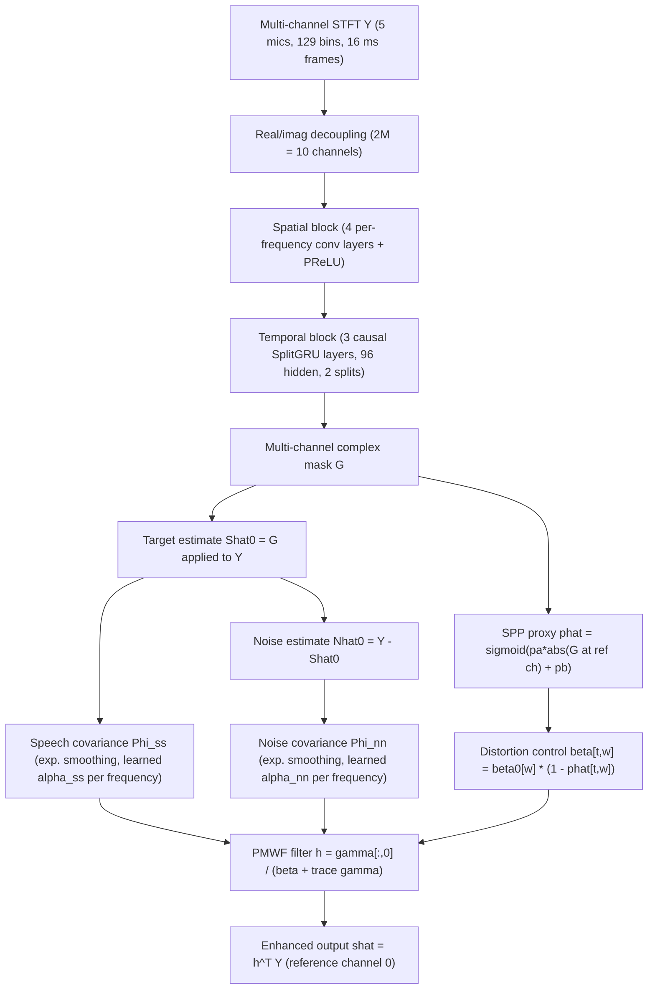

# Grinstein et al. 2025: Controlling the PMWF Using a Tiny Neural Network

**Authors**: [[entities/eric-grinstein|Eric Grinstein]], [[entities/ashutosh-pandey|Ashutosh Pandey]], [[entities/cole-li|Cole Li]], [[entities/shanmukha-srinivas|Shanmukha Srinivas]], [[entities/juan-azcarreta|Juan Azcarreta]], [[entities/jacob-donley|Jacob Donley]], [[entities/sanha-lee|Sanha Lee]], [[entities/ali-aroudi|Ali Aroudi]], [[entities/cagdas-bilen|Çağdaş Bilen]]
**Institutions**: Imperial College London, U.K.; Meta Reality Labs; Ohio State University (first author's work done during a research internship at Meta)
**Venue**: arXiv preprint 2507.13863 (submitted 18 Jul 2025)
**Type**: Preprint
**DOI**: [10.48550/arXiv.2507.13863](https://doi.org/10.48550/arXiv.2507.13863)
**Zotero**: [QK787TMQ](zotero://select/items/0_QK787TMQ)

## Summary

This paper presents **NeuralPMWF**, a hybrid multi-channel speech enhancement system in which a tiny neural network (164.9k parameters, 24.95 MMACs/s, 16 ms algorithmic latency) *fully controls* the [[concepts/parametric-multi-channel-wiener-filter|parameterized multi-channel Wiener filter (PMWF)]]: the network estimates a multi-channel complex-valued T-F mask from which speech and noise covariance matrices are derived by exponential smoothing; the smoothing speeds $\alpha_{ss}, \alpha_{nn}$ are learned frequency-dependent parameters; and the PMWF's distortion trade-off parameter $\beta$ is driven dynamically by a speech-presence-probability proxy computed from the mask. On a simulated 5-microphone smart-glasses scenario, NeuralPMWF surpasses low-compute neural baselines (TinyGRU+MWF, GTCRN+MWF, MCCRN+MWF) on STOI, SI-SDR, SNR, and NB-PESQ at comparable computational cost, with the SPP-driven dynamic $\beta$ contributing the largest single gain.

## Problem Formulation

In the STFT domain, the multi-channel received signal is

$$
\mathbf{Y}=\mathbf{S}+\mathbf{N}\in\mathbb{C}^{T\times F\times M},
$$

with $T, F$ the number of time and frequency bins and $M$ the number of microphone channels. The goal is to estimate the source signal at reference channel $0$, i.e. $\mathbf{S}_0=\mathbf{S}[:,:,0]$, using a causal time-frequency-varying filter $\mathbf{h}[t,w]\in\mathbb{C}^{M}$ that combines all channels (Eq. 2 as printed applies $\mathbf{h}$ to $\mathbf{S}$; the intended operand is evidently the observation $\mathbf{Y}$). The filter is chosen as the PMWF (Souden, Benesty & Affes 2010), derived with Lagrange multipliers:

$$
\begin{split}
\boldsymbol{\gamma}[t,w]&=\mathbf{\Phi}^{-1}_{nn}[t,w]\,\mathbf{\Phi}_{ss}[t,w]\in\mathbb{C}^{M\times M}\\
\mathbf{h}[t,w]&=\frac{\boldsymbol{\gamma}[t,w][:,0]}{\beta[t,w]+\text{trace}(\boldsymbol{\gamma}[t,w])},
\end{split}
$$

where $\mathbf{\Phi}_{xx}=\mathbb{E}(\mathbf{X}[t,w]\mathbf{X}[t,w]^{H})$ for $\mathbf{X}\in\{\mathbf{S},\mathbf{N}\}$, the numerator selects reference channel $0$ of $\boldsymbol{\gamma}$, and the parameter $\beta$ controls the output speech distortion: $\beta=0$ gives the [[concepts/mvdr-beamformer|MVDR beamformer]], $\beta=1$ the [[concepts/multi-channel-wiener-filter|MWF]]. The design tension the paper addresses: neural networks achieve strong noise suppression but introduce speech distortion and high compute; classical filters offer an explicit suppression/distortion trade-off but need reliable second-order statistics and, historically, fixed or hand-tuned $\beta$ (the only prior dynamic-control works — Braun et al. 2015, Bagheri & Giacobello 2019, Ngo et al. 2009 — rely on specialized parameter tuning).

## Methodology

### Model Structure, Inputs, and Outputs

![[raw/papers/grinstein-2025-tiny-param-mwf/figures/simplified_system.svg|Overview of the proposed NeuralPMWF method]]

*Figure 1: Overview of the proposed NeuralPMWF method.*

![[raw/papers/grinstein-2025-tiny-param-mwf/figures/system.svg|System overview; DNN blocks in blue, DSP blocks in green]]

*Figure 2: System overview. DNN blocks are coloured in blue, and DSP blocks are coloured in green.*

The system runs a tiny DNN (MaskDNN) alongside classical DSP. The network estimates a multi-channel complex-valued T-F mask $\mathbf{G}$; the mask yields a multi-channel target-speech estimate $\hat{\mathbf{S}}_0$ and, by subtraction, a noise estimate $\hat{\mathbf{N}}_0=\mathbf{Y}-\hat{\mathbf{S}}_0$; both feed exponentially smoothed covariance matrices, from which the PMWF filter is computed. The control parameters ($\beta$ and, during training, $\alpha_{ss}/\alpha_{nn}$) are derived from the same mask.

**MaskDNN spec** (single network, trained end-to-end jointly with the learned control parameters):

| Spec | Value |
|:-----|:------|
| Structure | **Spatial block**: 4 spatial convolution layers operating per frequency bin ($F$ distinct matrices per layer, mimicking frequency-domain Filter-And-Sum), each followed by PReLU; the first 3 keep the channel size at 10, the last outputs one additional channel for the temporal block. **Temporal block**: the extra channel is linearly projected to size $H$, processed by 3 causal SplitGRU layers (hidden size 96, split factor 2), then linearly projected to size $F$. Temporal output acts as a real mask applied independently to each channel of the spatial output, forming the multi-channel complex mask $\mathbf{G}$. |
| Input | Real and imaginary parts of the 5-channel STFT ($2M=10$ channels $\times$ $T\times F$, $F=129$), 256-sample window / 128-sample hop at 16 kHz (16 ms frame rate) |
| Output | Multi-channel complex-valued T-F mask $\mathbf{G}\in\mathbb{C}^{T\times F\times M}$, one frame per 16 ms; plus learned time-invariant per-frequency control vectors $\mathbf{p}^{(a)},\mathbf{p}^{(b)},\boldsymbol{\alpha}^{(0)}_{ss},\boldsymbol{\alpha}^{(0)}_{nn},\boldsymbol{\beta}^{(0)}\in\mathbb{R}^{F}$ (not fully-connected layers — plain element-wise gains, found cheaper and more stable) |
| Training data | 320k simulated 10-s utterances from the [[concepts/dns-challenge|Interspeech 2020 DNS Challenge]] corpus, room-simulated (image method, order 6) onto a 5-microphone array resembling Rayban Meta smart glasses using measured anechoic ATFs |
| Role | Produces the mask that (i) yields $\hat{\mathbf{S}}_0$ / $\hat{\mathbf{N}}_0$ for covariance estimation and (ii) drives the SPP proxy that schedules the distortion parameter $\beta$ |
| Budget | 164.9k parameters, 24.95 MMACs/s, 16 ms algorithmic latency |

### Covariance Estimation and Control (Sec. 3.1)

Covariances are estimated by exponential smoothing of the outer products of the mask-derived estimates:

$$
\begin{split}
\mathbf{\Phi}_{ss}[t,w]=\;&(1-\alpha_{ss}[w])\,\mathbf{\Phi}_{ss}[t-1,w]
+\alpha_{ss}[w]\,(\hat{\mathbf{S}}_{0}[t,w]\hat{\mathbf{S}}_{0}[t,w]^{H})\\
\mathbf{\Phi}_{nn}[t,w]=\;&(1-\alpha_{nn}[w])\,\mathbf{\Phi}_{ss}[t-1,w]
+\alpha_{nn}[w]\,(\hat{\mathbf{N}}_{0}[t,w]\hat{\mathbf{N}}_{0}[t,w]^{H}),
\end{split}
$$

where the second recursion's $\mathbf{\Phi}_{ss}[t-1,w]$ is as printed in the paper (presumably intended $\mathbf{\Phi}_{nn}[t-1,w]$). The $0<\alpha_{ss},\alpha_{nn}<1$ control adaptation speed; here they are **learned frequency-dependent constants** (trained, then fixed at inference — estimating them online brought no advantage). The controls are computed as

$$
\begin{split}
\hat{p}[t,w]&=\text{sigmoid}(\mathbf{p}^{(a)}[w]\,|\mathbf{G}[t,w,0]|+\mathbf{p}^{(b)}[w])\\
\mathbf{\beta}[t,w]&=\mathbf{\beta}^{(0)}[w]\,(1-\hat{p}[t,w])\\
\mathbf{\alpha}_{ss}[w]&=\text{sigmoid}(\mathbf{\alpha}^{(0)}_{ss}[w]),\qquad
\mathbf{\alpha}_{nn}[w]=\text{sigmoid}(\mathbf{\alpha}^{(0)}_{nn}[w]).
\end{split}
$$

$\hat{p}$ is interpretable as a [[concepts/speech-presence-probability|speech presence probability]] computed from the mask magnitude at the reference channel: when speech is certainly absent ($\hat{p}\to 0$), $\beta$ grows toward $\beta^{(0)}[w]$ (aggressive suppression); when speech is present, $\beta\to 0$ (distortionless MVDR-like behaviour). All per-frequency gains are learned jointly with the mask network end-to-end.

### Network Architecture (Sec. 3.2)

![[raw/papers/grinstein-2025-tiny-param-mwf/figures/network_architecture.svg|MaskDNN architecture for estimating the complex-valued mask G]]

*Figure 3: Proposed network architecture for the MaskDNN block in Fig. 2, which estimates the complex-valued mask $\mathbf{G}$.*

The spatial processing blocks (introduced by Pandey & Xu 2024, Pandey & Azcarreta 2024) are convolutional layers with $F$ distinct per-frequency matrices, mimicking a frequency-domain Filter-And-Sum beamformer, each followed by PReLU. The temporal block consists of [[concepts/splitgru|SplitGRU]] units (Tan & Wang 2019): the input feature dimension is divided into $R$ segments processed by $R$ parallel GRUs, whose outputs are redistributed so each GRU in the next layer sees all GRUs' outputs — cutting compute by a factor of $R$ (here $R=2$).

### Training Losses

Training minimizes a combination of a **time-domain SNR loss** and a **frequency-domain phase-constrained magnitude (PCM) loss** (proposed in Pandey & Wang 2021); the paper does not state the mixing coefficients. The loss trains the MaskDNN *and* the control vectors jointly — gradients flow through the differentiable PMWF computation, so the mask, smoothing speeds, and distortion schedule are optimized for the final filtered output rather than for mask fidelity. Optimization: Adam with AMSGrad, gradient-norm clipping at 1, learning rate 0.001 for the first 70 of 100 epochs, reduced by a factor of 10% every 10 epochs thereafter; 10-second utterances, batch size 128, on multiple Nvidia H100 GPUs. Inputs are normalized to a range between −60 dB and −20 dB at the reference microphone.

## Experimental Setup

| Item | Value |
|:-----|:------|
| Sampling rate / STFT | 16 kHz; 256-sample window, 128-sample shift, 129 frequency bins → 16 ms algorithmic latency |
| Array | 5 microphones resembling Rayban Meta smart glasses (measured anechoic ATFs: channel directivity, head diffraction, absorption) |
| Training data | [[concepts/dns-challenge|DNS Challenge 2020]] corpus; 320k / 600 / 3.2k utterances for train / validation / test (85/5/10 split of speakers and noises) |
| Room simulation | Pyroomacoustics image method, order 6; rooms $[3,10]\times[3,10]\times[2,5]$ m; wall absorption $\sim\mathcal{U}[0.1,0.7]$ |
| Source configuration | Speech at 0.5–2.5 m from array center, FoV $[-30°,30°]$ azimuth / $[-90°,90°]$ elevation (smart-glasses use case); 1–10 noise sources (>0.5 m); 0–10 interfering talkers (>3 m) |
| Mixture conditions | SNR $\sim\mathcal{U}[-5,10]$ dB; SIR $\sim\mathcal{U}[5,10]$ dB (as printed) |
| Ablations | Smoothing ($\alpha$): cumulative mean / fixed untrained / frequency-dependent trained / SPP-driven. Distortion ($\beta$): $\beta=0$ (MVDR) / $\beta=1$ (MWF) / $\beta=10$ (aggressive MWF) / frequency-dependent / SPP-driven |
| Baselines | TinyGRU+MWF (Wang et al. 2023 formulation); GTCRN adapted to multichannel (channels concatenated, more input filters); MC-CRN (FOVNet's maxDI-beamformer extension of CRN) |
| Metrics | STOI, SI-SDR (dB), SNR (dB), narrow-band PESQ |

## Results

**Baseline comparison (Table 1)**:

| Method | STOI | SI-SDR | SNR | NB-PESQ | MMACs | Params |
|:-------|-----:|-------:|----:|--------:|------:|-------:|
| **NeuralPMWF (ours)** | **74.3** | **5.5** | **6.91** | **2.12** | 24.95 | 164.9k |
| TinyGRU+MWF | 73.1 | 5.02 | 6.56 | 2.08 | 24.37 | 152.8k |
| GTCRN+MWF | 72.7 | 4.66 | 6.23 | 2.01 | 91 | 26.5k |
| MCCRN+MWF | 69.9 | 3.88 | 5.78 | 1.79 | 35 | 117k |
| Input | 58.1 | −2.83 | −2.84 | 1.47 | – | – |

NeuralPMWF surpasses all baselines on all metrics at compute comparable to TinyGRU+MWF.

**Ablation: covariance smoothing $\alpha$ (Table 2-a, $\beta$ fixed at 0 per the printed caption; see note below)**:

| Smoothing method | STOI | SI-SDR | SNR | NB-PESQ |
|:-----------------|-----:|-------:|----:|--------:|
| Cumulative mean | 69.8 | 3.62 | 5.57 | 1.93 |
| Fixed (untrained) | 71.8 | 4.83 | 6.40 | 2.04 |
| Frequency-dependent (trained) | 72.3 | 4.90 | 6.46 | 2.06 |
| SPP-driven | 71.9 | 4.90 | 6.45 | 2.05 |

**Ablation: distortion control $\beta$ (Table 2-b)**:

| $\beta$ strategy | STOI | SI-SDR | SNR | NB-PESQ |
|:-----------------|-----:|-------:|----:|--------:|
| $\beta=0$ (MVDR) | 69.8 | 3.62 | 5.57 | 1.93 |
| $\beta=1$ (MWF) | 69.9 | 3.62 | 5.57 | 1.93 |
| $\beta=10$ (aggressive MWF) | 67.2 | 1.71 | 4.42 | 1.87 |
| Frequency-dependent | 70.0 | 3.70 | 5.62 | 1.93 |
| **SPP-driven** | **74.3** | **5.5** | **6.91** | **2.12** |

*Note*: the paper's Table 2 caption transposes the two held-fixed conditions ("In (a), several $\beta$ strategies are tested while cumulative mean covariance smoothing was used. In (b), several $\alpha$ strategies are used while $\beta$ was fixed at 0") relative to the sub-table contents; the section headings and the Sec. 5 discussion identify (a) as the smoothing ablation and (b) as the distortion ablation, as presented above.

Qualitative findings:

- **Smoothing**: cumulative mean is the worst (diminishing ability to adapt to acoustic changes over time); the exponential-smoothing variants perform similarly, with trained frequency-dependent $\alpha$ marginally best.
- **Distortion**: MVDR ($\beta=0$) and MWF ($\beta=1$) are almost identical; aggressive MWF ($\beta=10$) is clearly worst; the **SPP-driven dynamic $\beta$ delivers the largest single improvement** (+4.5 STOI over fixed $\beta=0$), demonstrating the value of time-varying distortion control.
- **Explainability**: the learned internals can be visualized (Fig. 4). The learned $\alpha_{ss}$ exceeds $\alpha_{nn}$, matching the classical assumption that speech statistics change faster than noise. The learned SPP-dependent $\beta^{(0)}$ reaches very aggressive values ($\beta>30$) where the network is certain of speech absence, while the SPP-independent $\beta^{(0)}$ is low at low frequencies, where most speech energy lies.

![[raw/papers/grinstein-2025-tiny-param-mwf/figures/alpha_beta.svg|Learned smoothing parameters and distortion parameter results]]

*Figure 4: (a) Learned speech and noise covariance smoothing parameters per frequency (darker curve: Savitsky-Golay-interpolated trend). (b) $\beta^{(0)}$ when training with SPP-independent $\beta$. (c) $\beta^{(0)}$ for SPP-dependent $\beta^{(0)}$.*

## Key Contributions

1. **NeuralPMWF** — a novel low-latency (16 ms), low-compute (24.95 MMACs/s, 164.9k params) multi-channel speech enhancement system in which a tiny neural network *fully controls* the [[concepts/parametric-multi-channel-wiener-filter|PMWF]]: mask-based covariance estimation, learned frequency-dependent smoothing speeds, and dynamic distortion control, all trained end-to-end.
2. **SPP-driven dynamic $\beta$** — the PMWF distortion parameter is scheduled per T-F bin from a mask-derived SPP proxy ($\beta=\beta^{(0)}[w](1-\hat{p})$), yielding the largest ablation gain (+4.5 STOI over MVDR-fixed $\beta$) and, to the authors' knowledge, the first practical alternative to the specialized hand-tuning of Braun 2015 / Bagheri & Giacobello 2019 / Ngo 2009.
3. **Learned frequency-dependent covariance smoothing** — $\alpha_{ss}, \alpha_{nn}$ learned during training and fixed at inference; the learned values reproduce the classical speech-faster-than-noise statistics assumption ($\alpha_{ss}>\alpha_{nn}$), providing built-in explainability.
4. **Two ablation studies + baseline comparison** showing the system beats comparably-sized hybrid baselines (TinyGRU+MWF, GTCRN+MWF, MCCRN+MWF) on all metrics in a smart-glasses simulation.

## Related Concepts

- [[concepts/neuralpmwf|NeuralPMWF]]
- [[concepts/parametric-multi-channel-wiener-filter|Parametric Multi-Channel Wiener Filter (PMWF)]]
- [[concepts/multi-channel-speech-presence-probability|Multi-Channel Speech Presence Probability (MC-SPP)]]
- [[concepts/speech-presence-probability|Speech Presence Probability (SPP)]]
- [[concepts/splitgru|SplitGRU]]
- [[concepts/multi-channel-wiener-filter|Multi-Channel Wiener Filter]]
- [[concepts/mvdr-beamformer|MVDR Beamformer]]
- [[concepts/multi-channel-speech-enhancement|Multi-Channel Speech Enhancement]]
- [[concepts/spatial-covariance-matrix|Spatial Covariance Matrix]]
- [[concepts/complex-ratio-mask|Complex Ratio Mask]]
- [[concepts/gtcrn|GTCRN]]
- [[concepts/neural-beamforming|Neural Beamforming]]
- [[concepts/noise-attenuation-control|Noise Attenuation Control]]
- [[concepts/dns-challenge|DNS Challenge]]

## Related Sources

- [[sources/bagheri-2019-pmwf-spp|Bagheri & Giacobello 2019: Exploiting MC-SPP in Parametric Multi-Channel Wiener Filter]] — prior SPP-driven $\beta$ control via specialized tuning; NeuralPMWF replaces the hand-tuned schedule with an end-to-end learned one
- [[sources/braun-2015-residual-noise-control|Braun, Kowalczyk & Habets 2015: Residual Noise Control PMWF]] — prior parametric PMWF control via residual-noise target redefinition
- [[sources/rong-2024-gtcrn-speech-enhancement-ultralow|Rong et al. 2024: GTCRN]] — single-channel ultralightweight baseline, here adapted to multichannel input
- [[sources/pandey-2019-cnn-speech-enhancement-time-domain|Pandey & Wang 2019: CNN-Based Speech Enhancement in the Time Domain]] — same first-author lineage of low-compute hybrid time/frequency-domain training losses (the PCM loss used here is from Pandey & Wang 2021)
