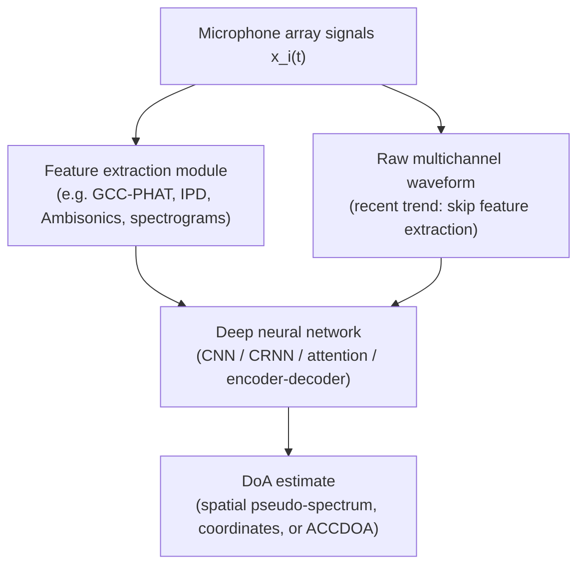

# Grumiaux, Kitić, Girin & Guérin 2022: A Survey of Sound Source Localization with Deep Learning Methods

**Authors**: [[entities/pierre-amaury-grumiaux|Pierre-Amaury Grumiaux]], [[entities/srdan-kitic|Srđan Kitić]], [[entities/laurent-girin|Laurent Girin]], [[entities/alexandre-guerin|Alexandre Guérin]]
**Venue**: The Journal of the Acoustical Society of America 152(1), pp. 107–151 (Review Article)
**Year**: 2022
**Type**: Survey / review article
**DOI**: [10.1121/10.0011809](https://doi.org/10.1121/10.0011809)
**Zotero**: [4EEVNXYM](zotero://select/items/0_4EEVNXYM)

## Summary

This article surveys 156 deep-learning papers on single- and multiple-source sound source localization (SSL) published from 2011 to 2021, with a focus on indoor environments where reverberation and diffuse noise are present. The review organizes the literature along a six-axis taxonomy — acoustic environment and source configuration, neural network architecture, input feature type, output strategy, training/evaluation data, and learning strategy — and distills it into four summary tables (one for 2011–2018, one each for 2019, 2020, 2021) enabling rapid lookup of methods by characteristics. The authors deliberately do not compare performance across systems (datasets and configurations differ too much) but instead provide the field's first comprehensive topography of DL-based SSL.

## Scope and Conventions

- **SSL ≈ DoA estimation**: unless otherwise stated, the survey uses "SSL" and "direction-of-arrival (DoA) estimation" interchangeably — azimuth/elevation estimation without distance, relative to the microphone array.
- **In scope**: audible-range sources (speech and audio events) in indoor office/domestic environments; reverberant, noisy, multi-source configurations; single- and multi-source SSL; source counting; SELD methods from the DCASE Challenge 2019–2021.
- **Out of scope**: audio-visual SSL systems, performance comparison across systems, moving-source tracking in depth (covered as a perspective).
- **Motivating results**: a CNN gave a twofold DoA classification accuracy increase over SRP-PHAT at low SNR (Chakrabarty & Habets 2017a); a CRNN gave +25% accuracy over an ICA-based method (Perotin et al. 2018b); a CRNN halved the average angular error of MUSIC in reverberant conditions (Adavanne et al. 2018).

The general DL-based SSL pipeline (the survey's Fig. 1):

The signal model underlying the task: each microphone signal is the source signal convolved with a position-dependent room impulse response plus noise, $x_i(t) = a_{i,j}(t) * s_j(t) + n_i(t)$; in the STFT domain $X_i(f,n) = A_{i,j}(f) S_j(f,n) + N_i(f,n)$, where the acoustic transfer functions $A_{i,j}(f)$ encode the source spatial information. With $J$ sources the mixture is $\mathbf{X}(f,n) = \mathbf{A}(f)\mathbf{S}(f,n) + \mathbf{N}(f,n)$; overlapping sources make SSL require TF-domain source clustering (W-disjoint orthogonality sparsity).

## Taxonomy

The survey's central contribution is a six-axis classification of every reviewed system:

| Axis | Categories |
|------|-----------|
| **Acoustic environment** | anechoic vs reverberant (survey focuses on reverberant); diffuse + sensor noise |
| **Source configuration** | speech vs heterogeneous sound events; single vs multiple (overlapping) sources; number of sources (NoS) known or estimated; static vs moving |
| **Architecture** | FFNN, CNN, RNN, CRNN, residual networks, attention-based, encoder-decoder (AE/VAE/U-Net) |
| **Input features** | inter-channel (RTF, binaural ILD/IPD/ITD), cross-correlation based (GCC-PHAT, CPS), spectrogram based, Ambisonics (FOA/HOA), intensity based, raw waveforms |
| **Output strategy** | classification (spatial pseudo-spectrum) vs regression (Cartesian/spherical coordinates, ACCDOA); non-direct estimation (TF masks, cleaned GCC, likelihood surfaces) |
| **Data & learning** | synthetic (simulated RIRs) vs real recordings; augmentation; supervised, semi-supervised, weakly supervised |

The taxonomy is cumulative across architectures (a CRNN contains CNN and RNN layers, etc.) and mirrors the general evolution of deep learning, since SSL architectures are typically inherited from other audio domains.

## Methodology (Surveyed Methods)

### Conventional baselines (Sec. III)

Reviewed briefly because they serve as DL baselines and as feature extractors: TDoA estimation via GCC-PHAT; SRP-PHAT acoustic power maps (grid of delay-and-sum beamformers); sound intensity methods (degrade quickly under reflections); subspace methods — MUSIC (EVD of the CPS matrix; robust to noise, sensitive to reverberation) and ESPRIT (faster but less accurate); probabilistic generative models — GMM/GMM-EM variants and Gaussian mixture regression (GMR, the closest conventional ancestor of DNN-based SSL); Bayesian inference (MCMC, sparse Bayesian learning); compressive sensing/sparse recovery (strong guarantees, but grid constraints and dictionary assumptions); ICA.

### Neural network architectures (Sec. IV)

- **FFNN**: earliest, simplest systems (e.g. MLPs on GCC-PHAT vectors).
- **CNN**: convolution over TF representations; the workhorse for phase-map and spectrogram inputs.
- **RNN / CRNN**: recurrent layers model temporal dynamics; the CRNN (CNN feature extractor + RNN temporal aggregation) became the dominant architecture (used by most DCASE SELD systems).
- **Residual networks**: deep CRNNs with residual connections (e.g. SELNet).
- **Attention-based**: self-attention and multi-head self-attention layers, including Transformer-style encoders; increasingly replacing RNNs.
- **Encoder-decoder**: AEs, VAEs (e.g. semi-supervised RTF-phase inference), and U-Nets (e.g. reconstruction of clean GCC features or DoA maps).

### Input features (Sec. V)

Seven feature families, with a recent trend toward raw waveforms:

| Family | Examples | Notes |
|--------|----------|-------|
| Inter-channel | [[concepts/relative-transfer-function\|RTF]] arguments (phase maps); binaural ILD/IPD/ITD | ILD/IPD ≈ log-magnitude/argument of the RTF; TF-domain sparsity enables multi-source use |
| Cross-correlation | GCC-PHAT (per microphone pair), CPS | robust to speech variability; combined with CNNs to counter noise/reverb sensitivity |
| Spectrogram | magnitude, phase, real+imaginary, log-Mel | single-channel or per-channel; phase maps central (Chakrabarty & Habets) |
| Ambisonics | FOA/HOA signals and spectra | array-agnostic; standard for DCASE |
| Intensity | active/real, reactive/imaginary intensity vectors | DoA-proportional in favorable conditions; FOA-domain dominant/azimuth features |
| Raw waveforms | multichannel samples | end-to-end; growing trend |
| Other | SRP maps, spatial pseudo-spectra, beamformer outputs, CPS eigenvectors | conventional-method outputs as features |

### Output strategies (Sec. VI)

- **Classification**: space discretized into zones; final layer with softmax (single source) or sigmoid (multi-source) outputs a *spatial pseudo-spectrum* whose peaks are picked as DoAs (implicit source counting via thresholding). Grids range from coarse azimuth classes (e.g. $N_\theta = 7, 8, 20, 37, 72, 360$) to quasi-uniform spherical grids of 429 classes (Perotin et al., Grumiaux et al.) or 432 classes (Adavanne et al., azimuth × elevation in $[-60°, 60°]$). Distance estimation is rare and coarse (e.g. 4–5 classes).
- **Regression**: direct continuous estimates — Cartesian $(x,y,z)$ or spherical $(\theta, \phi)$ coordinates; the **ACCDOA** (activity-coupled Cartesian DoA) representation couples event activity and DoA in a single output vector, adopted widely in 2021 (see [[concepts/activity-coupled-cartesian-doa|ACCDOA]]).
- **Non-direct**: the network estimates TF masks, denoised GCC/clean features, or a likelihood surface consumed by a conventional estimator; DoA is a by-product.

## Survey of Data and Learning Strategies

### Data (Sec. VII)

- **Synthetic data** dominates training: dry signals convolved with simulated RIRs. Image-source-method simulators ([[concepts/image-source-method|ISM]]; Habets' RIR generator, Pyroomacoustics, GPU-accelerated variants) offer the best fidelity/complexity trade-off for the RIR "head" (direct path + early reflections). Training on speech (or speech+noise+events mixtures) beats noise-based training even with GAN-simulated noise (Vargas et al. 2021); mixed-source training beats matched training (Krause et al. 2021). Binaural systems use BIR/BRIR convolution (HRTFs × room).
- **Real data**: scarce — DIRHA multi-room corpus, Hadad et al. RIRs, DCASE SELD datasets 2019–2021 (12 event types, up to 3 overlapping, tetrahedral mic array + FOA formats, moving sources from 2020, directional interferers in 2021), and the LOCATA challenge (static/mobile sources and arrays, several array types, optical ground truth).
- **Augmentation**: FOA channel swap/rotation (label- or channel-oriented — the latter performed worst), SpecAugment TF-masking, Mixup convex combinations, pitch shifting, block mixing, random mixing, spatial-spectral extraction-and-recombination.

### Learning strategies (Sec. VIII)

- **Supervised** (vast majority): categorical cross-entropy (softmax/single-source), binary cross-entropy (sigmoid/multi-source), MSE for regression; occasionally angular error or $\ell_1$ losses.
- **Semi-supervised**: entropy-minimization adaptation to unseen conditions (Takeda & Komatani); VAE-based RTF phase inference mixing labeled and unlabeled examples (Bianco et al.); adversarial domain adaptation — discriminator on synthetic vs. real, generator adapts the DoA network (Le Moing et al. 2021).
- **Weakly supervised**: NoS-only weak labels to reduce incoherent predictions (He et al.); triplet loss on query/positive/negative position examples (Opochinsky et al.).

## Key Contributions

1. **First comprehensive survey of DL-based SSL**: 156 papers (2011–2021) reviewed and classified — previous reviews either targeted conventional methods or devoted only short sections to SSL with DNNs.
2. **Six-axis taxonomy**: environment/source configuration, architecture, input features, output strategy, data, learning strategy — a reusable vocabulary for positioning any SSL system.
3. **Four summary tables** (2011–2018, 2019, 2020, 2021) cross-referencing each system's architecture, output type, learning paradigm, input features, output format, NoS/movement handling, and train/test data type (synthetic/real × anechoic/reverberant) — designed for quick filtering by target characteristics.
4. **Input-feature and output-strategy syntheses**: a structured comparison of seven feature families (with the general trend toward raw waveforms) and of classification vs. regression vs. non-direct output strategies, including the ACCDOA 2021 trend.
5. **Dataset and simulator catalog**: the survey's enumeration of RIR simulators (ISM variants, GPU acceleration), real corpora (DIRHA, DCASE, LOCATA), and augmentation techniques doubles as a practitioner's data-source reference.
6. **Five research perspectives**: (A) adaptation to real-world data (domain adaptation, manifold learning), (B) model flexibility / array-agnostic inputs (Ambisonics, CPS eigenvectors, point-cloud representations), (C) multi-task learning (SELD, joint source counting, end-to-end localization+beamforming+ASR), (D) combining DL with conventional SP (mask-based beamforming analogies, deep generative models + spatial models), (E) moving sources and deep tracking (deep MOT replacing Kalman-style trackers).

## Limitations and Caveats

- **No performance comparison**: the authors explicitly decline to benchmark systems — datasets and configurations differ too much across papers; all "best variant" remarks are qualitative.
- **Literature cutoff 2021**: post-2021 architectures and datasets (e.g. newer Transformer SSL models) are not covered.
- **Indoor focus**: outdoor and large-venue SSL (e.g. sensor networks, underwater) are outside the taxonomy.
- **Audio-only**: multimodal (audio-visual) SSL excluded; moving-source tracking only sketched as a perspective.
- **Extraction note**: this wiki copy was extracted via pypdf (plain text, no figures); the paper's Fig. 1 (pipeline) and Tables II–V (summary tables) are described in text above but not embedded as images. Some accented characters appear garbled in the raw text (e.g. "/C19" for "é").

## Related Concepts

- [[concepts/sound-source-localization|Sound Source Localization]]
- [[concepts/direction-of-arrival-estimation|Direction-of-Arrival Estimation]]
- [[concepts/activity-coupled-cartesian-doa|ACCDOA]]
- [[concepts/sel-d|SELD (Sound Event Localization and Detection)]]
- [[concepts/ambisonics|Ambisonics]]
- [[concepts/relative-transfer-function|Relative Transfer Function (RTF)]]
- [[concepts/room-impulse-response|Room Impulse Response]]
- [[concepts/image-source-method|Image Source Method]]
- [[concepts/voice-activity-detection|Voice Activity Detection]]

## Related Sources

- The predecessor survey of conventional (non-deep) SSL methods is Argentieri et al. 2015 ("A survey on sound source localization in robotics"), cited throughout as the robotics-context review.
- [[sources/zmolikova-2023-neural-target-speech-extraction-overview|Zmolikova et al. 2023: Neural Target Speech Extraction Overview]] — complementary task view: spatial clues (DoA) as input to target speech extraction rather than as the output target.
