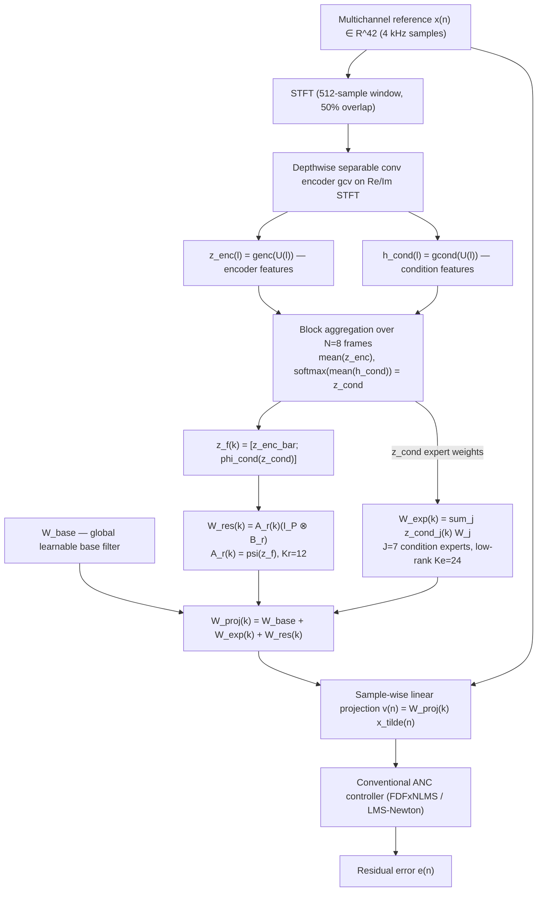

# He, Chen, Zou, Tao & Qiu 2026: Neural Projection Filter Generation for Multi-Reference ANC

**Authors**: [[entities/yiming-he|Yiming He]], [[entities/kai-chen|Kai Chen]], [[entities/haishan-zou|Haishan Zou]], [[entities/jiancheng-tao|Jiancheng Tao]], [[entities/xiaojun-qiu|Xiaojun Qiu]]
**Institution**: Key Laboratory of Modern Acoustics, Institute of Acoustics, Nanjing University, Nanjing, China
**Venue**: IEEE Signal Processing Letters, 2026 (early access, DOI 10.1109/LSP.2026.3728398)
**Type**: Journal letter
**Funding**: National Natural Science Foundation of China, Grant 11874218

## Summary

This letter introduces **condition-aware projection filtering (CAPF)**, a neural front end that generates causal block-wise linear FIR projection filters to compress high-dimensional correlated reference signals for [[concepts/multi-reference-anc|multi-reference ANC]]. CAPFNet — a 500k-parameter network — maps 42 in-vehicle reference channels down to 4 projected references while preserving the information required by conventional adaptive controllers. Paired with an LMS-Newton back end, CAPF improves average attenuation over FDFxNLMS by 2.6 dBA and matches the neural reference-projection baseline NRP-FxAP with a 48× reduction in online computational complexity.

## Problem Formulation

Automotive feedforward ANC uses many reference sensors (structural vibration accelerometers) to capture road noise. More channels improve attainable attenuation but introduce strong inter-channel correlation, high-dimensional redundancy, slow adaptive convergence, and high computational cost.

Let $\mathbf{x}(n) \in \mathbb{R}^P$ be the multichannel reference ($P = 42$), and $\tilde{\mathbf{x}}(n) = [\mathbf{x}^T(n), \mathbf{x}^T(n-1), \cdots, \mathbf{x}^T(n-L_p+1)]^T$ the tapped reference vector with projection filter length $L_p$. The projection stage maps

$$\mathbf{v}(n) = \mathbf{W}_{\mathrm{proj}}(k)\,\tilde{\mathbf{x}}(n), \qquad \mathbf{W}_{\mathrm{proj}}(k) \in \mathbb{R}^{Q \times P L_p},$$

for $n \in \mathcal{B}_k$ (the sample block of the $k$th filter update), producing a compact projected reference $\mathbf{v}(n) \in \mathbb{R}^Q$ with $Q < P$ ($Q = 4$). A conventional controller then operates on the projected references:

$$y(n) = \mathbf{W}_{\mathrm{ctrl}}(n)\,\tilde{\mathbf{v}}(n), \qquad e(n) = d(n) + \mathbf{S}\,\tilde{\mathbf{y}}(n),$$

with residual error $e(n)$, primary noise $d(n) \in \mathbb{R}^M$, and secondary-path convolution matrix $\mathbf{S} \in \mathbb{R}^{M \times C L_s}$. CAPF thus reduces the back-end input dimension from $P$ to $Q$ and improves conditioning through decorrelation-oriented training — while remaining compatible with conventional adaptive algorithms (FDFxNLMS, LMS-Newton).

## Methodology

### CAPF-Based ANC Framework

CAPFNet generates block-wise projection filters, while causal reference projection and control filtering run **sample-wise** using the latest filter coefficients, avoiding block-processing latency. Filters are updated every $N = 8$ STFT frames; each generated filter is applied only to its own (future) block, preserving causality.

![[raw/papers/he-2026-neural-projection-filter-anc/figures/fig1.png|Figure 1]]

*Figure 1: Overview of the proposed CAPF-based ANC framework.*

### Model Structure, Inputs, and Outputs

**CAPFNet spec table**

| Property | Value |
|---|---|
| Structure | Depthwise separable convolution encoder $g_{cv}$ on complex STFT (real + imaginary parts) → two feature heads $g_{enc}$, $g_{cond}$; N-frame aggregation (mean / softmax-weighted); fusion $\phi_{cond}$ = two-layer fully connected; filter decoder: global base $\mathbf{W}_{base}$ + $J=7$ low-rank experts $\bar{\mathbf{A}}_j(\mathbf{I}_P \otimes \mathbf{B}_e)$ ($K_e = 24$) + block-wise residual $\bar{\mathbf{A}}_r(k)(\mathbf{I}_P \otimes \mathbf{B}_r)$ ($K_r = 12$), with $\bar{\mathbf{A}}_r(k)$ generated by $\psi$ (two linear layers + ELU) |
| Input | 42-channel time-domain reference at 4 kHz; STFT with 512-sample frames, 50% overlap |
| Output | Projection filter $\mathbf{W}_{\mathrm{proj}}(k) \in \mathbb{R}^{4 \times 42 \cdot 256}$, one update every 8 STFT frames (asynchronous); applied sample-wise as linear FIR projection |
| Training data | 19.5 h measured in-vehicle road noise, 42 references / 2 sources / 2 error mics, 7 operating conditions (50, 80, 100 km/h × road surface × environment), 10-s clips at 4 kHz |
| Role | Compresses 42 correlated references to 4 decorrelated projected references, enabling low-complexity conventional adaptive control |

**Deployment cost**: 500.0k parameters; 83.0 MMAC/s for filter generation plus 172.0 MMAC/s for projection filtering; 132.2 µs per sample for the delayless filtering path and 18.2 ms per asynchronous filter update on an Intel Core i7-10875H CPU; estimated DSP memory 2.65 MiB (conservative upper bound 9.51 MiB).

### Training Losses

$$\mathcal{L}_{\mathrm{train}} = \mathcal{L}_{\mathrm{err}} + \alpha\,\mathcal{L}_{\mathrm{reg}} + \beta\,\mathcal{L}_{\mathrm{cls}}, \qquad \alpha = 0.1,\ \beta = 0.2.$$

- **Error loss** (with A-weighting filter $f_A(\cdot)$ and an offline least-squares Wiener controller $\mathbf{W}_w$ computed on the generated projected references):

$$\mathcal{L}_{\mathrm{err}} = 10\log_{10}\left(\|f_A(e_w)\|_2^2 / \|f_A(d)\|_2^2\right)$$

- **Decorrelation regularization** — whitens the secondary-path-filtered projected-reference autocorrelation matrix $\mathbf{R} \in \mathbb{R}^{QC L_c \times QC L_c}$, with $\rho = \mathrm{tr}(\mathbf{R})/(QC L_c)$ the average power:

$$\mathcal{L}_{\mathrm{reg}} = \|\mathbf{R}/\rho - \mathbf{I}\|_F^2$$

- **Condition classification loss** — cross-entropy against one-hot operating-condition labels, supervising the softmax expert weights $z_{\mathrm{cond}}$:

$$\mathcal{L}_{\mathrm{cls}} = -\mathrm{mean}_k \sum_{j=1}^{J} p_j(k)\log z_{\mathrm{cond},j}(k)$$

Expert factors $\bar{\mathbf{A}}_j$ are zero-initialized, $\mathbf{B}_e$ and $\mathbf{B}_r$ Gaussian-initialized; all components are jointly optimized with CAPFNet. Trained with Adam, 30 epochs, batch size 16 on two NVIDIA RTX 4070 GPUs; initial learning rate $4\times10^{-3}$ decayed ×0.2 every 10 epochs.

## Experimental Setup

| Item | Value |
|---|---|
| Dataset | 21 h measured in-vehicle road noise (19.5 h train / 1.5 h test, 10-s clips) |
| System | 42 reference channels, 2 secondary sources, 2 error microphones (M1, M2 near passenger) |
| Secondary paths | Identified offline, 512-tap FIR |
| Conditions | 7 operating conditions: driving speed (50/80/100 km/h) × road surface × environment |
| Sampling rate | 4 kHz |
| CAPF settings | $Q = 4$, $L_p = 256$, $N = 8$ frames per filter update; back-end control filter length 256 |
| Baselines | FDFxNLMS (control filter 512), BCD-Newton (5 inner iterations, update every 30×512 samples), iSVD-VR (PCA 95% → 28 virtual references, update every 4000 samples), offline Wiener, NRP-FxAP (projection dim 4, control filter 512) |
| CAPF-Newton update | Every 2048 samples |
| Metric | A-weighted noise reduction (residual-to-primary level difference, dBA); std over non-overlapping 10-s segments |

## Results

**Table I: A-weighted noise reduction (dBA, more negative = better).**

| Method | Mic | 50 km/h | 80 km/h | 100 km/h | Complexity (MAC/s) |
|---|---|---|---|---|---|
| Wiener (offline) | M1 | −9.64 (1.06) | −7.36 (0.75) | −7.92 (0.85) | — |
| | M2 | −10.60 (1.09) | −7.70 (0.78) | −7.94 (0.89) | |
| FDFxNLMS | M1 | −5.91 (1.37) | −5.48 (0.99) | −5.66 (0.86) | 199.0 M |
| | M2 | −6.52 (1.32) | −5.93 (1.03) | −5.75 (0.85) | |
| BCD-Newton | M1 | −8.38 (1.70) | −6.38 (1.22) | −6.43 (1.16) | 440.2 M |
| | M2 | −9.35 (1.87) | −6.85 (1.29) | −6.60 (1.19) | |
| iSVD-VR | M1 | −6.41 (1.18) | −4.80 (1.01) | −4.74 (1.00) | 699.0 M |
| | M2 | −6.91 (1.21) | −5.21 (1.02) | −5.07 (0.96) | |
| NRP-FxAP | M1 | −10.69 (1.71) | −7.73 (1.14) | −7.91 (1.04) | 17.9 G |
| | M2 | −10.86 (1.70) | −7.53 (1.09) | −7.50 (1.04) | |
| CAPF-FDFxNLMS | M1 | −9.27 (1.78) | −7.19 (1.37) | −7.37 (1.23) | 265.8 M |
| | M2 | −9.90 (1.73) | −7.30 (1.28) | −7.17 (1.12) | |
| CAPF-Newton | M1 | −10.24 (1.72) | −7.46 (1.17) | −7.78 (1.19) | 374.0 M |
| | M2 | −10.63 (1.71) | −7.50 (1.24) | −7.52 (1.10) | |

Across the six speed–microphone cases, CAPF-Newton achieves **8.52 dBA average attenuation**, comparable to the offline Wiener reference and NRP-FxAP, at 374.0 MMAC/s versus 17.9 GMAC/s for NRP-FxAP (**48× reduction**). It outperforms BCD-Newton by 1.19 dBA with 15.0% lower complexity, and FDFxNLMS by 2.6 dBA.

![[raw/papers/he-2026-neural-projection-filter-anc/figures/fig2.png|Figure 2]]

*Figure 2: Noise reduction results. (a) Convergence curves over the 50→60→80 km/h driving scenario, (b) spectra for the 50 km/h steady segment (20–30 s), (c) spectra for the 80 km/h steady segment (80–90 s).*

In the 50→60→80 km/h transition scenario, the intermediate 60 km/h segment is an **unseen operating condition** (training covers only 50/80/100 km/h). CAPF-Newton reaches stable attenuation within about 20 s, adapts after the speed transition, and approaches the offline Wiener reference in steady-state spectra — evidence of cross-condition generalization.

**Table II: Parameter analysis and component ablation of CAPF-Newton (M1/M2, dBA).**

| Variant | 50 km/h | 80 km/h | 100 km/h | Complexity |
|---|---|---|---|---|
| Default ($Q=4$, $L_p=256$) | −10.24 / −10.63 | −7.46 / −7.50 | −7.78 / −7.52 | 374.0 M |
| $Q = 6$ | −10.33 / −10.73 | −7.55 / −7.59 | −7.79 / −7.54 | 701.8 M |
| $L_p = 128$ | −9.55 / −9.93 | −7.10 / −7.12 | −7.21 / −6.97 | 418.0 M |
| $L_p = 384$ | −9.99 / −10.53 | −7.38 / −7.52 | −7.78 / −7.58 | 382.1 M |
| w/o $\mathbf{W}_{base}$ | −10.06 / −10.48 | −7.32 / −7.39 | −7.60 / −7.37 | 374.0 M |
| w/o $\mathbf{W}_{exp}$ | −9.80 / −10.20 | −7.24 / −7.34 | −7.47 / −7.37 | 366.1 M |
| w/o both | −9.34 / −9.79 | −6.80 / −6.89 | −6.98 / −6.75 | 366.1 M |

- Increasing $Q$ from 4 to 6 improves average attenuation by only 0.07 dBA while nearly doubling complexity (374.0 → 701.8 MMAC/s): $Q = 4$ already captures the dominant reference information.
- With the effective reference-to-control memory fixed at 512 samples, $L_p = 256$ is the best balance (128→256: +0.54 dBA; 256→384: −0.06 dBA).
- Removing $\mathbf{W}_{base}$, $\mathbf{W}_{exp}$, or both costs 0.15, 0.29, and 0.76 dBA respectively — both the condition-independent base and the condition-dependent expert branch contribute.

## Key Contributions

1. **CAPF framework**: introduces condition-aware projection filtering — a neural front end that generates *block-wise causal FIR projection filters* (rather than point-wise projected signals) for reference compression in multi-reference ANC, keeping the back end entirely conventional and adaptive.
2. **Filter decomposition with condition experts**: decomposes the generated filter as $\mathbf{W}_{proj} = \mathbf{W}_{base} + \mathbf{W}_{exp} + \mathbf{W}_{res}$ with a global base, softmax-weighted low-rank condition experts supervised by an operating-condition classification loss, and a block-wise residual branch.
3. **48× complexity reduction over point-wise neural projection**: achieves NRP-FxAP-level performance (8.52 dBA average, Wiener-comparable) at 374.0 MMAC/s vs 17.9 GMAC/s, by moving neural inference from sample rate to block rate (every 8 STFT frames).
4. **Deployment characterization**: reports real-time measurements (132.2 µs/sample delayless path on an i7 CPU) and DSP memory estimates (2.65–9.51 MiB) supporting embedded feasibility.

## Related Concepts

- [[concepts/condition-aware-projection-filtering|Condition-Aware Projection Filtering (CAPF)]]
- [[concepts/multi-reference-anc|Multi-Reference ANC]]
- [[concepts/active-noise-control|Active Noise Control]]
- [[concepts/multi-channel-anc|Multi-Channel ANC]]
- [[concepts/filtered-x-lms-algorithm|Filtered-x LMS Algorithm]]
- [[concepts/frequency-domain-anc|Frequency-Domain ANC]]
- [[concepts/generative-fixed-filter-anc|Generative Fixed-Filter ANC]]

## Related Synthesis

- [[synthesis/multichannel-anc-efficiency-and-robustness|Multichannel ANC Efficiency and Robustness]]
- [[synthesis/ai-driven-anc|AI-Driven ANC]]
- [[synthesis/application-specific-anc|Application-Specific ANC]]
