# Heitkaemper et al. 2025: BCS-Guided Speech Enhancement for Voice Assistant on Earbuds

**Authors**: [[entities/jens-heitkaemper|Jens Heitkaemper]], [[entities/joseph-caroselli-jr|Joe Caroselli]], [[entities/max-mckinnon|Max McKinnon]], [[entities/arun-narayanan|Arun Narayanan]], [[entities/nathan-howard|Nathan Howard]]
**Affiliation**: Google LLC, U.S.A.
**Venue**: Proc. IEEE ICASSP 2025
**Type**: Conference paper
**DOI**: [10.1109/ICASSP49660.2025.10889416](https://doi.org/10.1109/ICASSP49660.2025.10889416)
**Zotero**: [Y8SU4C7T](zotero://select/items/0_Y8SU4C7T)
**Related**: This paper is the publication of the same system as the Google patent [[sources/heitkaemper-2026-bcs-speech-enhancement-earbuds|Heitkaemper et al. 2026: BCS-Guided Speech Enhancement for Earbuds]] (US20260073929A1, filed 2025-07); the paper adds the full experimental evaluation.

## Summary

Presents a multi-modal, streaming speech enhancement network for earbud voice assistants that uses a bone conducted signal (BCS) from an accelerometer to guide separation of the target speaker from interfering sources in a single-channel air-conducted signal (ACS). The model preprocesses the BCS by downsampling to twice a configurable cutoff frequency $f^{BCS}_{\max}$ and upscaling back via a feed-forward projection, exploiting the low-pass characteristic of [[concepts/bone-conduction|bone conduction]] to cut the earbud-to-device transmission bandwidth to 6.25% of the original with under 1.5% absolute WER increase. A pretrained [[concepts/voice-activity-detection|VAD]] applied to the BCS gates the enhancer, discarding the enhanced output when the BCS contains no speech information (~30% of realistic earbud recordings). The system outperforms a state-of-the-art multi-channel enhancement baseline (McEnhancer, RTF 0.39) on most realistic test sets at RTF 0.01.

## Problem Formulation

Earbud ASR degrades in low-SNR and overlapping-speech conditions. Auxiliary information beyond the microphone signal helps; for earbuds, the BCS directly captures the target speaker's skull vibration and is largely immune to environmental noise. Unlike most prior work that assumes on-device enhancement and clean BCS, this work assumes:

- **Off-device enhancement**: the enhancer runs on a connected device (e.g., phone), permitting more compute but making every additional signal sent from the earbuds cost transmission bandwidth.
- **Distorted BCS exists in practice**: under windy conditions the BCS can be uninformative (~30% of the authors' recorded earbud data), and enhancers trained only on clean BCS can *degrade* the ACS below unprocessed performance.

**Signal model** (convolutive transfer function approximation, single channel):

$$Y_{\ell,f} = H_{\ell,f} * S_{\ell,f} + N_{\ell,f} = X_{\ell,f} + N_{\ell,f} \tag{1}$$

where $Y_{\ell,f}$ is the ACS STFT coefficient at frame $\ell$, bin $f$; $S_{\ell,f}$, $N_{\ell,f}$ are clean speech and noise; $H_{\ell,f}$ is the speaker-to-microphone transfer function.

**BCS model** (accelerometer):

$$B_{\ell,f} = G_{\ell,f} * S_{\ell,f} + G^{N}_{\ell,f} * N_{\ell,f} + U_{\ell,f} \tag{2}$$

with $G_{\ell,f}$ the bone conduction transfer function (low-pass characteristic suppressing most speech above low frequencies), $G^{N}_{\ell,f}$ the noise leakage function, and $U_{\ell,f}$ the sensor noise. In many applications $G^{N}_{\ell,f} * N_{\ell,f}$ and $U_{\ell,f}$ are assumed negligible — this work explicitly handles cases where that assumption fails (wind).

## Methodology

### System Overview

The enhancer (Fig. 1 in the paper) combines three block types: non-trainable (STFT/ISTFT, downsampling), pretrained-on-simulation-then-finetuned (mask estimator / Conformer), and finetuning-only (FF upscaling projection). The full system (Fig. 2) adds a pretrained VAD and pretrained ASR, neither adapted to earbud data.

### Model Structure, Inputs, and Outputs

```mermaid
flowchart TB
    subgraph Earbud["Earbud sensors (16 kHz)"]
        MIC["Air mic y<sub>t</sub> (single channel)"]
        ACC["Accelerometer b<sub>t</sub> (BCS)"]
    end
    subgraph Enhancer["BCS-guided enhancer (trained in this work)"]
        DS["Downsample + anti-aliasing filter<br/>to 2·f<sub>max</sub><sup>BCS</sup> (non-trainable)"]
        STFT2["BCS STFT<br/>(size 512·f<sub>max</sub>/8 kHz)"]
        FF["FF upscaling projection<br/>(finetuning-only)"]
        STFT1["ACS STFT<br/>(32 ms / 16 ms, size 512)"]
        CONCAT["Concatenate (early fusion)"]
        CONF["Conformer layer"]
        MASK["FF + Sigmoid → mask M&#770;<sub>ℓ,f</sub>"]
        ISTFT["iSTFT → x&#770;<sub>t</sub>"]
    end
    subgraph Gate["VAD gate (pretrained, frozen)"]
        VAD["VAD on BCS"]
        SW{"Speech in<br/>keyword BCS?"}
    end
    ASR["ASR (pretrained, frozen)"]
    MIC --> STFT1 --> CONCAT
    ACC --> DS --> STFT2 --> FF --> CONCAT
    CONCAT --> CONF --> MASK --> ISTFT
    ACC --> VAD --> SW
    ISTFT --> SW
    STFT1 --> SW
    SW -->|"yes"| ASR
    SW -->|"no: bypass enhancer"| ASR
```

**Enhancement network** (the only trained network):

| Aspect | Specification |
|--------|---------------|
| **Structure** | BCS path: anti-aliasing downsampling → STFT → FF projection upscaling band-limited BCS to the original number of frequency bins. ACS path: STFT (window 32 ms, shift 16 ms, size 512). Fusion: concatenation (early fusion as in Wang et al. 2022). Processing: a Conformer layer, then FF with sigmoid activation estimating the ratio mask; mask applied to ACS STFT, iSTFT to waveform. |
| **Input** | Single-channel ACS at 16 kHz; BCS at 16 kHz downsampled to $2 f^{BCS}_{\max}$ (BCS STFT size reduced by factor $8\,\text{kHz}/f^{BCS}_{\max}$, same 32 ms / 16 ms window and shift) |
| **Output** | Ratio mask $\hat{M}_{\ell,f}$ at the ACS STFT frame rate (16 ms hop); enhanced waveform $\hat{x}_t$ at 16 kHz via iSTFT |
| **Training data** | Pretraining: ~50k hours (LibriSpeech 281k utts, segmented Librivox 18M utts of 3–15 s, 1.9M vendor utterances) with simulated reverberation, noise, and multi-talker; simulated BCS by low-pass filtering reverberant speech. Finetuning: ~6 hours / 5k utterances / 45 speakers of real earbud recordings. |
| **Role** | Streaming mask-based enhancer that uses the (band-limited) BCS as target-speaker guidance to clean the ACS prior to ASR |

**VAD gate** (pretrained [Bijwadia et al. 2022], unchanged): a neural VAD designed for ACS is applied to the BCS; if no speech activity is detected in the keyword BCS, the unprocessed ACS is sent to ASR instead of the enhanced output. Applied to the keyword BCS, this also reduces latency. Highly correlated with the authors' subjective assessment of speech presence in the BCS.

**ASR** (pretrained [Sainath et al. 2021], unchanged): streaming on-device-style recognition model; the enhancer is optimized directly for its accuracy via the ASR-loss.

### Training Losses

Joint objective during pretraining and finetuning:

$$\mathcal{L} = \lambda_{\text{ASR}} \cdot \mathcal{L}_{\text{ASR}} + \mathcal{L}_{\text{SI-SNR}}$$

- **ASR-loss** (Howard et al. 2021): compares ASR encoder outputs for enhanced vs. target speech, optimizing the enhancer for downstream recognition accuracy rather than signal-level quality only.
- **SI-SNR loss** (Le Roux et al. 2019): scale-invariant signal-to-noise ratio on the enhanced waveform.
- **Weight**: $\lambda_{\text{ASR}} = 10^{-4}$ (fixed), equalizing the scales of the two losses.

### Training Data Simulation

| Component | Simulation |
|-----------|------------|
| **ACS** | Reverberation + noise added to 50k h of speech via room simulator; noise from cars/cafes/kitchens + Getty Music + YouTube Audio Library; random speech mixtures for multi-talker; SNR −10 to 30 dB, T60 0–900 ms |
| **BCS** | Reverberant speech (no added noise) through a 47-coefficient FIR low-pass filter (window method, 500 Hz corner frequency), attenuated by 7–13 dB; parameters chosen empirically |
| **Finetuning ACS** | Clean earbud recordings + realistically recorded earbud noise (e.g., wind); **no noise added to the BCS** since the model is only applied for clean BCS (VAD-gated) |

## Experimental Setup

| Aspect | Detail |
|--------|--------|
| **Sampling rate** | 16 kHz |
| **STFT** | 32 ms window, 16 ms shift, size 512 (ACS); BCS STFT size scaled by $f^{BCS}_{\max}/8$ kHz |
| **Optimizer** | ADAM with gradient clipping and learning-rate decay |
| **Pretraining** | 500k steps on simulated set |
| **Finetuning** | 50k steps on earbud set (5k utts, 45 speakers, ~6 h, ~4 s average utterance length) |
| **Metrics** | WER (primary), RTF (single core, Intel Xeon @ 2.20 GHz) |
| **Baselines** | Unprocessed; McEnhancer S / L = state-of-the-art multi-channel enhancement (TfCleanformer, Heitkaemper et al. 2024), finetuned 50k steps, 2-channel exterior-mic ACS input |
| **Test data** | >5 h real earbud recordings, >30 speakers (~70% male / 30% female, native and non-native English, ages 20–50), voice-assistant-style queries, 30–80 dBA environmental noise |

**Test sets** (non-overlapping subsets):

| Set | Duration (h) | Noise SPL (dBA) | Wind (m/s) | Multi-talker |
|-----|--------------|-----------------|------------|--------------|
| Easy | 0.94 | — | — | — |
| Moderate | 2.10 | 30–50 | 0–3 | — |
| Hard | 1.40 | 30–80 | 0–6 | — |
| Dynamic | 0.74 | 30–80 | 0–6 | ✓ |

Hard-set examples are included if SPL ≥ 70 dBA or wind ≥ 6 m/s. Environmental noise: cafe, bar with music, marketplace, train station (background chatter). Dynamic adds a person walking around the wearer pretending a phone call.

## Results

**BCS bandwidth reduction** (Fig. 3, full Hard set, no VAD): sweeping $f^{BCS}_{\max}$ from 250 Hz to 8 kHz, the upscaling module improves WER across the range except at 1 kHz — despite the BCS low-pass characteristic, the model still benefits from higher-frequency BCS information. $f^{BCS}_{\max} = 500$ Hz with upscaling gives the best bandwidth/WER trade-off: <1.5% absolute WER increase at 6.25% of the original transmission bandwidth.

**VAD gating** (Fig. 4, Table II): WER correlates strongly with BCS quality (per-frame VAD activity in the keyword BCS). Enhancement *degrades* the signal for examples with <60% detected activity (~40% of the Hard set) — for these, transcribing the unprocessed ACS is better. Because the optimal threshold is dataset-dependent, the deployed threshold is $L^{max}_{i} = 0.0$ (bypass only when no activity at all is detected).

WER (%) with and without VAD gating:

| System | VAD | Easy | Moderate | Hard | Dynamic |
|--------|-----|------|----------|------|---------|
| Unprocessed | — | 6.4 | 5.9 | 18.1 | 17.2 |
| Proposed 500 Hz | no | 6.2 | 6.8 | 16.8 | 10.6 |
| Proposed 500 Hz | yes | 6.2 | 6.2 | 15.8 | 10.9 |
| Proposed 8 kHz | no | 6.3 | 6.8 | 15.6 | 10.5 |
| Proposed 8 kHz | yes | 6.3 | 6.2 | 15.0 | 10.8 |

VAD gating helps on Hard/Moderate, slightly degrades Dynamic (gains outweigh losses); with gating, the 500 Hz vs full-bandwidth gap shrinks to 0.8%.

**Comparison with multi-channel enhancer** (Table III, proposed models use VAD gating):

| System | RTF | Easy | Moderate | Hard | Dynamic |
|--------|-----|------|----------|------|---------|
| Unprocessed | 0.00 | 6.4 | 5.9 | 18.1 | 17.2 |
| McEnhancer S | 0.01 | 6.4 | 6.5 | 17.2 | 15.3 |
| McEnhancer L | 0.39 | 7.5 | 7.2 | 13.9 | 16.4 |
| Proposed 500 Hz | 0.01 | 6.2 | 6.2 | 15.8 | 10.9 |
| Proposed 8 kHz | 0.01 | 6.3 | 6.2 | 15.0 | 10.8 |

The BCS-guided single-channel models deliver more consistent results than the multi-channel McEnhancer at matched RTF (0.01) and dramatically outperform the 39×-costlier McEnhancer L on Dynamic (10.9 vs 16.4 WER). McEnhancer L only clearly wins on Hard, suggesting headroom from increasing the proposed model's complexity.

**Headline**: in the most difficult cases (interfering noise or wind ≥ 6 m/s), relative WER reduction exceeds 15%.

## Key Contributions

1. **BCS-guided streaming enhancer for earbud voice assistants**: STFT-domain Conformer mask estimator fusing single-channel ACS with upscaled band-limited BCS via early fusion, trained end-to-end with ASR-loss + SI-SNR, targeting off-device enhancement.
2. **BCS transmission bandwidth reduction**: preprocessing that limits the BCS to $f^{BCS}_{\max}$ = 500 Hz (downsampling with anti-aliasing + learned FF upscaling) cuts the earbud-to-device bandwidth to 6.25% with <1.5% absolute WER increase — enabling the off-device use-case.
3. **VAD-gated robustness to distorted BCS**: first to quantify that ~30% of realistic earbud recordings have uninformative BCS, and to address it by applying a pretrained ACS-style VAD on the BCS to bypass the enhancer, preventing the enhancer from degrading the ACS below unprocessed performance.
4. **Empirical validation on realistic earbud data**: 4-condition test protocol (Easy/Moderate/Hard/Dynamic) with real wind (0–6 m/s) and walking interfering speakers, showing >15% relative WER reduction in the hardest conditions.
5. **Outperforms state-of-the-art multi-channel enhancement**: at RTF 0.01, beats both McEnhancer variants on 3 of 4 test sets, with the 39× more costly McEnhancer L winning only on the Hard set.

## Related Concepts

- [[concepts/bcs-guided-speech-enhancement|BCS-Guided Speech Enhancement]]
- [[concepts/bone-conduction|Bone Conduction]]
- [[concepts/voice-activity-detection|Voice Activity Detection]]
- [[concepts/multi-channel-speech-enhancement|Multi-Channel Speech Enhancement]]
- [[concepts/ideal-ratio-mask|Ideal Ratio Mask]]
- [[concepts/wearer-speech-recognition|Wearer Speech Recognition]]

## Related Synthesis

- [[synthesis/multimodal-bc-speech-enhancement|Multimodal BC Speech Enhancement]]
