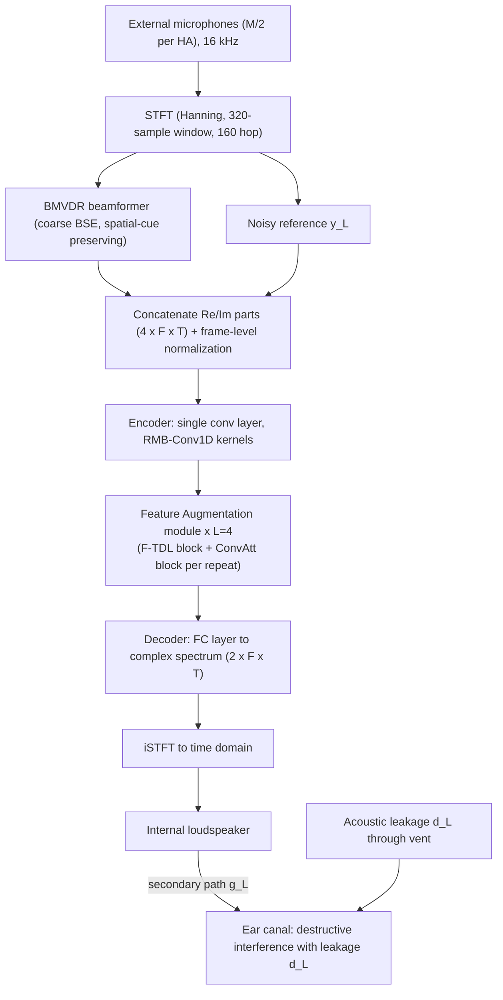

# Hu, Du, Zhao & Si 2026: ABSE-NET — Active Binaural Speech Enhancement for Open-Fit Hearing Aids

**Authors**: [[entities/de-hu|De Hu]], [[entities/xue-du|Xue Du]], [[entities/qingying-zhao|Qingying Zhao]], [[entities/qintuya-si|Qintuya Si]]
**Institution**: Inner Mongolia University, Hohhot, China (College of Computer Science; College of Electronic and Information Engineering)
**Venue**: arXiv preprint 2609.00966 (accepted to INTERSPEECH 2026)
**Type**: Preprint (conference paper)
**DOI**: [10.48550/arXiv.2609.00966](https://doi.org/10.48550/arXiv.2609.00966)
**Code**: [github.com/Bream101/ABSE-NET](https://github.com/Bream101/ABSE-NET)
**Zotero**: [B6TE7KHB](zotero://select/items/0_B6TE7KHB)

## Summary

ABSE-NET integrates active noise control (ANC) with binaural speech enhancement (BSE) to jointly enhance target speech and suppress the acoustic leakage that the open-fit (vented) hearing-aid design lets into the ear canal. The pipeline cascades a binaural MVDR (BMVDR) beamformer — which performs coarse enhancement while preserving spatial cues — with a 0.112M-parameter lightweight neural network (LNN) that simultaneously cancels the leakage and compensates for BMVDR-induced distortion. Unlike traditional BSE+ANC solutions based on adaptive filtering, ABSE-NET requires no in-ear error microphone at inference (one is used only during training), addressing the practical impossibility of placing a microphone deep inside the narrow ear canal.

![[raw/papers/hu-2026-abse-net/figures/fig1.png|Acoustic leakage in semi-open-fit HAs]]

*Figure 1: Acoustic leakage in semi-open-fit HAs. External microphones (hollow circles) feed BSE; the enhanced signal is played by the internal loudspeaker, but external noise leaks through the vent and corrupts it, as detected by the error microphone (solid circle) deep in the ear canal.*

## Problem Formulation

Each hearing aid carries $M/2$ microphones ($M$ even). In the STFT domain the multi-channel signal is

$$\bm{y}(k,l)=\bm{a}(k)s(k,l)+\sum_{i=1}^{I}\bm{b}_{i}(k)n_{i}(k,l)+\bm{v}(k,l),$$

with $\bm{a}$ the target acoustic transfer function (ATF), $\bm{b}_i$ the interferer ATFs, and $\bm{v}$ background plus sensor noise. The BMVDR beamformer for the left HA solves

$$\hat{\bm{w}}_{L}=\arg\min_{\bm{w}_{L}}\bm{w}^{H}_{L}\bm{R}\bm{w}_{L}\quad\text{s.t.}\quad\bm{w}_{L}^{H}\bm{a}=a_{L},$$

preserving the target as received by the left reference microphone while minimizing interferer-plus-noise power ($\bm{R}$ = noise SCM). Two problems arise in open-fit HAs:

1. **Acoustic leakage.** The in-ear error signal is $e_{L}=g_{L}\cdot\bm{\hat{w}}_{L}^{H}\bm{y}+d_{L}$, where $d_{L}$ is the leakage and $g_{L}$ the secondary path (loudspeaker-to-ear-canal ATF). The interferer component of $d_L$ degrades SINR; the target component of $d_L$ interacts with the loudspeaker signal and causes comb-filter artifacts.
2. **Speech distortion.** ATF and SCM estimation errors break the distortionless constraint and corrupt spatial cues.

The paper's answer is a data-driven post-filter $\mathcal{F}(\cdot)$:

$$\mathcal{F}(\bm{\hat{w}}_{L}^{H}\bm{y},\,y_{L})\mapsto -d_{L}/g_{L}+a_{L}s$$

The first term generates the anti-leakage signal (destructive interference at the ear canal); the second compensates BMVDR distortion. The noisy reference $y_{L}$ is a second input so the network retains enough noise information to synthesize the anti-leakage component.

## Methodology

### Model Structure, Inputs, and Outputs

ABSE-NET operates independently per ear (left pipeline shown; right is analogous). The loudspeaker plays the LNN output, which propagates through the secondary path $g_L$ and destructively interferes with the leakage $d_L$ in the ear canal.

**LNN (single network)**

| Spec | Value |
|---|---|
| **Structure** | Encoder (single conv layer with RMB-Conv1D kernels, no identity branches) → Feature Augmentation (FA) module repeated $L=4$ times, each = F-TDL block + ConvAtt block → FC decoder projecting to the complex spectral dimension |
| **Input** | $\bm{X}\in\mathbb{R}^{4\times F\times T}$: real+imaginary parts of the BMVDR output $\bm{\hat{w}}_L^H\bm{y}$ concatenated with those of the noisy reference $y_L$; frame-level normalization; STFT with 320-sample Hanning window, 160-sample hop at 16 kHz (100 Hz frame rate) |
| **Output** | $\bm{U}\in\mathbb{R}^{2\times F\times T}$ (complex STFT spectrum) → time-domain signal $\hat{\bm{u}}$ emitted by the loudspeaker and propagated through the secondary path $g_L$ |
| **Training data** | 43,200 two-second samples (~24 h): LibriSpeech clean speech + NOISEX-92 noise, convolved with Hearpiece-database HRIRs (24 incident directions; 12 train, 12 val/test, adjacent directions ≥15° apart), random SNR from −5 to 0 dB, 16 kHz, 8:1:1 train/val/test split |
| **Role** | Post-filter after BMVDR: synthesizes the anti-leakage signal $-d_L/g_L$ and compensates BMVDR-induced speech distortion; enables error-microphone-free inference |

**F-TDL block** (frequency–time dependency learning): an FDL sub-block processes each time frame independently (weights shared across frames) using LN + a linear bottleneck $C\to C_1\to C$ with SiLU + RMB-Conv1D along frequency; a TDL sub-block processes each frequency bin independently (weights shared across bins) using causal C-RMB-Conv1D along time in an expanded feature space ($C\to C_2\to C$) for strictly causal real-time processing. **RMB-Conv1D** (reparameterized multi-branch 1D convolution, from RepVGG) trains multi-scale depth-wise convolutions with kernel sizes $\mathcal{K}=\{1,3,5\}$ summed with an identity-transformed branch, then fuses them at inference into a single kernel via zero-padding alignment — same capacity as multi-scale convolution, cost of one convolution:

$$\bm{Y}_{train}=\bm{\Psi}+\sum_{q\in\mathcal{K}}\mathcal{P}(\bm{\Psi},\bm{r}_{q})\;\;\Rightarrow\;\;\bm{Y}_{infer}=\mathcal{P}(\bm{\Psi},\bm{r}),\quad \bm{r}=\bm{r}_{q_{3}}+\mathcal{Z}(\bm{r}_{q_{2}})+\mathcal{Z}(\bm{r}_{q_{1}})+\bm{r}_{I}$$

**ConvAtt block**: CBAM-style factorized attention, sequentially inferring a channel attention map $\bm{M}_C(\bm{\Phi})\in\mathbb{R}^{C\times 1\times 1}$ (global pooling over frequency–time → linear+SiLU to $C_3$ → linear+Sigmoid back to $C$) and a frequency–time attention map $\bm{M}_{FT}(\bm{\Phi}')=[1-\alpha\cdot\rho(\bm{\Phi}')\cdot\bm{G}(\bm{\Phi}')]$, avoiding full 3D attention tensors.

Feature dimensions: $C=16$, $C_1=8$, $C_2=24$, $C_3=4$, $C_4=4$; $\alpha=0.3$.

![[raw/papers/hu-2026-abse-net/figures/fig2.png|ABSE-NET architecture]]

*Figure 2: Proposed ABSE-NET: (a) overview, (b) F-TDL block architecture, (c) ConvAtt block architecture.*

### Training Losses

$$\mathcal{L}=-\text{SI-SDR}(\hat{\bm{u}},\bm{u})-\lambda\cdot\text{STOI}(\hat{\bm{u}},\bm{u}),\qquad \lambda=10$$

SI-SDR (scale-invariant SDR) drives waveform reconstruction; the STOI term maximizes short-time envelope correlation in one-third-octave bands for perceptual intelligibility, weighted 10× . The single LNN is trained end-to-end (BMVDR is a fixed front-end); an in-ear error microphone is used during training but not at inference. Adam optimizer, initial LR $3\times10^{-3}$, batch size 6, 60 epochs.

## Experimental Setup

| Item | Setting |
|---|---|
| Sampling rate | 16 kHz |
| STFT | Hanning window 320 samples, hop 160 |
| Dataset | LibriSpeech (speech) + NOISEX-92 (noise) + Hearpiece HRIRs (24 directions, 12 train / 12 val+test) |
| Training SNR | Random in −5 to 0 dB |
| Data volume | 43,200 × 2 s ≈ 24 h; 8:1:1 split, no overlap |
| BMVDR config | Ideal or mismatched ATFs; SCM $\bm{R}$ estimated via VAD |
| LNN config | $L=4$, $\mathcal{K}=\{1,3,5\}$, $C=16$, $C_1=8$, $C_2=24$, $C_3=4$, $C_4=4$, $\alpha=0.3$, $\lambda=10$ |
| Optimizer | Adam, LR $3\times10^{-3}$, batch 6, 60 epochs |
| Metrics | SI-SDR, PESQ, STOI, CSIG, CBAK, COVL, $\Delta$ILD, $\Delta$IPD, params, FLOPs |
| Baselines | BMVDR w/o acoustic leakage (ideal closed-fit), BMVDR, FxMWF (adaptive-filter ABSE), DeepANC (retrained), ASE-TM (retrained) |

## Results

**Main comparison** (test set, low-SNR open-fit condition):

| Method | Para.(M) | FLOPs(G) | SI-SDR(dB) | PESQ | STOI | CSIG | CBAK | COVL | $\Delta$ILD | $\Delta$IPD |
|---|---|---|---|---|---|---|---|---|---|---|
| Unprocessed | – | – | −2.781 | 1.609 | 0.775 | 2.223 | 1.734 | 1.868 | – | – |
| BMVDR w/o AL | – | – | 5.216 | 3.437 | 0.929 | 4.020 | 3.343 | 3.698 | 4.375 | 0.391 |
| BMVDR | – | – | 0.878 | 2.196 | 0.861 | 2.670 | 2.266 | 2.424 | 4.054 | 0.351 |
| FxMWF | – | – | 3.723 | 3.181 | 0.925 | 3.791 | 3.173 | 3.325 | 3.998 | 0.327 |
| DeepANC | 19.683 | 5.817 | 2.683 | 2.449 | 0.854 | 3.414 | 2.827 | 2.953 | 3.690 | 0.302 |
| ASE-TM | 3.224 | 14.417 | **10.45** | 3.573 | 0.953 | 4.212 | **3.744** | 4.071 | 3.121 | **0.242** |
| ABSE-NET | **0.112** | **0.184** | 9.869 | **3.626** | **0.955** | **4.655** | 3.578 | **4.169** | **3.047** | 0.251 |

Key findings:

- **Acoustic leakage is devastating for closed-fit-designed BSE**: BMVDR's SI-SDR drops from 5.216 dB (no leakage) to 0.878 dB with leakage; PESQ from 3.437 to 2.196.
- ABSE-NET achieves best or second-best on every speech-quality and spatial-cue metric while using **29× fewer parameters and 78× fewer FLOPs** than ASE-TM (0.112M / 0.184G vs 3.224M / 14.417G), and ~176× fewer parameters than DeepANC.
- **Ablations**: heterogeneous multi-scale kernels $\mathcal{K}=\{1,3,5\}$ beat single-size and homogeneous multi-branch convolutions (SI-SDR 9.869 vs 7.918 for $\{5\}$); the F-TDL block beats SpatialNet at 7× lower FLOPs (0.184G vs 1.313G, SI-SDR 9.869 vs 8.809); removing FDL collapses performance to 5.610 dB; ConvAtt beats CBAM (9.869 vs 8.128 dB); FA depth scales nearly linearly in FLOPs ($L=2$: 0.094G → $L=5$: 0.230G) with SI-SDR rising 9.327 → 10.304 dB.
- **DOA/ATF robustness**: with 15° DOA error, BMVDR degrades to −1.010 dB SI-SDR (worse than unprocessed) while ABSE-NET maintains 6.434 dB, and holds the smallest ILD/IPD errors under all DOA-error conditions — the LNN simultaneously suppresses leakage and compensates beamformer distortion.

![[raw/papers/hu-2026-abse-net/figures/fig3.png|Waveforms and spectrograms across processing stages]]

*Figure 3: Waveforms and spectrograms: (a) clean, (b) unprocessed, (c) BMVDR w/o AL, (d) ABSE-NET. ABSE-NET suppresses leakage artifacts while preserving harmonic structure close to clean speech.*

## Key Contributions

1. **First lightweight, error-microphone-free ABSE framework**: ABSE-NET is (per the authors) the first active binaural speech enhancement method that requires no in-ear error microphone at deployment, removing the main practical blocker of prior BSE+ANC solutions.
2. **Hybrid BMVDR + LNN pipeline**: cascades a model-driven binaural MVDR (coarse BSE, spatial-cue preservation) with a data-driven post-filter that jointly cancels acoustic leakage and compensates BMVDR-induced distortion — a concrete instance of the model-driven + data-driven complementarity paradigm.
3. **F-TDL block**: a lightweight frequency-/time-dependency learning block using reparameterized multi-branch causal 1D convolutions (RMB-Conv1D/C-RMB-Conv1D) that matches SpatialNet's quality at 7× lower FLOPs.
4. **ConvAtt block**: a factorized channel + frequency–time attention refinement that avoids full 3D attention, suited to edge deployment.
5. **Efficiency frontier data point**: 0.112M parameters / 0.184G FLOPs with PESQ 3.626 and best-in-class spatial-cue preservation ($\Delta$ILD 3.047), substantially advancing the low-complexity frontier for hearing-aid DNNs.

## Related Concepts

- [[concepts/abse-net|ABSE-NET]]
- [[concepts/active-binaural-speech-enhancement|Active Binaural Speech Enhancement (ABSE)]]
- [[concepts/active-noise-control|Active Noise Control]]
- [[concepts/mvdr-beamformer|MVDR Beamformer]]
- [[concepts/beamforming|Beamforming]]
- [[concepts/multi-channel-wiener-filter|Multi-Channel Wiener Filter]]
- [[concepts/spatial-covariance-matrix|Spatial Covariance Matrix]]
- [[concepts/voice-activity-detection|Voice Activity Detection]]
- [[concepts/secondary-path-modeling|Secondary Path Modeling]]
- [[concepts/ear-canal-occlusion-effect|Ear Canal Occlusion Effect]]
- [[concepts/spatially-selective-anc|Spatially Selective ANC]]
- [[concepts/speech-preserving-anc|Speech-Preserving ANC]]
- [[concepts/room-impulse-response|Room Impulse Response]]
- [[concepts/direction-of-arrival-estimation|Direction of Arrival Estimation]]

## Related Synthesis

- [[synthesis/multi-channel-speech-enhancement|Multi-Channel Speech Enhancement]]
