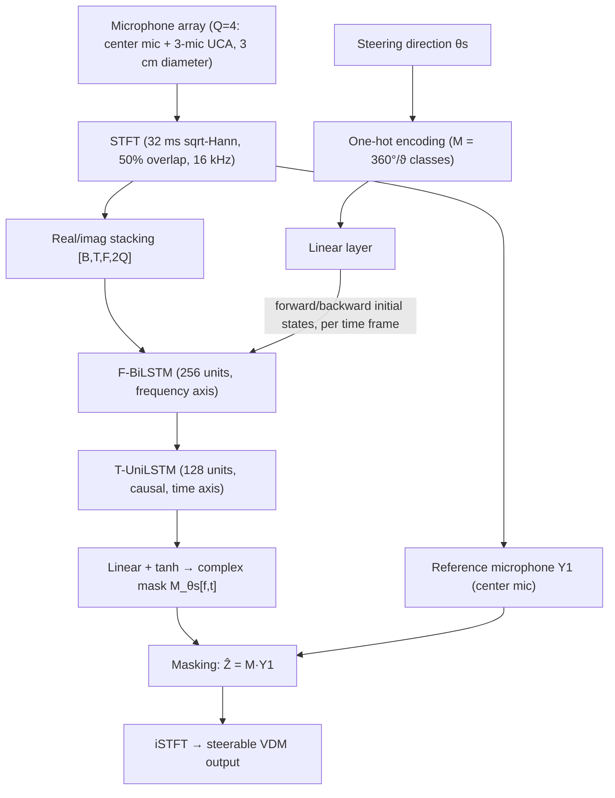

# Huang, Halimeh, Chetupalli, Thiergart & Habets 2025: Steerable Neural Directional Filtering

**Authors**: [[entities/weilong-huang|Weilong Huang]], [[entities/mhd-modar-halimeh|Mhd Modar Halimeh]], [[entities/srikanth-raj-chetupalli|Srikanth Raj Chetupalli]], [[entities/oliver-thiergart|Oliver Thiergart]], [[entities/emanuel-habets|Emanuël Habets]]
**Institution**: International Audio Laboratories Erlangen (joint institution of FAU and Fraunhofer IIS), Erlangen, Germany
**Venue**: 11th Convention of the European Acoustics Association (Euronoise 2025), Málaga, Spain, 23–26 June 2025
**Year**: 2025
**Type**: Conference paper (open access, CC BY 3.0)
**DOI**: N/A
**Zotero**: [Zotero Link](zotero://select/items/0_R3CVBTU5)

## Summary

Steerable neural directional filtering (SNDF) extends [[concepts/neural-directional-filtering|neural directional filtering (NDF)]] from static, pre-defined directivity patterns to patterns that can be steered towards any direction at inference time using a single trained model. The steering direction is fed to the network as a conditioning input (one-hot encoded, mapped to the initial states of the frequency BiLSTM), and a steerability-oriented training strategy reuses each acoustic scene across all steering targets. Experiments on a 4-microphone, 3 cm array show steering-invariant pattern quality, consistent SDR across steering directions, and 6th-order patterns that exceed the classical differential-array order bound for this array.

## Problem Formulation

A compact array of $Q$ omnidirectional microphones captures an anechoic scene with $N$ far-field sources in the x-y plane:

$$Y_q[f,t] = \sum_{n=1}^{N} X_{q,n}[f,t] + V_q[f,t], \qquad X_{q,n}[f,t] = H_{\mathbf{p}_q,\mathbf{p}_n}[f]\,X_n[f,t]$$

where $V_q$ is spatially uncorrelated sensor noise. The objective is to capture the scene as a virtual directional microphone (VDM) at position $\mathbf{p}_{\mathrm{VDM}}$ (the array center) with a **steerable** directivity pattern $\Psi_{\theta_s}[\theta]$, where $\theta_s$ is the steering direction:

$$Z_{\theta_s}[f,t] = \sum_{n=1}^{N} \Psi_{\theta_s}[\theta_n]\,H_{\mathbf{p}_{\mathrm{VDM}},\mathbf{p}_n}[f]\,X_n[f,t]$$

In the founding NDF study ([[sources/wechsler-2024-neural-directional-filtering|Wechsler et al. 2024]]), each directivity pattern required a separately trained model with a fixed look direction. SNDF aims to learn one pattern *shape* that can be steered to any $\theta_s \in [0°, 360°)$ during inference, including mid-recording steering changes.

## Methodology

### Model Structure, Inputs, and Outputs

The architecture is the FT-JNF-based spatially selective filter ([[concepts/joint-nonlinear-filtering|JNF-SSF]], [[concepts/spatially-selective-nonlinear-filter|SSF]]) of Tesch & Gerkmann, extended with a steering mechanism (Figure 1):

![[raw/papers/huang-2025-steerable-neural-directional-filtering/figures/fig1-architecture.png|FT-JNF based neural directional filtering with the steering mechanism]]

*Figure 1: FT-JNF based neural directional filtering with the steering mechanism. The steering direction is one-hot encoded and injected as the initial states of the F-BiLSTM.*

| Spec | Value |
|------|-------|
| **Structure** | Input $[B,T,F,2Q]$ → F-BiLSTM (256 hidden units, spectro-spatial modelling) → T-UniLSTM (128 units, temporal, frame-level causal) → linear + tanh → complex mask $\mathcal{M}_{\theta_s}[f,t]$. Steering branch: one-hot($\theta_s$) → linear layer → forward/backward initial states of the F-BiLSTM per time frame (conditioning scheme of Tesch & Gerkmann 2023). 873K parameters total. |
| **Input** | Real + imaginary STFT parts of $Q=4$ microphone signals, $[B,T,F,8]$; 32 ms frames, square-root Hann window, 50% overlap at 16 kHz. Conditioning: one-hot steering direction over $M = 360°/\vartheta$ classes. |
| **Output** | Single-channel complex mask $\mathcal{M}_{\theta_s}[f,t]$ at STFT rate, applied to the center reference microphone: $\hat{Z}_{\theta_s}[f,t] = \mathcal{M}_{\theta_s}[f,t]\,Y_1[f,t]$. |
| **Training data** | LibriSpeech train-clean-360; mixtures of up to 3 concurrent speakers; 11,520 acoustic scenes × 72 steering targets; anechoic ATFs simulated with the Habets RIR generator (reflection order 0). |
| **Role** | Steerable VDM reconstruction: one model renders the learned directivity pattern steered to any direction requested at inference. |

### Training Losses

A batch-aggregated normalized L1 (MAE) loss over the time-domain VDM signals:

$$\mathcal{L}_{\mathrm{MAE}} = \frac{\sum_{b=1}^{B}\|z^{b}_{\mathrm{VDM}} - \hat{z}^{b}_{\mathrm{VDM}}\|_1}{\sum_{b=1}^{B}\|z^{b}_{\mathrm{VDM}}\|_1 + \epsilon}, \qquad \epsilon = 1.2\times 10^{-7}$$

where $z_{\mathrm{VDM}}$ and $\hat{z}_{\mathrm{VDM}}$ are the time-domain target and estimate. An **enhanced mini-batch sampling** rule requires at least one sample per mini-batch to contain a speaker from the target steering direction or its vicinity — this prevents the L1 denominator from collapsing and stabilizes training.

### Training Strategy for Steerability

- **Speaker count**: up to 3 concurrent speakers (per [[sources/wechsler-2024-neural-directional-filtering|Wechsler et al. 2024]], ≥2-speaker training generalizes to 6 speakers; beyond 3 adds no significant gain).
- **Scene reuse across steering targets**: for each acoustic scene, $M$ target VDM signals are generated for steering directions uniformly spanning 0°–360°, and the *same* microphone signals are paired with all $M$ targets as separate training samples — emphasizing the steerability function.
- **Speaker grids**: training positions on a 72-point grid at 5° spacing (0°, 5°, …, 355°); validation on the interleaved grid (2.5°, 7.5°, …, 357.5°); test on a 144-point grid at 2.5° spacing offset by 1.25° — so test DOAs are never on the training grid.

## Experimental Setup

Target patterns are $R$th-order DMA patterns:

$$\Psi_{\theta_s}[\theta] = \sum_{r=0}^{R} a_r \cos^r(\theta - \theta_s), \qquad \sum_{r=0}^{R} a_r = 1$$

with maximum suppression clipped at −40 dB (0.01 linear) when generating target VDM signals. Three targets are trained (one model per pattern order):

| Pattern | Coefficients $(a_0,\dots,a_R)$ |
|---------|-------------------------------|
| 1st-order cardioid | $(\tfrac{1}{2}, \tfrac{1}{2})$ |
| 3rd-order | $(0, \tfrac{1}{6}, \tfrac{1}{2}, \tfrac{1}{3})$ |
| 6th-order | $(\tfrac{1}{49}, \tfrac{8}{49}, \tfrac{8}{49}, -\tfrac{48}{49}, -\tfrac{48}{49}, \tfrac{64}{49}, \tfrac{64}{49})$ |

![[raw/papers/huang-2025-steerable-neural-directional-filtering/figures/fig2-target-patterns.png|Three target DMA patterns for training the DNN models]]

*Figure 2: Three target DMA patterns (1st/3rd/6th-order) used for training, steered towards 0°.*

| Item | Value |
|------|-------|
| Array | $Q=4$: 1 center microphone + 3-microphone UCA, 3 cm diameter; VDM at the center microphone |
| Sampling / STFT | 16 kHz; 32 ms square-root Hann window, 50% overlap |
| Data | LibriSpeech (train-clean-360 / dev-clean / test-clean), 4 s clips (zero-padded if shorter) |
| Training set | 11,520 scenes × 72 steering targets ($\theta_s \in \{0°,5°,\dots,355°\}$) |
| Validation set | 2,880 scenes × 72 targets |
| Test set | 3,240 scenes (2 concurrent speakers, 144-position grid) × 5 targets ($\theta_s \in \{0°,30°,60°,90°,120°\}$) |
| Loudness / noise | Signals normalized to [−33, −25] dBFS; sensor self-noise at 30 dB SNR |
| Optimization | Batch size 10, learning rate 0.001, max 100 epochs, best-validation-loss model selection |

**Metrics**: estimated narrowband $\hat{B}_{\theta_s}[\theta,f]$ and wideband $\hat{P}_{\theta_s}[\theta]$ directivity patterns (RMS-aggregated masked/unmasked power ratios per source direction over the test set), and averaged SDR between estimated and target VDM signals.

## Results

**Steering-invariant patterns.** Across steering directions $\theta_s \in \{0°, 60°, 120°\}$, the estimated pattern shape is essentially invariant: the main lobe is well approximated while null-direction attenuation is limited, and the patterns remain frequency-invariant as desired. This holds for all three target orders (Figures 3–5 show the cardioid and 6th-order cases; the 3rd-order case behaves identically).

![[raw/papers/huang-2025-steerable-neural-directional-filtering/figures/fig3-cardioid.png|Estimated wideband and narrowband patterns for the target cardioid pattern]]

*Figure 3: Estimated wideband pattern $\hat{P}$ (a, c, e) and narrowband pattern $\hat{B}$ (b, d, f) for the target 1st-order cardioid at steering directions 0°, 60°, 120°.*

![[raw/papers/huang-2025-steerable-neural-directional-filtering/figures/fig5-6th-order.png|Estimated wideband and narrowband patterns for the target 6th-order pattern]]

*Figure 5: Estimated wideband and narrowband patterns for the target 6th-order pattern at steering directions 0°, 60°, 120°. Null attenuation degrades relative to the cardioid, but the pattern shape remains steering-invariant and frequency-invariant.*

**Consistent SDR across steering directions** (Table 1):

| Target pattern | 0° | 30° | 60° | 90° | 120° |
|----------------|-----|-----|-----|-----|------|
| 1st-order | 25.81 | 25.90 | 25.89 | 25.96 | 25.95 |
| 3rd-order | 20.16 | 20.22 | 20.21 | 20.20 | 20.29 |
| 6th-order | 17.21 | 17.06 | 16.89 | 16.73 | 17.51 |

Higher-order patterns are harder to learn (SDR drops with order), mainly because the sidelobes around null positions correspond to low-power target signals. Since test microphone signals are identical across steering directions, the near-constant SDR confirms direction-independent performance.

**Mid-inference steering demo.** A 20 s scene with speech at 60° and music at 230°, steered to 60° for the first 10 s and to 230° afterwards: the null-direction source is suppressed in each segment and the output matches the target VDM spectrogram without evident distortion — notably, the model generalizes to music although trained on speech only.

![[raw/papers/huang-2025-steerable-neural-directional-filtering/figures/fig6-spectrograms.png|Spectrograms for the mid-inference steering scenario]]

*Figure 6: (a) fully overlapping reference mixture (speech at 60°, music at 230°); (b) target VDM signal; (c) SNDF output with the steering direction switched from 60° to 230° at t = 10 s.*

## Key Contributions

1. **Steerable NDF (SNDF)**: first NDF variant whose learned directivity pattern can be steered to any direction at inference with a single trained model, via steering-direction conditioning (one-hot encoding → linear layer → F-BiLSTM initial states).
2. **Steerability-oriented training strategy**: reuse of each acoustic scene's microphone signals across all $M$ steering targets, plus a mini-batch sampling rule (≥1 sample per batch with a speaker at/near the target direction) that stabilizes the normalized L1 loss.
3. **Steering-invariance analysis**: estimated pattern shape and SDR are consistent across steering directions; patterns remain frequency-invariant; 6th-order patterns are learned with only 4 microphones (3-mic UCA), exceeding the classical DMA order bound $\lfloor Q/2 \rfloor$ for the ring.
4. **Generalization evidence**: a speech-trained model steers and suppresses correctly on a music interferer, and the steering direction can be switched mid-recording.

## Related Concepts

- [[concepts/steerable-neural-directional-filtering|Steerable Neural Directional Filtering]]
- [[concepts/neural-directional-filtering|Neural Directional Filtering]]
- [[concepts/virtual-directional-microphone|Virtual Directional Microphone]]
- [[concepts/joint-nonlinear-filtering|Joint Nonlinear Filtering]]
- [[concepts/spatially-selective-nonlinear-filter|Spatially Selective Non-Linear Filter]]
- [[concepts/directivity-pattern|Directivity Pattern]]
- [[concepts/differential-microphone-array|Differential Microphone Array]]
- [[concepts/fixed-beamformer|Fixed Beamformer]]

## Related Synthesis

- [[synthesis/multi-channel-speech-enhancement|Multi-channel Speech Enhancement]]
