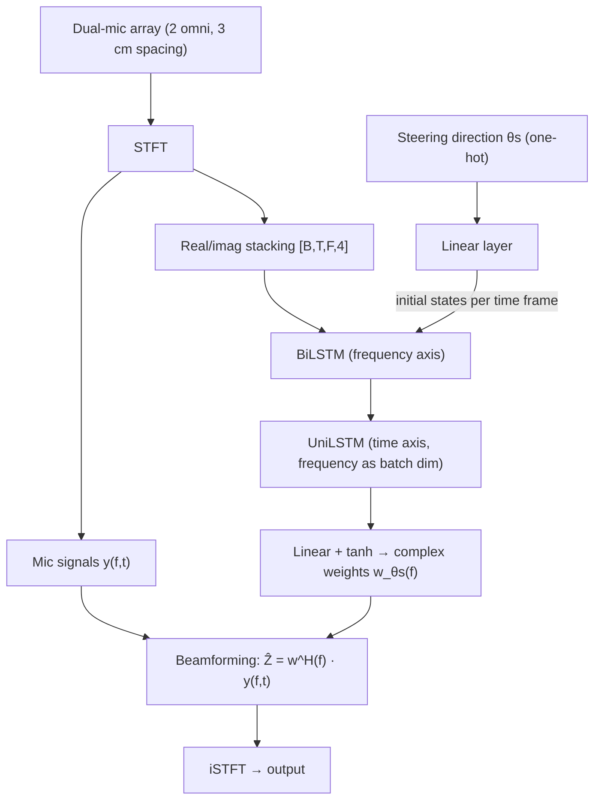

# Huang & Habets 2026: Dual-Microphone Steerable High-Order Neural Differential Beamformer

**Authors**: [[entities/weilong-huang|Weilong Huang]], [[entities/emanuel-habets|Emanuël Habets]]
**Institution**: International Audio Laboratories Erlangen (joint institution of Fraunhofer IIS and FAU), Erlangen, Germany
**Venue**: arXiv preprint 2609.27021 (submitted 2026-09-22)
**Year**: 2026
**Type**: Preprint
**DOI**: [10.48550/arXiv.2609.27021](https://doi.org/10.48550/arXiv.2609.27021)
**Zotero**: [Zotero Link](zotero://select/items/0_3TZX8NYS)

## Summary

This paper proposes the neural differential beamformer (NDBF), which uses a DNN to produce classical-DMA-like beampatterns from a dual-microphone linear array of closely spaced (3 cm) omnidirectional microphones. Unlike classical dual-mic differential beamformers — which are restricted to first order and are non-steerable — NDBF is (i) steerable (the beampattern maintains its shape across look directions 0°–180° in the semicircular plane), (ii) achieves high-order frequency-invariant beampatterns, and (iii) enables stereo recording with only two omnidirectional microphones by running two parallel steered models in an X-Y configuration.

## Problem Formulation

A dual-microphone linear array captures $N$ sources in an (anechoic) sound field. In the STFT domain:

$$
Y_{1}(f,t)=\sum_{n=1}^{N}X_{1,n}(f,t)+V_{1}(f,t), \qquad X_{1,n}(f,t)=H_{\mathbf{p}_{1},n}(f)\,X_{n}(f,t)
$$

where $V_{1}$ is spatially uncorrelated sensor noise and $H_{\mathbf{p}_{1},n}$ is the direct-path transfer function (DPTF) to microphone position $\mathbf{p}_1$. The goal is to capture the scene with a **steerable high-order DMA beampattern** $\Lambda_{\theta_{\mathrm{s}}}(\theta_{\mathrm{n}})$, where $\theta_{\mathrm{s}}$ is the steering direction and $\theta_{\mathrm{n}}$ the source DOA with respect to the array center $\mathbf{p}_{\mathrm{c}}$:

$$
Z_{\theta_{\mathrm{s}}}(f,t)=\sum_{n=1}^{N}\Lambda_{\theta_{\mathrm{s}}}(\theta_{\mathrm{n}})\,H_{\mathbf{p}_{\mathrm{c}},n}(f)\,X_{n}(f,t)
$$

**Steerability for linear arrays** is defined (following [[sources/jin-2021-steering-study-ldma|Jin et al. 2021]]) as the beampattern maintaining the same shape across all look directions from 0° to 180° in the semicircular plane (beampatterns of linear omni arrays are symmetric about the array axis). Classical dual-mic DMAs are first-order only and hardly steerable — first-order LDMAs are provably non-steerable ([[concepts/steerable-ldma|Steerable LDMA]]).

## Methodology

### Model Structure, Inputs, and Outputs

The architecture is the [[concepts/spatially-selective-nonlinear-filter|JNF-SSF]] of Tesch & Gerkmann (2023), extended with one decisive modification: the single-channel complex mask of the output layer is replaced by a **vector of $Q=2$ complex beamforming weights** per frequency, applied to all microphone signals (rather than masking one reference channel) — enabling the network to act as a true beamformer that exploits the limited spatial degrees of freedom of a dual-microphone array.

| Spec | Value |
|------|-------|
| **Structure** | Input $[B,T,F,4]$ → BiLSTM along frequency (instantaneous spectro-spatial modelling) → UniLSTM along time (frequency treated as batch dimension, all frequencies modelled independently) → linear layer with tanh activation → complex beamforming weights $\mathbf{w}_{\theta_{\mathrm{s}}}(f)$. Steering branch: one-hot($\theta_{\mathrm{s}}$) → linear layer → embedding used to initialize the LSTM states for each time frame. |
| **Input** | Real + imaginary STFT parts of the 2 microphone signals, $[B,T,F,4]$; 4 s samples. Conditioning: one-hot steering direction over $M = 36$ classes (5° resolution, 0°–180°). |
| **Output** | Two complex weights per frequency $f$, $\mathbf{w}_{\theta_{\mathrm{s}}}(f)$, applied as $\widehat{Z}_{\theta_{\mathrm{s}}}(f,t)=\mathbf{w}_{\theta_{\mathrm{s}}}^{H}(f)\,\mathbf{y}(f,t)$ — one beamformed output signal per steering direction. |
| **Training data** | LibriSpeech train-clean-360 (train) / dev-clean (validation); 1440 random source-array setups on a semicircle × 36 steering targets; test on EARS; 30 dB SNR sensor noise. |
| **Role** | Steerable high-order differential beamforming: renders the learned DMA beampattern steered to any $\theta_{\mathrm{s}} \in [0°, 180°]$ at inference from only two microphones. |

### Training Losses

Batch-aggregated normalized $\mathcal{L}_1$ loss over time-domain signals:

$$
\mathcal{L}_{\textrm{1}}=\frac{\sum_{b=1}^{B}\left\lVert\mathbf{z}^{b}-\hat{\mathbf{z}}^{b}\right\rVert_{1}}{\sum_{b=1}^{B}\left\lVert\mathbf{z}^{b}\right\rVert_{1}+\epsilon}
$$

where $\mathbf{z}$ and $\hat{\mathbf{z}}$ are the time-domain target and estimate. STFT settings and training details follow NDF (Wechsler et al. 2024).

### Target Beampatterns and Training Strategy

A $J$th-order DMA beampattern is $\Lambda_{\theta_{\mathrm{s}}}=\sum_{j=0}^{J}a_{j}\cos^{j}(\theta-\theta_{\mathrm{s}})$. Focusing on mainlobe control, the paper uses the simplified DMA pattern

$$
\Lambda(\theta)=\left(\mu+(1-\mu)\cos(\theta-\theta_{\mathrm{s}})\right)^{J}
$$

with $\mu \in [0,1]$ controlling the null position. Two targets are trained: a 1st-order Cardioid ($\mu=0.5, J=1$) and a 3rd-order Cardioid ($\mu=0.5, J=3$).

Sources are positioned along a **semicircle** concentric with the array (array along the 0°–180° axis); DPTFs are simulated with the Habets RIR generator (reflection order 0). Each source-array setup is paired with $M=36$ target signals for look directions uniformly spanning 0°–180° (5° steering resolution) — the scene-reuse-across-steering-targets strategy of [[concepts/steerable-neural-directional-filtering|SNDF]].

## Experimental Setup

| Item | Value |
|------|-------|
| Array | $Q=2$ omnidirectional microphones, 3 cm spacing (spatial aliasing above 5.7 kHz for classical methods) |
| Source-array distance | 1.5 m (fixed) |
| Training set | 1440 setups × 36 steering targets; up to 3 concurrent sources; source DOAs $\theta_{\mathrm{n}}\in\{0°,5°,\ldots,175°\}$; LibriSpeech train-clean-360 |
| Validation set | dev-clean; source DOAs $\theta_{\mathrm{n}}\in\{2.5°,7.5°,\ldots,177.5°\}$ |
| Test set | 3240 samples; exactly 2 concurrent sources; EARS dataset (min loudness −42 dBFS); source DOAs $\theta_{\mathrm{n}}\in\{1.25°,3.75°,\ldots,178.75°\}$ (interleaved with training grid) |
| Sample duration | 4 s |
| Sensor noise | 30 dB SNR |
| Baselines | Classical DMA (Benesty & Chen 2012), parametric spatial filter (Thiergart et al. 2014), NDF (Wechsler et al. 2024) retrained on the same dual-mic data |
| Metrics | Estimated wideband/narrowband beampatterns (wideband power ratio per source direction); SDR |

## Results

**Endfire SDR comparison** (Table 1):

| Method | 1st-order pattern | 3rd-order pattern |
|--------|------------------|-------------------|
| DMA | −0.99 dB | N/A |
| Parametric spatial filter | 13.77 dB | 10.32 dB |
| NDF (dual-mic retrained) | 25.85 dB | 23.13 dB |
| **Proposed NDBF** | **25.93 dB** | **23.24 dB** |

The DMA suffers white-noise amplification at low frequencies and spatial aliasing above 5.7 kHz (3 cm spacing), which collapses its SDR; the parametric spatial filter is also impacted by aliasing. NDBF outperforms even the retrained NDF: both approximate the mainlobe, but NDBF provides **stronger suppression near the null position** and a cleaner suppression region in narrowband beampatterns — attributed to the complex-weight beamformer output exploiting both microphone channels, versus NDF's single-channel mask on one reference microphone.

**Steerability** (Fig. 4): across look directions $\theta_{\mathrm{s}} \in \{0°, 30°, 60°, 90°\}$, the NDBF beampattern keeps the same shape for both orders — the paper's definition of steerable. The classical DMA achieves 0 dB at the look direction but **exceeds 0 dB in other directions** (non-steerable). Steered 3rd-order narrowband patterns remain frequency-invariant like the endfire case, and both NDBF and NDF avoid spatial aliasing for broadband speech.

![[raw/papers/huang-2026-dual-mic-steerable-neural-beamformer/figures/fig2.png|Estimated 3rd-order narrowband beampatterns]]

*Figure 5: Estimated 3rd-order narrowband beampatterns. (a) Baseline NDF at $\theta_{\mathrm{s}}=0°$; (b)–(d) proposed NDBF at steering angles 0°, 30°, and 60° — the steered patterns stay frequency-invariant with cleaner null suppression.*

**Stereo recording application**: two parallel steerable NDBF models (1st-order cardioid), one steered to $\theta_{\mathrm{L}}=135°$ (left channel) and one to $\theta_{\mathrm{R}}=45°$ (right channel) — an X-Y stereo configuration realized with two closely spaced omnidirectional microphones. In a simulated reverberant room (6 m × 4 m × 3.5 m, $RT_{60}=0.15$ s) with a source moving clockwise from 180° to 0° over 12 s (DAS generator), the NDBF stereo output closely matches a reference pair of virtual directional microphones at the array center with the same look directions — including segmental left/right energy differences (inter-channel level differences). The authors state that neither classical differential beamformers nor existing neural beamformers previously enabled stereo recording with only two closely spaced omnidirectional microphones.

![[raw/papers/huang-2026-dual-mic-steerable-neural-beamformer/figures/fig1.png|Goal of steerable high-order neural differential beamforming with dual omnidirectional microphones]]

*Figure 1: The goal of the steerable high-order neural differential beamforming with dual-omnidirectional microphones.*

## Key Contributions

1. **Steerable NDBF**: a DNN-based differential beamformer for a dual-microphone linear array whose beampattern maintains its shape across look directions 0°–180° — full steerability in the semicircular plane, where first-order classical designs are provably non-steerable.
2. **High-order patterns with two microphones**: frequency-invariant 3rd-order beampatterns from only 2 omnidirectional microphones (classical bound: order $Q-1 = 1$), without spatial aliasing, outperforming classical DMA, a parametric spatial filter, and a dual-mic-retrained NDF.
3. **Mask-to-weights architectural modification**: replaces the JNF-SSF single-channel complex mask with a vector of complex beamforming weights per frequency — exploiting the limited spatial degrees of freedom of dual-mic arrays better than reference-channel masking.
4. **Stereo recording with two omni microphones**: two parallel steered NDBFs in an X-Y configuration reproduce the stereo output (incl. inter-channel level differences) of two virtual directional microphones — a capability no classical or prior neural beamformer offered with two closely spaced omni mics.

## Related Concepts

- [[concepts/neural-differential-beamformer|Neural Differential Beamformer]]
- [[concepts/neural-directional-filtering|Neural Directional Filtering]]
- [[concepts/steerable-neural-directional-filtering|Steerable Neural Directional Filtering]]
- [[concepts/steerable-ldma|Steerable LDMA]]
- [[concepts/differential-microphone-array|Differential Microphone Array]]
- [[concepts/spatially-selective-nonlinear-filter|Spatially Selective Non-Linear Filter]]
- [[concepts/frequency-invariant-beamforming|Frequency-Invariant Beamforming]]
- [[concepts/virtual-directional-microphone|Virtual Directional Microphone]]

## Related Synthesis

- [[synthesis/multi-channel-speech-enhancement|Multi-channel Speech Enhancement]]
