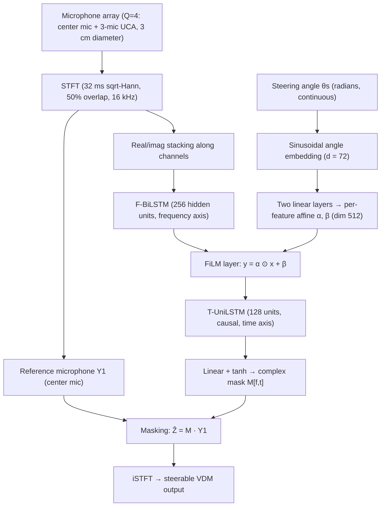

# Huang, Chetupalli, Halimeh, Thiergart & Habets 2026: Neural Directional Filtering with a Compact Microphone Array

**Authors**: [[entities/weilong-huang|Weilong Huang]], [[entities/srikanth-raj-chetupalli|Srikanth Raj Chetupalli]], [[entities/mhd-modar-halimeh|Mhd Modar Halimeh]], [[entities/oliver-thiergart|Oliver Thiergart]], [[entities/emanuel-habets|Emanuël A. P. Habets]]
**Institution**: International Audio Laboratories Erlangen, Germany
**Venue**: arXiv preprint 2511.07185 (v4, 2026-03-23; first submitted November 2025)
**Year**: 2026
**Type**: Preprint (journal-style extension of [[sources/wechsler-2024-neural-directional-filtering|Wechsler et al. 2024]])
**DOI**: [10.48550/arXiv.2511.07185](https://doi.org/10.48550/arXiv.2511.07185)
**Zotero**: [Zotero Link](zotero://select/items/0_Z4XEUH72)

## Summary

This is the comprehensive journal-style treatment of [[concepts/neural-directional-filtering|neural directional filtering]] (NDF), extending the preliminary IWAENC 2024 study. A DNN computes a single-channel complex mask from a compact 4-microphone array, applied to a reference microphone to approximate a [[concepts/virtual-directional-microphone|virtual directional microphone]] (VDM) with a desired directivity pattern. The paper proposes the **FiLM-JNF** architecture (also introduced in the companion study Huang, Chetupalli & Habets 2025, arXiv:2510.20253) for *continuous* steering — replacing the discrete one-hot conditioning of [[concepts/steerable-neural-directional-filtering|SNDF]] — together with a batch-aggregated normalized $\mathcal{L}_1$ loss and data-dependent metrics for evaluating the directivity pattern and directivity factor of any masking-based method. It demonstrates frequency-invariant patterns even above the spatial aliasing frequency, higher-order and user-defined patterns, reverberant-environment training, generalization to unseen non-speech and moving sources, and a stereo-recording application.

## Problem Formulation

A compact array of $Q$ omnidirectional microphones captures $N$ far-field sources (azimuth-only, x-y plane) plus spatially uncorrelated sensor noise:

$$
Y_{q}[f,t]=\sum_{n=1}^{N}X_{q,n}[f,t]+V_{q}[f,t], \qquad X_{q,n}[f,t]=H_{\mathbf{p}_{q},\mathbf{p}_{n}}[f]\,X_{n}[f,t].
$$

A $J$-th order DMA directivity pattern is defined as a power of the first-order pattern (identical null positions across factors, avoiding extra sidelobes):

$$
\Lambda(\theta,\phi)=\left(\mu+(1-\mu)(\sin\phi\sin\phi_{\textrm{s}}\cos(\theta-\theta_{\textrm{s}})+\cos\phi\cos\phi_{\textrm{s}})\right)^{J},
$$

with $\mu\in[0,1]$ the null parameter ($\mu=0.5$: cardioid). The target is the reverberant VDM signal, in which **every propagation path is weighted by the directivity gain at its angle of arrival**:

$$
Z[f,t]=\sum_{n=1}^{N}H_{\mathbf{p}_{\textrm{VDM}},\mathbf{p}_{n}}[f,\Lambda(\theta,\phi)]\,X_{n}[f,t], \qquad
H_{\mathbf{p}_{\textrm{VDM}},\mathbf{p}_{n}}[f,\Lambda]=\sum_{i=1}^{\infty}\Lambda(\theta_{i},\phi_{i})\,\rho^{(i)}_{\mathbf{p}_{\textrm{VDM}},\mathbf{p}_{n}}[f],
$$

which reduces to the anechoic direct-path form $Z[f,t]=\sum_n \Lambda(\theta_n)\,\rho_{\mathbf{p}_{\textrm{VDM}},\mathbf{p}_{n}}[f]\,X_n[f,t]$. The DNN-based estimate applies a complex mask to the reference (center) microphone: $\widehat{Z}[f,t]=\mathcal{M}[f,t]\,Y_{1}[f,t]$.

## Methodology

### Model Structure, Inputs, and Outputs

Two architectures are used (Figure 2): the **FT-JNF** backbone ([[concepts/joint-nonlinear-filtering|joint nonlinear filtering]] of Tesch & Gerkmann 2023) for static patterns, and the proposed **FiLM-JNF** for continuously steerable patterns. In FiLM-JNF the steering angle is embedded with a sinusoidal encoding ($d_{\mathrm{emb}}=72$, as in transformer positional encodings but applied to the continuous angle) and injected through a [[concepts/film-layer|FiLM]] layer between the frequency BiLSTM and the time UniLSTM.

![[raw/papers/huang-2026-neural-directional-filtering/figures/fig1.png|DNN architecture for neural directional filtering]]

*Figure 2: DNN architecture for NDF — FT-JNF for a static steering direction (left) and the proposed FiLM-JNF for continuous steering (right).*

| Spec | FT-JNF (static) | FiLM-JNF (steerable) |
|------|-----------------|----------------------|
| **Structure** | F-BiLSTM (256 units, frequency axis) → T-UniLSTM (128 units, causal) → linear + tanh → complex mask | Same, with a FiLM conditioning layer ($\mathbf{y}=\boldsymbol{\alpha}\odot\mathbf{x}+\boldsymbol{\beta}$, dims $[B,512]$, shared across time and frequency) inserted between F-BiLSTM and T-UniLSTM |
| **Input** | Real/imag STFT parts of $Q=4$ mics; 32 ms sqrt-Hann, 50% overlap, 16 kHz | Same, plus steering angle $\theta_{\mathrm{s}}$ (continuous, radians) |
| **Conditioning** | none (pattern fixed at training) | sinusoidal angle embedding $\mathbf{e}_{\theta_s}\in\mathbb{R}^{72}$ → two linear layers → $\boldsymbol{\alpha},\boldsymbol{\beta}\in\mathbb{R}^{512}$ |
| **Output** | complex mask $\mathcal{M}[f,t]$ applied to the center reference microphone | same, mask $\mathcal{M}_{\theta_s}[f,t]$ follows the requested steering direction |
| **Complexity** | 874 K params, 3.33 MB, 14.116 GMACs/s, RTF 0.706 (ONNX, MacBook Pro M2) | 948 K params, 3.62 MB, 14.121 GMACs/s, RTF 0.740 |
| **Latency** | 32 ms algorithmic (window length, causal UniLSTM) | 32 ms |
| **Role** | static-pattern VDM reconstruction | continuously steerable VDM reconstruction |

### Training Losses

The preliminary study used a batch-aggregated thresholded SDR loss with $\tau=10^{-\mathrm{SDR}_{\max}/10}$ ($\mathrm{SDR}_{\max}=40$ dB). This paper adopts a **batch-aggregated normalized $\mathcal{L}_{1}$ loss** (reported to outperform $\mathcal{L}_{2}$-type losses on SDR/PESQ/STOI in speech processing):

$$
\mathcal{L}_{\textrm{1}}(\mathbf{z},\widehat{\mathbf{z}})=\frac{\sum_{b=1}^{B}\left\|\mathbf{z}^{(b)}-\widehat{\mathbf{z}}^{(b)}\right\|_{1}}{\sum_{b=1}^{B}\left\|\mathbf{z}^{(b)}\right\|_{1}+\epsilon},
$$

with $\epsilon=10^{-7}$ and maximum null attenuation clipped at 30 dB. An **enhanced mini-batch sampling** rule requires each mini-batch to contain at least one sample with a source in the target direction or its vicinity ($\pm 20^{\circ}$), preventing the normalization denominator from collapsing when all samples sit near the null direction.

### Training Strategies

- **Anechoic**: fixed source-array distance $d=1.5$ m; $P_{\textrm{train}}=72$ candidate DOAs (5° grid); direct-path RIRs via the Habets RIR generator (reflection order 0); up to 3 concurrent speakers (2+ speaker training generalizes to 6; beyond 3 adds no gain).
- **Reverberant**: random room size, $\textrm{RT}_{60}\in[0.2,0.5]$ s, source-array distance $\in[0.5,2.5]$ m, array $\geq 1.2$ m from walls (Monte Carlo RIR simulation); 50,000 training samples.
- **Steerable**: $M=72$ target VDM signals per scene (steering directions on a 5° grid); the same microphone signals are reused as $M$ training samples. FiLM's continuous embedding allows steering to angles *not* on the training grid (tested at 32.5° and 67.5°).
- Static models: max 250 epochs (anechoic); steerable/reverberant: 150 epochs; LR 0.001 decayed ×0.75 every 40 (anechoic) / 20 epochs; batch size 10.

### Data-Dependent Performance Measures

Because NDF is data-dependent and non-linear, the classical WNG/DF/pattern definitions (defined for fixed linear weights $\mathbf{w}$) do not apply. The paper proposes metrics for **any masking-based method** (see [[concepts/data-dependent-directivity-metrics|data-dependent directivity metrics]]):

- **Power pattern**: apply the estimated mask separately to the *direct-path* component of each source at the reference microphone; the per-direction average of the masked/unmasked power ratios (narrowband $\xi_n^{(k)}[f]$ and wideband $\bar{\xi}_n^{(k)}$) yields the estimated pattern $\widehat{\mathcal{P}}[\theta_p,f]$. Accurate when DRR is high.
- **Directivity factor**: ratio of reverberant-component power at the input to that at the masked output, $\widehat{\mathcal{DF}}[f]=\frac{\sum_{k,t}|Y^{(k)}_{1,\textrm{rvb}}|^2}{\sum_{k,t}|\mathcal{M}^{(k)}Y^{(k)}_{1,\textrm{rvb}}|^2}$. Accurate when DRR is low. A target-VDM variant $\widehat{\mathcal{DF}}_{\textrm{target}}$ validates the computation against theoretical DF values.

## Experimental Setup

| Item | Value |
|------|-------|
| Array | $Q=4$: center microphone + 3-mic UCA, 3 cm diameter (6 cm / 9 cm in the aperture study); VDM at the center microphone |
| Target patterns | 1st / 3rd / 6th-order cardioid DMA patterns; plus two user-defined shapes (two-mainlobe; step-like) |
| Training data | LibriSpeech train-clean-360, up to 3 concurrent speakers, 4 s clips, loudness normalized to [−33, −25] dBFS, sensor noise at 30 dB SNR |
| Test data (speech) | EARS dataset (≥ −42 dBFS utterances, 4 s segments, 2 concurrent speakers, 144-point DOA grid at 2.5° spacing offset 1.25°) |
| Test data (non-speech) | WHAM! noise sources |
| Baselines | Null-constraint DMA; LS beamformer (min WNG −15 dB); oracle parametric filtering (oracle DOA, anechoic only — upper bound) |
| Metrics | SDR, SCOREQ, PESQ; estimated power patterns; estimated DF |

![[raw/papers/huang-2026-neural-directional-filtering/figures/fig2.png|LS beamformer targeting a 3rd-order cardioid pattern]]

*Figure 3: Pattern obtained with an LS beamformer targeting a 3rd-order cardioid on the 4-mic 3 cm array — spatial aliasing at high frequencies, widened mainlobe at low frequencies. For a circular array the highest achievable DMA order is $\lfloor (M-1)/2 \rfloor$ (1st-order for $M=4$), so 3rd/6th-order entries are infeasible for the fixed baselines.*

## Results

### Static Patterns in Anechoic Conditions

| Method | 1st-order SDR | 3rd-order SDR | 6th-order SDR |
|--------|---------------|----------------|----------------|
| DMA | 6.25 | – | – |
| LS beamformer | 10.32 | – | – |
| Parametric filtering (oracle DOA) | 19.80 | 18.62 | 19.03 |
| NDF ($\mathcal{L}_{\textrm{SDR}}$, Wechsler 2024) | 27.55 | 25.71 | 25.68 |
| NDF ($\mathcal{L}_{1}$, proposed) | **27.70** | **26.93** | **27.31** |

The $\mathcal{L}_{1}$ loss improves SDR/PESQ over the tSDR loss for 3rd/6th-order patterns. The learned mainlobes are largely frequency-invariant; null positions show larger deviations.

![[raw/papers/huang-2026-neural-directional-filtering/figures/fig3.png|Estimated power patterns for the 3rd-order target]]

*Figure 4 (3rd-order case): estimated power patterns — the NDF learns highly directive mainlobes with frequency invariance, while null positions deviate more.*

### Frequency Processing Mechanisms (Spatial Aliasing)

Using a 6 cm array (aliasing above 5.6 kHz) and bandpass-filtered inputs (500 Hz bandwidth):

- 1 kHz band only → target 1st-order pattern matched.
- 7 kHz band only (above aliasing limit) → distorted pattern, spatial aliasing.
- 7 kHz band **plus all content below 5.6 kHz** → aliasing resolved, target pattern recovered.
- Two bands (1 kHz + 7 kHz) without the in-between context → aliasing at 7 kHz returns.

Conclusion: the model performs **frequency-dependent processing**, resolving phase ambiguities when broadband spectral context is available — reminiscent of classical low-to-high subband disambiguation schemes. Two hypothesized mechanisms: exploitation of cross-band source characteristics (as in single-channel separation) and the frequency-dependence of the aliased-angle sets (the true angle is the consistent one across frequencies). The authors stress this is an empirical finding, not a theoretical guarantee.

### Non-Speech Generalization

On WHAM! noise sources (unseen during speech-only training), the 3rd/6th-order estimated patterns maintain good mainlobe approximation with larger deviations than for speech — spatial features are still extracted without speech-specific spectral characteristics.

![[raw/papers/huang-2026-neural-directional-filtering/figures/fig5.png|Power patterns estimated on non-speech test sets]]

*Figure 7 (3rd-order case): narrowband/wideband power patterns estimated with WHAM! noise sources — mainlobe approximation is maintained for unseen non-speech sources.*

### Array Aperture and Sensor Noise

SDR improves with diameter (1st-order: 27.70 / 29.61 / 30.43 dB for 3 / 6 / 9 cm). At 10 dB SNR, however, the 3 cm array shows white-noise amplification at very low frequencies (up to +3.5 dB, analogous to DMA/superdirective beamformers) while the 9 cm array loses frequency invariance at high frequencies — smaller diameters preserve the pattern shape at high frequencies under noise, larger diameters are more robust at low frequencies.

### Steerable Patterns (FiLM-JNF)

Performance is consistent across steering directions $\theta_s\in\{0°,30°,32.5°,60°,67.5°,90°\}$ — including 32.5° and 67.5°, which are **not on the 5° training grid** (continuous steering, unlike one-hot SNDF): 1st-order 27.66–27.72 dB, 3rd-order 24.72–25.17 dB, 6th-order 25.73–26.25 dB SDR, with frequency-invariant patterns.

![[raw/papers/huang-2026-neural-directional-filtering/figures/fig7.png|Narrowband power patterns for the 6th-order steerable pattern]]

*Figure 9 (steering to 32.5°): narrowband power pattern estimates for the 6th-order pattern — frequency-invariant and steering-invariant, including at off-grid steering angles.*

### User-Defined Patterns

Two non-DMA shapes are learned: a two-mainlobe pattern (20°/30° widths, 0 dB attenuation, broad null) and a step-like pattern with sharp level transitions. Unattenuated regions are well approximated in a frequency-invariant manner; null attenuation is limited to −25 dB and pattern variance grows beyond −15 dB attenuation.

![[raw/papers/huang-2026-neural-directional-filtering/figures/fig8.png|User-defined pattern learned by NDF]]

*Figure 10 (step-like pattern): user-defined pattern learning — the pattern shape is determined solely by the target VDM signal, not by the architecture or loss.*

### Reverberant Environments (R-Model vs A-Model)

Models trained on reverberant data (R-Model) outperform anechoic-trained models (A-Model), and both beat the baselines at all reverberation times:

| Method / pattern | RT60=0.2 s | RT60=0.4 s | RT60=0.6 s |
|------------------|------------|------------|------------|
| DMA (1st) | 6.82 | 7.71 | 7.92 |
| LS beamformer (1st) | 10.83 | 11.62 | 11.78 |
| A-Model (1st / 3rd / 6th) | 19.43 / 11.81 / 8.34 | 18.23 / 9.27 / 5.64 | 17.75 / 8.59 / 4.90 |
| R-Model (1st / 3rd / 6th) | **22.12** / **14.30** / **10.58** | **20.37** / **11.59** / **7.77** | **19.70** / **10.74** / **6.92** |

Performance depends strongly on the pattern order and only mildly on RT60. Power-pattern analysis (source distance 1 m, positive DRR): for the 1st-order pattern A- and R-Models are similar; for the 6th-order pattern at RT60 = 0.6 s the R-Model suppresses direct-path sound near the null more strongly. DF analysis (source distance 2.5 m, low DRR): the R-Model's DF approaches or exceeds the target VDM's DF at RT60 = 0.6 s — slight over-suppression of reverberation beyond its training range (max RT60 = 0.5 s).

![[raw/papers/huang-2026-neural-directional-filtering/figures/fig9.png|Wideband power patterns of A-Model and R-Model]]

*Figure 11 (1st-order, RT60 = 0.2 s panel): estimated wideband power patterns for the A-Model (anechoic-trained) and R-Model (reverberant-trained).*

### Moving Sources and Stereo Recording

- **Simulated mono**: static speech at 0° + music source rotating a full circle in 18 s (RT60 = 0.15 s); the anechoic-trained 1st-order cardioid NDF output follows the target VDM — the moving source's amplitude dips towards the null and recovers, with slightly stronger suppression at high frequencies near the null; the desired-direction speech stays undistorted.
- **Real-room stereo**: two co-located 1st-order cardioids (steerable NDF steered to 45° and 135°) record a speaker moving 0°→180° in a room with RT60 = 0.23 s; the measured left/right amplitude difference reaches 16 dB, though below the theoretical cardioid null-depth.

![[raw/papers/huang-2026-neural-directional-filtering/figures/fig10.png|Spectrograms for the simulated moving-source scenario]]

*Figure 15 (NDF output panel): spectrogram comparison for the simulated moving scenario — the NDF output follows the target VDM while the desired-direction speech remains undistorted.*

## Key Contributions

1. **Continuous steerability**: the FiLM-JNF architecture conditions the FT-JNF backbone on an arbitrary continuous steering angle via a sinusoidal angle embedding + FiLM layer, removing the discrete one-hot limitation of prior conditioning (Tesch & Gerkmann 2023; SNDF).
2. **Pattern controllability**: frequency-invariant higher-order (up to 6th-order) and arbitrary user-defined directivity patterns from a 4-microphone 3 cm array.
3. **Evaluation methodology**: data-dependent estimation of the directivity pattern and directivity factor applicable to any masking-based (non-linear) method, separating the analysis of direct and reverberant components.
4. **Training improvements**: batch-aggregated normalized $\mathcal{L}_{1}$ loss (better than the tSDR loss of the preliminary study) and an enhanced mini-batch sampling rule for training stability.
5. **In-depth analysis**: frequency invariance above the spatial aliasing frequency via broadband context; generalization to unseen non-speech sources and moving sources; aperture-vs-noise trade-offs; reverberant training strategy; stereo-recording application.

## Related Concepts

- [[concepts/neural-directional-filtering|Neural Directional Filtering]]
- [[concepts/steerable-neural-directional-filtering|Steerable Neural Directional Filtering]]
- [[concepts/film-jnf|FiLM-JNF]]
- [[concepts/joint-nonlinear-filtering|Joint Nonlinear Filtering]]
- [[concepts/film-layer|FiLM Layer]]
- [[concepts/virtual-directional-microphone|Virtual Directional Microphone]]
- [[concepts/directivity-pattern|Directivity Pattern]]
- [[concepts/data-dependent-directivity-metrics|Data-Dependent Directivity Metrics]]
- [[concepts/differential-microphone-array|Differential Microphone Array]]
- [[concepts/fixed-beamformer|Fixed Beamformer]]

## Related Synthesis

- [[synthesis/multi-channel-speech-enhancement|Multi-channel Speech Enhancement]]
