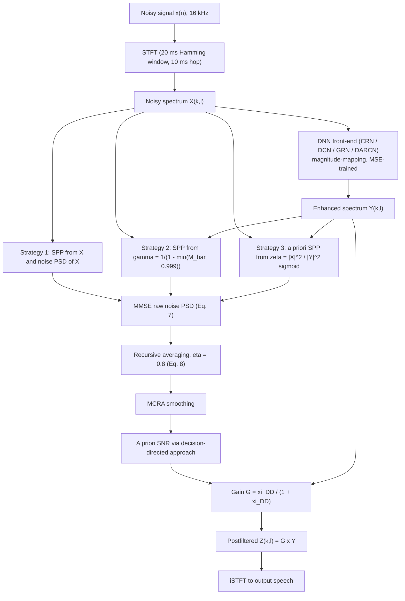

# Ke, Li, Zheng, Peng & Li 2021: Low-Complexity Artificial Noise Suppression for Deep Learning-Based Speech Enhancement

**Authors**: [[entities/yuxuan-ke|Yuxuan Ke]]¹², [[entities/andong-li|Andong Li]]¹², [[entities/chengshi-zheng|Chengshi Zheng]]¹², [[entities/renhua-peng|Renhua Peng]]¹² (corresponding), [[entities/xiaodong-li|Xiaodong Li]]¹²

**Affiliation**: ¹Key Laboratory of Noise and Vibration Research, Institute of Acoustics, Chinese Academy of Sciences, Beijing, China; ²University of Chinese Academy of Sciences, Beijing, China

**Venue**: EURASIP Journal on Audio, Speech, and Music Processing, vol. 2021 (received 3 Sep 2020, accepted 12 Mar 2021, published 12 Apr 2021)

**Year**: 2021 | **Type**: Journal paper | **DOI**: [10.1186/s13636-021-00204-9](https://doi.org/10.1186/s13636-021-00204-9)

**Zotero**: [EQHIKN87](zotero://select/items/0_EQHIKN87)

## Summary

This paper shows, via a psychoacoustic model, that the **artificial residual noise** left behind by DNN-based speech enhancement (trained on phase-less targets) exceeds the human noise masking threshold by 10–50 dB, and then removes it with a *classical* postfilter at negligible cost. The postfilter is the Gerkmann & Hendriks unbiased MMSE noise PSD estimator followed by a decision-directed Wiener-style gain; the contribution is three re-designed **speech presence probability (SPP)** inputs that fix the SPP-overestimation problem which otherwise freezes noise tracking on highly non-stationary DNN residual noise. All three strategies add only 0.0098–0.016 MFLOPs/frame (vs 10.4–64.66 MFLOPs for the DNN front-ends), improve PESQ/segSNR on four typical DNN front-ends, and reach over 60% preference in AB listening tests.

## Problem Formulation

The monaural noisy signal $x(n) = s(n) + d(n)$ maps to the STFT domain as

$$X(k, l) = S(k, l) + D(k, l), \tag{1}$$

with frequency bin $k$ and frame $l$. Treating a DNN enhancement model as a nonlinear mapping $\mathcal{G}(\cdot)$,

$$Y(k, l) = \mathcal{G}(X(k, l)) = \widehat{S}(k, l) + \widetilde{D}(k, l), \tag{2}$$

where $\widehat{S}$ is the speech component and $\widetilde{D}$ the **residual (artificial) noise** component of the enhanced signal. Because $\mathcal{G}$ is nonlinear, the components do not pass through separately; the residual noise is highly non-stationary and concentrates in mid-high frequency bands where speech PSD is low.

### Psychoacoustic characterization of the residual noise

Four typical DNN front-ends — [[concepts/convolutional-recurrent-network|CRN]], DCN (dense sub-pixel convolution), GRN (dilated gated residual), and DARCN (dynamic-attention recursive) — were trained on identical data and inspected:

- **Spectrograms (Fig. 1)**: enhanced spectra are blurred along time and frequency; during a speech-absence segment (1.2–1.5 s) the residual noise retains strong energy. Stationary white input noise becomes *highly non-stationary* after DNN processing — hence the name *artificial noise*.
- **Log-spectral distortion** vs. clean speech: CRN 2.50, DCN 2.71, GRN 4.84, DARCN 2.86.
- **Noise masking threshold** (Virag-style psychoacoustic model): at a speech-presence frame (0.96 s), residual noise PSD is >10 dB above the masking threshold on average in the 2–3 kHz and 4–5 kHz bands (Fig. 2a); at 4500 Hz across time, residual noise PSD exceeds the threshold by ~50 dB on average during speech absence (Fig. 2b) — audibly annoying to a listener.

![[raw/papers/ke-2021-low-complexity-artificial-noise-suppression/figures/2755cb354f73d0b89b171d77a8e646535e14fd4101700fa628e9df8c2656093b.jpg|Clean speech spectrogram]]
*(a) Clean speech.*

![[raw/papers/ke-2021-low-complexity-artificial-noise-suppression/figures/95686e7c42e073d51223f55db69daab60126a6dfccedc576dcb85ff0be3231d9.jpg|Noisy speech spectrogram]]
*(b) Noisy speech (white Gaussian noise, SNR = 0 dB).*

![[raw/papers/ke-2021-low-complexity-artificial-noise-suppression/figures/1d40941024d1ca75002764b7aeea059f5a1649f013e561978713f66ae373bcb5.jpg|Speech enhanced by CRN]]
*(c) Speech enhanced by CRN.*

![[raw/papers/ke-2021-low-complexity-artificial-noise-suppression/figures/e25427f53cbcdca789d749b61dda95bed52628d6fb78171823f9a00e3828f466.jpg|Speech enhanced by DCN]]
*(d) Speech enhanced by DCN.*

![[raw/papers/ke-2021-low-complexity-artificial-noise-suppression/figures/083468387e6e6b71a0547b656a1cf03fa7ac92ad37ab9395fd0987542e5baf80.jpg|Speech enhanced by GRN]]
*(e) Speech enhanced by GRN.*

![[raw/papers/ke-2021-low-complexity-artificial-noise-suppression/figures/585bd0485769bb1de44cdc539e4f1df65f624a04a559cbff7f84ba6d596df490.jpg|Speech enhanced by DARCN]]
*(f) Speech enhanced by DARCN.*

*Figure 1: Speech spectrograms. The residual noise of all four DNNs is obvious and highly non-stationary, with strong energy during speech absence (1.2–1.5 s).*

![[raw/papers/ke-2021-low-complexity-artificial-noise-suppression/figures/83774ac1c2b711066e81ae735eb51cf4d7abe6f1cde4600282002f3e86a776c7.jpg|Speech spectrum and noise masking threshold at 0.96 s]]
*(a) Speech spectra and noise masking threshold at time 0.96 s.*

![[raw/papers/ke-2021-low-complexity-artificial-noise-suppression/figures/875a54635fb2ac3a33e0a97359f8406e6759f9b5dad7df688ef36bc041dbea65.jpg|Speech spectrum and noise masking threshold at 4500 Hz]]
*(b) Speech spectra and noise masking threshold at frequency 4500 Hz.*

*Figure 2: Clean/enhanced (DCN) speech spectra vs. noise masking threshold. Residual noise PSD exceeds the masking threshold by >10 dB in low-speech-PSD bands (a) and ~50 dB during speech absence (b).*

## Methodology

### Baseline: unbiased MMSE noise PSD estimation on the enhanced signal

Applying the Gerkmann & Hendriks estimator to $Y(k,l)$ with speech-absence/presence hypotheses $\mathcal{H}_0: Y = \widetilde{D}$ and $\mathcal{H}_1: Y = \widehat{S} + \widetilde{D}$, the a posteriori SPP is (Bayes, complex Gaussian coefficients):

$$P(\mathcal{H}_1 | Y) = \left(1 + \frac{P(\mathcal{H}_0)}{P(\mathcal{H}_1)} (1 + \xi_{\mathcal{H}_1}) \exp\left(-\frac{|Y|^2}{\widehat{\sigma}_{\widetilde{D}}^2} \frac{\xi_{\mathcal{H}_1}}{1+\xi_{\mathcal{H}_1}}\right)\right)^{-1}, \tag{6}$$

with fixed a priori SNR $\xi_{\mathcal{H}_1} = 15$ dB and $P(\mathcal{H}_0) = P(\mathcal{H}_1) = 0.5$. The raw noise PSD estimate and its recursive update are

$$E\{| \widetilde{D} |^2 \mid Y\} = (1 - P(\mathcal{H}_1 | Y))\,|Y|^2 + P(\mathcal{H}_1 | Y)\,\widehat{\sigma}_{\widetilde{D}}^2, \tag{7}$$

$$\widehat{\sigma}_{\widetilde{D}}^2(k, l) = \eta\, \widehat{\sigma}_{\widetilde{D}}^2(k, l-1) + (1-\eta)\, E\{| \widetilde{D} |^2 \mid Y\}, \qquad \eta = 0.8. \tag{8}$$

**Failure mode**: when the residual noise PSD is strongly underestimated, the a posteriori SNR $|Y|^2/\widehat{\sigma}_{\widetilde{D}}^2$ blows up and the SPP is overestimated → the noise PSD stops updating (tracking delay). Gerkmann & Hendriks' recursive SPP smoothing mitigates but does not remove this on highly non-stationary artificial noise. Once the noise PSD is available, the a priori SNR follows from the **decision-directed** approach and the postfilter gain is

$$G(k, l) = \frac{\widehat{\xi}_{\mathrm{DD}}(k,l)}{1 + \widehat{\xi}_{\mathrm{DD}}(k,l)}, \qquad Z(k,l) = G(k,l)\, Y(k,l). \tag{4}$$

### Proposed SPP strategies

**Strategy 1 — SPP from the original noisy spectrum** (SPP-proposed-1). Estimate SPP from $X(k,l)$ with the *original* noise PSD $\widehat{\sigma}_D^2$ instead of from $Y$ with the residual-noise PSD:

$$P(\mathcal{H}_1^{(1)} | X) = \left(1 + \frac{P(\mathcal{H}_0^{(1)})}{P(\mathcal{H}_1^{(1)})} (1 + \xi_{\mathcal{H}_1}) \exp\left(-\frac{|X|^2}{\widehat{\sigma}_D^2} \frac{\xi_{\mathcal{H}_1}}{1+\xi_{\mathcal{H}_1}}\right)\right)^{-1}, \tag{10}$$

substituted for $P(\mathcal{H}_1|Y)$ in Eqs. (7)–(8). Rationale: the SPP of the same speech should be consistent across noise types, and the original noisy spectrum is more stationary than DNN residual noise, avoiding the overestimation loop.

**Strategy 2 — SPP from the DNN gain function** (SPP-proposed-2). Write $X = Y + V$ with $V$ the noise removed by the DNN. The T-F mask $M = E\{|Y|^2\}/E\{|X|^2\} \approx (\gamma - 1)/\gamma$ relates to the a posteriori SNR $\gamma = E\{|X|^2\}/E\{|V|^2\}$; using the transient mask $\overline{M} = |Y|^2/|X|^2$,

$$\gamma(k,l) = \frac{1}{1 - \min(\overline{M}(k,l),\, 0.999)}, \tag{13}$$

(the 0.999 cap avoids division by zero), and the SPP uses $\gamma$ in place of $|X|^2/\widehat{\sigma}_D^2$:

$$P(\mathcal{H}_1^{(2)} | \gamma) = \left(1 + (1 + \xi_{\mathcal{H}_1}) \exp\left(-\gamma \frac{\xi_{\mathcal{H}_1}}{1+\xi_{\mathcal{H}_1}}\right)\right)^{-1}. \tag{14}$$

**Strategy 3 — adaptive a priori SPP from the PSD ratio** (SPP-proposed-3). Keep the a posteriori term of Eq. (6) but replace the worst-case $P(\mathcal{H}_0)=0.5$ with an adaptive prior derived from the PSD ratio

$$\zeta(k, l) = \frac{E\{|X|^2\}}{E\{|Y|^2\}}. \tag{15}$$

Since DNNs protect speech during speech presence at the cost of noise reduction, $\zeta_{\mathcal{H}_0} \geq \zeta_{\mathcal{H}_1}$ with high probability — larger $\zeta$ means more likely speech absence. A generalized sigmoid maps $\zeta$ to the a priori absence probability:

$$P(\mathcal{H}_0^{(3)}) = \frac{1}{1 + \exp(-\alpha\,\zeta(k,l) + \beta)}, \qquad \alpha = 1.18,\ \beta = 0.5, \tag{19}$$

($\beta \geq 0$ caps $P(\mathcal{H}_0)$ to limit speech distortion), then $P(\mathcal{H}_1^{(3)}|Y)$ follows Eq. (6) with this prior. Operates frame-by-frame with no added latency.

Finally, each estimator's noise PSD is smoothed by **MCRA** (avoids speech distortion and musical noise) before the decision-directed gain of Eq. (4).

### System pipeline

### DNN front-ends (external baselines)

The four front-ends are trained identically (below) and used off-the-shelf; the proposed postfilter is non-neural.

| Front-end | Family | Input | Target | FLOPs/frame | LSD vs. clean |
|-----------|--------|-------|--------|------------:|--------------:|
| CRN (Tan & Wang 2018) | conv encoder–decoder + LSTM | $\|X(k,l)\|$ | $\|S(k,l)\|$ | 32.22 M | 2.50 |
| DCN (Pandey & Wang 2020) | dense dilated, sub-pixel conv (time domain) | $\|X(k,l)\|$ | $\|S(k,l)\|$ | 46.68 M | 2.71 |
| GRN (Tan, Chen & Wang 2018) | dilated gated residual | $\|X(k,l)\|$ | $\|S(k,l)\|$ | 10.40 M | 4.84 |
| DARCN (Li, Zheng, Fan, Peng & Li 2020) | recursive + dynamic attention | $\|X(k,l)\|$ | $\|S(k,l)\|$ | 64.66 M | 2.86 |

**Postfilter complexity**: SPP-proposed-1 0.014, SPP-proposed-2 0.0098, SPP-proposed-3 0.016 MFLOPs/frame — three orders of magnitude below any front-end, i.e. effectively free.

### Training losses

All four DNN front-ends are trained with plain **mean-square error (MSE)** between the estimated and clean magnitude spectra; the postfiltering stage involves no training. (The paper's point is precisely that phase-less MSE training is what produces the artificial residual noise that the postfilter must then remove.)

## Experimental Setup

| Parameter | Value |
|-----------|-------|
| Sampling rate | 16 kHz; STFT 20 ms Hamming window, 10 ms frame shift |
| Training data | TIMIT: 4856 train / 800 validation utterances; 130 noise types (115 from Xu et al. 2014, 9 from Duan et al. 2012, 3 NOISEX-92, 3 freesound.org); SNR −5…10 dB, 1 dB steps → 40,000 train / 4,000 validation pairs |
| Test data | TIMIT 100 utterances mixed with Gaussian white noise (residual-noise analysis) or NOISEX-92 noises (objective/subjective tests); SNRs {−5, 0, 5, 10} dB; 800 pairs |
| DNN training | SGD + Adam, MSE loss, lr 0.001 (halved after 3 consecutive validation-loss increases), early stop after 10, max 50 epochs, batch 4 |
| Postfilter | unbiased MMSE noise PSD estimator base; $\xi_{\mathcal{H}_1}=15$ dB; $\eta=0.8$; MCRA smoothing; decision-directed a priori SNR; Strategy 3 sigmoid $\alpha=1.18$, $\beta=0.5$ |
| Metrics | PESQ, segSNR, STOI; AB listening test (16 normal-hearing subjects, speech naturalness, 45 pairs) |
| Comparisons | SPP-MMSE (conventional MMSE postfilter) vs SPP-proposed-1/2/3, on CRN / DCN / GRN / DARCN front-ends |

## Results

### Noise tracking (Fig. 3)

SPP-MMSE is the worst tracker under both white and babble noise (SPP overestimated → PSD frozen). Among the proposed strategies: under **white noise** at 4500 Hz, SPP-proposed-1 tracks fastest; under **babble noise**, SPP-proposed-2 wins — babble concentrates energy at low frequencies, making the high-frequency a posteriori SNR of the *original* signal large, while the DNN output noise is more uniform. SPP-proposed-3 tracks slowest of the three (it shares the a posteriori SNR of SPP-MMSE) but still beats SPP-MMSE. At high instantaneous SNR (>10 dB) all estimators deliberately under-update (SPP→1), which protects speech from distortion.

![[raw/papers/ke-2021-low-complexity-artificial-noise-suppression/figures/a78a24e1248f911c239186c45c355a72ae9563f9ab4548e1b5a2aea09f389d68.jpg|Noise PSD estimates at 800 Hz under white noise]]
*(a) 800 Hz, white noise.*

![[raw/papers/ke-2021-low-complexity-artificial-noise-suppression/figures/d44308363737880c4b1e4c87a566171ef767587514c9fd794115460d7b327ef3.jpg|Noise PSD estimates at 4500 Hz under white noise]]
*(b) 4500 Hz, white noise.*

![[raw/papers/ke-2021-low-complexity-artificial-noise-suppression/figures/ccba54ecc5f39db343dc292bb4a9a5abbe9f92a358faa8c6ea212a1cef9643b5.jpg|Noise PSD estimates at 800 Hz under babble noise]]
*(c) 800 Hz, babble noise.*

![[raw/papers/ke-2021-low-complexity-artificial-noise-suppression/figures/df99fe0c5315ef65d65283cc93e1a2cffddda12d615e97876a775ee3233ef75c.jpg|Noise PSD estimates at 4500 Hz under babble noise]]
*(d) 4500 Hz, babble noise.*

*Figure 3: Noise PSD estimate results (DCN front-end, SNR = 0 dB): enhanced-speech PSD, true residual-noise PSD, and estimates of SPP-MMSE and the three proposed postfilters.*

### Objective quality (PESQ, averaged over SNRs −5/0/5/10 dB, Table 2)

| Front-end | none | SPP-MMSE | proposed-1 | proposed-2 | proposed-3 |
|-----------|-----:|---------:|-----------:|-----------:|-----------:|
| Noisy | 1.85 | — | — | — | — |
| CRN | 2.59 | 2.65 | **2.74** | 2.73 | 2.71 |
| DCN | 2.54 | 2.57 | **2.68** | 2.68 | 2.65 |
| GRN | 2.56 | 2.58 | **2.69** | 2.68 | 2.66 |
| DARCN | 2.66 | 2.70 | **2.78** | 2.73 | 2.77 |

SPP-proposed-1 achieves the highest average PESQ; on GRN at 10 dB it gains 0.18 PESQ, 0.12 more than SPP-MMSE. SPP-proposed-3 fits DARCN best (its noise-PSD underestimation matches DARCN's smaller residual noise). segSNR (Table 3) improves similarly (e.g. CRN 4.60 → 5.64/5.65 dB; GRN 4.85 → 5.83 dB; DARCN 4.97 → 5.73 dB with proposed-3). STOI slightly *decreases* with any postfilter (the front-ends are already excellent at intelligibility), which the authors deem acceptable.

Two-way ANOVA: input SNR and DNN model both significantly affect PESQ ($F(3,80)=1324.422$ and $12.195$, $p<0.001$; interaction $F(9,80)=3.866$); only SNR significantly affects segSNR (DNN model $F(3,80)=1.799$, $p=0.156$). Per noise type (Table 5): SPP-proposed-2 gives the largest ΔPESQ under babble and factory noise; SPP-proposed-1/3 are strongest under white noise / f16; SPP-proposed-3 wins ΔsegSNR in most cases. Among front-ends, DARCN showed the best overall speech-quality improvement.

### Subjective evaluation (Fig. 5)

AB listening test with 16 normal-hearing subjects (speech naturalness, 45 randomized pairs): clean speech highest preference, raw DNN output lowest (artificial noise), SPP-MMSE only slightly above raw DNN — confirming that the conventional postfilter largely fails on DNN residual noise. The proposed strategies score much higher: SPP-proposed-1 and -2 exceed **60% preference**, and SPP-proposed-3 still scores ~30 points above SPP-MMSE.

![[raw/papers/ke-2021-low-complexity-artificial-noise-suppression/figures/547c62d27b20eff2f75424e2f32b8e52710301108685749645f0b9ef4b9da518.jpg|Mean subjective preference scores for different methods]]
*Figure 5: Mean subjective preference scores (%) — clean vs. DNN vs. SPP-MMSE vs. the three proposed postfilters.*

Notably, the PESQ/segSNR gains are modest while the subjective gain is large — the authors attribute this gap to segSNR being weakly related to auditory perception and to PESQ's known divergence from MOS (citing Valin et al. 2020, where subjective improvement co-occurred with PESQ degradation).

## Key Contributions

1. **Psychoacoustic quantification of artificial residual noise**: first systematic noise-masking-threshold analysis of DNN speech-enhancement output — residual noise PSD exceeds the masking threshold by >10 dB in low-speech-PSD bands and ~50 dB in speech pauses, with LSD of 2.50–4.84 across four typical front-ends (see [[concepts/artificial-residual-noise|Artificial Residual Noise]]).
2. **Three SPP re-estimation strategies for the MMSE postfilter**: (i) SPP from the original noisy spectrum, (ii) SPP from the DNN-implied a posteriori SNR $\gamma = 1/(1-\min(\overline{M},0.999))$, (iii) adaptive a priori SPP from a sigmoid of the PSD ratio $\zeta$ — each repairs the SPP overestimation that freezes noise tracking on non-stationary residual noise.
3. **Near-zero complexity**: 0.0098–0.016 MFLOPs/frame, ~3 orders of magnitude below the DNN front-ends — quality gains at effectively no computational cost.
4. **Cross-strategy/noise-type map**: strategy 1 best for PESQ in most cases and under white noise; strategy 2 under babble/factory; strategy 3 for segSNR and f16; strategy choice should follow the noise type and front-end residual-noise level (ANOVA-validated interactions).
5. **Subjective–objective gap evidence**: >60% listener preference despite modest PESQ/segSNR gains, reinforcing that residual-noise *audibility* (not energy) dominates perceived quality.

## Related Concepts

- [[concepts/artificial-residual-noise|Artificial Residual Noise]]
- [[concepts/speech-presence-probability|Speech Presence Probability]]
- [[concepts/noise-attenuation-control|Noise Attenuation Control]]
- [[concepts/convolutional-recurrent-network|Convolutional Recurrent Network]]
- [[concepts/minimum-statistics|Minimum Statistics]]
- [[concepts/speech-enhancement|Speech Enhancement]]
- [[concepts/pesq|PESQ]]

## Related Sources

- [[sources/li-2020-residual-noise-control|Li, Peng, Zheng & Li 2020: Supervised Speech Enhancement with Residual Noise Control]] — same group; the training-time counterpart: controls residual noise *inside* the loss, whereas this paper removes it *after* inference with a classical postfilter
- [[sources/seidel-2024-bark-scale-nn-residual-suppression|Seidel, Mowlaee & Fingscheidt 2024: Bark-Scale NN for Residual Echo and Noise Suppression]] — the neural alternative: a learned postfilter on Bark-scale features instead of an SPP-based classical one
- [[sources/tagliasacchi-2020-seanet|Tagliasacchi et al. 2020: SEANet]] — the PercepNet-style low-complexity fullband enhancer whose PESQ-vs-MOS divergence (Valin et al. 2020) is cited to explain the subjective–objective gap

## Related Synthesis

- [[synthesis/deep-speech-enhancement|Deep Speech Enhancement]]
- [[synthesis/computational-efficiency-evolution|Computational Efficiency Evolution]]
