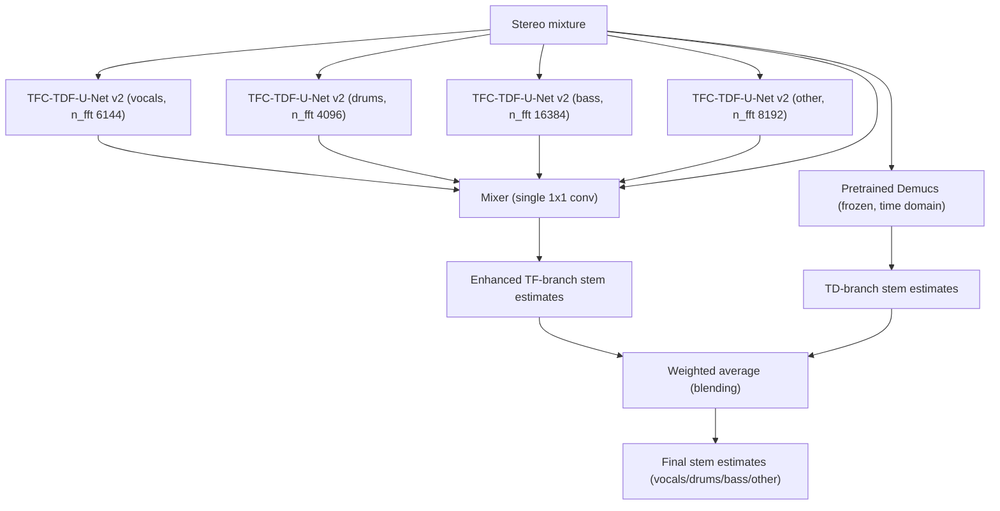

# Kim, Choi, Chung, Lee & Jung 2021: KUIELab-MDX-Net — A Two-Stream Neural Network for Music Demixing

**Authors**: [[entities/minseok-kim|Minseok Kim]] (co-first), [[entities/woosung-choi|Woosung Choi]] (co-first), [[entities/jaehwa-chung|Jaehwa Chung]], [[entities/daewon-lee|Daewon Lee]], [[entities/soonyoung-jung|Soonyoung Jung]] (corresponding)
**Affiliations**: Korea University (KUIELab); Queen Mary University of London; Korea National Open University; Seokyeong University
**Venue**: MDX Workshop @ ISMIR 2021 (arXiv:2111.12203)
**Type**: Workshop / Preprint
**DOI**: [10.48550/arXiv.2111.12203](https://doi.org/10.48550/arXiv.2111.12203)
**Zotero**: [X3Q2EYUX](zotero://select/items/0_X3Q2EYUX)

---

## Summary

**KUIELab-MDX-Net** is a two-stream neural network for four-stem music demixing (vocals/drums/bass/other) that balances separation quality against the compute/time constraints of the ISMIR 2021 Music Demixing (MDX) Challenge. A time-frequency branch — four independently trained [[concepts/tfc-tdf-unet|TFC-TDF U-Net]] v2 models plus a *Mixer* refinement network — is blended with a frozen pretrained time-domain Demucs, taking second place on Leaderboard A and third on Leaderboard B. On MUSDB18 it achieved the best SDR of all compared systems on vocals, drums, and other.

## Problem Formulation

Given a stereo mixture $x$, the system must estimate four stems $\hat{s}_{k}$, $k \in \{$vocals, drums, bass, other$\}$, subject to a *wall-clock evaluation limit*: the MDX Challenge enforced a separation-time constraint that state-of-the-art deep models such as LaSAFT-Net could not meet. The design problem is therefore not only maximizing SDR but jointly minimizing inference cost — an early performance-vs-compute frontier problem for offline music source separation.

## Methodology

### TFC-TDF-U-Net v2

The starting point is the TFC-TDF-U-Net v1 of Choi et al. (ISMIR 2020), a spectrogram-domain U-Net whose TFC (time-frequency convolution) blocks aggregate information within a scale and whose TDF (time-distributed frequency) blocks — two linear layers applied along frequency with a bottleneck factor $bn$ — give each block the full frequency receptive field. Three changes define v2:

1. **Multiplicative U-connections**: element-wise multiplication instead of channel-wise concatenation for each encoder–decoder skip connection (reduces parameters with negligible performance degradation).
2. **No other skip connections**: dense-block-style skip connections are removed; plain stacked convolutions with TDFs match dense blocks without them.
3. **Channel scaling**: intermediate channels increase after each downsampling and decrease after each upsampling layer (linear factor of 32), where v1 kept them constant — v2 is *shallower but wider* than v1 (11 blocks / 3 convs per block vs. 9 / 5).

Each of the four separation models is trained for a single target with **source-specific frequency cutoff**: frequencies above the target's expected range are cut from the mixture spectrogram, which permits a larger $n_{\mathrm{fft}}$ (which usually improves SDR) at the same input spectrogram size. Per-source $n_{\mathrm{fft}}$: vocals 6144, drums 4096, bass 16384, other 8192.

### Mixer

The four independently estimated stems lack the knowledge that they come from the same mixture (e.g., residual drum snare noise in estimated vocals). The **Mixer** takes the four estimated sources *plus the mixture* and outputs enhanced estimates — a single $1\times1$ convolution layer was enough to improve total SDR.

### Two-Stream Blending

A pretrained time-domain Demucs (Défossez et al., 2021) is applied *without fine-tuning* as the second stream, and the final estimate is the weighted average of the two streams' outputs per source — the *blending* technique of Uhlich et al. (2017).

![[raw/papers/kim-2021-kuielab-mdx-net/figures/fig1.png|TDF weight matrices visualization]]

*Figure 1: Trained weight matrices of single-layered TDF blocks (from Choi 2021): each matrix captures the harmonic pattern (linear $y=\frac{\alpha}{\beta}x$ structure) of its target instrument.*

![[raw/papers/kim-2021-kuielab-mdx-net/figures/fig2.png|TFC-TDF-U-Net v2 architecture]]

*Figure 2: Architecture of TFC-TDF-U-Net v2.*

### Model Structure, Inputs, and Outputs

**TFC-TDF-U-Net v2 separation model** (×4, one per source, trained separately):

| Property | Value |
|---|---|
| Structure | U-Net, 11 blocks, 3 convs per block; TFC-TDF blocks; multiplicative U-connections; channels scale by 32 per down/upsample |
| TDF bottleneck $bn$ | 8 |
| Input | Source-specific frequency-cropped mixture spectrogram: 2048 frequency bins × 256 STFT frames, hop size 1024, per-source $n_{\mathrm{fft}}$ (6144/4096/16384/8192 for vocals/drums/bass/other) |
| Output | Estimated waveform of the single target source |
| Training data | MUSDB18-HQ (86/14 train/validation split) + augmentation |
| Role | Single-target spectrogram-domain separator; four instances cover the four stems |

**Mixer**:

| Property | Value |
|---|---|
| Structure | Single $1\times1$ convolution layer (shallow by design, due to challenge time limit) |
| Input | Four independently estimated stems + mixture |
| Output | Refined stem estimates (e.g., removes drum residuals from vocals) |
| Training data | MUSDB18-HQ, separator weights frozen |
| Role | Cross-source refinement exploiting the shared-mixture constraint |

**Demucs branch** (pretrained, frozen — not trained by this paper):

| Property | Value |
|---|---|
| Structure | Waveform-to-waveform U-Net (Défossez et al., 2021) |
| Input | Stereo mixture waveform |
| Output | Four stem estimates in the time domain |
| Training data | Original Demucs release (no fine-tuning) |
| Role | Time-domain stream; blended with TF branch by weighted average |

The six networks (four separators + Mixer + pretrained Demucs) are all **trained separately**; Demucs is used as-is.

### Training Losses

Each separation model is trained with a **time-domain $l_1$ loss** on the waveform,

$$
\mathcal{L} = \left\| \hat{s} - s \right\|_{1},
$$

where $\hat{s}$ and $s$ are the estimated and reference stems — replacing the loss used by v1. The Mixer is trained with the same setup while the separation models' weights are frozen. All five trainable models use RMSProp with no momentum.

## Experimental Setup

| Item | Value |
|---|---|
| Training dataset | MUSDB18-HQ, default 86/14 train/validation split |
| Augmentation | Random chunking + cross-song instrument mixing (Uhlich 2017); pitch shift + time stretch (Défossez 2021) |
| Optimizer | RMSProp, no momentum |
| Training procedure | (1) train the four single-target separation models; (2) train the Mixer with separators frozen |
| Evaluation | MUSDB18 test set (50 songs), median SDR, SiSEC2018 version (BSSEval v4 framewise multi-channel) |
| Config vs. v1 | v2: 11 blocks / 3 convs / $bn{=}8$ / 2048 bins / 256 frames / hop 1024; v1: 9 / 5 / 16 / 2048 / 128 / 1024 |

## Results

MUSDB18 median SDR (dB):

| Model | vocals | drums | bass | other |
|---|---|---|---|---|
| TFC-TDF-U-Net v1 (Choi 2020) | 7.98 | 6.11 | 5.94 | 5.02 |
| X-UMX (Sawata 2021) | 6.61 | 6.47 | 5.43 | 4.64 |
| Demucs (Défossez 2021) | 6.84 | 6.86 | 7.01 | 4.42 |
| D3Net (Takahashi & Mitsufuji 2021) | 7.24 | 7.01 | 5.25 | 4.53 |
| ResUNetDecouple+ (Kong 2021) | 8.98 | 6.62 | 6.04 | 5.29 |
| TFC-TDF-U-Net v2 | 8.81 | 6.52 | 7.65 | 5.70 |
| v2 + Mixer | 8.91 | 7.07 | 7.33 | 5.81 |
| v2 + Demucs | 8.80 | 7.14 | 8.11 | 5.90 |
| **KUIELab-MDX-Net (v2 + Mixer + Demucs)** | **9.00** | **7.33** | 7.86 | **5.95** |

Despite being downsized for the MDX Challenge time limit, the full system achieves the best SDR on vocals, drums, and other among all compared systems (Hybrid Demucs keeps the lead on bass). Ablations show v2 alone is already competitive, the Mixer adds up to +0.55 dB (drums) over v2, and blending with Demucs adds up to +0.46 dB (bass). In the MDX Challenge at ISMIR 2021 the system ranked **2nd on Leaderboard A** and **3rd on Leaderboard B**.

## Key Contributions

1. **TFC-TDF-U-Net v2**: three efficiency modifications to the v1 architecture (multiplicative U-connections, removal of non-U skip connections, channel scaling on down/upsampling) that cut parameters with negligible quality loss, motivated by a hard inference-time budget.
2. **Two-stream TF+TD architecture**: blending an ensemble of spectrogram-domain U-Nets with a frozen pretrained waveform-domain Demucs via weighted averaging — the two domains' errors are complementary enough that the blend beats either stream alone.
3. **Mixer**: a minimal cross-source refinement network exploiting the shared-mixture constraint that independent per-source models ignore; even a single 1×1 conv improves total SDR.
4. **Source-specific frequency cropping**: cutting frequencies above a stem's expected range allows a per-source $n_{\mathrm{fft}}$ (up to 16384) at fixed spectrogram size, trading frequency resolution against the frame budget.

## Related Concepts

- [[concepts/kuielab-mdx-net|KUIELab-MDX-Net]]
- [[concepts/tfc-tdf-unet|TFC-TDF U-Net]]
- [[concepts/music-source-separation|Music Source Separation]]
