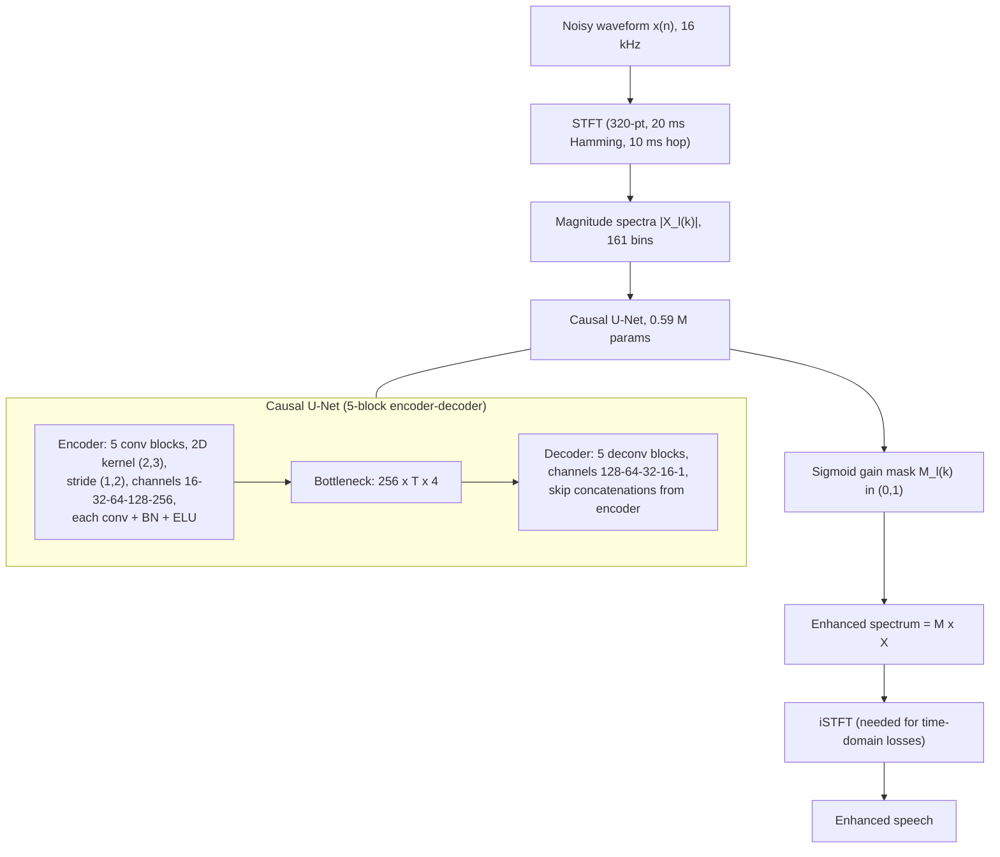

# Li, Peng, Zheng & Li 2020: A Supervised Speech Enhancement Approach with Residual Noise Control for Voice Communication

**Authors**: [[entities/andong-li|Andong Li]]¹², [[entities/renhua-peng|Renhua Peng]]¹², [[entities/chengshi-zheng|Chengshi Zheng]]¹² (corresponding), [[entities/xiaodong-li|Xiaodong Li]]¹²

**Affiliation**: ¹Key Laboratory of Noise and Vibration Research, Institute of Acoustics, Chinese Academy of Sciences, Beijing, China; ²University of Chinese Academy of Sciences, Beijing, China

**Venue**: Applied Sciences (MDPI), vol. 10, no. 8, article 2894

**Year**: 2020 | **Type**: Journal paper | **DOI**: [10.3390/app10082894](https://doi.org/10.3390/app10082894)

**Zotero**: [2UNUCIN9](zotero://select/items/0_2UNUCIN9)

## Summary

This paper derives a **generalized loss function (GL)** for supervised (DNN-based) speech enhancement that makes the trade-off between speech distortion and residual noise explicit and controllable. Starting from the subband MSE of *unsupervised* estimators and its relationship to supervised training targets, the authors formulate a constrained program — minimize speech distortion subject to the residual noise matching a preset level — and transfer it to the fullband case as a training loss. The GL family subsumes the plain MSE loss, the components loss (Xu et al. 2019), and the fullband complex-spectral MSE as special cases, and exposes manual parameters ($\gamma$, $\alpha$, $\beta_0$, $\mu$) that let well-studied noise shaping schemes control the residual noise *during training*. Objective tests show the parameter effects predicted by theory, and listening tests strongly prefer the GL-trained model (~70% preference) over MSE-, TMSE-, and SI-SDR-trained baselines, mainly because the residual noise stays natural rather than unnaturally suppressed.

## Problem Formulation

The noisy signal in the STFT domain is

$$X_l(k) = S_l(k) + D_l(k)$$

with frame index $l$ and frequency bin $k$; the task is estimating $S_l(k)$ from $X_l(k)$.

Unsupervised MMSE estimators minimize a subband square error with transform functions $f, g$:

$$J_x[M_l(k)] = \left| f(S_l(k)) - g(S_l(k), D_l(k), M_l(k)) \right|^2$$

e.g. $f = |a|$, $g = |(a+b)c|$ yields the MMSE short-time spectral amplitude estimator (Ephraim & Malah 1984); $f = \log|a|$ yields the log-spectral-amplitude variant. The fullband sum $\mathcal{J}_x = \sum_k \sum_l J_x[M_l(k)]$ is the supervised training target (e.g. log-spectral MSE as in Xu et al. 2013). Subband square errors can thus always be "promoted" to fullband supervised losses.

**Motivation — why plain MSE is insufficient for voice communication:**

1. MSE assumes equal importance of every T-F bin, ignoring auditory frequency sensitivity, and produces over-smoothed spectra that lose spectral detail (formants concentrated at low/mid frequencies, sparse high-frequency content).
2. All standard loss functions drive noise suppression to infinity at noise-only segments. In practice the noise is stochastic (estimation accuracy limited by few observations) and too diverse for a DNN to separate from speech in every T-F bin — so total suppression is unattainable, and the *unnatural residual noise* left behind severely degrades quality. The goal of this paper is to control that residual noise instead of trying to eliminate it.

## Methodology

### Subband Trade-Off Criterion

Speech distortion and residual noise are considered separately in the subband:

$$J_s[M_l(k)] = \left| f(S_l(k)) - g(S_l(k), D_l(k), M_l(k)) \right|^2, \qquad J_d[M_l(k)] = \left| h(S_l(k), D_l(k), M_l(k)) \right|^2$$

The nonlinear spectral gain is derived from the constrained program

$$\min_{M_l(k)} E\{J_s[M_l(k)]\} \quad \text{s.t.} \quad E\{J_d[M_l(k)]\} = |\bar{\lambda}(\beta_l(k), D_l(k))|^2$$

where $\beta_l(k) \in [0, 1]$ is a frequency- and frame-dependent factor that flexibly presets the residual noise level. This is the single-channel, supervised analogue of the [[concepts/speech-distortion-constrained-noise-reduction|speech-distortion-constrained noise reduction]] program. Solving via the Lagrange multiplier $\mu$ (with $f = |a|$, $g = |ac|$, $h = |bc|$, $\bar{\lambda} = \beta E\{|b|^2\}$) gives the parametric Wiener gain

$$M_l(k) = \frac{\xi_l(k)}{\xi_l(k) + \mu_l(k)}$$

with a priori SNR $\xi_l(k)$. Closed-form gains are generally impossible for complicated $f, g, h$ and noise PSD estimation is unreliable in non-stationary noise — exactly the situation where supervised learning takes over.

### Fullband Generalized Loss

Promoting the subband criterion to the fullband and generalizing the square to an exponent $\gamma \ge 0$ plus a spectral exponent $\alpha$ yields the paper's central result, the **generalized loss function**:

$$\mathcal{J}_x^{\gamma,\alpha} = \mathcal{J}_s^{\gamma,\alpha} + \mu\, \mathcal{J}_d^{\gamma,\alpha,\mathrm{con}}$$

with (for the magnitude-domain instantiation $f=|a|$, $g=|ac|$, $h=|bc|$, $\bar{\lambda}=(\beta|b|)$):

$$\mathcal{J}_s^{\gamma,\alpha} = \sum_l \sum_k \left| (1 - M_l^\alpha(k))\, S_l^\alpha(k) \right|^\gamma$$

$$\mathcal{J}_d^{\gamma,\alpha,\mathrm{con}} = \sum_l \sum_k \left| |M_l(k) D_l(k)|^{\alpha\gamma} - |\beta_l(k) D_l(k)|^{\alpha\gamma} \right|$$

The second term does not push residual noise to zero but toward the *preset* level $\beta$ — residual noise control by noise shaping inside the training loss. See [[concepts/generalized-loss-function|Generalized Loss Function]] for the full family and its special cases.

The corresponding generalized gain derived analytically,

$$M_l(k) = \left( \frac{(\xi_l(k))^{c_1}}{(\mu_l(k))^{(2c_1 c_2 - 1)} + (\xi_l(k))^{c_1}} \right)^{c_2}, \qquad c_1 = \frac{\alpha\gamma}{2\gamma - 2}, \quad c_2 = \frac{1}{\alpha}$$

is *identical* to the generalized Wiener gain of Inoue et al. 2011, which had been given intuitively without theoretical derivation — this paper supplies the missing derivation from the residual-noise-control program.

### Model Structure, Inputs, and Outputs

The enhancement network is a **causal U-Net** estimating a T-F gain function.

| Property | Value |
|----------|-------|
| Structure | 5 conv encoder blocks + 5 deconv decoder blocks; 2-D convolution (kernel (2,3) along time and frequency), stride (1,2); channels 16→32→64→128→256 (encoder), 128→64→32→16→1 (decoder); each block = conv + batch normalization + ELU; skip connections concatenate encoder features into the decoder; causal along the time axis (only past frames) for real-time processing; output layer sigmoid |
| Input | Noisy magnitude spectra, 161 bins/frame (320-point STFT of 16 kHz signal, 20 ms Hamming window, 10 ms overlap) |
| Output | Estimated gain (mask) $M_l(k) \in (0,1)$ per T-F bin via sigmoid, applied to the noisy spectrum |
| Training data | TIMIT: 1000 train + 200 validation clean utterances, each mixed with 2 of 125 noise types at 5 SNR levels (−5…15 dB, 5 dB steps) → 10,000 training / 2,000 validation noisy-clean pairs |
| Role | Single-network supervised SE front-end for voice communication; trained under the generalized loss with residual noise control |

The U-Net follows the topology of Kolbæk et al. 2019 (speech separation); it is applied here to magnitude-masking SE. Layer-by-layer tensor sizes (Channels × TimeStep × Feat) are given in Table 1 of the paper, e.g. encoder `1×T×161 → 16×T×80 → 32×T×39 → 64×T×19 → 128×T×9 → 256×T×4` and the mirrored decoder back to `1×T×161`.

![[raw/papers/li-2020-residual-noise-control/figures/b16b13136d2773a92a8a040a73bf9fce259b079cf20d21004943d431a353ef59.jpg|Causal U-Net architecture for T-F gain estimation]]
*Figure 1: Network architecture. Input is the noisy magnitude spectra and output is the estimated gain functions; T is the timestep length within a minibatch. Tensor sizes in (Channels, TimeStep, Feat) format.*

### Training Losses

The proposed loss is the generalized loss above, instantiated with constant $\beta_l(k) \equiv \beta_0$ and $\alpha = \alpha_0$ (majority of experiments use $\alpha_0 = 1$):

$$\mathcal{J}_x^{\gamma,\alpha_0} = \sum_l \sum_k \left| (1 - M_l^{\alpha_0}(k))\, S_l^{\alpha_0}(k) \right|^\gamma + \mu \sum_l \sum_k \left| |M_l(k) D_l(k)|^{\alpha_0\gamma} - |\beta_0\, D_l(k)|^{\alpha_0\gamma} \right|$$

- $\mu \in \{0.5, 1, 2, 3, 4\}$ — weight between speech distortion and the noise-control term (Lagrange multiplier).
- $\beta_0 \in \{-10, -20, -30\}$ dB — preset residual noise threshold (the noise shaping target).
- $\gamma \in \{1, 2, 3\}$ — error exponent ($\gamma = 2$ recovers squared error; best objective quality).
- $\alpha_0 \in [1, 2]$ — spectral exponent; $\alpha < 1$ avoided because it causes infinite gradients during backpropagation.

Baselines trained on the same network: plain MSE (Eq. 4), time-domain MSE (TMSE), and SI-SDR loss — the latter two require an additional iSTFT layer (a deconvolutional layer whose basis functions are the iSTFT coefficient matrix) to map the estimated T-F spectrum back to the time domain. This is a single jointly-trained network; the loss choice is the only difference between systems.

## Experimental Setup

| Parameter | Value |
|-----------|-------|
| Sampling rate | 16 kHz |
| STFT | 320-point FFT, 20 ms Hamming window, 10 ms overlap → 161 magnitude bins |
| Training data | TIMIT 1000 utterances × 2 noise types × 5 SNRs (−5…15 dB) = 10,000 pairs; 125 environment noise types |
| Validation data | TIMIT 200 utterances × 2 × 5 = 2,000 pairs |
| Test data | 10 male + 10 female TIMIT utterances × 5 unseen NOISEX92 noises (babble, factory1, hfchannel, pink, white) × 4 SNRs (−5…10 dB) |
| Optimizer | SGD with Adam, initial learning rate 5e-4, halved after 3 consecutive validation-loss increases |
| Early stopping | stop after 10 consecutive validation-loss increases; up to 100 epochs |
| Batch | 16 utterances, zero-padded to the longest in batch |
| Network | causal U-Net, 0.59 M trainable parameters |
| Metrics | noise attenuation (NA), speech attenuation (SA), PESQ, SDR (noisy reference: PESQ 1.80, SDR 2.51 dB) |
| Loss configurations | $\gamma \in \{1,2,3\}$, $\beta_0 \in \{-10,-20,-30\}$ dB, $\mu \in \{0.5,1,2,3,4\}$, $\alpha_0 = 1$; $\alpha$-study at $(\gamma,\beta_0,\mu) = (2, -20\,\mathrm{dB}, 1)$ |

## Results

### Impact of $\gamma$, $\beta_0$, $\mu$ (Figure 2)

- **$\beta_0$ ↑ → NA ↓ (as designed)**: with residual noise control, the residual noise during training converges toward the preset threshold instead of zero — the *characteristic* of the background noise is preserved, confirmed subjectively below.
- **$\mu$ ↑ → more noise suppression, more speech distortion**: larger $\mu$ emphasizes noise reduction in the joint objective; per the gain formula this yields smaller gains — more interference removed, more speech abandoned.
- **$\gamma$**: increasing $\gamma$ hurts both NA and SA; $\gamma = 2$ achieves better objective speech quality than $\gamma = 1, 3$.

Parameter-selection guideline: maximize NA and PESQ/SDR while minimizing SA. Recommended practical configurations: **$(\gamma, \beta_0, \mu) = (2, -30\,\mathrm{dB}, 0.5)$, $(2, -30\,\mathrm{dB}, 1)$, $(2, -20\,\mathrm{dB}, 1)$**. Baseline losses win on isolated metrics (SI-SDR loss gets the largest SDR but a PESQ below even plain MSE, consistent with Le Roux et al. 2019) — the GL configurations are the only ones balanced across all four metrics.

![[raw/papers/li-2020-residual-noise-control/figures/0b54d6726ef7e560e0164f5f7272f6af287f831901c41c913122c4bd904ac2ed.jpg|Test results for NA, SA, PESQ, SDR across gamma, beta_0, mu configurations]]
*Figure 2: Test results in terms of NA, SA, PESQ and SDR for $\gamma \in \{1,2,3\}$, $\beta_0 \in \{-10,-20,-30\}$ dB, $\mu \in \{0.5,1,2,3,4\}$ ($\alpha = 1$). The averaged PESQ of the noisy signals is 1.80 and their averaged SDR is 2.51 dB; MSE, TMSE and SI-SDR baselines are included for comparison.*

### Impact of $\alpha$ (Figure 3)

At $(\gamma, \beta_0, \mu) = (2, -20\,\mathrm{dB}, 1)$ with $\alpha_0$ swept from 1 to 2 in steps of 0.1: increasing $\alpha$ **decreases both NA and SA** — since the estimated gain lies in $(0,1)$, larger $\alpha$ raises the effective gain (cf. the generalized gain formula), so the network attenuates less interference and preserves more speech. However **PESQ and SDR decline** with $\alpha$ as well: the extra preserved residual noise outweighs the reduced speech distortion. $\alpha_0 = 1$ is thus the practical choice. (Directionally this mirrors the $\alpha$-vs-suppression trade-off documented for feature-side [[concepts/power-law-compression|power-law compression]], but here the exponent acts inside the loss/gain family and the quality outcome is the opposite.)

![[raw/papers/li-2020-residual-noise-control/figures/7289c029819aa5f502f64539574198f801d6714ace3bb507c870cb986be36daa.jpg|NA scores vs alpha_0]]
*(a) NA scores with the increase of $\alpha_0$.*

![[raw/papers/li-2020-residual-noise-control/figures/ec0bc39cb1484b324aafea060c0329e8ed83d44fda95763935656d7e59f6a805.jpg|SA scores vs alpha_0]]
*(b) SA scores with the increase of $\alpha_0$.*

![[raw/papers/li-2020-residual-noise-control/figures/ef04c0a8d6d730af86409726a58745eadb760f88c06e3fc7d034db3405193ae7.jpg|PESQ scores vs alpha_0]]
*(c) PESQ scores with the increase of $\alpha_0$.*

![[raw/papers/li-2020-residual-noise-control/figures/045c558e1f55001c53c996aa7ef19b62b932cb889958fcff4741e78cd8de0f7b.jpg|SDR scores vs alpha_0]]
*(d) SDR scores with the increase of $\alpha_0$.*

*Figure 3: Metric scores with the increase of $\alpha_0$ at $(\gamma, \beta_0, \mu) = (2, -20\,\mathrm{dB}, 1)$.*

### Subjective Evaluation

AB-style preference test (procedure of Breithaupt et al. 2007) with GL at $(2, -20\,\mathrm{dB}, 1)$, $\alpha_0 = 1$: 10 listeners, 20 utterances (each one male + one female TIMIT utterance mixed with one of aircraft, babble, bus, cafeteria, car noises at −5/0/5/10 dB SNR), shuffled pair order with an "Equal" option.

| Comparison | GL preferred | Baseline | Equal |
|------------|-------------:|---------:|------:|
| GL vs MSE | **70.0%** | 22.0% | 8.0% |
| GL vs TMSE | **66.5%** | 22.0% | 12.5% |
| GL vs SI-SDR | **70.5%** | 23.5% | 6.0% |

The GL-trained model recovers speech while *preserving the character of the background noise*, which the baselines' unnatural residual noise fails to do — objective scores are only comparable, but the subjective gap is decisive.

## Key Contributions

1. **Generalized loss function with residual noise control**: derives $\mathcal{J}_x^{\gamma,\alpha} = \mathcal{J}_s^{\gamma,\alpha} + \mu\,\mathcal{J}_d^{\gamma,\alpha,\mathrm{con}}$ by bridging unsupervised subband MSE analysis and supervised fullband training targets — the first training-loss-level mechanism for [[concepts/noise-attenuation-control|residual noise control]] in DNN speech enhancement (previous mechanisms were filter-level or inference-time post-processing).
2. **Unification of existing losses as special cases**: plain MSE (fullband), the components loss of Xu et al. 2019 ($\gamma=2$, $\alpha=1$, no control), fullband complex-spectral MSE (via its distortion + residual-noise decomposition), and parametric Wiener-type gains all reduce to the GL family at specific parameter settings.
3. **Theoretical grounding for the generalized Wiener gain**: the Lagrange-derived gain $M = (\xi^{c_1}/(\mu^{2c_1c_2-1}+\xi^{c_1}))^{c_2}$ (Inoue et al. 2011) is obtained as the analytic solution of the constrained program, where it had previously been introduced intuitively.
4. **Empirical parameter map for practitioners**: $\beta_0$ sets the residual noise floor; $\mu$ moves along the suppression-distortion trade-off; $\gamma = 2$ and $\alpha_0 = 1$ are the quality-optimal exponents — yielding recommended configurations $(2, -30\,\mathrm{dB}, 0.5)$, $(2, -30\,\mathrm{dB}, 1)$, $(2, -20\,\mathrm{dB}, 1)$.
5. **Evidence that residual noise naturalness dominates listening quality**: ~70% listener preference over MSE/TMSE/SI-SDR-trained models at only comparable objective scores, quantifying the "unnatural residual noise" failure mode of total-suppression training objectives.

## Related Concepts

- [[concepts/generalized-loss-function|Generalized Loss Function]]
- [[concepts/noise-attenuation-control|Noise Attenuation Control]]
- [[concepts/speech-distortion-constrained-noise-reduction|Speech-Distortion-Constrained Noise Reduction]]
- [[concepts/parametric-multi-channel-wiener-filter|Parametric Multi-Channel Wiener Filter (PMWF)]]
- [[concepts/power-law-compression|Power-Law Compression]]
- [[concepts/frequency-domain-loss|Frequency-Domain Loss]]
- [[concepts/speech-enhancement|Speech Enhancement]]
- [[concepts/pesq|PESQ]]

## Related Sources

- [[sources/braun-2015-residual-noise-control|Braun, Kowalczyk & Habets 2015: Residual Noise Control PMWF]] — the multichannel filter-level ancestor of this paper's residual noise control idea (ref. [26] here); Li et al. transfer the same principle into the supervised training loss
- [[sources/shetu-2026-munet|Shetu et al. 2026: μNet]] — the inference-time (NAL post-processing) counterpart of the same trade-off; comparison of the three mechanisms appears in [[concepts/noise-attenuation-control|Noise Attenuation Control]]
- [[sources/zheng-2023-survey-frequency-domain-speech-enhancement|Zheng et al. 2023: Sixty Years of Frequency-Domain Monaural Speech Enhancement]] — surveys the loss-function landscape this paper's GL generalizes

## Related Synthesis

- [[synthesis/deep-speech-enhancement|Deep Speech Enhancement]]
