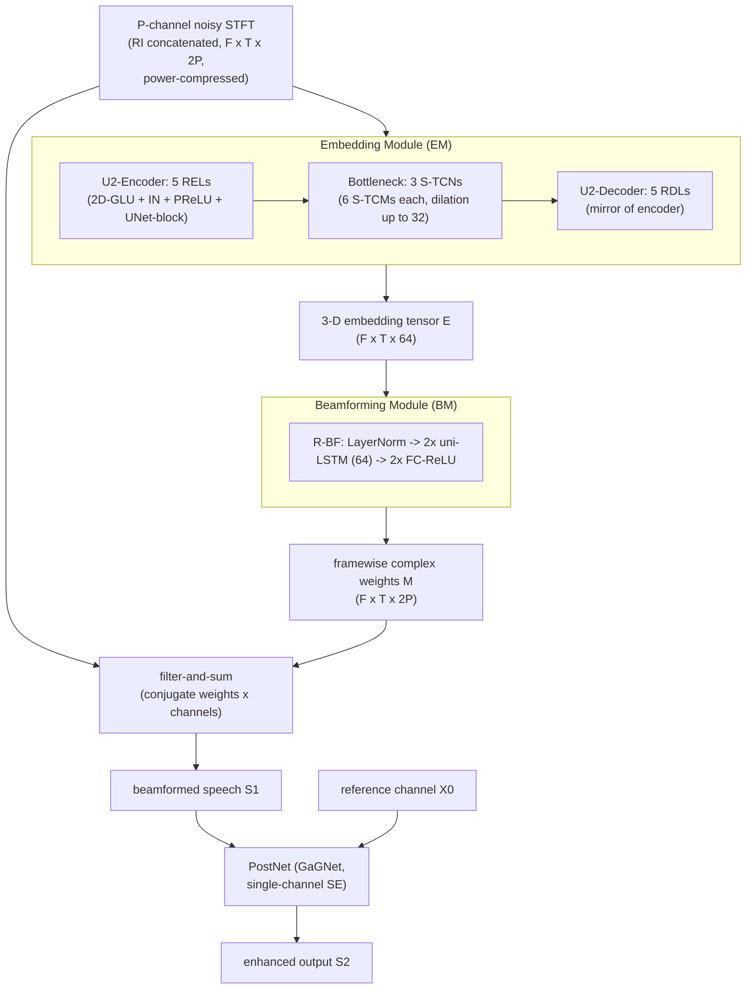

# Li, Liu, Zheng & Li 2022: Embedding and Beamforming

- **Authors**: [[entities/andong-li|Andong Li]], [[entities/wenzhe-liu|Wenzhe Liu]], [[entities/chengshi-zheng|Chengshi Zheng]], [[entities/xiaodong-li|Xiaodong Li]]
- **Affiliation**: Key Laboratory of Noise and Vibration Research, Institute of Acoustics, Chinese Academy of Sciences; University of Chinese Academy of Sciences, Beijing, China
- **Venue**: IEEE International Conference on Acoustics, Speech and Signal Processing (ICASSP) 2022
- **Type**: Conference paper
- **DOI**: [10.1109/ICASSP43922.2022.9746432](https://doi.org/10.1109/ICASSP43922.2022.9746432)
- **Zotero**: [AAS72Q9D](zotero://select/items/0_AAS72Q9D)

## Summary

This paper proposes **EaBNet** (Embedding and Beamforming Network), a causal all-neural beamformer for [[concepts/multi-channel-speech-enhancement|multi-channel speech enhancement]] that replaces the traditional mask-then-[[concepts/mvdr-beamformer|MVDR]] pipeline entirely with networks. Instead of explicitly estimating a [[concepts/spatial-covariance-matrix|spatial covariance matrix]] (SCM), an Embedding Module (EM) learns a 3-D embedding tensor carrying both spectral and spatial discriminative information, and a Beamforming Module (BM) directly outputs framewise complex beamforming weights that are applied via filter-and-sum. On a simulated 9-channel DNS-Challenge setup, EaBNet (2.84M parameters, RTF 0.59) outperforms strong baselines by a large margin and even surpasses an oracle-mask MB-MVDR beamformer.

## Problem Formulation

The multi-channel signal model in the STFT domain is

$$\mathbf{X}_{f,t} = \mathbf{S}_{f,t} + \mathbf{N}_{f,t} = \mathbf{c}_{f} S_{f,t} + \mathbf{r}_{f} N_{f,t},$$

where $\mathbf{X}_{f,t}, \mathbf{S}_{f,t}, \mathbf{N}_{f,t} \in \mathbb{C}^{P \times 1}$ are the reverberant mixture, target speech, and noise at $P$ channels, $\mathbf{c}_f, \mathbf{r}_f \in \mathbb{C}^{P \times 1}$ are the [[concepts/relative-transfer-function|relative transfer functions]] (RTFs) of speech and noise, and the first channel is the reference. Unlike beamformers operating at utterance or chunk level, the goal here is **framewise** filter weights for real-time processing:

$$\widetilde{S}_{f,t} = \sum_{p=0}^{P-1} \left(M_{f,t}^{p}\right)^{*} X_{f,t}^{p},$$

with $M_{f,t}^{p} \in \mathbb{C}$ the beamforming weight of the $p$-th microphone. Only noise suppression is addressed; dereverberation is not.

**Motivation**: In the dominant "tandem" strategy, a single-channel DNN first estimates T-F masks per channel, then SCMs are computed and optimal weights derived via statistical criteria (MVDR, MWF). Because the second stage is decoupled from (and irrelevant to) mask estimation, pre-estimation errors heavily hamper the beamforming result. The paper asks: *how can a neural system be guaranteed to generate frame-level beamforming weights?* — requiring (1) abundant spatial information to distinguish sources by direction, and (2) T-F cues to separate speech from interference when spatial cues are absent or blurred.

## Methodology

The overall pipeline (Fig. 1) consists of three modules — Embedding Module (EM), Beamforming Module (BM), and a post-processing module (PostNet):

$$\widetilde{\mathbf{E}} = EMet(\mathrm{Cat}(\mathbf{X}^{0}, \dots, \mathbf{X}^{P-1})), \qquad
\widetilde{\mathbf{M}} = BFNet(\widetilde{\mathbf{E}}),$$

$$\widetilde{\mathbf{S}}^{(1)} = \sum_{p=0}^{P-1} \left(\widetilde{\mathbf{M}}^{p}\right)^{\mathsf{H}} \widetilde{\mathbf{X}}^{p}, \qquad
\widetilde{\mathbf{S}}^{(2)} = \mathrm{PostNet}\left(\mathrm{Cat}\left(\widetilde{\mathbf{S}}^{(1)}, \mathbf{X}^{0}\right)\right),$$

where $\widetilde{\mathbf{E}} \in \mathbb{C}^{F \times T \times C}$ is the 3-D embedding tensor and $\widetilde{\mathbf{M}} \in \mathbb{C}^{F \times T \times \bar{P}}$ the beamforming weight tensor.

![[raw/papers/li-2022-embedding-beamforming/figures/540935cf4e5484aec0a9cc591aca33c221cbf5c7022cac6deb13e9873e80e00c.jpg|EaBNet framework diagram]]

*Figure 1: The EaBNet framework — Embedding Module (EM), Beamforming Module (BM, with C-BF and R-BF variants), and Post-processing module (PostNet).*

### Embedding Module (EM)

The EM follows a convolutional "Encoder–TCN–Decoder" topology:

- **Input**: real and imaginary (RI) components of the $P$ microphone spectra concatenated along the channel axis, $\mathbf{X} \in \mathbb{C}^{F \times T \times 2P}$.
- **U²-Encoder / U²-Decoder**: multiple recalibration encoder/decoder layers (RELs/RDLs). Each REL/RDL consists of a 2D-(De)GLU, instance normalization (IN), PReLU, and a UNet-block with residual connection:

$$\mathcal{K}_{i}(\mathbf{I}_{i}) = GLU(\mathbf{I}_{i}), \qquad \mathbf{O}_{i} = \mathrm{UNet\text{-}block}(\mathcal{K}_{i}(\mathbf{I}_{i})) + \mathcal{K}_{i}(\mathbf{I}_{i}).$$

  The nested sub-UNet captures spectral information at multiple scales and preserves spatial information that would otherwise be aliased by consecutive downsampling. The number of (de)encoding layers within the UNet-block is $Q = \{4,3,2,1,0\}$ for the U²-Encoder and $Q = \{1,2,3,4,0\}$ for the U²-Decoder ($0$ = no UNet-block); channel count is 64.
- **Bottleneck**: 3 stacked S-TCNs (squeezed temporal convolutional networks, from the authors' preliminary CTSNet work), each with 6 S-TCMs, kernel size 5, dilation rates $\{1,2,4,8,16,32\}$.
- **Output**: 3-D embedding tensor $\widetilde{\mathbf{E}} \in \mathbb{C}^{F \times T \times 64}$ — an *implicit, learned* representation that latently distinguishes speech and noise in both spectral and spatial senses. No SCM is ever computed.

### Beamforming Module (BM)

The BM replaces the statistically optimal beamformer with a network that directly infers framewise filter weights, avoiding explicit SCM computation and inversion (improving stability). Two variants:

- **C-BF (convolutional-based)**: a pointwise 2D-Conv ($1 \times 1$ kernel) maps the embedding channel dimension $C \to 2P$, yielding RI components of $P$-channel filters:

$$\widetilde{\mathbf{M}} = \mathrm{Conv}(\widetilde{\mathbf{E}}).$$

- **R-BF (recurrent-based)**: layer normalization, then two uni-directional [[concepts/long-short-term-memory|LSTM]] layers (64 hidden nodes) that update the beamforming state frame by frame, then two fully-connected layers with ReLU:

$$\widetilde{\mathbf{M}} = FC(\mathrm{LSTM}(\mathrm{LayerNorm}(\widetilde{\mathbf{E}}))).$$

  Unlike prior literature where the frequency dimension feeds the LSTM, here the LSTM is **shared across frequency subbands** — analogous to traditional beamformers that process each frequency bin independently. The complex weights are then applied per channel and summed (filter-and-sum).

### Post-Processing Module (PostNet)

After beamforming, residual noise may remain. The PostNet cascades any single-channel SE system on the concatenation of the beamformed signal and the reference-channel mixture; the authors choose their GaGNet for its strong noise reduction at low complexity. The PostNet adds +0.11 avg PESQ but nearly triples the parameter count (2.84M → 8.78M).

### Model Structure, Inputs, and Outputs

**EM (Embedding Module)**

| Property | Value |
|:---------|:------|
| Structure | U²-Encoder (5 RELs) → 3 S-TCNs (6 S-TCMs each, kernel 5, dilations {1,2,4,8,16,32}) → U²-Decoder (5 RDLs); 2D-(De)GLU kernel (2,3), stride (1,2); UNet-block kernel (1,3), stride (1,2); 64 channels throughout |
| Input | RI components of $P$ channels concatenated, $F \times T \times 2P$ (161 frequencies, 16 kHz, 20 ms Hanning window, 50% overlap, 320-point FFT) |
| Output | 3-D embedding tensor, $F \times T \times 64$, at frame rate (12.5 ms hop) |
| Training data | 80,000 simulated multi-channel mixtures (DNS-Challenge speech + 20,000 noises, simulated RIRs) |
| Role | Jointly encode spectral and spatial discriminative information; replaces explicit SCM estimation |

**BM (Beamforming Module, R-BF)**

| Property | Value |
|:---------|:------|
| Structure | LayerNorm → 2 uni-directional LSTMs (64 hidden nodes, shared across frequencies) → 2 FC layers with ReLU |
| Input | 3-D embedding tensor, $F \times T \times 64$ |
| Output | Framewise complex beamforming weights, $F \times T \times 2P$ (RI parts), at frame rate |
| Training data | Same as EM (trained jointly end-to-end) |
| Role | Replace statistical beamformer weight computation (SCM + inversion) with direct network regression |

**PostNet (GaGNet)**

| Property | Value |
|:---------|:------|
| Structure | GaGNet single-channel speech enhancement network (glance-and-gaze collaborative learning; details in Li et al. 2021, arXiv:2106.11789) |
| Input | Concatenation of beamformed output and reference-channel mixture |
| Output | Final enhanced speech spectrum |
| Training data | Same as EM/BM (jointly trained) |
| Role | Suppress residual noise remaining after beamforming |

All modules are trained **jointly end-to-end**; the whole system is causal (uni-directional LSTMs, no future-frame access), enabling real-time framewise beamforming.

### Training Losses

The loss is **MMSE with magnitude constraint** (as in the authors' CTSNet/GaGNet works): mean-squared error between the estimated and target spectra, with an additional magnitude-domain constraint. The paper does not give the explicit equation or coefficient values here; the loss operates on **power-compressed** spectra — both network input and training target use $|\mathbf{X}^{p}|^{0.5} e^{j\theta_{\mathbf{X}^{p}}}$ and $|\mathbf{S}^{p}|^{0.5} e^{j\theta_{\mathbf{S}^{p}}}$. Rationale: only the magnitude is compressed while the phase is left unchanged, so the inter-channel **spatial information (phase differences) is fully preserved** — a multichannel-specific argument for [[concepts/power-law-compression|power-law compression]].

## Experimental Setup

| Item | Detail |
|:-----|:------|
| Dataset | DNS-Challenge: 562 h neutral clean speech (11,350 speakers), 20,000 noises (~55 h) |
| Array | Uniform 9-channel linear array, 4 cm spacing; RIRs simulated by the [[concepts/image-source-method|image method]] |
| Rooms | 3×3×2.5 m to 10×10×3 m; $RT_{60}$ 0.05–0.7 s; source distance {0.5, 1, 2, 3} m; DOA gap between speech and noise ≥ 5° |
| Training SNR | −6 to 6 dB, 2 dB step; 80,000 train / 4,000 validation pairs (~6 s each) |
| Test noises | babble, factory1, white (NOISEX-92), cafe (CHiME-3); SNRs {−5, −2, 0, 2} dB; 600 pairs each |
| STFT | 16 kHz sampling, 20 ms Hanning window, 50% overlap, 320-point FFT → $F = 161$ |
| Optimization | Adam, lr 5e-4 (halved after 2 non-improving epochs), batch size 8, 60 epochs |
| Baselines | CTSNet, GaGNet, FasNet+TAC, MC-ConvTasNet, MIMO-UNet (all made causal), oracle MB-MVDR (oracle [[concepts/ideal-ratio-mask|IRM]]-derived SCM) |
| Metrics | [[concepts/pesq|PESQ]], ESTOI, SDR |

## Results

**Ablation (Table 1)**, reported as PESQ/ESTOI(%)/SDR(dB) averaged over test SNRs:

| ID | UNet-block | MO | BF type | Compression | Para. (M) | Avg. |
|:--|:--|:--|:--|:--|--:|:--|
| 1 | ✗ | ✓ | R-BF | ✓ | 2.19 | 3.40/83.78/15.93 |
| 2 | ✓ | ✗ (direct cRM) | ✗ | ✓ | 2.77 | 3.34/82.24/14.26 |
| 3 | ✓ | ✓ | C-BF | ✓ | 2.77 | 3.44/84.30/15.52 |
| 4 | ✓ | ✓ | R-BF | ✗ | 2.84 | 3.18/82.15/17.00 |
| 5 | ✓ | ✓ | R-BF | ✓ | 2.84 | **3.52/85.91/16.72** |

Key ablation findings: (1) the UNet-block consistently helps preserve spectral/spatial information; (2) removing the explicit beamforming operation (estimating a complex mask on the reference channel instead, ID-2) degrades all three metrics, confirming the value of beamforming in MCSE; (3) R-BF beats C-BF because the LSTM updates state frame by frame, yielding better weights when spatial information is insufficient; (4) magnitude compression gives considerable PESQ/ESTOI gains at a mild SDR cost — compression reduces dynamic range and prioritizes low-energy regions (more residual-noise suppression), but the nonlinearity can destroy the linear separability of sources, increasing target distortion.

**Comparison with baselines (Table 2)**, avg. PESQ/ESTOI(%)/SDR(dB):

| System | Domain | Para. (M) | MACs (G/s) | RTF | Causal | Avg. |
|:-------|:------|--:|--:|--:|:--|:--|
| Noisy | – | – | – | – | – | 1.67/39.65/−1.18 |
| CTSNet | T-F | 4.35 | 5.57 | 0.37 | ✓ | 2.21/53.28/6.15 |
| GaGNet | T-F | 5.94 | 1.63 | 0.19 | ✓ | 2.28/54.90/6.52 |
| FasNet+TAC | T | 3.82 | 7.56 | 0.67 | ✓ | 2.67/70.69/13.82 |
| MC-ConvTasNet | T | 6.56 | 5.28 | 0.43 | ✓ | 2.55/67.86/12.25 |
| MIMO-UNet | T-F | 1.97 | 4.09 | 0.16 | ✓ | 2.65/68.23/11.45 |
| MB-MVDR (oracle) | T-F | – | – | – | ✗ | 3.10/83.57/14.26 |
| EaBNet* (explicit SCM) | T-F | 2.91 | 8.46 | 0.80 | ✓ | 3.46/84.67/15.60 |
| EaBNet | T-F | 2.84 | 7.38 | 0.59 | ✓ | 3.52/85.91/16.72 |
| EaBNet+PostNet | T-F | 8.78 | 9.04 | 0.83 | ✓ | **3.63/87.06/17.12** |

Findings:

1. **Large margin over prior systems**: vs. MIMO-UNet, EaBNet gains +0.87 PESQ, +17.68% ESTOI, +5.67 dB SDR on average.
2. **Surpasses oracle MB-MVDR** (3.52 vs. 3.10 PESQ): a fully learned framewise beamformer beats the tandem mask-then-MVDR scheme *even when the latter uses oracle IRM masks* — evidence that the statistical second stage is the bottleneck, not just mask estimation error.
3. **Implicit embedding beats explicit SCM** (EaBNet vs. EaBNet*): EaBNet* outputs speech/noise complex masks, computes SCMs, and concatenates them as R-BF input (following the GST-RNN beamformer recipe); it performs *worse* than the purely implicit embedding. Explanations: the SCM is sparse, redundant, and unnecessary for spectral-temporal representation; less robust in real scenarios than a compact embedding; and the data-driven embedding can potentially learn higher-order spatial statistics beyond the second-order SCM. The authors suggest this motivates *rethinking the role of signal theory in end-to-end neural beamformers*.
4. **Efficiency**: EaBNet is lightweight (2.84M parameters) with RTF 0.59 on an Intel i5-4300 CPU (1.90 GHz), meeting real-time requirements; PostNet raises cost to 8.78M / RTF 0.83.

## Key Contributions

1. **EaBNet paradigm**: an all-neural, causal, framewise beamforming framework where an EM produces a 3-D spectral-spatial embedding and a BM directly regresses beamforming weights — no explicit SCM estimation or inversion anywhere in the pipeline.
2. **Empirical refutation of the explicit-SCM stage**: the EaBNet* ablation shows that inserting traditional SCM computation (speech/noise masks → covariances → concatenation) *hurts* performance relative to a purely learned embedding, questioning signal-theory operations inside end-to-end neural beamformers.
3. **Beating oracle MVDR**: the first (to the authors' knowledge) causal neural system in this setting to consistently surpass an oracle-IRM MB-MVDR baseline, closing the argument that tandem schemes are fundamentally limited by their decoupled statistical stage.
4. **Multichannel power compression**: compressing magnitudes ($|X|^{0.5}$) while leaving phase untouched preserves inter-channel spatial information; ablation shows large PESQ/ESTOI gains (+0.34 PESQ) at a mild SDR cost.

## Related Concepts

- [[concepts/eabnet|EaBNet]]
- [[concepts/neural-beamforming|Neural Beamforming]]
- [[concepts/mvdr-beamformer|MVDR Beamformer]]
- [[concepts/multi-channel-speech-enhancement|Multi-Channel Speech Enhancement]]
- [[concepts/spatial-covariance-matrix|Spatial Covariance Matrix]]
- [[concepts/power-law-compression|Power-Law Compression]]
- [[concepts/beamforming|Beamforming]]
- [[concepts/relative-transfer-function|Relative Transfer Function]]
- [[concepts/ideal-ratio-mask|Ideal Ratio Mask]]
- [[concepts/dns-challenge|DNS Challenge]]
- [[concepts/image-source-method|Image Source Method]]
- [[concepts/pesq|PESQ]]
- [[concepts/long-short-term-memory|Long Short-Term Memory]]
- [[concepts/causality|Causality]]

## Related Synthesis

- [[synthesis/deep-speech-enhancement|Deep Speech Enhancement]]
- [[synthesis/multi-channel-speech-enhancement|Multi-Channel Speech Enhancement]]
