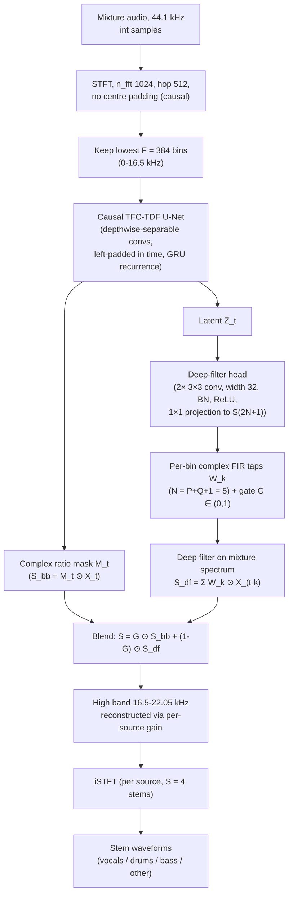

# Li, Liu, Malsky & Yi 2026: Real-Time Music Source Separation on a Low-Power Audio DSP

**Authors**: [[entities/jianan-li|Jianan Li]], [[entities/li-liu|Li Liu]], [[entities/ken-malsky|Ken Malsky]], [[entities/gabby-yi|Gabby Yi]]
**Venue**: arXiv preprint 2609.12201, 2026 (Zotero: 3ZHQXR54)
**Type**: Preprint (research paper)
**URL**: https://arxiv.org/abs/2609.12201

## Summary

This paper asks whether any published real-time music source separation (MSS) system fits the embedded audio hardware the task ultimately targets, and answers no: on a commercial audio DSP (Analog Devices SHARC-FX, 2 MB on-chip L2 SRAM, 2.07 GMAC/s measured sustained), weight memory rules out the 16–51 M parameter TasNet/X-UMX family while per-frame compute rules out RT-STT, which needs 5.5× the available MAC rate. Parameter count predicts neither failure, because the weight-reuse factor spans 1× to 345× across architectures. The authors then build a separator that fits: a causal TFC-TDF U-Net with a gated complex-FIR deep-filter head, trained on continuous (not block-padded) convolution context, which reaches 4.70 dB cSDR on MUSDB18-HQ and runs on the DSP in 10.43 ms of an 11.6 ms hop deadline.

## Problem Formulation

Deployability is stated as two hardware-independent constraints on a model with $W$ parameters, $b$ bytes per weight, $C_{\mathrm{frame}}$ MACs per frame, hop $H$, and sustained MAC rate $R$:

$$
W \cdot b \leq M_{\mathrm{L2}}, \qquad
C_{\mathrm{frame}} \cdot f_s / H \leq R .
$$

The target is the SHARC-FX (ADSP-21835): 1 GHz, 512 kB L1, 2 MB on-chip L2. Peak rate (8 GMAC/s float) is explicitly *not* used for budgeting — a hand-scheduled floating-point runtime sustains 2.07 GMAC/s (26% of peak), and a TFLite-Micro port on the same part spent ~90% of its time moving data. Off-chip DDR for weights is deliberately excluded: weights are re-read every frame, putting ~44 MB/s of recurring transfer on the critical path of the per-frame deadline.

**Weight reuse factor** $\rho = C_{\mathrm{frame}}/W$. For frame-rate dense/recurrent layers $\rho \approx 1$ (each weight participates in exactly one MAC per frame), so published parameter counts of the TasNet/X-UMX family *are* per-frame MAC estimates. Convolution over frequency breaks the identity: RT-STT's 383 k weights are evaluated across 384 frequency bins every frame, $\rho = 345$. Because $\rho$ spans 2.5 orders of magnitude, no ordering by parameter count predicts deployability. The identity is validated on X-UMX: summing its layers gives 31.5 M MAC/frame against 31 M reported parameters.

**Verdict (Table 1)**: no published system satisfies both constraints, and the two constraints eliminate *different* models — memory rules out X-UMX, TasNet, and both HS-TasNet variants by 8.0–25.5×; compute independently rules out RT-STT (11.4 GMAC/s needed vs 2.07 available, still 2.7× over even with 16-bit fixed point granted at the authors' efficiency). HS-TasNet-S is the instructive exception: it meets the frame deadline but overruns L2 by 8.0×; RT-STT is its mirror image. The constraints are close to anti-correlated across architecture families.

## Methodology

### Model Structure, Inputs, and Outputs

The system is a causal TFC-TDF U-Net backbone (RT-STT lineage) operating on the real-valued STFT of the mixture, with a deep-filter head blended against a complex ratio mask output.

**Backbone (causal TFC-TDF U-Net)**

| Spec | Value |
| --- | --- |
| Structure | Causal TFC-TDF U-Net [RT-STT specialization of the Choi 2020 lineage]; all convolutions depthwise-separable and left-padded in time; recurrence is a GRU (×6 in the deployed model) |
| Input | Real-valued STFT of the mixture, $n_{\mathrm{fft}}{=}1024$, hop $H{=}512$, no centre padding; lowest $F{=}384$ bins kept (0–16.5 kHz); $F{=}192$ (0–8.27 kHz) slim variant also reported — the crop is a compute dial, MAC scaling linearly in $F$ |
| Output | Complex ratio mask $M_t$ per source and TF bin; $\hat{S}^{\mathrm{bb}}_t = M_t \odot X_t$; high band 16.5–22.05 kHz reconstructed by scaling the mixture's high band by a per-source gain from the top in-band bins |
| Training data | MUSDB18-HQ training split, sources re-mixed across tracks |
| Role | Separation backbone emitting masked spectrum estimates |
| Size | Deployed model: 131 k parameters, 501 kB float32 weights; unconstrained full-band variant: 444 k |

**Deep-filter head**

| Spec | Value |
| --- | --- |
| Structure | Two 3×3 convolutions (width 32, BN, ReLU) + 1×1 projection to $S(2N{+}1)$ channels; taps shared across frequency by construction; real and imaginary parts each $\tanh$-bounded |
| Input | Latent features $Z_t$ from the backbone |
| Output | Per source and TF bin: complex FIR taps $W_k$, $k \in [-Q, P]$, order $N{=}P{+}Q{+}1{=}5$, $Q \in \{0,1,2\}$; gate $G \in (0,1)$ |
| Training | Warm-started onto a converged backbone |
| Size | 58.5 k parameters (+15.2% over the backbone) |
| Role | Complex FIR filtering of the *mixture* spectrum, blended with the mask estimate: $\hat{S}_t = G \odot \hat{S}^{\mathrm{bb}}_t + (1-G) \odot \hat{S}^{\mathrm{df}}_t$, where $\hat{S}^{\mathrm{df}}_t = \sum_{k=-Q}^{P} W_k \odot X_{t-k}$ |

Two design choices are dictated by streaming rather than accuracy. (i) The recurrence is a GRU, whose state $h_t = (1-z_t)h_{t-1} + z_t\tilde{h}_t$ is a convex combination of bounded terms and stays in $[-1,1]$ by construction, whereas an LSTM cell state is an unbounded running sum: streaming two trained checkpoints for 120 s, the LSTM state grows from 399 to 962 (still rising, no plateau) while the GRU sits at exactly 1.00. An unbounded state eventually saturates downstream activations, forcing periodic resets that reintroduce buffering latency. (ii) The mask output maps silence to exactly silence, so the idle noise floor is zero by construction; because the deep filter also reads the mixture, it too maps silence to silence. The past/future tap split $P/Q$ is an explicit algorithmic latency control: $Q \cdot H/f_s = 11.6Q$ ms added latency.

### Training on Continuous Context

Chunk-based training zero-pads each independent chunk on the left, but streaming inference feeds the same layers a running cache of real past frames; stacked causal convolutions compound the mismatch (an $L \approx 8$-layer stack makes ~16 of 65 frames per 0.755 s chunk padding-dependent). A chunk-trained model scores 3.93 dB under the standard block-wise protocol yet collapses to silent output within ~2 s frame-by-frame; an ablation attributes the collapse to the convolution context, not recurrent state (threading recurrent state across blocks costs only ~0.2 dB). Training on single continuous 5.8 s segments (one forward pass, no internal padding, cut at a random position) restores frame-by-frame performance to within 0.1 dB of block-wise. See [[concepts/continuous-context-training|continuous-context training]].

### Training Losses

A single $L_1$ waveform loss (no coefficient weighting reported), with the data augmentation of RT-STT; AdamW at lr $10^{-4}$, gradient-norm clip 3.0, mixed precision, batch 6 (8.8 GB on one T4); the DF head is warm-started onto a converged backbone. A truncated-BPTT variant must overlap consecutive chunks by $n_{\mathrm{fft}} - H$ samples or the frame grid skips a position at every boundary.

## Experimental Setup

| Item | Value |
| --- | --- |
| Dataset | MUSDB18-HQ, full 50-song test split, 44.1 kHz |
| Metrics | cSDR (median over 1 s windows, then songs; silent reference windows gated) and uSDR (whole-song SDR, mean over songs); cSDR is a plain energy ratio, *not* BSSEval-v4 — they differ by −1.33 to +1.21 dB per stem, so cross-paper comparisons are indicative |
| Target hardware | Analog Devices SHARC-FX (ADSP-21835): 1 GHz, 512 kB L1, 2 MB L2; 2.07 GMAC/s sustained (measured, hand-scheduled float) |
| Operating point | 44.1 kHz, 512-sample hop → 86.1 frames/s, 11.6 ms per-frame deadline |
| Baselines | X-UMX, TasNet, HS-TasNet-S, HS-TasNet (quality/params from the HS-TasNet paper); RT-STT (authors' quality, reproduction's compute, marked) |
| Compute accounting | MAC/frame counted with hooks on every conv/linear/recurrent layer, calibrated against hardware (counter reproduces the 15.08 M MAC/frame independently timed on the part) |

## Results

**Deployability verdict** (Table 1, vs 2 MB L2 and 2.07 GMAC/s):

| Model | cSDR | Params | Mem. | GMAC/s | $\rho$ |
| --- | --- | --- | --- | --- | --- |
| X-UMX | 3.93 | 31 M | 15.5× | 2.71* | 1 |
| TasNet | 4.40 | 51 M | 25.5× | 4.39† | 1 |
| HS-TasNet-S | 4.48 | 16 M | 8.0× | 1.38† | 1 |
| HS-TasNet | 4.65 | 42 M | 21.0× | 3.62† | 1 |
| RT-STT | 5.17 | 383 K | ok | 11.39 | 345 |
| full + DF (ours) | 5.49 | 444 K | ok | 13.31 | 348 |
| slim + DF (ours) | 4.34 | 129 K | ok | 1.55 | 140 |
| deployed (ours) | 4.70 | 131 K | ok | 1.89 | 167 |

(*computed from published architecture; †from the $\rho \approx 1$ identity, hence a lower bound.*)

**Deployable operating points** (Table 2, time/frame at 1 GHz vs 11.6 ms deadline):

| Model | cSDR | uSDR | MAC/fr | Time/fr | Budget |
| --- | --- | --- | --- | --- | --- |
| slim, no DF | 4.04 | 4.24 | 15.1 M | 7.56 ms | 65% |
| slim + DF (LA0) | 4.10 | 4.30 | 18.0 M | 8.98 ms | 77% |
| slim + DF (LA2) | 4.34 | 4.52 | 18.0 M | 8.98 ms | 77% |
| full + DF (LA2) | 4.70 | 4.70 | 21.9 M | 10.43 ms | 90% |

**Key findings**:

- **Streaming stability**: two checkpoints differing only in training context are indistinguishable block-wise (3.93 dB) but diverge frame-by-frame — the chunk-trained model degrades to 0.04 dB within ~2 s (a silent estimate scores exactly 0 dB by construction), while the continuous-trained model holds 3.17 dB (medians over 8 tracks, last 30 s). The deployed model's continuous cSDR matches its block-wise value.
- **Look-ahead as a latency knob**: a strictly causal filter ($Q{=}0$) gains 0.38 dB cSDR on every stem — the gain is complex FIR filtering, not future information; one look-ahead frame (11.6 ms) adds 0.19 dB on the full-band model, after which cSDR flattens. The slim model needs both look-ahead frames ($+0.30$ dB cSDR): cropping to $F{=}192$ leaves a strictly causal filter little to exploit.
- **What the gate learns**: blend usage $1{-}G$ converges to 0.104 (vocals), 0.021 (other), 0.017 (drums), 0.007 (bass). The near-zero bass gate is not a collapsed optimisation — forcing it open only degrades bass (−0.22 to −3.80 dB). Deep filtering does not pay on a source whose energy already sits in a few bins.
- **On-device validation**: the deployed full-band model runs end to end in 10.43 ms mean / 10.44 ms worst case (90% of deadline) inside 1963/2040 kB L2 and 447/512 kB L1. The 0.01 ms spread matters as much as the mean: no allocation, cache refill, or data-dependent branch in the frame path. The six GRUs cost 4.37 ms, the deep-filter head 2.77 ms. Reduced precision is confined to where it cannot accumulate: convolution ring caches are 16-bit float (halving their 1050 kB), while weights and the indefinitely carried GRU state stay 32-bit. The build tracks the PyTorch streaming twin to 7.2×10⁻⁴ relative and runs for hours without drift.
- **Quality gap**: at 4.70 dB (bootstrap 95% interval [4.21, 5.09]) the deployed model sits 0.47 dB below RT-STT on the authors' metric (0.69 dB BSSEval-v4 like-for-like: 4.48 vs 5.17) and is indistinguishable from HS-TasNet; the unconstrained variant reaches 5.49 dB but needs 6.4× the available compute.

## Key Contributions

1. **Two-constraint deployability analysis**: formulates embedded deployability as weight memory ($W \cdot b \leq M_{\mathrm{L2}}$) and per-frame compute ($C_{\mathrm{frame}} \cdot f_s/H \leq R$) against *measured sustained* (not peak) MAC rate, and shows no published real-time MSS system satisfies both — with the two constraints eliminating different architecture families.
2. **Weight-reuse factor**: introduces $\rho = C_{\mathrm{frame}}/W$, showing it spans 1× to 345× across published systems, so parameter count predicts neither per-frame cost nor deployability; at $\rho \approx 1$ published parameter counts are themselves per-frame MAC estimates.
3. **Continuous-context training**: identifies and isolates a streaming failure mode of independent interest — block-padded convolution training makes continuous inference out-of-distribution, and a model scoring 3.93 dB block-wise collapses to silence within ~2 s frame-by-frame; training on single continuous segments fixes it.
4. **Gated causal deep filtering**: uses deep filtering causally, gated per source (so the network can decline it), with the past/future tap split as an explicit algorithmic-latency control; gains 0.38 dB even strictly causal.
5. **On-device validation**: the first MSS system demonstrated on a commercial low-power audio DSP — 4.70 dB cSDR on MUSDB18-HQ in 10.43 ms of an 11.6 ms hop, with the profiler, feasibility script, and on-device reference runtime to be released.

## Related Concepts

- [[concepts/music-source-separation|Music Source Separation]]
- [[concepts/tfc-tdf-unet|TFC-TDF U-Net]]
- [[concepts/deep-filtering|Deep Filtering]]
- [[concepts/continuous-context-training|Continuous-Context Training]]
- [[concepts/weight-reuse-factor|Weight Reuse Factor]]
- [[concepts/complex-ratio-mask|Complex Ratio Mask]]
- [[concepts/gated-recurrent-unit|Gated Recurrent Unit]]
- [[concepts/tinyml|TinyML]]
