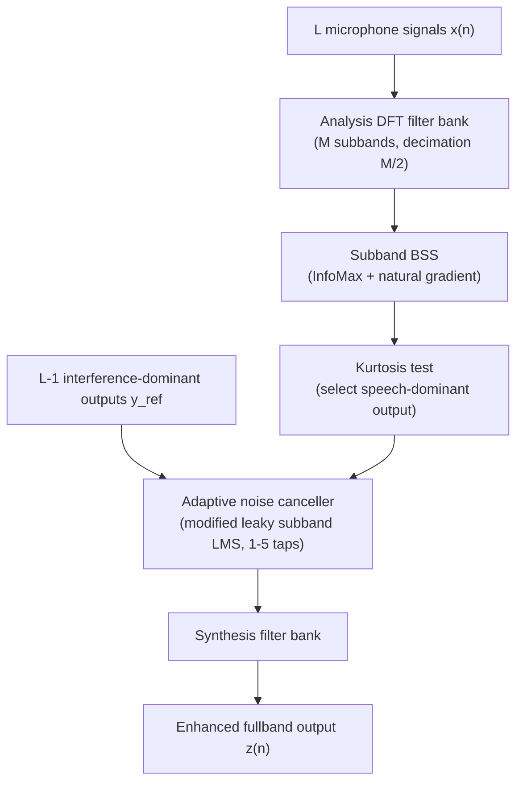

# Low & Nordholm 2004: A Hybrid Speech Enhancement System Employing Blind Source Separation and Adaptive Noise Cancellation

**Authors**: [[entities/siow-yong-low|Siow Yong Low]], [[entities/sven-nordholm|Sven Nordholm]]
**Institution**: The University of Western Australia / Western Australian Telecommunications Research Institute (WATRI), Crawley, Australia
**Venue**: Proceedings of the 6th Nordic Signal Processing Symposium (NORSIG 2004), Espoo, Finland, June 9–11, 2004, pp. 204–207
**Year**: 2004
**Type**: Conference paper
**URL**: https://ieeexplore.ieee.org/document/1344559
**Zotero**: [3UKW4L3L](zotero://select/items/0_3UKW4L3L)
**Funding**: Australian Research Council (ARC), grant no. DP0451111

## Summary

This paper presents a hybrid speech enhancement scheme that cascades subband [[concepts/blind-source-separation|blind source separation]] (BSS) with an adaptive noise canceller (ANC): BSS exploits spatial diversity to separate the target speech from interference, and the ANC — fed with the BSS's own interference-dominant outputs as reference signals — performs further temporal decorrelation on the speech-dominant output. A higher-order statistical test (kurtosis) identifies which of the L BSS outputs is speech dominant. The structure bypasses all a priori information required by conventional beamforming (array geometry, source localization), and evaluations in a real car (110 km/h) and a simulated multi-babble room show SNR improvements of 8.7–20.6 dB with only 2–5 microphones.

## Problem Formulation

Speech acquisition in adverse environments must suppress noise while maintaining signal integrity. Beamforming-based methods provide spatial filtering but rely on a priori knowledge of the array geometry and source locations, making them vulnerable to steering-vector errors. BSS removes that dependency by using statistical independence as the adaptation criterion, but it "only imposes spatial independence among the sources", leaving room for temporal improvement.

In a reverberant environment, the sources are convolutively mixed:

$$\mathbf{x}(n) = \mathbf{H}_{\mathrm{conv}} * \mathbf{s}(n)$$

where $\mathbf{H}_{\mathrm{conv}}$ is an $L \times N$ mixing filter matrix of FIR filters. Transforming the problem into (sub)bands reverts it to the simple instantaneous case per subband:

$$\mathbf{x}^{(m)}(k) = \mathbf{H}^{(m)}\mathbf{s}^{(m)}(k), \qquad \mathbf{y}^{(m)}(k) = \mathbf{V}^{(m)}\mathbf{x}^{(m)}(k)$$

where $\mathbf{V}^{(m)}$ is the unmixing matrix for the $m$th subband, determined so that the output sources are mutually independent. The number of subbands must be large enough for the convolutive mixture to be accurately modelled as instantaneous within each subband.

## Methodology

The system (Figure 1 of the paper) comprises four stages, all operating per subband:

*Figure 1 (described): the proposed hybrid system with L microphones — analysis filter bank, subband BSS, kurtosis-based output classification, and the ANC post-processor that reuses the L−1 interference-dominant BSS outputs as references.*

### Analysis & Synthesis Filter Banks

A uniform over-sampled DFT filter bank decomposes each of the $L$ microphone signals into $M$ subbands with decimation factor $M/2$. Over-sampling reduces aliasing between adjacent subbands and ensures sufficient data samples. The prototype filter is designed with a Hamming window with cut-off frequency $\pi/M$, and its low-pass characteristics form the response of each subband. A matching synthesis filter bank reconstructs the fullband signal with minimum transformation and reconstruction aliasing.

### Subband BSS (InfoMax with Natural Gradient)

The unmixing matrix is found via the information maximization approach with the natural gradient update:

$$\Delta\mathbf{V}^{(m)} \propto \eta \left[\mathbf{I} - 2\varphi(\mathbf{y}^{(m)}(k))(\mathbf{y}^{(m)}(k))^{H}\right]\mathbf{V}^{(m)}$$

where $(\cdot)^{H}$ is the Hermitian transpose and $\eta$ the learning factor. The non-linear function $\varphi$ minimizes the mutual information among the outputs when matched to the input cumulative distribution; for speech it is chosen as

$$\varphi(\cdot) = \tanh(\Re(\cdot)) + j\,\tanh(\Im(\cdot))$$

acting separately on the real and imaginary parts of the complex subband signals.

**Ambiguity handling:**

- **Scaling** (which differs per subband and would cause spectral deformation on reconstruction): resolved by forcing $\det(\mathbf{V}^{(m)}) = 1$, ensuring volume conservation in every subband.
- **Permutation** (which causes serious separation loss if subbands disagree): resolved by initializing the unmixing matrix as a beamformer-like matrix with a sharp null toward an arbitrary jammer direction,

$$\mathbf{V}_{\mathrm{initial}}^{(m)} = \left[\exp\!\left(\tfrac{2\pi f_s m d_l \sin\theta_j}{M c}\right)\right]_{l,j}^{-1}$$

so that all subbands start consistently aligned and the adaptation preserves that alignment ($f_s$ sampling frequency, $d_l$ element distances from the array centre, $\theta_j$ arbitrarily set angles of arrival).

### Kurtosis-Based Output Selection

Among the $L$ BSS outputs there is no telling which is speech dominant. The paper proposes the fourth-order statistic (kurtosis) as the discriminator: speech has a Laplacian distribution (supergaussian, positive kurtosis), whereas spatially diffuse interference tends toward a Gaussian distribution (zero kurtosis) by the Central Limit Theorem. The output with the highest kurtosis is labelled speech-dominant; the remaining $L-1$ become ANC references. The complex subband kurtosis of output $l$, averaged over all $M$ subbands, is

$$\xi_l = \frac{1}{M}\sum_{m=0}^{M-1} \frac{E[|y_l^{(m)}(k)|^4] - 2E^2[|y_l^{(m)}(k)|^2] - |E^2[(y_l^{(m)}(k))^2]|}{\sigma_{y_l}^{4(m)}(k)}$$

### Adaptive Noise Canceller

The ANC cancels, in each subband, any component of the speech-dominant output that is correlated with the reference outputs. A modified subband leaky LMS algorithm (after Greenberg 1998) updates the weights:

$$\mathbf{w}_l^{(m)}(k+1) = (1-\beta)\,\mathbf{w}_l^{(m)}(k) + (z^{(m)*}(k)\,\mathbf{y}_{l,\mathrm{ref}}^{(m)}(k))\,f_l^{(m)}(k)$$

with the power-normalized non-linear step function

$$f_l^{(m)}(k) = \frac{\alpha}{K\left[\hat{\sigma}_{z}^{2(m)}(k) + \alpha\sum_{l=1}^{L-1}\|\mathbf{y}_{l,\mathrm{ref}}^{(m)}(k)\|^2\right]}$$

where $K$ is the filter order, $\beta$ the leaky factor, $\alpha$ the step size, and $\hat{\sigma}_{z}^{2(m)}(k)$ an exponentially averaged estimate of the output signal power ($\lambda$ smoothing). Because the excess MSE of LMS grows with target-signal power, this time-varying normalization reduces the step size during strong-speech intervals — an energy-detector-like behaviour. Since processing is subband, very short filters (1–5 taps) suffice. The ANC output is

$$z^{(m)}(k) = y_{\mathrm{speech}}^{(m)}(k) - \sum_{l=1}^{L-1}\mathbf{w}_l^{(m)H}(k)\,\mathbf{y}_{l,\mathrm{ref}}^{(m)}(k)$$

## Experimental Setup

| Parameter | Car environment | Room environment |
|-----------|-----------------|------------------|
| Setting | Real hands-free, Volvo station wagon, visor (passenger side), constant 110 km/h | Simulated room (image model method), 4 × 5 × 3 m³, $T_{60}$ = 100 ms |
| Target source | 30 cm from array centre | 40 cm from array, at 60° (off-centre) |
| Interference | Car noise | Directional multi-babble sources (speech-like, placed close to the target) |
| Input SNR | −7 dB | 0 dB |
| Sampling rate | 12 kHz (multi-channel DAT recorder) | — |
| Subbands | 64 | 64 |
| ANC taps | 1 | 5 |
| Step size $\alpha$ / leaky factor $\beta$ | 0.05 / 10⁻⁵ | 0.05 / 10⁻⁵ |
| Microphones | 2–5, 5 cm inter-element spacing | 2–5, 5 cm inter-element spacing |

Babble was deliberately chosen over white noise to test robustness to interference with speech-like characteristics, and the babble sources were placed close to the target to stress the structure.

## Results

SNR of the processed output (segmental speech/non-speech SNR measurement):

| No. microphones | Car env. | Room env. |
|-----------------|----------|-----------|
| 2 | 8.7 dB | 11.6 dB |
| 3 | 13.4 dB | 15.6 dB |
| 4 | 15.5 dB | 17.7 dB |
| 5 | 17.2 dB | 20.6 dB |

- Even with only two microphones, SNR improvement exceeds 10 dB; with five elements, up to 20 dB.
- Spectrograms (Figures 3–4 of the paper) show significant noise removal with good target-signal integrity in both environments; in the room case the "drowned" target is "rescued" even though it is off-centre and in close proximity to the babble sources.
- Informal listening tests suggest very good output quality.

## Key Contributions

1. **Hybrid BSS+ANC spatio-temporal structure**: a cascade in which the ANC reuses the BSS's own interference-dominant outputs as references — "the BSS looking across the sensors (spatial) and the ANC looking across the time (temporal)" — rather than discarding them.
2. **Kurtosis-based output identification**: a higher-order-statistical test that labels the speech-dominant BSS output (supergaussian speech vs. Gaussian-like diffuse interference), enabling the reference-selection for the ANC stage.
3. **Geometry-free operation**: no a priori array geometry or source localization is needed, avoiding the deleterious effects of steering-vector errors that plague beamforming-based methods.
4. **Ambiguity handling for subband BSS**: scaling resolved by unit-determinant (volume-conserving) unmixing matrices; permutation resolved by beamformer-like initialization toward an arbitrary jammer direction.
5. **Practical validation**: real car (110 km/h) and simulated multi-babble room evaluations showing 8.7–20.6 dB SNR improvement with 2–5 microphones and only 1–5 ANC taps per subband.

## Related Concepts

- [[concepts/hybrid-bss-anc-speech-enhancement|Hybrid BSS-ANC Speech Enhancement]] — the system introduced by this paper
- [[concepts/kurtosis-based-output-selection|Kurtosis-Based Output Selection]] — the speech-dominant output discrimination method
- [[concepts/blind-source-separation|Blind Source Separation]]
- [[concepts/speech-enhancement|Speech Enhancement]]
- [[concepts/subband-adaptive-filter|Subband Adaptive Filter]]
- [[concepts/permutation-alignment|Permutation Alignment]] — this paper avoids post-hoc alignment via initialization instead
- [[concepts/natural-gradient|Natural Gradient]]
- [[concepts/beamforming|Beamforming]] — the a-priori-dependent alternative this structure bypasses

## Related Synthesis

- [[synthesis/multi-channel-speech-enhancement|Multi-Channel Speech Enhancement]] — early geometry-agnostic entry on the geometry axis (BSS route) and a classical BSS+ANC cascade on the hybrid axis
