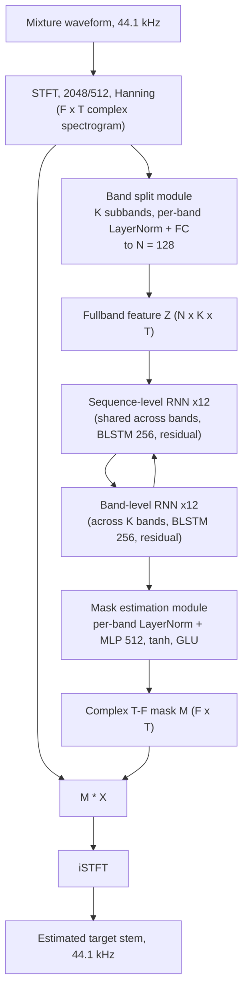

# Luo & Yu 2022: Music Source Separation with Band-Split RNN

**Authors**: [[entities/yi-luo|Yi Luo]], [[entities/jianwei-yu|Jianwei Yu]]
**Venue**: arXiv preprint 2209.15174 (Sep 30, 2022); published in IEEE/ACM Transactions on Audio, Speech, and Language Processing, vol. 31, pp. 1893–1901, 2023
**DOI**: [10.1109/TASLP.2023.3271145](https://doi.org/10.1109/TASLP.2023.3271145)
**Type**: Research paper (frequency-domain neural MSS)
**Zotero**: [S88QEMKK](zotero://select/items/0_S88QEMKK)

## Summary

Band-split RNN (BSRNN) is a frequency-domain music source separation model that explicitly splits the mixture spectrogram into subbands with instrument-specific bandwidths and performs interleaved band-level and sequence-level modeling with residual BLSTMs. Trained only on MUSDB18-HQ, it outperforms all MDX Challenge 2021 top-ranking systems on vocals, drums, and other; a semi-supervised self-boosting finetuning pipeline on 1750 unlabeled songs further improves all four stems.

## Problem Formulation

Prior MSS model designs were largely imported from other fields — speech separation architectures applied unchanged, U-Nets from image segmentation, DenseNets from image recognition — without exploiting the intrinsic characteristics of music signals: 44.1 kHz sample rates (super wideband vs. the narrow/wideband speech world), instrument-dependent frequency ranges and harmonic patterns, and singing-voice acoustics that differ from speech in F0, loudness, and formants. The paper asks how a frequency-domain model can encode such a priori knowledge explicitly. Separation is formulated as per-stem source extraction: one model per target track (vocals, bass, drums, other), estimating a complex-valued T-F mask $\mathbf{M} \in \mathbb{C}^{F \times T}$ applied to the mixture spectrogram $\mathbf{X} \in \mathbb{C}^{F \times T}$ to yield the target spectrogram $\mathbf{S} = \mathbf{M} \odot \mathbf{X}$.

## Methodology

BSRNN has three modules: a **band split module**, a **band and sequence modeling module**, and a **mask estimation module** (Figure 1).

### Band Split Module

The complex spectrogram $\mathbf{X}$ (STFT, 2048-point window, 512 hop, Hanning) is split into $K$ subband spectrograms $\mathbf{B}_i \in \mathbb{C}^{G_i \times T}$ with predefined bandwidths $\{G_i\}$, $\sum_i G_i = F$. Since the $G_i$ differ, each subband has its own layer-norm + fully-connected layer mapping $[\Re\,\mathbf{B}_i; \Im\,\mathbf{B}_i]$ to a shared feature dimension $N$, yielding $K$ features merged into $\mathbf{Z} \in \mathbb{R}^{N \times K \times T}$. The bandwidths are chosen per instrument — e.g., fine-grained 100 Hz bands below 1 kHz for vocals (where the F0 and first harmonics live), 50 Hz bands below 500 Hz for bass — so prior knowledge about the target source enters the architecture through this module.

### Band and Sequence Modeling Module

Analogous to [[concepts/dprnn|DPRNN]] but along the frequency axis: a **sequence-level RNN** (shared across all $K$ subbands, since they share dimension $N$) models the temporal dimension $T$, and a **band-level RNN** models cross-band dependencies along $K$ at each frame. Each RNN is a residual block: group normalization → BLSTM → FC, with a residual connection. Twelve such modules are stacked (24 residual BLSTM layers in total).

### Mask Estimation Module

Each subband feature of the final output $\mathbf{Q}$ passes through its own layer normalization and an MLP (one hidden layer of size $4N$, tanh, GLU output) to produce the complex mask $\mathbf{M}_i$ for that band; the masks are merged into the full-band $\mathbf{M}$ and multiplied with $\mathbf{X}$, and the subband estimates are concatenated to form the target spectrogram $\mathbf{S}$, inverted by iSTFT. The per-band MLP follows Li & Luo (2022), who found MLP-based mask estimation outperforms a plain FC layer.

### Model Structure, Inputs, and Outputs

**BSRNN (per-stem model)**

| Aspect | Specification |
|--------|---------------|
| Structure | Band split (per-band LayerNorm + FC → 128) → 12 × (sequence-level BLSTM(256) + band-level BLSTM(256), each group-norm + BLSTM + FC + residual) → per-band LayerNorm + MLP (hidden 512, tanh, GLU output) |
| Input | Complex STFT of 44.1 kHz mixture, window 2048, hop 512, Hanning; split into K subbands (vocals/other: K = 41; bass: K = 30; drums: K = 55) |
| Output | Complex-valued T-F mask per band → masked spectrogram → 44.1 kHz target stem waveform via iSTFT |
| Training data | MUSDB18-HQ (supervised) + 1750 private unlabeled songs (finetuning) |
| Role | Per-stem source extractor; four independent models per song (vocals, bass, drums, other) |

### Training Losses

$$
\mathcal{L}_{obj} = \left| \mathrm{S}_r - \bar{\mathrm{S}}_r \right|_1 + \left| \mathrm{S}_i - \bar{\mathrm{S}}_i \right|_1 + \left| \mathrm{iSTFT}(\mathrm{S}) - \mathrm{iSTFT}(\bar{\mathrm{S}}) \right|_1
$$

An $L_1$ (MAE) loss summed over the real and imaginary parts of the estimated vs. clean target spectrograms plus the $L_1$ distance of the reconstructed time-domain signals. One model is trained per stem with this objective; no auxiliary losses.

### Semi-Supervised Finetuning Pipeline

Given the supervised model $P$ on labeled set $\mathcal{L}$ (MUSDB18-HQ) and unlabeled set $\mathcal{U}$ (1750 songs), each training sample is built by: (1) sampling clean target and residual segments from $\mathcal{L}$; (2) passing an $\mathcal{U}$ mixture through $P$ and filtering by energy difference — if mixture − separated target > 30 dB, the segment is a clean residual; if mixture − separated residual > 30 dB, it is a clean target; otherwise the separated signals serve as pseudo-labels. The pre-trained model thus acts as **both** source activity detector and pseudo-label generator, eliminating separately trained detectors. A **self-boosting scheme** initializes the student $Q$ from $P$ and replaces $P \leftarrow Q$ whenever $Q$ beats $P$ on validation, progressively improving pseudo-label quality (Figure 2).

## Experimental Setup

| Item | Configuration |
|------|---------------|
| Dataset | MUSDB18-HQ (train), evaluated on MUSDB18-HQ and MUSDB18 |
| SAD preprocessing | Unsupervised energy thresholding: 6 s segments, 50% overlap, 10 chunks/segment, silent-chunk energy $\epsilon = 10^{-5}$, threshold $\max$(15% quantile, $10^{-3}$), keep segment if >50% of chunks exceed threshold |
| On-the-fly mixing | Random cross-song mixing; 3 s chunks; energy rescale in [−10, 10] dB; chunk drop probability 0.1; peak normalization |
| Optimizer | Adam, lr $10^{-3}$, decayed ×0.98 every 2 epochs; gradient clipping (max norm 5); early stopping (10 epochs) |
| Schedule | 100 epochs × 10 000 batches, batch size 2 on 8 GPUs |
| Finetuning | lr $10^{-4}$, all else identical |
| Inference | 3 s chunks, hop 0.5 s (default), zero-padding, overlap-add |
| Metrics | uSDR (utterance-level mean, MDX-Challenge metric) and cSDR (median over 1 s chunks, BSSEval/SiSEC) |

## Results

**Band-split bandwidth ablation (vocals, uSDR on MUSDB18-HQ test):** uniform 1 kHz splitting (V1, 22 bands) scores 8.15 dB; V1–V3 (coarse schemes) stay on par at ~8.1–8.2 dB. Splitting below 1 kHz into 100 Hz bands (V4, 23 bands) jumps to 9.51 dB — the low band carries the vocal F0 and first harmonics, letting the band-level RNN capture pitch information. Progressively finer low-frequency splitting keeps helping: V5 9.57, V6 9.78, V7 (100 Hz below 1 kHz, 250 Hz to 4 kHz, 500 Hz to 8 kHz, 1 kHz to 16 kHz, 2 kHz to 20 kHz; 41 bands) 10.04 dB. Different instruments prefer different schemes: bass uses 50 Hz bands below 500 Hz (30 bands), drums 50 Hz bands below 1 kHz (55 bands).

**Evaluation hop size:** overlap-add with any hop $P \leq T$ helps (smoothing effect); 0.5/1/1.5/3 s hops give 10.04/10.00/9.94/9.75 dB uSDR — 1.5 s is a practical speed/quality balance.

**Comparison with MDX-Challenge 2021 top systems (MUSDB18-HQ / MUSDB18):**

| Model | Vocals uSDR | Bass uSDR | Drum uSDR | Other uSDR | All uSDR | All cSDR |
|-------|------------|-----------|-----------|------------|----------|----------|
| ResUNetDecouple+ | – / – | – / – | – / – | – / – | – / 6.73 | – / – |
| CWS-PResUNet | 8.92 / – | 5.93 / – | 6.38 / – | 5.84 / – | – / – | 6.77 / – |
| KUIELab-MDX-Net | 8.97 / 9.00 | 7.83 / 7.86 | 7.20 / 7.33 | 5.90 / 5.95 | 7.47 / 7.54 | – / – |
| Hybrid Demucs | 8.13 / 8.04 | 8.76 / 8.67 | 8.24 / 8.58 | 5.59 / 5.59 | 7.68 / 7.72 | – / – |
| BSRNN (MUSDB18-HQ only) | **10.04 / 9.92** | 6.80 / 6.77 | **8.92 / 8.68** | **6.01 / 5.97** | **7.94 / 7.84** | 8.24 / 8.23 |
| BSRNN + finetuning | **10.47 / 10.36** | **7.20 / 7.17** | **9.66 / 9.46** | **6.33 / 6.27** | **8.42 / 8.32** | **8.97 / 8.87** |

(cSDR columns: Hybrid Demucs vocals 8.13/8.04, drums 8.24/8.58, bass 8.76/8.67, other 5.59/5.59; full per-stem cSDR values in Table III of the paper.)

BSRNN trained only on MUSDB18-HQ beats all MDX-Challenge systems on vocals (+1.1 dB over KUIELab-MDX-Net), drums, and other; it is slightly worse on bass, which the authors attribute to the energy-rescaling augmentation suiting bass poorly and the band-split scheme needing refinement in the low/mid frequencies. Finetuning improves every track, with ~1 dB cSDR gains on bass (7.22 → 8.16 HQ) and drums (9.01 → 10.15 HQ).

![[raw/papers/luo-2022-band-split-rnn/figures/d60d5275510eae52c832124744005715f1c184b8120153d37d7fad7c953057fa.jpg|BSRNN architecture]]
*Figure 1: (A) BSRNN pipeline — band split, band and sequence modeling, mask estimation modules. (B) Band split module design. (C) Band and sequence modeling module. (D) Mask estimation module.*

![[raw/papers/luo-2022-band-split-rnn/figures/ef5fe6258b80482f0e850b6492d4536c12c3957d819b82b60f6dc6a21b1e9971.jpg|Semi-supervised data sampling pipeline]]
*Figure 2: Semi-supervised data sampling pipeline for model finetuning.*

## Key Contributions

1. **Band-split RNN architecture**: a frequency-domain MSS model that encodes a priori knowledge of the target instrument through explicit, non-uniform band splitting, with interleaved band-level and sequence-level residual BLSTM modeling — the first MSS architecture designed around music-signal characteristics rather than imported wholesale from speech or vision.
2. **Band-split scheme study**: a 7-way ablation (V1–V7) isolating fine-grained low-frequency splitting (+1.35 dB vocals from splitting <1 kHz alone) and instrument-specific bandwidths (bass/drums schemes differ from vocals), establishing band-split design as a first-class hyperparameter.
3. **Semi-supervised self-boosting finetuning**: a pipeline using the pre-trained model as both source activity detector and pseudo-label generator via 30 dB energy-difference filtering — no separately trained detector, no model-size growth — improving all four stems at 44.1 kHz (prior self-training pipelines were 16 kHz, vocal/speech-only).
4. **State-of-the-art results**: BSRNN trained only on MUSDB18-HQ surpasses MDX Challenge 2021 top systems on vocals, drums, and other tracks; with finetuning, 10.47 dB uSDR vocals (HQ).

## Related Concepts

- [[concepts/band-split-rnn|Band-Split RNN (BSRNN)]]
- [[concepts/music-source-separation|Music Source Separation]]
- [[concepts/dprnn|Dual-Path RNN (DPRNN)]]
- [[concepts/grouped-recurrent-neural-network|Grouped Recurrent Neural Network]]
- [[concepts/complex-ratio-mask|Complex Ratio Mask]]
- [[concepts/kuielab-mdx-net|KUIELab-MDX-Net]]
- [[concepts/bidirectional-lstm|Bidirectional LSTM]]
