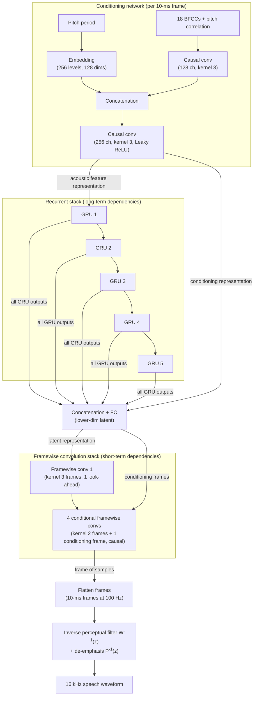

# Mustafa, Valin, Büthe, Smaragdis & Goodwin 2023: Framewise WaveGAN

| Field | Value |
|-------|-------|
| **Authors** | [[entities/ahmed-mustafa\|Ahmed Mustafa]], [[entities/jean-marc-valin\|Jean-Marc Valin]], [[entities/jan-buthe\|Jan Büthe]], [[entities/paris-smaragdis\|Paris Smaragdis]], [[entities/mike-goodwin\|Mike Goodwin]] |
| **Institution** | Amazon Web Services, Palo Alto, CA, USA (Smaragdis also University of Illinois at Urbana-Champaign) |
| **Published** | Proc. IEEE ICASSP 2023, Rhodes Island, Greece, pp. 5596–5600 |
| **Type** | Conference paper (arXiv preprint 2212.04532, v2 March 2023) |
| **arXiv** | [2212.04532](https://arxiv.org/abs/2212.04532) |
| **DOI** | 10.48550/arXiv.2212.04532 |
| **Zotero** | [26IHRUNV](zotero://select/items/0_26IHRUNV) |

## Summary

This paper introduces **Framewise WaveGAN (FWGAN)**, a GAN vocoder that generates 16 kHz speech directly in the time domain **one 10-ms frame at a time** instead of sample-by-sample, so every model parameter runs at the 100 Hz acoustic-feature rate rather than the 16 kHz signal rate. Built only from GRUs and fully-connected layers (no upsampling transposed convolutions), the dense 7.8M-parameter model costs 1.5 GFLOPS; after [[concepts/structured-sparsity|WaveRNN/LPCNet-style sparsification]] (density 0.6 for GRUs, 0.65 for FC layers) it drops to **1.2 GFLOPS** with 5.9M active parameters, running 20× faster than real-time on a CPU. P.808 listening tests show the 1.2-GFLOPS FWGAN significantly outperforms End-to-End [[concepts/lpcnet|LPCNet]] at equal complexity and slightly (but statistically significantly) beats LPCNet at 3 GFLOPS — making GAN-vocoder quality practical on edge and low-power devices. FWGAN is the direct predecessor of [[concepts/fargan|FARGAN]] (IEEE SPL 2024).

## Problem Formulation

GAN vocoders deliver state-of-the-art neural waveform quality with one-shot parallel generation, but their architectures cost multiples of GFLOPS, which is challenging for low-power devices with limited parallelization capability:

- **WaveNet-based GAN vocoders** use every parameter at the target sampling rate $f_s$: each parameter performs $f_s$ multiplies plus $f_s$ accumulations per second. Even the light-weight Parallel WaveGAN (1.44M parameters) needs **46 GFLOPS** for 16 kHz generation.
- **Latent-based (upsampling) GAN vocoders** stack transposed-convolution upsamplers from the feature rate to the signal rate, reaching moderate cost (~8–10 GFLOPS) but with sophisticated architectures, and the upsampling layers remain the main source of complexity.
- **Autoregressive maximum-likelihood vocoders** ([[concepts/lpcnet|LPCNet]]) are among the lowest-complexity generative models, but their quality trails GAN vocoders.

FWGAN's goal: run a GAN vocoder in the time domain **at the acoustic feature rate** — no upsampling layers, no sample-rate parameter usage. The complexity of any model whose parameters all run at the feature rate follows

$$
C = N \cdot 2 \cdot S,
$$

where $C$ is FLOPS, $N$ the parameter count and $S$ the generation steps per second ($S = 100$ here, versus $S = 16000$ for sample-rate models — a 160× reduction in parameter reuse cost).

## Methodology

### Framewise Generation

Where conventional vocoders organize activations as tensors of $[\text{Batch}, \text{Channel}, \text{Temporal}]$ with Temporal at the signal resolution, FWGAN organizes everything as $[\text{Batch}, \text{Sequence\_dim}, \text{Frame\_dim}]$: **Sequence_dim equals the acoustic-feature resolution everywhere in the model** (100 Hz), and Frame_dim holds the representation of the 10-ms frame (160 samples at 16 kHz) being generated. The final waveform is obtained by simply flattening the generated frames. This yields large computational savings even with a large memory footprint, because each parameter fires once per frame, not once per sample.

### Model Structure, Inputs, and Outputs

![[raw/papers/mustafa-2023-framewise-wavegan/figures/fig1-architecture.svg|Framewise WaveGAN generator architecture with per-layer [Sequence_dim, Frame_dim] shapes]]

*Figure 1: Framewise WaveGAN generator architecture. The numbers show [Sequence_dim, Frame_dim] of the output representation of each layer, to generate 1 s of 16 kHz speech from conditioning features at 100 Hz.*

**Generator** (single network, three stacks):

| Spec | Value |
|------|-------|
| **Structure** | Conditioning network: pitch embedding (256 levels, 128 dims) + causal conv (128 ch, kernel 3) on BFCCs/pitch-correlation, concatenated into a causal conv (256 ch, kernel 3, Leaky ReLU). Recurrent stack: **5 GRUs** with GLU activations, no biases. Fusion FC: concatenates all GRU outputs with the conditioning representation into a lower-dimensional latent. Framewise stack: 1 non-conditional [[concepts/framewise-convolution\|framewise convolution]] (kernel 3 frames, stride = dilation = 1, non-causal with 1 look-ahead frame) + 4 conditional framewise convolutions (kernel 2 frames + 1 conditioning frame, causal), each a single fully-connected network per layer. All activations $GLU(X)=X\otimes\sigma(FC(X))$; bias disabled everywhere (faster convergence, fewer artifacts). |
| **Input** | [[concepts/lpcnet\|LPCNet]] acoustic features at 100 Hz from 20-ms overlapping windows of 16 kHz speech: 18 [[concepts/bark-scale-spectral-features\|BFCCs]], pitch period, pitch correlation (pre-emphasis factor 0.85 applied before feature extraction). One conditioning vector per generated 10-ms frame. |
| **Output** | One 10-ms frame (160 samples) of pre-emphasized, perceptually weighted 16 kHz speech per step; frames are flattened into the waveform, then inverse perceptual filtering $W^{-1}(z)$ and de-emphasis $P^{-1}(z)$ produce the final signal. Total algorithmic delay **25 ms** (10 ms framing + 5 ms LPCNet feature look-ahead + 10 ms one-frame look-ahead). |
| **Training data** | 205 hours of 16 kHz TTS speech, 900+ speakers, 34+ languages and dialects (9 open multi-lingual corpora + Hi-Fi TTS). |
| **Role** | Universal (speaker- and language-independent) vocoder: time-domain waveform generation at the acoustic feature rate. |
| **Sizes** | Dense: 7.8M parameters. Sparse (GRU density 0.6; FC density 0.65 except the last three FC layers kept dense): **5.9M active parameters**. The higher-complexity 3-GFLOPS variant uses GRU size 320 and 10 framewise convolution layers. Baseline GRU width and per-layer dimensions are only given in Figure 1. |

**Discriminators** (6, trained jointly against the generator):

| Spec | Value |
|------|-------|
| **Structure** | 6 UnivNet-style **multi-resolution spectrogram discriminators**, operating on STFT magnitudes with the same 6 resolutions as the pre-training loss (power-of-two FFT sizes 64–2048), $sqrt$ non-linearity, weight normalization on all conv layers. |
| **Input** | Generated vs. real spectrograms. |
| **Output** | Least-squares GAN scores per resolution. |
| **Training data** | Same corpus as the generator. |
| **Role** | Adversarial fidelity critics. Notably, time-domain discriminators (MelGAN, StyleMelGAN, HiFi-GAN styles) all **failed to achieve stable training** on this framewise generator; only spectrogram discriminators worked. |

### Framewise Convolution

A **framewise convolution** is a kernel whose elements are *frames* instead of samples: the fully-connected layer at frame index $i$ receives a concatenation of $k$ frames $\{i-k+1,\dots,i\}$, where $k$ is the kernel size. A *conditional* framewise convolution additionally concatenates an external conditioning frame to the layer input. Because each layer is a single fully-connected network (single-channel), the implementation is trivially compatible with the sparsification methods used for GRUs/FC layers — the stated motivation for FC layers over traditional multi-channel convolutions.

### Training Losses

Training proceeds in the **perceptual domain**: pre-emphasis plus the AMR-WB perceptual weighting filter

$$
W(z)=\frac{A(z/\gamma_{1})}{(1-\gamma_{2}z^{-1})},
$$

where $A(z)$ is the [[concepts/linear-prediction|LPC filter]] computed from the BFCCs, $\gamma_{1}=0.92$, $\gamma_{2}=0.85$. This raises spectral flatness and speeds convergence; at synthesis time the reconstruction-artifact noise is shaped by $W^{-1}(z)P^{-1}(z)$ at negligible cost.

Two sequential stages (both 1M steps, batch 32 of 1-s samples, AdamW with $\beta=\{0.8,0.99\}$, one NVIDIA Tesla V100):

1. **Spectral pre-training** ($lr_g=10^{-4}$) with the multi-resolution STFT reconstruction loss $\mathcal{L}_{\text{aux}}$ of Parallel WaveGAN (spectral magnitude + convergence losses) over all six power-of-two FFT sizes 64–2048 (75% window overlap), using $sqrt$ instead of $log$ as the magnitude non-linearity for better early convergence (see [[concepts/frequency-domain-loss|Frequency Domain Loss]]). The result is a metallic, over-smoothed signal — a good prior for the adversarial stage.
2. **Spectral adversarial training** ($lr_d=2\cdot10^{-4}$, $lr_g$ reduced to $5\cdot10^{-5}$) with the 6 spectrogram discriminators under the least-squares GAN formulation. The generator objective keeps the spectral loss as regularizer:

$$
\min_{G}\Big(\mathbb{E}_{z}\Big[\sum_{k=1}^{6}(D_{k}(G(s))-1)^{2}\Big]+\mathcal{L}_{\text{aux}}(G)\Big),
$$

where $s$ is the conditioning features. Weight normalization is applied to all discriminator convolutions and all generator fully-connected layers.

## Experimental Setup

| Item | Value |
|------|-------|
| **Task** | Universal vocoding (speaker- and language-independent) |
| **Training data** | 205 h, 16 kHz, 900+ speakers, 34+ languages/dialects (TTS corpora) |
| **Hardware** | 1× NVIDIA Tesla V100 |
| **Batch** | 32 samples × 1 s (features and speech) |
| **Optimizer** | AdamW, $\beta=\{0.8,0.99\}$ |
| **Schedule** | 1M steps spectral pre-training ($lr_g=10^{-4}$), then 1M steps adversarial ($lr_d=2\cdot10^{-4}$, $lr_g=5\cdot10^{-5}$) |
| **Evaluation data** | PTDB-TUG (20 English speakers, 200 concatenated sentence pairs) + NTT Multi-Lingual Speech Database (16 AmE/BrE speakers, 192 samples); no overlap with training |
| **Metrics** | P.808 crowdsourced MOS (30 listeners, Amazon Mechanical Turk); PMAE / VDE voicing metrics via YAAPT pitch tracker |
| **Baselines** | End-to-End LPCNet at {3, 1.2} GFLOPS; reference speech (upper bound); Speex 4 kb/s wideband vocoder (anchor) |
| **FWGAN variants** | Dense 1.5 GFLOPS; sparse 1.2 GFLOPS; higher-complexity 3 GFLOPS (GRU size 320, 10 framewise conv layers) |

## Results

**Complexity and speed.** All parameters run at 100 Hz, so $C = N\cdot2\cdot S$: the dense 7.8M-parameter model costs 1.5 GFLOPS (including 7.3 MFLOPS for the tanh/sigmoid activations); sparsification (GRU 0.6, FC 0.65, last three FC layers dense) reduces active parameters to 5.9M and total complexity to **1.2 GFLOPS**. The PyTorch implementation runs **20× real-time on CPU** (Intel Xeon Platinum 8175M 2.50 GHz) and **75× real-time on GPU** (Tesla V100).

**Subjective quality.**

![[raw/papers/mustafa-2023-framewise-wavegan/figures/fig2-mos-results.svg|MOS results with 95% confidence intervals for LPCNet and FWGAN at different complexities]]

*Figure 2: P.808 MOS results with 95% confidence intervals for LPCNet and Framewise WaveGAN (FWGAN) at different complexities (30 listeners).*

- FWGAN at 1.2 GFLOPS achieves **significantly higher quality than LPCNet at the same complexity**, and even slightly (statistically significantly) outperforms LPCNet at 3 GFLOPS.
- The higher-complexity FWGANs (1.5 and 3 GFLOPS) **cannot outperform the 1.2-GFLOPS model** — attributed to weaker discriminator behavior in adversarial training against larger generators; the authors flag better discriminators as future work to enable quality scaling with generator complexity.

**Pitch consistency** (Table 1; lower is better):

| Model | PMAE | VDE |
|-------|------:|------:|
| LPCNet 3 GFLOPS | 5.5865 | 0.0168 |
| LPCNet 1.2 GFLOPS | 6.0965 | 0.0177 |
| FWGAN 1.2 GFLOPS | **5.0632** | **0.0163** |
| FWGAN 1.5 GFLOPS | 5.3502 | 0.0175 |
| FWGAN 3 GFLOPS | 5.4733 | 0.0169 |

FWGAN has clearly better pitch consistency than LPCNet (PMAE = pitch mean absolute error; VDE = voicing decision error, the percentage of frames with incorrect voicing decision). The authors suggest this may encourage low-complexity expressive speech synthesizers, even though singing-voice generation is not targeted.

## Key Contributions

1. **Framewise GAN generation**: the first GAN vocoder generating wideband time-domain speech frame-by-frame (10-ms frames) instead of samplewise, running all parameters at the 100 Hz acoustic-feature rate and eliminating the upsampling layers that dominate GAN-vocoder complexity.
2. **Stable training recipe for framewise adversarial generation**: training in the perceptual domain (pre-emphasis + AMR-WB weighting filter) with two-stage training — multi-resolution STFT spectral pre-training followed by adversarial training with **spectrogram discriminators**; time-domain discriminators provably unstable here (a finding later reused by FARGAN).
3. **Quality at 1.2 GFLOPS**: significant MOS improvement over the AR maximum-likelihood LPCNet at equal complexity, and slightly better than LPCNet at 2.5× the complexity, with better pitch consistency (PMAE/VDE) — making GAN vocoders practical on edge and low-power CPUs (20× real-time on a server CPU core).

## Related Concepts

- [[concepts/framewise-wavegan|Framewise WaveGAN]] — the vocoder introduced by this paper
- [[concepts/framewise-convolution|Framewise Convolution]] — the frame-element kernel operating principle
- [[concepts/lpcnet|LPCNet]] — feature source and quality/complexity baseline
- [[concepts/fargan|FARGAN]] — successor (2024) adding pitch prediction and subframe autoregression
- [[concepts/frequency-domain-loss|Frequency Domain Loss]] — the multi-resolution STFT pre-training loss and spectrogram discriminators
- [[concepts/structured-sparsity|Structured Sparsity]] — the GRU/FC sparsification bringing 1.5 → 1.2 GFLOPS
- [[concepts/gated-recurrent-unit|Gated Recurrent Unit]] — the recurrent backbone
- [[concepts/bark-scale-spectral-features|Bark-Scale Spectral Features]] — the 18-BFCC conditioning representation
- [[concepts/linear-prediction|Linear Prediction]] — supplies the LPC filter $A(z)$ of the perceptual weighting
- [[concepts/wavernn|WaveRNN]] — the AR density-estimation lineage whose sparsification method is reused

## Related Synthesis

- [[synthesis/low-complexity-neural-vocoders|Low-Complexity Neural Vocoders]] — FWGAN's own data point on the complexity–quality frontier and the framewise-GAN origin story
