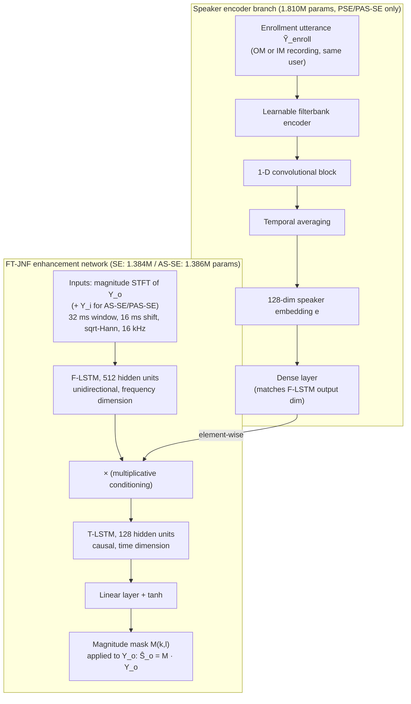

# Ohlenbusch, Kegler & Stamenovic 2026: PAS-SE — Personalized Auxiliary-Sensor Speech Enhancement for Voice Pickup in Hearables

**Authors**: [[entities/mattes-ohlenbusch|Mattes Ohlenbusch]], [[entities/mikolaj-kegler|Mikolaj Kegler]], [[entities/marko-stamenovic|Marko Stamenovic]]

**Institutions**: Bose Corporation (first author's work done during an internship at Bose)

**Venue**: IEEE International Conference on Acoustics, Speech and Signal Processing (ICASSP 2026)

**Year**: 2026 | **Type**: Conference Paper | **DOI**: [10.1109/ICASSP55912.2026.11460554](https://doi.org/10.1109/ICASSP55912.2026.11460554) | **arXiv**: [2509.20875](https://arxiv.org/abs/2509.20875)

**Zotero**: [P9ZFRWT9](zotero://select/items/0_P9ZFRWT9)

## Summary

This paper systematically benchmarks two strategies for resolving the target/interferer ambiguity in hearable voice pickup — [[concepts/personalized-speech-enhancement|personalized speech enhancement (PSE)]], which conditions on enrollment utterances, and [[concepts/as-se|auxiliary-sensor speech enhancement (AS-SE)]], which adds an in-ear microphone input — and combines them into **PAS-SE**. The authors propose training-time augmentations (in-ear noise/interferer configurations A–D) that let AS-SE systems trained on one dataset generalize to a different auxiliary-sensor array, and show that PAS-SE with in-ear-microphone enrollment yields the best interferer suppression both within and across datasets, retaining its benefits even with noisy in-ear enrollments.

## Problem Formulation

A hearable is equipped with an **outer microphone (OM)** and an **in-ear microphone (IM)**. In the STFT domain, the microphone signals are

$$
Y_{\{o,i\}}(k,l)=S_{\{o,i\}}(k,l)+N_{\{o,i\}}(k,l)+V_{\{o,i\}}(k,l),
$$

where $S$ is the user's own voice (target), $N$ environmental noise, and $V$ an interfering talker; $k,l$ index frequency and frame. The IM is acoustically shielded from noise and interferers by the device, while the user's voice reaches it predominantly through body conduction — giving a substantial own-voice SNR advantage, but with band-limitation, nonlinear distortion, and additive body-produced noises that prevent direct use of the IM signal. Single-channel SE cannot disambiguate target from interfering talkers; PSE (enrollment-based) and AS-SE (in-ear-sensor-based) are two complementary ways to supply the missing context, but their trade-offs differ: PSE requires an enrollment/setup procedure, while AS-SE is user-agnostic but may not generalize across devices due to array-specific acoustic properties. A systematic evaluation or integration of the two had not been carried out before this work.

## Methodology

### Model Structure, Inputs, and Outputs

All systems (SE, PSE, AS-SE, PAS-SE) are built by modifying the **FT-JNF** architecture (Tesch & Gerkmann; see [[concepts/joint-nonlinear-filtering|Joint Nonlinear Filtering]]), previously applied to AS-SE by Ohlenbusch et al. Personalization is added via a SpeakerBeam-style speaker-encoder branch with **multiplicative conditioning** on the F-LSTM output.

**FT-JNF enhancement network**

| Spec | Value |
|------|-------|
| Structure | F-LSTM (512 units, frequency) → multiplicative conditioning (personalized variants) → causal T-LSTM (128 units, time) → linear layer → tanh |
| Input | Magnitude STFT of OM signal (SE: 1.384M params); OM + IM magnitudes (AS-SE/PAS-SE: 1.386M params); 32 ms frame / 16 ms shift, sqrt-Hann analysis+synthesis, 16 kHz; per-channel mean-variance normalization from clean-speech training statistics |
| Output | Magnitude mask $M(k,l)$ applied to noisy OM signal: $\hat{S}_o(k,l)=M(k,l)\cdot Y_o(k,l)$ — one mask value per TF bin, at the STFT frame rate (62.5 Hz) |
| Training data | Vibravox `speech_clean` subset, ~33 h, 198 talkers; rigid earbud IM + close-talk OM; mixed with `speechless_noisy` noise and simulated interferers |
| Role | Estimate a magnitude mask that suppresses noise and interferers while preserving the user's own voice at the OM |

**Speaker encoder branch** (PSE / PAS-SE only)

| Spec | Value |
|------|-------|
| Structure | Learnable filterbank encoder → 1-D convolutional block → temporal averaging → 128-dim embedding $\mathbf{e}$ → dense layer (dimension matched to F-LSTM output) |
| Input | One disjoint enrollment utterance $\tilde{Y}_{\text{enroll}}$ from the same talker (recorded at OM or IM); time-domain waveform |
| Output | 128-dim speaker embedding, multiplied element-wise with the F-LSTM output (multiplicative conditioning) |
| Params | 1.810M (time-domain SpeakerBeam architecture, authors' Asteroid implementation) |
| Role | Identify the target (device user) so the mask network can distinguish own voice from interfering talkers |

**Baseline**: time-domain SpeakerBeam ([[concepts/td-speakerbeam|TD-SpeakerBeam]]) with 4.985M parameters (without speaker encoder), trained with the same setups.

### Training Losses

$$
\mathcal{L} = L_{1}\big(S_{o}, \hat{S}_{o}\big)_{\text{time}} + L_{1}\big(|S_{o}|, |\hat{S}_{o}|\big)_{\text{STFT magnitude}}
$$

The combined $L_1$ difference between clean target speech at the OM and the estimate, in both the time domain and the STFT magnitude domain (cf. Wang et al. 2023). Training details: ADAM with initial learning rate 0.001 halved every 5 epochs, 50 epochs total (best validation-loss epoch selected), batch size 8, 3-second random clips, gradient clipping when the total gradient $L_2$-norm exceeds 10.

### In-Ear Noise and Interferer Training Configurations

Vibravox contains no recorded in-ear signals of isolated interfering voices, so the in-ear components $N_i$ and $V_i$ must be approximated during training. The paper ablates four configurations (Table 1):

| Config | OM noise $N_o$ | OM interf. $V_o$ | IM noise $N_i$ | IM interf. $V_i$ |
|--------|---------------|-----------------|---------------|-----------------|
| A (SEANet-style) | ✓ | ✓ | ✗ | ✗ |
| B (Ohlenbusch 2024) | ✓ | ✗ | ✓ | ✗ |
| C | ✓ | ✓ | ✓ | ✗ |
| D | ✓ | ✓ | ✓ | $a \cdot V_o$ |

In configuration D, the in-ear interferer is approximated by the OM interferer attenuated by a random factor $a \in [0.001, 1]$ (uniform). Config A corresponds to the idealized assumption (no noise/interferer transmission to the auxiliary sensor) of SEANet; config B to noise-only augmentation.

## Experimental Setup

| Parameter | Value |
|-----------|-------|
| Sampling rate / STFT | 16 kHz; 32 ms frame, 16 ms shift, sqrt-Hann window |
| Training dataset | Vibravox `speech_clean` (~33 h, 198 talkers), rigid-earbud in-ear mic + close-talk (boom) OM |
| Cross-dataset eval | Oldenburg dataset: 306 utterances, 12/2/4 talkers (train/val/test), same rigid earbud, **outer-face device microphone as OM** (large array difference vs. Vibravox's close-talk OM) |
| Noise | Vibravox `speechless_noisy`; Oldenburg: DNS Challenge 5th edition noise spatialized via 8-loudspeaker circle impulse responses |
| Interferers | Other talkers from training partition (Vibravox) / Oldenburg training set, same spatialization |
| Mixing | 75% probability of noise, SNR $\sim U[-10, 10]$ dB (at OM, same scaling applied to IM); independent 75% probability of interferer |
| Enrollment | Single disjoint clean utterance per training example (OM or IM recording) |
| Metrics | SI-SDR, wideband PESQ, ESTOI vs. target speech at OM; conditions: noise (N), interferer (V), both (N+V) |

## Results

### In-domain (Vibravox)

**PSE vs. SE vs. SpeakerBeam (Table 2, SI-SDR dB / PESQ):**

| System | Enrollment | V: SI-SDR | V: PESQ | N+V: SI-SDR | N+V: PESQ |
|--------|-----------|-----------|---------|-------------|-----------|
| Noisy | – | −0.04 | 1.24 | −4.50 | 1.11 |
| SE | – | 0.55 | 1.31 | −1.76 | 1.20 |
| SpeakerBeam | OM | 5.21 | 1.39 | 1.83 | 1.19 |
| PSE (FT-JNF) | OM | **5.78** | **1.56** | **2.65** | **1.31** |
| PSE (FT-JNF) | IM | 4.81 | 1.52 | 1.77 | 1.29 |

SE handles noise (SI-SDR 7.64 dB under N) but essentially cannot suppress interferers. Personalization resolves this; the smaller FT-JNF PSE slightly outperforms the 3.6× larger SpeakerBeam in all scenarios, and OM enrollment beats IM enrollment in-domain.

**AS-SE training configurations (Table 3, noise-only condition):**

| Config | A | B | C | D |
|--------|---|---|---|---|
| AS-SE SI-SDR (dB) | −0.92 | **11.23** | 10.42 | 9.98 |

Configuration A (no in-ear noise in training) collapses; including in-ear noise (B/C/D) is decisive, while interferer-configuration and added personalization (PAS-SE ≈ 10.3–10.9 dB) barely matter for noise-only suppression.

### Cross-dataset generalization (trained on Vibravox, evaluated on Oldenburg)

Key rows from Table 4 (SI-SDR dB; OL = trained in-domain on Oldenburg):

| System | Enrollment | Train config | N | V | N+V |
|--------|-----------|--------------|-----|-----|-----|
| Noisy | – | – | 0.13 | 0.04 | −4.52 |
| SE | – | – | 8.04 | 2.23 | −0.06 |
| SpeakerBeam | OM | – | −1.42 | −7.02 | −8.63 |
| PSE (FT-JNF) | OM | – | 8.29 | 4.67 | 2.01 |
| AS-SE | – | A | 3.35 | 3.52 | −1.72 |
| AS-SE | – | B | 9.85 | 2.62 | 2.60 |
| AS-SE | – | C | 10.09 | 5.15 | 3.59 |
| AS-SE | – | D | 9.63 | 7.20 | 4.97 |
| PAS-SE | IM | C | 10.70 | 7.40 | 5.35 |
| PAS-SE | IM | D | 10.30 | **8.34** | **5.85** |
| AS-SE | – | OL | 7.47 | 7.27 | 4.57 |
| PAS-SE | IM | OL | 7.63 | 7.57 | 4.85 |

Findings:

1. **SpeakerBeam fails to generalize** (SI-SDR below noisy input), while the magnitude-STFT FT-JNF PSE transfers — attributed to SpeakerBeam's time-domain learnable filterbanks being prone to dataset-specific biases.
2. **AS-SE needs interferer modeling during training** to generalize across auxiliary-sensor arrays: config B (no in-ear interferer training) suppresses noise but not interferers (V: 2.62 dB); adding OM-side interferers (C) and especially the attenuated in-ear approximation (D) substantially improve interferer suppression (V: 7.20 dB).
3. **PAS-SE systematically beats AS-SE**, especially on interferers, and with **in-ear enrollment** the cross-domain PAS-SE (V: 8.34 dB) even outperforms the AS-SE trained fully in-domain on Oldenburg (V: 7.27 dB). In-domain (OL) personalization gains are smaller, likely because only 12 talkers are available for training.

### Personalization with noisy enrollment signals

![[raw/papers/ohlenbusch-2026-pas-se/figures/bfeb627000880e52f02975e9e54a4018f5ab5543edb433a45ae90291d7516514.png|Cross-dataset interferer reduction vs enrollment SNR for SE, PSE, AS-SE and PAS-SE systems]]
*Figure 2: Cross-dataset interferer reduction performance (V) achieved by SE, PSE, AS-SE, and PAS-SE systems at different enrollment utterance SNRs (−∞: only noise, no speech; ∞: clean speech). Systems trained on Vibravox (config D), evaluated on Oldenburg.*

With noisy enrollments (interferer-only condition, Fig. 2): **in-ear enrollment is markedly more robust** — the acoustically shielded IM yields PSE benefits over single-channel SE down to −10 dB enrollment SNR, whereas OM-based conditioning provides no benefit below 0 dB. PAS-SE with in-ear enrollment outperforms AS-SE for enrollment SNRs above −10 dB; PAS-SE with OM enrollment does not benefit from personalization at all.

![[raw/papers/ohlenbusch-2026-pas-se/figures/d4a5eac76dc139639295641e0e8362decd45ef0b5e8807a0a7ad4cfa648b55f6.png|PAS-SE system architecture based on FT-JNF with multiplicative speaker-encoder conditioning]]
*Figure 1: PAS-SE system architecture based on FT-JNF. The system is personalized using multiplicative conditioning with a feature vector $\mathbf{e}$ obtained from an enrollment utterance $\tilde{Y}_{\text{enroll}}$.*

## Key Contributions

1. **First systematic PSE vs. AS-SE benchmark**: denoising, interferer suppression, and cross-dataset generalization compared under a common FT-JNF architecture, two public in-ear-microphone datasets, and identical training/mixing protocols.
2. **Training-time augmentation configurations for AS-SE**: the A–D ablation of in-ear noise/interferer modeling shows that (i) in-ear noise must be present during training (A collapses), and (ii) approximating the in-ear interferer as an attenuated OM interferer (D, $a \in [0.001,1]$) enables interferer suppression and cross-dataset generalization without recorded in-ear interferer data.
3. **PAS-SE**: the combination of enrollment-based personalization with auxiliary-sensor input; in-ear enrollment (matching the auxiliary sensor) gives the best results, generalizing within and across datasets and outperforming even in-domain-trained baselines.
4. **Noisy-enrollment robustness analysis**: in-ear enrollments retain PAS-SE benefits down to −10 dB enrollment SNR, whereas OM enrollments break down below 0 dB — an argument for capturing enrollment through the same shielded sensor used at runtime.

## Related Concepts

- [[concepts/pas-se|PAS-SE]] — the paper's proposed combination
- [[concepts/as-se|Auxiliary-Sensor Speech Enhancement (AS-SE)]] — the in-ear-microphone-input approach, systematically formulated here
- [[concepts/personalized-speech-enhancement|Personalized Speech Enhancement (PSE)]] — enrollment-conditioned enhancement, here as TSE special case with the target = device user
- [[concepts/target-speaker-extraction|Target Speaker Extraction (TSE)]] — umbrella task
- [[concepts/joint-nonlinear-filtering|Joint Nonlinear Filtering]] — the FT-JNF backbone
- [[concepts/td-speakerbeam|TD-SpeakerBeam]] — speaker-encoder branch source and baseline
- [[concepts/hearables|Hearables]] — application platform
- [[concepts/bone-conduction|Bone Conduction]] — how own voice reaches the in-ear microphone
- [[concepts/dns-challenge|DNS Challenge]] — noise source for the Oldenburg evaluation
- [[concepts/speaker-embedding|Speaker Embedding]] — the 128-dim conditioning vector

## Related Synthesis

- [[synthesis/multimodal-bc-speech-enhancement|Multimodal BC Speech Enhancement]] — PSE/AS-SE complementarity in the body-conduction context
