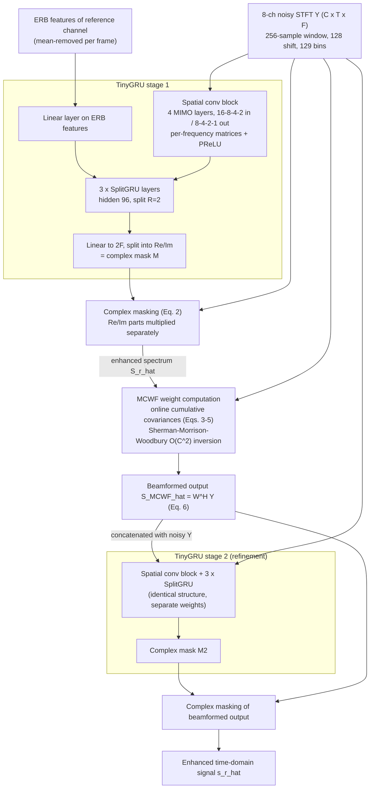

# Pandey & Azcarreta 2025: Ultra Low-Compute Complex Spectral Masking for Multichannel Speech Enhancement

**Authors**: [[entities/ashutosh-pandey|Ashutosh Pandey]] (Meta Reality Labs Research, Redmond, USA), [[entities/juan-azcarreta|Juan Azcarreta]] (Meta Reality Labs Research, Cambridge, UK)
**Venue**: ICASSP 2025 (IEEE International Conference on Acoustics, Speech and Signal Processing)
**Year**: 2025
**Type**: Conference paper
**DOI**: [10.1109/ICASSP49660.2025.10890512](https://doi.org/10.1109/ICASSP49660.2025.10890512)
**Zotero**: [6K4CICNG](zotero://select/items/0_6K4CICNG)

## Summary

This paper presents TinyGRU (TGRU), an ultra-low-compute DNN for complex spectral masking on multichannel input, integrated with a Multi-Channel Wiener Filter (MCWF) in a two-stage framework for edge devices such as smart glasses and hearables. A first TGRU estimates the enhanced complex spectrum at the reference microphone, from which MCWF weights are computed in closed form via online covariance estimation; a second TGRU then refines the beamformed output. The full framework outperforms the oracle Souden MVDR beamformer while requiring only ~50 MMACs/s for one second of 8-channel audio, and surpasses the oracle MCWF in PESQ.

## Problem Formulation

A microphone array with $C$ channels records a mixture of reverberant target speech $\mathbf{S} \in \mathbb{R}^{C \times N}$ and noise $\mathbf{N} \in \mathbb{R}^{C \times N}$:

$$
\mathbf{Y} = \mathbf{S} + \mathbf{N}
$$

The goal is to estimate the target talker speech $s_r$ at a reference microphone $r$. The design constraints are the focus of the paper: real-time, causal, on-device operation on wearables, where existing low-compute multichannel models (e.g., FOVNet, ~50 MMACs/s) rely on ERB-based **magnitude-only** enhancement — leaving phase-enhancement gains unexploited at this compute budget. Complex spectrum enhancement had previously required hundreds of MMACs/s.

## Methodology

### Model Structure, Inputs, and Outputs

The full system is a two-stage hybrid pipeline; each stage is a TinyGRU network whose enhanced spectrum (stage 1) or refined output (stage 2) is produced by complex masking.

**TinyGRU (stage 1) spec:**

| Property | Value |
|----------|-------|
| Structure | 4 [[concepts/spatial-convolution\|MIMO spatial convolution]] layers (input channels 16, 8, 4, 2; output 8, 4, 2, 1; per-frequency $C_{out} \times C_{in}$ matrices; PReLU after each; bias on all but first layer), first-layer output normalized by frame-wise mean/variance over channel+frequency; combined with linear-transformed ERB features of the reference channel; then 3 [[concepts/splitgru\|SplitGRU]] layers, hidden size 96, split factor 2; final linear projection to $2F$ split into real/imaginary mask components |
| Input | STFT of 8-channel signal ($C \times T \times F$, 129 bins, 256/128 window/shift, 16 kHz) with real/imaginary parts concatenated (2C = 16 real channels); ERB filter bank applied to reference channel for the feature branch |
| Output | Complex mask $\mathbf{M} \in \mathbb{C}^{T \times F}$ at frame rate (128 samples = 8 ms); enhanced spectrum $\hat{\mathbf{S}}_r$ of reference channel |
| Training data | Interspeech 2020 [[concepts/dns-challenge\|DNS Challenge]] corpus, 85/5/10 train/test/val split, simulated 8-mic circular array (10 cm radius) via [[concepts/image-source-method\|image method]] |
| Role | Estimates the reference-channel enhanced spectrum that drives MCWF weight computation |
| Cost | 18–20 MMACs/s, ~150k parameters |

**TinyGRU (stage 2) spec:**

| Property | Value |
|----------|-------|
| Structure | Identical spatial + temporal processing blocks (separate weights) |
| Input | Beamformed MCWF output (Eq. 6) concatenated with the multichannel noisy input |
| Output | Complex mask refining the beamformed output |
| Training data | Same as stage 1 |
| Role | Post-filter refining the MCWF output with complex masking |
| Cost | Two-stage total: 50 MMACs/s @ 16 ms latency (304k params); 54 MMACs/s @ 32 ms latency (625k params) |

**Complex masking (Eq. 2):** the real and imaginary parts of the mask are multiplied separately with the corresponding parts of the noisy reference-channel signal:

$$
\hat{\mathbf{S}}_r = \Re(\mathbf{Y}_r) \cdot \Re(\mathbf{M}) + j\,\Im(\mathbf{Y}_r) \cdot \Im(\mathbf{M})
$$

This "Complex-1" formulation deviates from full complex multiplication ("Complex-2") but is cheaper and achieves similar performance (Table I).

**MCWF weight computation (Eqs. 3–5):** using the estimated spectrum $\hat{\mathbf{S}}_r$ as a proxy for the target, filter weights follow from online cumulative empirical covariances:

$$
\mathbf{W}(t,f) = \mathbb{E}[\mathbf{Y}\mathbf{Y}^H](t,f)^{-1}\,\mathbb{E}[\mathbf{Y}\hat{\mathbf{S}}_r^H](t,f)
$$

with the beamformed output $\hat{\mathbf{S}}_{MCWF} = \mathbf{W}^H\mathbf{Y}$. The matrix inverse is computed online with $\mathcal{O}(N^2)$ complexity via the iterative Sherman-Morrison-Woodbury algorithm (Gannot et al. 2017), making the MCWF itself a causal, streaming operation.

### Training Losses

All models are trained with a **time-domain SNR loss** between the enhanced signal and the target (reverberant) speech — the standard negative-SNR form $\mathcal{L} = -10\log_{10}\left(\|s\|^2 / \|s - \hat{s}\|^2\right)$ evaluated on waveform samples. No auxiliary losses are used.

**Training procedure** (two phases, not the iterative mask-then-re-estimate alternation of earlier hybrid studies): the stage-1 TGRU with the MCWF computation in the loop is trained from scratch first; the second-stage refinement network is then trained with the **pretrained first-stage weights frozen**.

## Experimental Setup

| Property | Value |
|----------|-------|
| Training corpus | Interspeech 2020 DNS Challenge (85% train / 5% test / 10% val), 16 kHz |
| Array simulation | 8-mic circular array, 10 cm radius; Pyroomacoustics image method, order 6; absorption [0.1, 0.7]; rooms 3–10 m × 3–10 m × 2–5 m; source 0.5–2.5 m from array; 1–10 noise sources >0.5 m; 75% probability of 8–16 interfering talkers >3 m (babble) |
| SNR / SIR | SNR [−10, 10] dB; SIR [−5, 15] dB |
| Normalization | Input normalized to [−60, −20] dB at reference mic; per-frame mean of ERB features removed |
| Optimizer | Adam (amsgrad = True), gradient norm clipped at 1; lr 0.001 for first 70 epochs, then ×0.1 every 10 epochs; 100 epochs total |
| Batch / utterances | 128 × 10-second utterances, multiple Nvidia H100 GPUs |
| Metrics | STOI, NB-PESQ, SNR (vs reverberant target); MMACs per second of 8-channel audio; parameters in thousands |
| Baselines | Oracle MCWF, oracle [[concepts/mvdr-beamformer\|Souden MVDR]]; MC-CRN (FOVNet-style, ERB magnitude masking with K=20 maxDI fixed beamformers); GTCRN adapted to multichannel (concatenated channels, more input filters) |

## Results

**Masking ablation (Table I, 16 ms):** standalone TGRU performs similarly across sigmoid magnitude, softplus magnitude, and complex masking (STOI ~70.0, PESQ ~2.0) — the model alone does not exploit complex masking's potential. With MCWF added, complex masking pulls clearly ahead (STOI 73.9 vs 71.7 for sigmoid; PESQ 2.08 vs 2.02), indicating the MCWF's spatial information enables more precise phase estimation. The two-stage framework adds a large further jump: STOI 78.9, PESQ 2.38, SNR 8.7 dB at 54 MMACs/s (304k params).

**Configuration ablation (Table II):** spatial-filter tuples (8, 4, 2, 1) and 3 GRU layers give the best quality; the (4, 1) tuple with 2 GRUs offers the best efficiency tradeoff at 44 MMACs/s for the two-stage configuration.

**Baseline comparison at 16 ms latency (Table III):**

| Model | STOI | PESQ | SNR (dB) | MMACs/s | Params (k) |
|-------|------|------|----------|---------|------------|
| Noisy | 61.4 | 1.54 | −1.4 | — | — |
| MC-CRN | 68.1 | 1.92 | 6.3 | 19 | 75 |
| TGRU | 70.0 | 2.02 | 6.9 | 18 | 150 |
| MC-CRN + MCWF | 71.3 | 2.00 | 5.3 | 33 | 75 |
| TGRU + MCWF | 74.0 | 2.08 | 7.1 | 32 | 150 |
| MC-CRN + MCWF + TGRU | 77.5 | 2.32 | 8.1 | 51 | 221 |
| **TGRU + MCWF + TGRU** | **78.9** | **2.38** | **8.7** | **50** | **304** |
| Oracle MVDR | 75.7 | 2.06 | 5.1 | 14 | — |
| Oracle MCWF | 80.1 | 2.25 | 8.7 | 16 | — |

**Baseline comparison at 32 ms latency (Table IV):**

| Model | STOI | PESQ | SNR (dB) | MMACs/s | Params (k) |
|-------|------|------|----------|---------|------------|
| Noisy | 61.4 | 1.54 | −1.4 | — | — |
| GTCRN | 70.9 | 2.11 | 7.3 | 70 | 29 |
| TGRU | 71.2 | 2.10 | 7.5 | 20 | 310 |
| GTCRN + MCWF | 76.7 | 2.17 | 7.8 | 84 | 29 |
| TGRU + MCWF | 76.8 | 2.18 | 8.2 | 34 | 310 |
| GTCRN + MCWF + GTCRN | 80.4 | 2.54 | 8.9 | 140 | 59 |
| **TGRU + MCWF + TGRU** | **81.7** | **2.55** | **9.7** | **54** | **625** |
| Oracle MVDR | 79.9 | 2.21 | 6.2 | 12 | — |
| Oracle MCWF | 84.6 | 2.41 | 10.6 | 14 | — |

Key findings:

1. **TGRU beats oracle MVDR** at both latencies (78.9/2.38 vs 75.7/2.06 at 16 ms; 81.7/2.55 vs 79.9/2.21 at 32 ms), and exceeds the oracle MCWF in PESQ (2.38 vs 2.25; 2.55 vs 2.41) while remaining below it in STOI/SNR.
2. **Magnitude-only masking is incompatible with MCWF**: MC-CRN's performance *degrades* when paired with MCWF (SNR 6.3 → 5.3), whereas TGRU's complex masking benefits strongly — complex spectral masking is what makes the hybrid DNN + MCWF integration work.
3. **Compute efficiency**: at 32 ms, TGRU matches or beats GTCRN using 20 vs 70 MMACs/s standalone and 54 vs 140 MMACs/s in the two-stage configuration. GTCRN has far fewer parameters (29k vs 310k) but its temporal dilated convolutions require large runtime memory for the receptive field, whereas TGRU stores only the previous frame's GRU state.

![[raw/papers/pandey-2025-ultra-low-compute/figures/5c489cbcef1cb8fedc67aa3bf66d3d8b8ce59f0b777b281b14f6cad6ab136cdf.jpg|TinyGRU architecture schematic]]

*Figure 1: A schematic overview of TGRU — the spatial convolution block (MIMO per-frequency matrices) followed by SplitGRU temporal layers.*

## Key Contributions

1. **TinyGRU (TGRU)**: a novel ultra-low-compute DNN combining a low-compute [[concepts/spatial-convolution|MIMO spatial convolution]] block (mimicking frequency-domain filter-and-sum beamforming in the real domain) with [[concepts/splitgru|SplitGRU]] temporal layers for complex spectral masking of multichannel input (~18 MMACs/s, ~150k params for 8 channels).
2. **Two-stage TGRU + MCWF + TGRU framework**: closed-form MCWF weights derived online from the DNN-estimated reference-channel spectrum (cumulative covariances + Sherman-Morrison-Woodbury $\mathcal{O}(N^2)$ inversion), followed by a second TGRU refinement stage — trained in two phases rather than the iterative alternation of earlier hybrid studies.
3. **Complex masking × MCWF synergy**: the empirical demonstration that complex ratio masking only realizes its advantage once MCWF provides spatial information for phase estimation, and conversely that magnitude-only ERB masking (MC-CRN) is hurt by MCWF integration.
4. **Efficiency frontier**: the first complex-spectrum multichannel enhancement at the ~50 MMACs/s budget (previously only achievable with ERB magnitude-only models), outperforming the oracle MVDR and matching-or-beating oracle MCWF PESQ.

## Related Concepts

- [[concepts/tinygru|TinyGRU (TGRU)]] — the proposed model
- [[concepts/spatial-convolution|MIMO Spatial Convolution]] — the trainable per-frequency spatial processing block
- [[concepts/splitgru|SplitGRU]] — the compute-efficient recurrent temporal processing layers
- [[concepts/multi-channel-wiener-filter|Multi-Channel Wiener Filter (MCWF)]] — the closed-form DNN-guided spatial filter
- [[concepts/complex-ratio-mask|Complex Ratio Mask]] — the complex masking formulation (simplified Re/Im multiplication, Eq. 2)
- [[concepts/complex-spectral-mapping|Complex Spectral Mapping]] — the broader complex-domain enhancement paradigm this paper brings to the ultra-low-compute regime
- [[concepts/mvdr-beamformer|MVDR Beamformer]] — oracle Souden MVDR baseline that TGRU outperforms
- [[concepts/gtcrn|GTCRN]] — low-compute baseline compared at 32 ms latency
- [[concepts/erb-scale|ERB Scale]] — the feature compression applied to the reference channel
- [[concepts/dns-challenge|DNS Challenge]] — training corpus
- [[concepts/convolutional-recurrent-network|Convolutional Recurrent Network (CRN)]] — ancestor of the MC-CRN baseline
- [[concepts/gated-recurrent-unit|Gated Recurrent Unit]] — base recurrent unit of SplitGRU

## Related Synthesis

- [[synthesis/multi-channel-speech-enhancement|Multi-Channel Speech Enhancement]] — the hybrid DNN-guided linear-filter design point in the MCSE landscape
