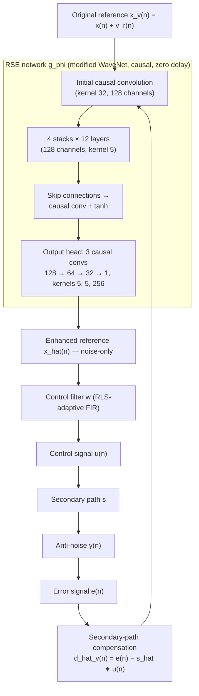

# Rao, Rong, Sun, He, Chen, Zou & Lu 2026: Causal Reference-Enhanced Keep-Speech Active Noise Control

**Authors**: [[entities/li-rao|Li Rao]], [[entities/xiaobin-rong|Xiaobin Rong]], [[entities/yu-sun|Yu Sun]], [[entities/yiming-he|Yiming He]], [[entities/kai-chen|Kai Chen]], [[entities/haishan-zou|Haishan Zou]] (corresponding), [[entities/jing-lu|Jing Lu]]
**Institutions**: Key Laboratory of Modern Acoustics, Institute of Acoustics, Nanjing University; NJU-Horizon Intelligent Audio Lab; R&D Centre, Samsung Electronics (China)
**Venue**: Interspeech 2026, Sydney, Australia, pp. 4966–4970
**Type**: Conference paper
**DOI**: 10.21437/Interspeech.2026-1608
**Zotero**: [H8H75VZM](zotero://select/items/0_H8H75VZM)
**Code**: Listening examples at [github.com/RaoLi666/RSE_KSANC](https://github.com/RaoLi666/RSE_KSANC.git)

## Summary

This paper proposes a causal, low-latency keep-speech ANC (KSANC) method for headphones: instead of replacing the ANC control filter with a neural network (as DeepANC does, incurring frame-level latency that violates causality), a modified WaveNet enhances the **reference signal** by suppressing its speech components while retaining noise, and a conventional FIR control filter — adaptively updated by RLS — does the cancellation. The method introduces no additional algorithmic delay, preserving a large causality margin, and an error-domain training loss ($L_{\mathrm{enh}}$) outperforms a reference-domain noise-extraction loss ($L_{\mathrm{refsep}}$) on STOI and DNSMOS with measured headphone impulse responses.

## Problem Formulation

Conventional ANC does not distinguish noise from speech: the reference microphone of an ANC headphone captures both ambient noise $x(n)$ and speech $v_r(n)$, so the original reference

$$x_v(n) = x(n) + v_r(n) \tag{1}$$

directly drives the control filter, causing the anti-noise to contain speech components and suppressing speech in the error signal — which, combined with the passive attenuation of the headphone shell, degrades communication quality. The error signal is

$$e(n) = d(n) + v_e(n) + y(n), \tag{2}$$

where $d(n)$ and $v_e(n)$ are the noise and speech components at the error microphone and $y(n)$ is the anti-noise. The goal of KSANC is to cancel only $d(n)$ while leaving $v_e(n)$ intact, thereby improving speech intelligibility and quality of the error signal relative to both conventional ANC and the unprocessed case (motivated by Niu et al. 2020, who showed that ANC improves speech recognition under simultaneous noise and speech).

The prior approach, DeepANC (Zhang & Wang 2021), replaces the control filter with a CRN — but CRN-based approaches "inevitably introduce frame-level latency, making it difficult to satisfy the strict causality constraints" of headphone applications.

## Methodology

### Overall System

![[raw/papers/rao-2026-keep-speech-anc/figures/fig1-system-diagram.jpg|Figure 1: Schematic diagram of the proposed RSE-based KSANC framework]]
*Figure 1: Schematic diagram of the proposed RSE-based KSANC framework using a headphone system.*

A neural network enhances the reference signal. It takes the original reference $x_v(n)$ and the estimated noisy speech at the error microphone $\hat{d}_v(n)$ as inputs, where $d_v(n) = d(n) + v_e(n)$ and

$$\hat{d}_v(n) = e(n) - \hat{s} \ast u(n), \tag{4}$$

with $\hat{s}$ the estimate of the secondary path (headphone loudspeaker → error microphone) and $u(n)$ the control signal. The network output is the enhanced reference

$$\hat{x} = g_\phi(x_v, \hat{d}_v), \tag{5}$$

which is filtered by the control filter $w$ to generate the control signal $u(n) = w \ast \hat{x}(n)$, propagated through the secondary path $s$ to produce the anti-noise $y(n) = s \ast u(n)$. Substituting and assuming an unbiased secondary-path estimate:

$$e(n) = d(n) + v_e(n) + s \ast w \ast g_\phi(x + v_r, d + v_e). \tag{8}$$

The key design choice: the **control filter remains a conventional FIR filter** (adaptively updated by RLS at run time), so the neural network sits on the reference path only and, being fully causal with stride 1, adds **zero algorithmic delay** — unlike DeepANC, whose CRN control filter adds frame-level latency.

### Model Structure, Inputs, and Outputs

![[raw/papers/rao-2026-keep-speech-anc/figures/fig2-network-architecture.jpg|Figure 2: The neural network architecture]]
*Figure 2: The RSE network architecture — a modified WaveNet.*

| Spec | RSE network $g_\phi$ |
|:-----|:---------------------|
| **Structure** | Modified WaveNet: initial causal convolution (kernel 32, 128 channels) → 4 stacks × 12 layers (128 channels, kernel 5) → skip connections into a **causal** convolution (replacing WaveNet's 1×1 conv) with **tanh** activation (replacing ReLU) → output head of 3 causal convolutions (channels 128 → 64 → 32 → 1; kernels 5, 5, 256) |
| **Input** | Two raw time-domain signals: original reference $x_v(n)$ and estimated error-microphone speech $\hat{d}_v(n)$; 8 kHz, one sample at a time (stride 1, causal padding → no additional algorithmic delay) |
| **Output** | Enhanced reference $\hat{x}(n)$ — one output sample per input sample, speech-suppressed noise estimate |
| **Training data** | Simulated ref/error mixtures via measured headphone impulse responses: 31 band-limited noise bands (0–4 kHz, bandwidths 250–4000 Hz) × LibriTTS speech (200 speakers, 3100 utterances of 10 s), talker at {270°, 0°, 90°}, noise at {0°, 90°, 180°, 270°}, SNR ∈ {−5, 5, 15} dB at the reference microphone |
| **Training** | Adam, initial lr $5 \times 10^{-5}$, decayed ×0.9 every 10 epochs, 100 epochs |
| **Size / cost** | ≈9.53 M parameters, ≈38.12 GMACs per second of reference signal |
| **Role** | Suppress the speech component of the reference so the conventional FIR control filter cancels only noise (the KSANC enabler); the modifications after the skip connections reduced validation loss from $6.9 \times 10^{-5}$ to $5.9 \times 10^{-5}$ vs. the unmodified WaveNet |

### Training Losses

Two strategies are compared for training the RSE network $g_\phi$:

$$\mathcal{L}_{\mathrm{enh}} = E\left[d(n) + s \ast w \ast g_\phi(x + v_r, d + v_e)\right]^2 \tag{9}$$

$$\mathcal{L}_{\mathrm{refsep}} = E\left[x(n) - g_\phi(x + v_r, d + v_e)\right]^2 \tag{10}$$

- **$\mathcal{L}_{\mathrm{enh}}$** (error-domain) evaluates KSANC performance at the error microphone — since the speech component $v_e(n)$ is absent from Eq. 9, minimizing it jointly achieves noise suppression and speech preservation in the error signal. During training the **optimal Wiener solution** of the control filter $w$ is computed (following Elliott 2001, pp. 130–131) and substituted into Eq. 9; the network is optimized against this Wiener-controlled closed loop.
- **$\mathcal{L}_{\mathrm{refsep}}$** (reference-domain) directly minimizes the MSE between the network output and the noise component $x(n)$ at the reference microphone — a pure noise-extraction objective.

The empirical finding (Table 1): $\mathcal{L}_{\mathrm{refsep}}$ yields *higher* coherence between the enhanced reference and the target noise, but this does **not** translate into better STOI/DNSMOS — its optimization is less aligned with the downstream ANC objective. $\mathcal{L}_{\mathrm{enh}}$ is the better training strategy.

## Experimental Setup

| Item | Value |
|:-----|:------|
| Acoustic setup | Measured headphone impulse responses, right earpiece only; loudspeaker ring at 45° intervals, 0.6 m (talker) / 1.0 m (noise); room $T_{60} \approx 0.25$ s |
| Impulse responses | 256 taps at 8 kHz (primary); measured secondary path truncated to 128 taps (small tail coefficients) |
| Noise | Band-limited synthetic: 31 train bands (bandwidths 4000/2000/1000/500/250 Hz), 7+7 disjoint val/test bands; 100 signals × 10 s per band at 8 kHz. Real-world: DCASE fan/engine/bearing/gearbox recordings, 700 segments × 10 s each |
| Speech | LibriTTS; 200/50/50 speakers (train/val/test, no overlap, balanced gender), 3100/700/700 utterances of 10 s |
| Directions | Talker train {270°, 0°, 90°} / test {270°, 315°, 0°, 45°, 90°}; noise train {0°, 90°, 180°, 270°} / test all 8 directions |
| SNR (at reference mic) | Train/val {−5, 5, 15} dB; test {−5, 0, 5, 10, 15} dB — 0 and 10 dB are unseen |
| Control filter | RLS, forgetting factor 0.99999, initial covariance 0.01·I |
| Metrics | STOI (intelligibility), DNSMOS OVRL (quality) on the last 3 s of the error signal after steady state; mean coherence $\gamma_{\hat{x}d}(f)$ between reference and primary noise $d(n)$ |
| Baselines | Unprocessed; Ideal KSANC (pure-noise reference — unrealizable upper bound); Conventional ANC (noisy reference); DeepANC; RSE-based KSANC with each loss |

![[raw/papers/rao-2026-keep-speech-anc/figures/fig5a-measured-irs.jpg|Figure 5a: Measured impulse responses]]
![[raw/papers/rao-2026-keep-speech-anc/figures/fig5b-secondary-path.jpg|Figure 5b: Measured secondary path]]
*Figure 5: (a) Measured impulse responses of the loudspeaker located at 45° and 1.0 m to the microphones. (b) Measured secondary path.*

## Results

**Band-limited noise (Table 1, STOI % / DNSMOS at each SNR):**

| Method | STOI @ −5 dB | STOI @ 15 dB | DNSMOS @ −5 dB | DNSMOS @ 15 dB |
|:-------|:-------------|:-------------|:---------------|:---------------|
| Unprocessed | 76.71 | 94.59 | 1.60 | 2.62 |
| Ideal KSANC (upper bound) | 93.88 | 98.60 | 2.61 | 2.76 |
| Conventional ANC | 75.17 | 70.51 | 1.72 | 1.73 |
| DeepANC | 74.44 | 92.70 | 1.59 | 2.61 |
| RSE-KSANC ($L_{\mathrm{refsep}}$) | 74.90 | 87.13 | 1.58 | 2.18 |
| **RSE-KSANC ($L_{\mathrm{enh}}$)** | **77.99** | **94.64** | **1.81** | **2.62** |

- RSE-KSANC trained with $L_{\mathrm{enh}}$ achieves the best overall STOI/DNSMOS across the SNR range, consistently beating Unprocessed, Conventional ANC, DeepANC, and the $L_{\mathrm{refsep}}$ variant (full sweep: STOI 77.99/84.46/88.67/91.94/94.64 and DNSMOS 1.81/2.11/2.36/2.50/2.62 at −5/0/5/10/15 dB).
- **DeepANC underperforms** because its larger processing delay violates the causality constraint — its STOI/DNSMOS essentially match the unprocessed case at low SNR.
- **Conventional ANC** gives only a marginal DNSMOS gain at −5 dB and no STOI benefit at higher SNRs, because it suppresses speech along with the stationary band-limited noise.
- The $L_{\mathrm{enh}}$ model's coherence is slightly below Conventional ANC's at −5 dB SNR, but only above 2 kHz, where ANC is ineffective anyway — negligible perceptual impact.

**Real-world DCASE noise (Table 2):** RSE-KSANC ($L_{\mathrm{enh}}$) wins consistently (e.g. fan @ −5 dB: STOI 67.58 vs. 59.99 unprocessed / 63.90 conventional ANC; DNSMOS 1.39 vs. 1.10 / 1.31). Conventional ANC performs *worse than unprocessed* at 5 dB SNR because it suppresses speech together with the weak noise; the proposed method improves both intelligibility and quality simultaneously.

![[raw/papers/rao-2026-keep-speech-anc/figures/fig6a-waveforms.jpg|Figure 6a: Time-domain waveforms]]
![[raw/papers/rao-2026-keep-speech-anc/figures/fig6b-spectrograms.jpg|Figure 6b: Time-frequency representations]]
*Figure 6: (a) Time-domain waveforms and (b) time–frequency representations of a fan-noise sample at NSR = 5 dB (i.e. SNR = −5 dB): the proposed method attenuates noise while preserving speech.*

Robustness: the method generalizes to unseen SNRs (0, 10 dB), unseen speech signals and directions (315°, 45°), unseen noise types (DCASE), and unseen noise directions (all 8).

## Key Contributions

1. **Reference-enhancement architecture for KSANC**: instead of replacing the control filter with a DNN (DeepANC), a neural network on the reference path suppresses speech in the reference while the cancellation is done by a conventional RLS-adapted FIR filter — introducing no additional delay and preserving a large causality margin.
2. **Causal time-domain RSE network**: a modified WaveNet (causal convolution after the skip connections, tanh instead of ReLU; 9.53 M params, 38.12 GMACs/s) that operates sample-by-sample with zero algorithmic delay; the modifications reduce validation loss from $6.9 \times 10^{-5}$ to $5.9 \times 10^{-5}$.
3. **Error-domain vs. reference-domain training analysis**: substituting the Wiener-optimal control filter into an error-domain loss ($L_{\mathrm{enh}}$) aligns optimization with the KSANC objective (joint noise suppression + speech preservation), whereas reference-domain noise extraction ($L_{\mathrm{refsep}}$) improves coherence but not perceptual performance.
4. **Measured-IR validation with generalization study**: experiments on measured headphone impulse responses show consistent STOI/DNSMOS improvements over all baselines, with robustness to unseen SNRs, speech, noise types, and directions.

## Limitations and Future Work

The WaveNet-based model's 9.53 M parameters are relatively high for headphone deployment; future work targets model optimization and parameter reduction for resource-constrained devices. Evaluation is simulation-based (convolving measured IRs), and only the right earpiece was considered.

## Related Concepts

- [[concepts/reference-signal-enhancement|Reference Signal Enhancement]] — the paper's core method
- [[concepts/speech-preserving-anc|Speech-Preserving ANC]] — KSANC belongs to this family; the paper uses the term "keep-speech ANC (KSANC)"
- [[concepts/active-noise-control|Active Noise Control]]
- [[concepts/feedforward-anc|Feedforward ANC]]
- [[concepts/causality|Causality in ANC]] — the causality margin is the central design driver
- [[concepts/wiener-filter|Wiener Filter]] — the Wiener-optimal control filter substituted during $L_{\mathrm{enh}}$ training
- [[concepts/convolutional-recurrent-network|Convolutional Recurrent Network]] — the DeepANC baseline's architecture, whose frame-level latency motivates this work

## Related Sources

- [[sources/bai-2026-feedback-guided-anc|Bai, He, Nan, Chen & Lu 2026: Feedback-guided DNN-based Controller Fusion]] — same NJU group; also uses a WaveNet branch inside an ANC controller
- [[sources/he-2026-neural-projection-filter-anc|He 2026: Neural Projection Filter Generation for Multi-Reference ANC]] — same group; neural processing on the reference side of multi-reference ANC

## Related Synthesis

- [[synthesis/ai-driven-anc|AI-Driven ANC]] — a new placement option for neural networks in the ANC loop (reference path vs. controller)
- [[synthesis/modern-headphone-anc-systems|Modern Headphone ANC Systems]] — causal speech-preserving ANC for conversational headphone scenarios
