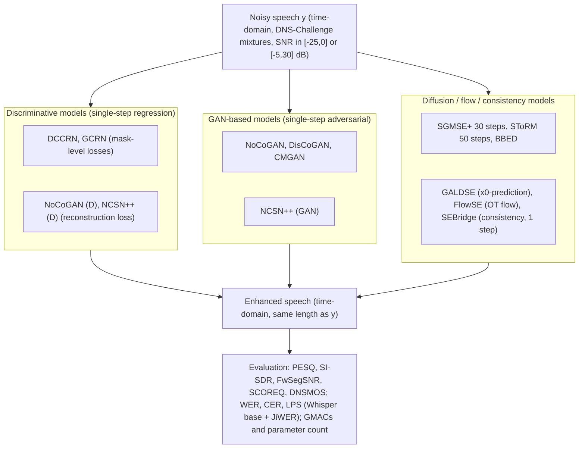

# Shetu, Habets & Brendel 2026: Generative vs. Discriminative Speech Enhancement

**Authors**: [[entities/shrishti-saha-shetu|Shrishti Saha Shetu]], [[entities/emanuel-habets|Emanuël A. P. Habets]], [[entities/andreas-brendel|Andreas Brendel]]
**Institution**: International Audio Laboratories Erlangen, Germany
**Venue**: arXiv preprint 2606.02913, June 2026
**Type**: Preprint — empirical comparison study (original training runs)
**DOI**: [10.48550/arXiv.2606.02913](https://doi.org/10.48550/arXiv.2606.02913)
**Zotero**: [YQIW583N](zotero://select/items/0_YQIW583N)

## Summary

This paper trains and evaluates 14 speech enhancement models spanning discriminative regression, GANs, and diffusion/flow/consistency-type generative methods on ~1000-hour DNS-Challenge-derived datasets for high-SNR ([-5,30] dB) and low-SNR ([-25,0] dB) conditions. Under matched and mismatched conditions, GAN-based methods (especially NCSN++ trained with a GAN objective) dominate diffusion-type methods in PESQ/FwSegSNR, train and converge faster, are far more data-efficient, and are 60–100× cheaper in GMACs; diffusion-type methods only win slightly on the non-intrusive DNSMOS metric. Hallucination metrics (WER/CER/LPS) show limited hallucination at moderate SNR but significant degradation with spurious spectral content below -7 dB SNR for all generative methods.

## Problem Formulation

Let $p(\mathbf{x}_{0}\mid\mathbf{y})$ denote the conditional distribution of clean speech $\mathbf{x}_{0}\in\mathbb{R}^{L}$ given a noisy signal $\mathbf{y}\in\mathbb{R}^{L}$. Conditional generative SE learns a transformation of samples from a source distribution such that transformed samples follow the target clean speech distribution conditioned on $\mathbf{y}$; discriminative SE instead learns a deterministic regression $\mathbf{x}_{0}\approx\mathcal{F}_{\theta}(\mathbf{y})$. The paper asks whether the perceptual gains of generative over discriminative training justify their computational cost, across:

- matched high-SNR and low-SNR conditions, and mismatched (high-SNR-trained → low-SNR-evaluated) conditions,
- training-data volume (50–1000 h) and convergence speed (epochs/steps to peak),
- hallucination behavior (WER, CER, LPS),
- complexity–performance trade-off (GMACs, parameters).

## Methodology

### Compared Training Paradigms

**Diffusion-type (score matching).** A forward SDE perturbs clean speech toward the noisy signal $\mathbf{y}$ via the diffusion kernel $q(\mathbf{x}_{t}\mid\mathbf{x}_{0},\mathbf{y})$; a score network $\mathbf{S}_{\theta}(\mathbf{x}_{t},\mathbf{y},t)$ approximates the conditional score by denoising score matching:

$$
\mathcal{L}_{\mathrm{diff}}=\mathbb{E}_{t,\mathbf{x}_{0},\mathbf{y},\bm{\epsilon}}\left[\left\|\bm{\epsilon}-\mathbf{S}_{\theta}(\mathbf{x}_{t},\mathbf{y},t)\right\|^{2}_{2}\right],\quad\bm{\epsilon}\sim\mathcal{N}(\mathbf{0},\mathbf{I})
$$

with $t\sim\mathcal{U}(0,T)$. The reverse-time SDE iteratively refines $\mathbf{y}$ into a clean estimate. An alternative formulation predicts the initial clean signal $\mathbf{x}_{0}$ directly at each step.

**Conditional flow matching (CFM).** A velocity field $\mathbf{v}_{\theta}(\mathbf{x}_{t},\mathbf{y},t)$ transports samples from $\mathbf{y}$ ($t=1$) to $\mathbf{x}_{0}$ ($t=0$) along a probability path, trained against a conditional target field:

$$
\mathcal{L}_{\mathrm{CFM}}=\mathbb{E}_{t,\mathbf{x}_{0},\mathbf{y}}\left[\left\|\mathbf{v}_{\theta}(\mathbf{x}_{t},\mathbf{y},t)-\mathbf{u}_{t}(\mathbf{x}_{t}\mid\mathbf{x}_{0},\mathbf{y})\right\|^{2}_{2}\right]
$$

For optimal-transport paths, $\mathbf{u}_{t}$ reduces to the constant velocity $\mathbf{x}_{0}-\mathbf{y}$, enabling deterministic transport via an ODE.

**Consistency models.** A consistency function $f_{\theta}(\mathbf{x}_{t},\mathbf{y},t)$ maps any point on a trajectory directly to its origin $\mathbf{x}_{0}$, enforcing self-consistency across time steps with an EMA teacher $\theta^{-}$:

$$
\mathcal{L}_{\mathrm{cons}}=\mathbb{E}_{n,\mathbf{x}_{0},\mathbf{y}}\left[\left\|f_{\theta}(\mathbf{x}_{t_{n}},\mathbf{y},t_{n})-f_{\theta^{-}}(\mathbf{x}_{t_{n-1}},\mathbf{y},t_{n-1})\right\|^{2}_{2}\right]
$$

enabling single-step SE.

**GANs.** The generator $G_{\theta}(\mathbf{y})$ is trained via min–max optimization against a discriminator $D_{\phi}$:

$$
\min_{\theta}\max_{\phi}\;\mathbb{E}_{\mathbf{x}_{0},\mathbf{y}}\big[\mathcal{L}_{D}(\phi,\mathbf{x}_{0},\mathbf{y})\big]+\mathbb{E}_{\mathbf{y}}\big[\mathcal{L}_{G}(\phi,\theta,\mathbf{y})\big]
$$

giving direct single-step SE without iterative refinement.

**Discriminative regression.** A deterministic mapping is learned by minimizing a signal- or mask-level loss $\ell$ (e.g., SI-SNR or MSE):

$$
\mathcal{L}_{\mathrm{disc}}=\mathbb{E}_{\mathbf{x}_{0},\mathbf{y}}\left[\ell\!\left(\mathbf{x}_{0},\mathcal{F}_{\theta}(\mathbf{y})\right)\right]
$$

### Model Structure, Inputs, and Outputs

All models operate on time-domain signals of $L$ samples (transformations preserve signal dimensions), conditioned on the noisy signal $\mathbf{y}$; the NCSN++ backbone (originally a score network) is reused across three training objectives — diffusion, GAN, and discriminative — to isolate the effect of the training paradigm from the architecture. The paper does not re-derive the individual architectures (DCCRN, GCRN, CMGAN, etc.); it trains the published architectures under the two SNR regimes.

| Model | Paradigm | Backbone | Inference | Notes |
|-------|----------|----------|-----------|-------|
| DCCRN | Discriminative | complex CRN | single step | mask-based, widely deployed baseline |
| GCRN | Discriminative | gated CRN | single step | complex spectral mapping |
| NoCoGAN (D) | Discriminative | NoCoGAN generator | single step | GAN architecture trained with reconstruction loss only |
| NCSN++ (D) | Discriminative | NCSN++ | single step | diffusion backbone, regression objective |
| NoCoGAN | GAN | NoCoGAN generator | single step | latent-feature conditioning (Shetu et al. 2026 TASLP) |
| DisCoGAN | GAN | DisCoGAN generator | single step | discriminative conditioning GAN |
| CMGAN | GAN | Conformer metric GAN | single step | conformer-based metric GAN |
| NCSN++ (GAN) | GAN | NCSN++ | single step | diffusion backbone, GAN objective |
| SGMSE+ | Diffusion (score matching) | NCSN++ | 30 steps | SDE-based SE |
| BBED | Diffusion (score matching) | NCSN++ | iterative | prior-mismatch-reduced SDE |
| SToRM | Diffusion (stochastic regeneration) | predictive + diffusion | 50 steps | hybrid regeneration |
| GALDSE | Diffusion ($\mathbf{x}_{0}$-prediction) | lightweight diffusion | iterative | guided anisotropic lightweight diffusion |
| FlowSE | Flow matching | NCSN++ | few steps | OT-conditional flow |
| SEBridge | Consistency model | NCSN++ | 1 step | Brownian-bridge consistency |

### Training Losses

The study compares five training objectives: denoising score matching $\mathcal{L}_{\mathrm{diff}}$, flow matching $\mathcal{L}_{\mathrm{CFM}}$, consistency $\mathcal{L}_{\mathrm{cons}}$, GAN min–max, and discriminative regression $\mathcal{L}_{\mathrm{disc}}$ (equations above). Specific generator/discriminator loss terms $\mathcal{L}_{G}$, $\mathcal{L}_{D}$ follow the respective original publications (NoCoGAN/DisCoGAN, CMGAN); the discriminatively trained variants NoCoGAN (D) and NCSN++ (D) use the FunCodec-style reconstruction loss. Best epoch-wise checkpoints are selected by validation PESQ and SI-SDR.

## Experimental Setup

| Item | Setting |
|------|---------|
| Training data | Interspeech 2020 DNS Challenge mixtures; high-SNR dataset: SNR $\in[-5,30]$ dB; low-SNR dataset: SNR $\in[-25,0]$ dB; each ~1000 h |
| Data-volume study | Subsets of the high-SNR dataset: 50, 100, 200, 500 h |
| Eval — matched high SNR | DNS Challenge non-reverberant test set (12 VoIP noise categories, SNR $\in[0,25]$ dB) |
| Eval — matched low SNR | Dataset of Shetu et al. (2026 TASLP): 1200 10-s samples, 20 stationary/non-stationary noise types, 4 SNR groups ([-15,-12], [-11,-8], [-7,-4], [-3,0] dB) |
| Eval — mismatched | High-SNR-trained models evaluated on the low-SNR scenarios |
| Metrics | PESQ, SI-SDR, FwSegSNR, DNSMOS, SCOREQ (reference-based); WER, CER (Whisper base + JiWER), LPS; GMACs, parameters |
| Model selection | Best checkpoints per method by validation PESQ + SI-SDR |

## Results

**Matched high-SNR (DNS non-reverb test set, trained on high-SNR data; Table 1):**

| Paradigm | Model | SI-SDR (↑) | PESQ (↑) | SCOREQ (↓) | DNSMOS (↑) |
|----------|-------|-----------|----------|-----------|-----------|
| Ref. | Noisy | 9.06 | 1.58 | 0.93 | 3.15 |
| Disc. | DCCRN | 17.36 | 2.91 | 0.31 | 4.00 |
| Disc. | GCRN | 16.71 | 2.63 | 0.42 | 3.91 |
| Disc. | NoCoGAN (D) | 17.72 | 3.15 | 0.29 | 3.98 |
| Disc. | NCSN++ (D) | 17.99 | 3.04 | 0.28 | 4.02 |
| Diff. | SGMSE+ | 16.86 | 2.81 | 0.29 | 4.01 |
| Diff. | BBED | 19.10 | 2.81 | 0.26 | 4.11 |
| Diff. | GALDSE | 18.04 | 2.77 | 0.30 | 4.15 |
| Diff. | SEBridge | 17.21 | 2.45 | 0.38 | 4.00 |
| Diff. | SToRM | 17.56 | 2.80 | 0.27 | 4.11 |
| Diff. | FlowSE | 17.90 | 2.73 | 0.28 | 4.11 |
| GAN | NoCoGAN | 17.82 | 3.22 | 0.29 | 4.04 |
| GAN | DisCoGAN | 18.74 | 3.30 | 0.25 | 4.08 |
| GAN | CMGAN | 17.68 | 2.93 | 0.36 | 4.02 |
| GAN | NCSN++ (GAN) | 19.13 | 3.19 | 0.24 | 4.11 |

GAN-based methods outperform diffusion and discriminative methods in PESQ, SI-SDR, and SCOREQ; discriminative methods achieve comparable PESQ but lag on other metrics; diffusion methods slightly lead on DNSMOS, suggesting stronger generative capability.

**Matched low-SNR (trained on low-SNR data; Table 2, extreme SNR groups shown):**

| Paradigm | Model | ΔPESQ [-15,-12] | ΔPESQ [-3,0] | ΔSI-SDR [-15,-12] | ΔSI-SDR [-3,0] | ΔFwSegSNR [-15,-12] | ΔFwSegSNR [-3,0] |
|----------|-------|-----------------|--------------|--------------------|-----------------|----------------------|-------------------|
| Disc. | GCRN | 0.33 | 0.71 | 15.34 | 11.31 | 1.84 | 3.65 |
| Disc. | DCCRN | 0.40 | 0.88 | 16.19 | 11.73 | 2.59 | 4.64 |
| Disc. | NoCoGAN (D) | 0.54 | 1.10 | 16.70 | 11.84 | 5.85 | 7.86 |
| Disc. | NCSN++ (D) | 0.55 | 1.06 | 17.75 | 12.49 | 6.41 | 8.17 |
| Diff. | SGMSE+ | 0.37 | 0.88 | 9.81 | 11.10 | 4.35 | 9.75 |
| Diff. | BBED | 0.40 | 0.89 | 18.01 | 13.56 | 3.63 | 7.83 |
| Diff. | GALDSE | 0.30 | 0.80 | 18.24 | 13.54 | 1.33 | 4.71 |
| Diff. | FlowSE | 0.41 | 0.89 | 18.13 | 13.63 | 3.91 | 8.09 |
| GAN | DisCoGAN | 0.58 | 1.22 | 17.48 | 12.96 | 7.19 | 9.94 |
| GAN | NoCoGAN | 0.51 | 1.10 | 16.85 | 12.42 | 5.63 | 8.16 |
| GAN | NCSN++ (GAN) | 0.58 | 1.16 | 18.54 | 13.61 | 8.58 | 11.12 |
| GAN | CMGAN | 0.49 | 1.06 | 17.58 | 12.86 | 7.91 | 10.66 |

GAN-based methods clearly outperform discriminative and diffusion methods; NCSN++ (GAN) leads ΔFwSegSNR (8.58–11.12) and ΔSI-SDR (18.54–13.61 dB). Diffusion methods achieve comparable ΔSI-SDR (FlowSE: 16.80/15.59/13.63 for groups [-11,-8]/[-7,-4]/[-3,0]) but poor ΔPESQ and ΔFwSegSNR — attributed to over-denoising or oscillations while converging toward clean-speech outputs in extremely low SNR.

**Mismatched (high-SNR-trained, low-SNR evaluation; Table 3, extreme SNR groups shown):** GAN-based methods remain best; NCSN++ (GAN) achieves ΔPESQ 0.72/0.93/1.14 and ΔSI-SDR 16.03/15.13/13.41 dB (groups [-11,-8]/[-7,-4]/[-3,0]). SGMSE+ degrades most (ΔSI-SDR 7.55 dB at [-11,-8]).

**Hallucination (WER/CER/LPS, %; Table 4):**

| Paradigm | Model | WER [-7,-4] | WER [-3,0] | CER [-7,-4] | CER [-3,0] | LPS [-7,-4] | LPS [-3,0] |
|----------|-------|-------------|------------|-------------|------------|-------------|------------|
| Ref. | Noisy | 89 | 39 | 66 | 24 | 55 | 69 |
| GAN | NoCoGAN | 43 | 31 | 28 | 19 | 84 | 91 |
| GAN | DisCoGAN | 39 | 26 | 25 | 16 | 85 | 92 |
| GAN | NCSN++ (GAN) | 42 | 26 | 29 | 13 | 85 | 92 |
| Diff. | BBED | 43 | 39 | 30 | 17 | 82 | 90 |
| Diff. | FlowSE | 46 | 39 | 28 | 24 | 82 | 89 |
| Diff. | GALDSE | 62 | 32 | 45 | 18 | 81 | 89 |

All methods improve over the noisy reference (limited hallucination at moderate SNR), with GAN-based methods ahead (LPS up to 85/92). Below -7 dB SNR, the metrics degrade significantly and spurious spectral content absent from the clean signal appears in enhanced spectrograms of generative methods — the authors attribute this to conditional generative models relying heavily on $\mathbf{y}$, hallucinating only when $\mathbf{y}$ is almost fully noise-masked.

**Convergence and data volume (Figs. 1–2, vector plots in the source PDF):** With the shared NCSN++ backbone, the discriminative model peaks at ~200k training steps (flat thereafter to 600k); NCSN++ (GAN) peaks at ~250k steps with oscillations stabilizing around 400k; diffusion-based BBED needs ~300k steps to match the discriminative SI-SDR and ~400k to approach GAN-level performance, never reaching comparable PESQ. On data volume, NCSN++ (GAN) reaches peak SI-SDR with only 50 h of training data, whereas BBED requires at least 200 h — GAN training is substantially more data-efficient.

**Complexity–performance trade-off (Fig. 3):**

![[raw/papers/shetu-2026-generative-discriminative-comparison/figures/fig1.png|Figure 3: complexity comparison]]

*Figure 3: Comparison of model complexity across different methods in terms of GMACs and number of parameters.*

Iterative diffusion methods dominate the complexity budget: SGMSE+ (30 steps) and SToRM (50 steps) are at least 60–100× more expensive in GMACs than the single-step NCSN++ (GAN) and NoCoGAN, mainly due to repeated network evaluations in the reverse process. FlowSE and SEBridge reduce evaluations to one or a few steps but remain costly because of the NCSN++ backbone. Discriminative and GAN methods stay in the low-complexity region, and the higher-complexity NCSN++ (in both GAN and discriminative variants) buys proportionally better objective performance — complexity scales to quality for single-step paradigms but not for iterative diffusion.

## Key Contributions

1. **First comprehensive controlled comparison**: trains 14 discriminative, GAN, and diffusion/flow/consistency SE models on diverse 1000-h DNS-derived datasets under matched high-SNR, matched low-SNR, and mismatched conditions, jointly with classical and DNN-based metrics.
2. **GANs dominate low-SNR robustness**: GAN-based methods outperform discriminative and diffusion methods in both matched and mismatched low-SNR scenarios (PESQ, FwSegSNR), with NCSN++ (GAN) — the diffusion backbone with a GAN objective — the overall best model, showing the training paradigm, not the architecture, drives the gains.
3. **Training economics**: convergence and data-volume analysis showing GANs peak at ~250k steps and 50 h of data while diffusion (BBED) needs ~400k steps and ≥200 h — evidence that GAN training is faster and more data-efficient for SE.
4. **Complexity accounting**: GMACs/parameter comparison showing iterative diffusion is 60–100× costlier than single-step GAN/discriminative inference, with no compensating objective-metric advantage under the evaluated conditions.
5. **Hallucination characterization**: WER/CER/LPS evaluation showing generative methods hallucinate little at moderate SNR (conditioning on $\mathbf{y}$ dominates) but degrade with spurious spectral content below -7 dB SNR, GAN less than diffusion.

## Limitations and Caveats

- Objective metrics only; no subjective listening test is reported, and DNSMOS (which slightly favors diffusion) is itself a DNN-based proxy.
- Hallucination findings below -7 dB SNR are qualitative (spectrogram inspection), with quantitative WER/CER/LPS reported only for [-7,-4] and [-3,0] dB.
- Backbone-controlled comparison (NCSN++ under three objectives) covers only one architecture family; the conclusion that paradigm dominates architecture may not transfer to other backbones.
- Noise-reduction only: no dereverberation, echo, or bandwidth extension; the authors themselves hypothesize diffusion may be more beneficial for inherently generative tasks (speech synthesis, bandwidth extension) that lack strong conditioning from $\mathbf{y}$.

## Related Concepts

- [[concepts/generative-vs-discriminative-speech-enhancement|Generative vs. Discriminative Speech Enhancement]]
- [[concepts/speech-enhancement-hallucination|Speech Enhancement Hallucination]]
- [[concepts/diffusion-models-for-speech|Diffusion Models for Speech Enhancement]]
- [[concepts/one-step-generative-models|One-Step Generative Models]]
- [[concepts/speech-enhancement|Speech Enhancement]]
- [[concepts/dns-challenge|DNS Challenge]]
- [[concepts/urgent-challenge|URGENT Challenge]]
- [[concepts/pesq|PESQ]]

## Related Sources

- [[sources/shetu-2026-munet|Shetu et al. 2026: μNet]] — same group's discriminative low-complexity SE line
- [[sources/lugo-2026-diffvqe|Lugo et al. 2026: DiffVQE]] — single-step hybrid generative AEC + denoise; also reports the LPS hallucination metric
- [[sources/xu-2026-drifting-models-speech-enhancement|Xu et al. 2026: Drifting Models]] — one-step generative SE via distributional equilibrium
