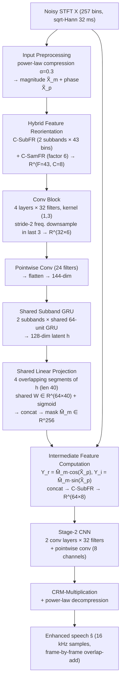

# Shetu, Martinez Aponte, Rao, Vittappan, Thiergart & Habets 2026: μNet — Ultra-Low-Memory and Low-Complexity Speech Enhancement for Embedded DSPs

**Authors**: [[entities/shrishti-saha-shetu|Shrishti Saha Shetu]]¹, [[entities/jose-miguel-martinez-aponte|Jose Miguel Martinez Aponte]]², [[entities/nagashree-k-s-rao|Nagashree K. S. Rao]]², [[entities/sharvin-vittappan|Sharvin Vittappan]]², [[entities/oliver-thiergart|Oliver Thiergart]]¹, [[entities/emanuel-habets|Emanuel A. P. Habets]]¹

**Affiliation**: ¹International Audio Laboratories Erlangen, Germany; ²Fraunhofer IIS, Erlangen, Germany

**Venue**: arXiv preprint (eess.AS)

**Year**: 2026 | **Type**: Preprint | **DOI**: [10.48550/arXiv.2608.21155](https://doi.org/10.48550/arXiv.2608.21155)

**Zotero**: [BYQU4WYY](zotero://select/items/0_BYQU4WYY)

## Summary

This paper proposes μNet, an ultra-low-memory, low-complexity, and low-latency end-to-end DNN for speech enhancement on embedded digital signal processors. μNet requires only 90 KB of static memory and 28 MMACs while supporting algorithmic latencies as low as 4 ms, achieving performance comparable to state-of-the-art methods of similar complexity (RNNoise, GTCRN). The model is fully quantizable to int8, runs in real-time on a Cadence Tensilica HiFi 4 DSP (NXP RT685, 70 MHz), and incorporates a configurable noise attenuation control mechanism that lets users trade off noise suppression aggressiveness against speech quality.

## Problem Formulation

Speech enhancement on embedded DSPs (e.g., Cadence Tensilica HiFi 4/5, common in hearables and hearing aids) imposes **joint** constraints on memory footprint, computational complexity, latency, and integer-only arithmetic support. Prior work has addressed these constraints individually — efficiency-oriented architectures, low-latency windowing schemes, quantization — but no unified framework simultaneously satisfies all of them for practical deployment. Hearable/wearable applications additionally require latencies well below the 10–40 ms regime of telecommunication-oriented enhancers.

The signal model is additive in the STFT domain: $\mathbf{X} = \mathbf{S} + \mathbf{N}$ (noisy, clean speech, noise). Input features are the magnitude and phase computed from the [[concepts/power-law-compression|modified power-law compressed]] (PF $\alpha$) real and imaginary parts of $\mathbf{X}$:

$$\widetilde{\mathbf{X}}_{\mathrm{r}}=\mathrm{sign}(\mathbf{X}_{\mathrm{r}})\odot|\mathbf{X}_{\mathrm{r}}|^{\alpha}, \qquad \widetilde{\mathbf{X}}_{\mathrm{i}}=\mathrm{sign}(\mathbf{X}_{\mathrm{i}})\odot|\mathbf{X}_{\mathrm{i}}|^{\alpha}$$

$$\widetilde{\mathbf{X}}_{\mathrm{m}}=\sqrt{\widetilde{\mathbf{X}}_{\mathrm{r}}^{2}+\widetilde{\mathbf{X}}_{\mathrm{i}}^{2}}, \qquad \widetilde{\mathbf{X}}_{\mathrm{p}}=\arctan\left(\frac{\widetilde{\mathbf{X}}_{\mathrm{i}}}{\widetilde{\mathbf{X}}_{\mathrm{r}}}\right)$$

## Methodology

μNet uses a two-stage backbone inspired by [[concepts/ulcnet|ULCNet]]: stage 1 estimates a magnitude mask $\widetilde{\mathbf{M}}_{\mathrm{m}}\in[0,1]$; stage 2 refines intermediate features to estimate a final [[concepts/complex-ratio-mask|complex ratio mask]] (CRM).

### Model Structure, Inputs, and Outputs

**Network spec — μNet (single network, two-stage)**

| Spec | Value |
|------|-------|
| **Structure** | Stage 1: hybrid C-SubFR + C-SamFR reorientation → 4-layer conv block (32 filters, kernel (1,3), stride-2 frequency downsampling in last 3 layers, BN + ReLU) → pointwise conv (24 filters) → flatten (144-dim) → shared subband GRU (2 subbands, 64 hidden units) → shared linear projection (4 overlapping segments of length 40 from index ranges [0,40], [24,64], [56,96], [88,128]; shared $\mathbf{W}\in\mathbb{R}^{64\times 40}$, sigmoid) → concat to 256-dim magnitude mask. Stage 2: 2-layer CNN (32 filters) + pointwise conv (8 channels) → CRM-multiplication + power-law decompression |
| **Input** | Power-law compressed magnitude $\widetilde{\mathbf{X}}_{\mathrm{m}}$ and phase $\widetilde{\mathbf{X}}_{\mathrm{p}}$ from the STFT of the 16 kHz noisy signal; square-root Hann analysis window of 32 ms; reoriented feature set $\widetilde{\mathbf{X}}_{c}\in\mathbb{R}^{B\times T\times 43\times 8}$ |
| **Output** | Complex ratio mask applied to the noisy spectrum; enhanced time-domain speech $\hat{\mathbf{s}}$ via overlap-add with a shorter Hann synthesis window (asymmetric window pair); purely frame-by-frame processing |
| **Training data** | ~1000 h noisy mixtures from the Interspeech 2020 DNS Challenge dataset, 16 kHz, SNR ∈ [−10, 30] dB; 50% of training/validation data convolved with randomly selected RIRs; augmentation: random low-pass filtering, upsampling, varying STFT windows |
| **Role** | Single end-to-end denoiser for embedded DSP deployment; 46 K parameters, 28 MMACs, 90 KB static memory |

**Key architectural choices:**

- **Standard convolutions instead of depthwise separable** (as in original ULCNet): depthwise separable convolutions reduce theoretical parameter count but suffer from poor hardware utilization on consumer DSPs due to fragmented memory access patterns; standard convolutions optimize embedded implementation and quantization support.
- **Shared subband GRU**: the 144-dim flattened features are split into 2 subbands processed by a GRU with **shared weights** (64 hidden units), learning common temporal dynamics across subbands and significantly reducing parameter count → 128-dim latent $\mathbf{h}$.
- **Shared linear projection with overlapping sliding windows**: $\mathbf{h}$ is partitioned into 4 overlapping segments $\mathbf{h}_k$ of length 40; each segment passes the *same* linear layer $\mathbf{m}_{k}=\sigma(\mathbf{W}\mathbf{h}_{k}+\mathbf{b})$ with $\mathbf{W}\in\mathbb{R}^{64\times 40}$; the projections $\mathbf{m}_{k}\in\mathbb{R}^{64}$ are concatenated into $\widetilde{\mathbf{M}}_{\mathrm{m}}\in\mathbb{R}^{256}$, ensuring spectral consistency during upsampling.
- **Low-latency asymmetric window pair**: Hann analysis window + shorter Hann synthesis window, so overall algorithmic latency is primarily determined by the synthesis window length in the overlap-add; latencies down to 4 ms with modest degradation.
- **Hybrid feature reorientation**: combines [[concepts/channel-wise-feature-reorientation|channel-wise subband feature reorientation]] (C-SubFR, 2 subbands × 43 bins emphasizing perceptually significant low frequencies) with channel-wise sampling-based feature reorientation (C-SamFR, sampling factor 6 across non-contiguous bins → 6 sub-sampled feature sets of dimension 43) to capture both local and global spectral dependencies.

### Training Losses

Three loss variants are evaluated (all on the same architecture):

1. **MSE loss** $\mathcal{L}_{\text{MSE}}$ — computed in the compressed frequency domain (following ULCNet), yielding aggressive noise suppression.
2. **Multi-Scale loss** $\mathcal{L}_{\text{MS}}$ — time-domain cosine similarity (CS) over segment lengths $j\in\{16,\dots,128\}$ ms combined with a frequency-domain MSE over multiple STFT window sizes $i\in\{16,\dots,64\}$ ms:

$$\mathcal{L}_{\text{MS}}=\sum_{j}\frac{1}{K}\sum_{k=1}^{K}\text{CS}\left(\mathbf{s}_{jk},\hat{\mathbf{s}}_{jk}\right)+\underbrace{\sum_{i}\left\||\mathbf{S}_{i}|^{\alpha}-|\widehat{\mathbf{S}}_{i}|^{\alpha}\right\|_{\text{F}}^{2}}_{\mathcal{L}_{\text{spec}}}$$

3. **Multi-Target loss** $\mathcal{L}_{\text{MT}}$ — extends $\mathcal{L}_{\text{spec}}$ with an explicit phase component:

$$\mathcal{L}_{\text{MT}}=\mathcal{L}_{\text{spec}}+\sum_{i}\left\||\mathbf{S}_{i}|^{\alpha}\odot e^{j\bm{\phi}_{\mathbf{S}}}-|\widehat{\mathbf{S}}_{i}|^{\alpha}\odot e^{j\bm{\phi}_{\widehat{\mathbf{S}}}}\right\|_{\text{F}}^{2}$$

Each variant trains the full network (no per-stage losses). All models use PF $\alpha=0.3$ unless stated.

### Noise Attenuation Control

A post-processing mechanism (inspired by Braun et al. 2015) for user-defined control of the noise attenuation level (NAL) with speech-quality trade-off. Given the enhanced estimate $\hat{\mathbf{s}}$ and estimated residual noise $\hat{\mathbf{n}}=\mathbf{x}-\hat{\mathbf{s}}$:

$$\hat{\mathbf{s}}_{-\text{dB}}=\hat{\mathbf{s}}+\beta\,\hat{\mathbf{n}}, \qquad \beta=\sqrt{\frac{P_{\hat{s}}}{P_{\hat{n}}\cdot 10^{(\text{NAL}_{\text{dB}}/10)}}}$$

where $P_{\hat{s}}$ and $P_{\hat{n}}$ are the mean powers of enhanced speech and residual noise. See [[concepts/noise-attenuation-control|Noise Attenuation Control]].

## Experimental Setup

| Parameter | Value |
|-----------|-------|
| Training data | ~1000 h, Interspeech 2020 DNS Challenge dataset |
| Sampling rate | 16 kHz |
| SNR range | [−10, 30] dB |
| Reverberation | 50% of train/val convolved with random RIRs (DNS set) |
| STFT window | Square-root Hann, 32 ms analysis (shorter Hann synthesis for low latency) |
| Optimizer | Adam, initial LR $4\times 10^{-4}$, ×0.1 decay every 3 epochs |
| Power-law factor | $\alpha = 0.3$ |
| Augmentation | Random low-pass filtering, upsampling, varying STFT windows |
| Quantization | TensorFlow TFLite post-training int8, 10 curated samples for calibration |
| Listening test | webMUSHRA, multi-stimulus, 10 listeners, 10 random samples |

**Baselines**: RNNoise (Valin 2018), GTCRN (Rong et al. 2024), and two μNet ablation variants — μNet V2 (shared subband causal self-attention instead of GRU) and μNet V3 (shared gated convolution instead of GRU).

**Evaluation**: DNS Challenge non-reverberant test set; PESQ, SI-SDR, BAK (MOS) from DNSMOS.

## Results

### Objective results (DNS non-reverberant test set)

| Method | Params (K) | MMACs | PESQ | SI-SDR | BAK (MOS) |
|--------|-----------:|------:|-----:|-------:|----------:|
| Noisy | – | – | 1.58 | 9.07 | 2.62 |
| RNNoise | 60 | 40 | 2.04 | 12.66 | 3.95 |
| GTCRN | 48 | 33 | 2.26 | 14.62 | 3.98 |
| μNet V2 (self-attention) | 52 | 32 | 1.81 | 12.28 | 3.92 |
| μNet V3 (gated conv) | 55 | 32 | 1.85 | 12.44 | 3.96 |
| **μNet MSE** | **46** | **28** | 1.90 | 13.24 | **4.03** |
| μNet MT | 46 | 28 | 2.18 | 12.74 | 3.95 |
| μNet MS | 46 | 28 | 2.13 | 13.27 | 3.99 |
| μNet −25 dB | 46 | 28 | 2.24 | 13.61 | 3.55 |
| μNet −30 dB | 46 | 28 | **2.27** | 13.53 | 3.71 |

- μNet (46 K params, 28 MMACs) is the smallest and cheapest model in the comparison.
- **μNet_MSE achieves the best noise suppression (BAK 4.03)** but over-suppresses non-harmonic speech components, distorting speech (visible in the spectrograms below).
- **μNet with NAL −30 dB achieves the best PESQ (2.27)** — the noise attenuation control recovers speech quality lost to aggressive suppression.
- GTCRN retains the best SI-SDR (14.62 dB).

![[raw/papers/shetu-2026-munet/figures/fig1.png|Spectrograms of clean, noisy, and enhanced speech with different power-law factors]]
*Figure 2: Spectrograms of (a) a clean speech signal and (b) noisy signal, enhanced by μNet_MSE with different power-law factors: (c)–(f). Lower PF yields more aggressive suppression but more speech distortion.*

### Perceptual results (MUSHRA, float32, 16 ms latency)

μNet achieves the **highest mean MUSHRA score of 77.78**, outperforming GTCRN (74.24). Notably, μNet_MSE is perceptually preferred despite its over-suppression characteristics.

![[raw/papers/shetu-2026-munet/figures/fig2.png|Multi-stimuli listening test results with float32 models at 16 ms latency]]
*Figure 3: Multi-stimuli listening test results with the float32 models at 16 ms latency; 95% confidence intervals shown as red whiskers.*

### Power-law factor vs noise attenuation level

![[raw/papers/shetu-2026-munet/figures/fig3.png|Relationship between power-law factor and noise attenuation level]]
*Figure 4: Relationship between the power-law factor $\alpha$ and $\text{NAL}_{\text{dB}}$ using μNet_MSE. Increasing $\alpha$ improves speech quality (PESQ) at the cost of reduced noise suppression — functionally equivalent to setting a higher NAL.*

Key finding: the two mechanisms are near-equivalent knobs for the same trade-off. Since most listeners prefer aggressive noise suppression but are highly sensitive to speech distortion, the NAL control provides an intuitive user-facing configuration mechanism: for $\text{NAL}_{\text{dB}}$ up to −35 dB, speech quality improves while noise remains effectively suppressed.

### Low latency and quantization

| Latency | ΔPESQ (float32) | ΔSI-SDR (float32) | ΔPESQ (int8) | ΔSI-SDR (int8) |
|---------|----------------:|------------------:|-------------:|---------------:|
| 16 ms | 0.35 | 3.59 | 0.40 | 3.55 |
| 8 ms | 0.34 | 3.09 | 0.24 | 2.31 |
| 4 ms | 0.21 | 2.52 | 0.10 | 0.50 |

- At 16 ms, int8 quantization has **no adverse effect** (even slightly better ΔPESQ).
- Performance degrades as latency decreases, especially for int8 (ΔSI-SDR drops from 2.31 → 0.50 dB at 4 ms); the authors attribute this to **drifting of GRU states** due to more frequent updates in low-latency configurations.
- Perceptually (MUSHRA): 16 ms scores 72.44, 8 ms 69.20, 4 ms 57.87 — a sharp decline at 4 ms, though listeners still prefer the enhanced output over the noisy signal.

![[raw/papers/shetu-2026-munet/figures/fig4.png|Multi-stimulus listening test results for float32 and int8-quantized models at different latencies]]
*Figure 5: Multi-stimulus listening test results for float32 (F) and int8-quantized (Q) μNet_MSE models. Subscripts indicate algorithmic latencies.*

### DSP deployment

- **90 KB static memory** (model parameters and weights, excluding platform-dependent dynamic workspace).
- Compatible with ARM Cortex M, ADI SHARC, Qualcomm Hexagon, and Cadence Tensilica HiFi 4/5.
- Real-time on Cadence Tensilica HiFi 4 (NXP RT685 DSP) with a cycles requirement of 70 MHz.
- Deployable on neural-accelerator-equipped platforms such as Airoha AB159x.
- Extensible to higher sampling rates by re-parameterizing the feature reorientation, shared subband GRU, and shared linear projection blocks.

## Key Contributions

1. **Ultra-low-memory, low-complexity architecture**: 46 K parameters, 28 MMACs, 90 KB static memory — with performance comparable to SOTA methods of similar complexity (best BAK 4.03, best-in-comparison PESQ 2.27 with NAL control, highest MUSHRA 77.78).
2. **Joint constraint satisfaction**: simultaneous support for algorithmic latencies down to 4 ms (asymmetric analysis–synthesis window pair), full int8 quantizability, and neural-accelerator compatibility — demonstrated on consumer DSP platforms (Cadence Tensilica HiFi 4/5, NXP RT685 at 70 MHz).
3. **Configurable noise attenuation control**: user-defined NAL post-processing that trades noise suppression against speech quality, with the empirical finding that PF and NAL act as near-equivalent controls of the same trade-off.
4. **Hardware-motivated design choices**: standard convolutions over depthwise separable convolutions for DSP memory-access efficiency and quantization support; shared subband GRU and shared linear projection for parameter efficiency.

## Related Concepts

- [[concepts/munet|μNet]]
- [[concepts/ulcnet|ULCNet]]
- [[concepts/fast-ulcnet|Fast-ULCNet]]
- [[concepts/channel-wise-feature-reorientation|Channel-Wise Feature Reorientation]]
- [[concepts/power-law-compression|Power-Law Compression]]
- [[concepts/complex-ratio-mask|Complex Ratio Mask (cRM)]]
- [[concepts/noise-attenuation-control|Noise Attenuation Control]]
- [[concepts/gtcrn|GTCRN]]
- [[concepts/gated-recurrent-unit|Gated Recurrent Unit (GRU)]]
- [[concepts/speech-enhancement|Speech Enhancement]]

## Related Sources

- [[sources/shetu-2024-hybrid-low-complexity-aenr|Shetu et al. 2024: Hybrid Low-Complexity AENR]] — same group; μNet inherits the two-stage ULCNet backbone and power-law compression from this line of work
- [[sources/rong-2024-gtcrn-speech-enhancement-ultralow|Rong et al. 2024: GTCRN]] — primary baseline; note Shetu et al. report GTCRN as 48 K params / 33 MMACs in their measurement setup (GTCRN's own paper reports 23.67 K params / 39.6 MMACs/s — different measurement conventions)
- [[sources/larraza-2026-fast-ulcnet-speech-enhancement|Larraza & de Koeijer 2026: Fast-ULCNet]] — parallel ULCNet-descendant line targeting embedded ARM; μNet targets integer DSPs + neural accelerators instead

## Related Synthesis

- [[synthesis/deep-speech-enhancement|Deep Speech Enhancement]]
- [[synthesis/joint-multitask-ultra-low-latency-se|Joint Multi-Task SE & Ultra-Low-Latency Paradigm]]
- [[synthesis/computational-efficiency-evolution|Computational Efficiency Evolution]]
