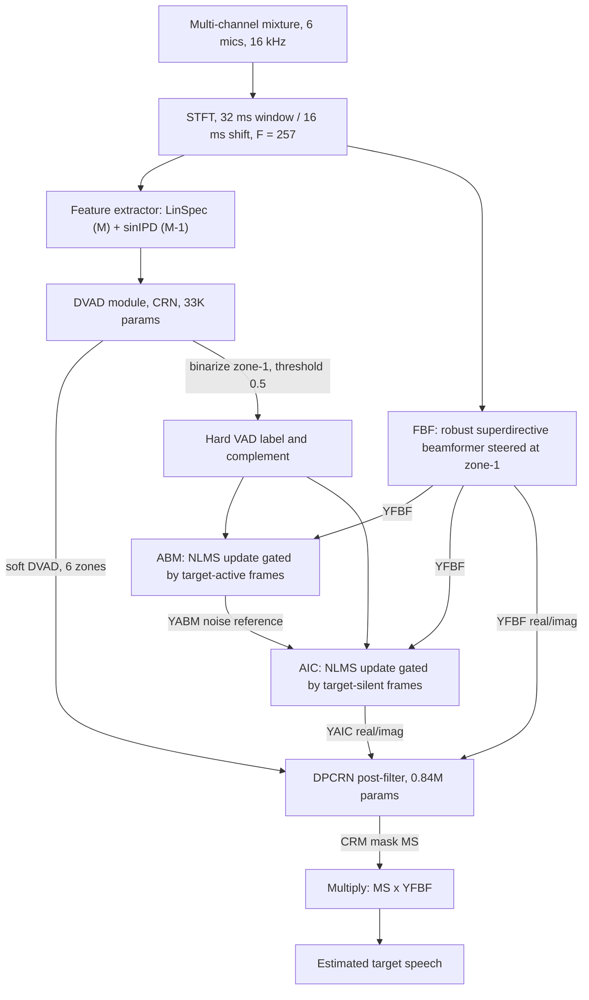

# Sun, Lei & Zhang 2024: A Lightweight Hybrid Multi-Channel Speech Extraction System with Directional VAD

**Authors**: [[entities/tianchi-sun|Tianchi Sun]], [[entities/tong-lei|Tong Lei]], [[entities/xu-zhang|Xu Zhang]], [[entities/yuxiang-hu|Yuxiang Hu]], [[entities/changbao-zhu|Changbao Zhu]], [[entities/jing-lu|Jing Lu]]
**Affiliation**: Key Laboratory of Modern Acoustics, Nanjing University / NJU-Horizon Intelligent Audio Lab, Horizon Robotics / Jiangsu Thingstar Information Technology
**Venue**: ICASSP 2024 — IEEE International Conference on Acoustics, Speech and Signal Processing, pp. 1486–1490
**Type**: Conference Paper
**DOI**: [10.1109/ICASSP48485.2024.10445953](https://doi.org/10.1109/ICASSP48485.2024.10445953)
**Zotero**: [I3S7UELX](zotero://select/items/0_I3S7UELX)
**Demo**: https://fab0504.github.io/TSE-DVAD/

## Summary

This paper proposes a lightweight hybrid multi-channel target speaker extraction (TSE) system that integrates a robust [[concepts/gsc-beamformer|generalized sidelobe canceller (GSC)]] with a DNN-based post-filter under the guidance of a novel [[concepts/directional-vad|directional voice activity detection (DVAD)]] module. The DVAD — a tiny CRN (33K parameters) that estimates per-zone speaker activity on a 6-microphone circular array — serves a dual role: (i) its binarized target-zone output controls the NLMS adaptation of the adaptive blocking matrix (ABM, update during target-active frames) and adaptive interference canceller (AIC, update during target-silent frames) to alleviate desired-speech distortion, and (ii) its soft multi-zone output is concatenated as auxiliary input to a DPCRN post-filter to strengthen interference suppression. With ~0.87M parameters and 1.82 GMACs/s (≈90% MACs reduction vs. the FT-JNF baseline's 14.36 GMACs/s), the system achieves comparable objective scores on simulated data and significantly better DNSMOS on real-world recordings.

## Problem Formulation

The task is extracting a target speaker from a noisy, reverberant multi-channel mixture. In the STFT domain:

$$Y_m(k,l) = S_0(k,l)H_m(k,l) + V_m(k,l) \tag{1}$$

where $Y_m(k,l)$ is the mixture spectrogram at microphone $m$, $S_0(k,l)H_m(k,l)$ the reverberant target speech (non-reverberant speech convolved with the room impulse response), and $V_m(k,l)$ the interference (background noise + competing speech). The goal is to recover the **non-reverberant** target speech at the reference channel $r$, $S(k,l) = S_0(k,l)H_{r,d}(k,l)$, where $H_{r,d}$ contains only the propagation delay.

For a planar array, the horizontal plane is partitioned into $N$ disjoint angular zones according to the beam-width. The target speaker is assumed known to reside in zone-1 (as in video conferencing systems with a known talker direction); competing speakers occupy the other zones. This spatial prior replaces the enrollment utterances required by [[concepts/personalized-speech-enhancement|personalized speech enhancement]] methods, which are often unavailable.

**Motivation**: end-to-end DNN multi-channel TSE (neural beamformers, deep non-linear filters) delivers outstanding performance but at computational complexity incompatible with edge devices, and with no robustness guarantee in unseen environments. Classical GSC with a small array suffers target-speech distortion from leakage through the blocking matrix; prior robust-GSC fixes (SNR-estimate control, coefficient/norm constraints, energy- or RNN-based VAD assist) assume a **single** speaker and degrade with interfering speakers.

## Methodology

### System Overview

The system couples a robust GSC with a neural post-filter via the DVAD module:

### Model Structure, Inputs, and Outputs

The pipeline contains two neural networks (DVAD CRN, DPCRN post-filter) trained **separately** (DVAD first, then the PF), plus the non-learned robust GSC.

**Network 1: DVAD CRN** (adapted from a CRN for [[concepts/direction-of-arrival-estimation|DOA estimation]], Tang et al. 2019)

| Aspect | Specification |
|:-------|:--------------|
| **Structure** | 3 CNN layers (16 channels each; 2-D kernels {(3,3), (3,1), (3,1)} on freq/time axes; ReLU + max-pooling (4,1), (4,1), (2,1) reducing the frequency dimension) → flatten along channels and chunk into 4 vectors → RNN layer of 4 **disconnected parallel GRUs** (32 hidden units each — a [[concepts/grouped-recurrent-neural-network|grouped RNN]] saving compute [Tan & Wang 2019]) → stack back → tanh → FC(36) → FC(6) with sigmoid |
| **Input** | $(2M-1) \times F \times T$ tensor: linear-frequency log-power spectrograms $\mathrm{LinSpec}(k,l) = \log_{10}|\mathbf{Y}(k,l)|^2 \in \mathbb{R}^{M}$ concatenated with sin inter-channel phase differences $\mathrm{sinIPD}(k,l) = \sin(\arg[Y_1^*(k,l)Y_{2:M}(k,l)]) \in \mathbb{R}^{M-1}$; $M=6$, $F=257$, 62.5 frames/s (16 ms hop) |
| **Output** | Soft DVAD $\hat{P}(l) \in \mathbb{R}^{N}$ at 62.5 Hz — one sigmoid probability per zone ($N=6$ zones of 60° each); zone-1 output binarized at $P_{threshold}=0.5$ into hard label $\delta(l)$ |
| **Training data** | 30000 simulated 4–6 s samples (4000/1000/500 train/val/test RIRs), 6-mic circular array (r = 3.5 cm), 1–3 speakers at uniformly sampled azimuths + diffuse noise, SNR 3–12 dB, SIR −3 to 3 dB; ground-truth labels from rVAD applied to each speaker's reverberant speech before mixing |
| **Role** | Estimates instantaneous speaker activity per spatial zone; the binarized target-zone label gates GSC adaptation and the soft full label conditions the post-filter |

**Network 2: DPCRN post-filter** (based on DPCRN-3, 2nd place wideband track of the Interspeech 2021 [[concepts/dns-challenge|DNS Challenge]]; modified by removing the instance layer normalization and widening the DPRNN hidden dimension from 128 to 134 to absorb the concatenated DVAD tensor)

| Aspect | Specification |
|:-------|:--------------|
| **Structure** | Convolutional encoder/decoder + [[concepts/dprnn|dual-path RNN (DPRNN)]] (intra-frame RNN block models spectral patterns within a frame; inter-frame block models time dependency); causal convolutions and uni-directional inter-frame RNNs for causality |
| **Input** | Dual-channel spectrogram — FBF output $Y_{FBF}(k,l)$ and GSC (AIC) output $Y_{AIC}(k,l)$, real and imaginary parts — with the soft DVAD $\hat{P}(l)$ (all $N$ zones) concatenated to the encoder output along the channel axis; 62.5 frames/s |
| **Output** | Complex ratio mask $M_S(k,l) \in \mathbb{C}$; the estimate is $\hat{S}(k,l) = M_S(k,l)\,Y_{FBF}(k,l)$ — the mask is applied to the **FBF** output, which preserves more target speech than the distortion-carrying AIC output |
| **Training data** | Separate 30000-sample dataset from the same source data: 1 target speaker (azimuth $\mathcal{N}(0°, 10°)$, limited to ±20°) + 0–2 competing speakers outside zone-1, target speech 6–8 s; teacher forcing — ground-truth DVAD and the GT-guided GSC output during training, estimated DVAD and corresponding GSC output at inference |
| **Role** | Residual interference suppression while compensating GSC-induced speech distortion; the DVAD input lets the network identify the target speaker in overlapping-speech segments |

**DSP stage: DVAD-assisted robust GSC** (no learnable parameters; filter weights $W_{FBF}(k) \in \mathbb{C}^M$, $W_{ABM}(k,l) \in \mathbb{C}^M$, $W_{AIC}(k,l) \in \mathbb{C}^M$):

$$Y_{FBF}(k,l) = W_{FBF}^H(k)\,\mathbf{Y}(k,l) \tag{4}$$
$$Y_{ABM}(k,l) = \mathbf{Y}(k,l) - W_{ABM}(k,l)\,Y_{FBF}(k,l) \tag{5}$$
$$Y_{AIC}(k,l) = Y_{FBF}(k,l) - W_{AIC}^H(k,l)\,Y_{ABM}(k,l) \tag{6}$$

The FBF is a robust superdirective beamformer (Doclo & Moonen) steered at the approximate target direction. The binarized DVAD $\delta(l)$ and its complement $\bar{\delta}(l) = 1 - \delta(l)$ gate the NLMS weight updates:

$$W_{ABM}(k,l{+}1) = W_{ABM}(k,l) + \delta(l)\,\mu_1 \frac{Y_{FBF}^*(k,l)\,Y_{ABM}(k,l)}{P_{FBF}(k,l)} \tag{8}$$
$$W_{AIC}(k,l{+}1) = W_{AIC}(k,l) + \bar{\delta}(l)\,\mu_2 \frac{Y_{AIC}^*(k,l)\,Y_{ABM}(k,l)}{P_{ABM}(k,l)} \tag{9}$$

with power normalization smoothed as $P_{FBF} = \alpha P_{FBF}(k,l{-}1) + (1-\alpha)|Y_{FBF}|^2$ and analogously for $P_{ABM}$ ($\beta$). The ABM updates **exclusively during the target speaker's active frames** (learning to block target speech from the noise reference), while the AIC updates **during target-silent frames** (when the noise reference is clean of target leakage) — the multi-speaker-safe replacement for the single-speaker SNR/VAD controls of prior robust GSCs.

### Training Losses

The two networks are trained separately, each with a single standard loss:

**DVAD** — multi-class classification over $N=6$ zones with a recall-weighted binary cross-entropy:

$$\mathcal{L}_{DVAD} = -\sum_{n=1}^{N}\big(\gamma\,P_n \log(\hat{P}_n) + (1-P_n)\log(1-\hat{P}_n)\big) \tag{12}$$

with $\gamma = 10$ to increase the recall rate (missing an active zone would mis-gate the GSC adaptation). Exploiting the circular array's spatial symmetry, each training iteration randomly **rolls the mixture and its DVAD label along the channel axis** — a free 6×-symmetry augmentation.

**Post-filter** — [[concepts/complex-compressed-mse|complex compressed MSE (ccMSE)]] (Ephrat et al.):

$$\mathcal{L}_{PF} = \lambda\,\mathrm{MSE}(|S|^c e^{j\varphi}, |\hat{S}|^c e^{j\hat{\varphi}}) + (1-\lambda)\,\mathrm{MSE}(|S|^c, |\hat{S}|^c) \tag{13}$$

with compression factor $c = 0.3$ and weighting $\lambda = 0.3$. The PF is trained with [[concepts/teacher-forcing|teacher forcing]]: ground-truth DVAD labels and the GSC output they guide are provided during training; the estimated DVAD and its GSC output are used at inference.

## Experimental Setup

| Aspect | Configuration |
|:-------|:--------------|
| **Simulation** | [[concepts/image-source-method|Source-image method]] (Allen & Berkley); rooms 3×2.5×2.2 m to 9×5×3.5 m (uniform); RT60 0.4–1.2 s |
| **Array** | Uniform 6-microphone circular array, radius 3.5 cm, placed at 1 m height ≥1 m from walls; 6 zones of 60° each; mic-1 = reference, zone-1 = target zone (−30°…30°); target speaker within ±20° with 10° exclusion range |
| **Mixtures** | 12 s, 16 kHz; 1–3 speakers + diffuse noise (Habets & Gannot generator); speaker distance 0.5–5 m; speaker heights $\mathcal{N}(1.3, 0.08)$ m; SNR 3–12 dB; SIR −3 to 3 dB |
| **Speech / noise corpora** | LibriSpeech (clean speech); QUT-NOISE, Nonspeech, MUSAN noise subset |
| **Splits** | 4000 / 1000 / 500 RIRs; 30000 / 5000 / 1500 samples (train/val/test), two dataset variants (DVAD, PF) from the same source data |
| **Real-world test set** | 0.5 h recorded in a small conference room with an identical array; Yamaha HS5 loudspeakers at different positions playing Chinese speech (Magic Data) to simulate human speakers |
| **STFT** | Square-root Hanning window, 32 ms frame / 16 ms shift, $F = 257$ |
| **Metrics** | SI-SDR, [[concepts/pesq|PESQ]], ESTOI (simulated); DNSMOS P.835 SIG/BAK/OVRL (simulated + real-world) |
| **Baseline** | FT-JNF ([[sources/tesch-2023-insights-deep-nonlinear-filters|Tesch & Gerkmann]]) with the inter-frame BLSTM replaced by a uni-directional LSTM for causality (0.88M params, 14.36 GMACs/s) |

## Results

### DVAD Accuracy

On the DVAD test set, the module reaches **precision 94% / recall 95%** at binarization threshold 0.5 — this threshold is used for all subsequent experiments.

### Objective Scores (Simulated Test Set)

| System | Params (M) | MACs (G/s) | SI-SDR | PESQ | ESTOI |
|:-------|:-----------|:-----------|:-------|:-----|:------|
| Noisy | – | – | −10.785 | 1.106 | 0.325 |
| FT-JNF (baseline) | 0.88 | 14.36 | **4.632** | 1.664 | 0.696 |
| PF-mono (GSC output only) | 0.82 | 1.71 | 1.269 | 1.436 | 0.648 |
| PF-dual (+ FBF output) | 0.82 | 1.71 | 3.318 | 1.670 | 0.697 |
| PF-DVAD-1ch (+ zone-1 DVAD) | 0.83 | 1.72 | 3.860 | 1.686 | 0.709 |
| **PF-DVAD-6ch (full system)** | 0.87 | 1.82 | 3.830 | **1.687** | **0.711** |

Ablation reading: the monaural PF alone already gains >10 dB SI-SDR over noisy, but lags FT-JNF badly; adding the FBF output (PF-dual) compensates GSC speech distortion and already **beats FT-JNF on PESQ/ESTOI**; adding DVAD (1ch/6ch) improves all objective metrics, with the full 6-zone DVAD slightly ahead of target-zone-only. The full system matches FT-JNF's objective scores while cutting compute by **~90%** (1.82 vs 14.36 GMACs/s; counts include DVAD + GSC + PF).

### DNSMOS P.835 (Simulated / Real-World)

| System | SIG | BAK | OVRL |
|:-------|:----|:----|:-----|
| FT-JNF | 2.664 / 2.892 | 3.962 / 3.697 | 2.191 / 2.528 |
| PF-DVAD-1ch | 2.635 / 2.813 | 3.965 / 3.776 | 2.167 / 2.500 |
| **PF-DVAD-6ch** | 2.635 / **3.205** | 3.967 / **3.891** | 2.169 / **2.874** |

On simulated data the three systems score similarly (FT-JNF marginally ahead on SIG/OVRL). On the **real-world** set, the full-DVAD system clearly outperforms both FT-JNF and the 1-channel-DVAD variant — especially on SIG (+0.31 vs FT-JNF) — indicating that the complete per-zone activity distribution preserves spatial information through post-filtering, giving more robust extraction. The end-to-end baseline's advantage does not transfer from simulation to the real conference room; the hybrid system's does.

## Key Contributions

1. **Lightweight hybrid TSE system**: integrates a robust GSC with a DPCRN post-filter at 0.87M parameters / 1.82 GMACs/s — roughly **90% cheaper in MACs** than the end-to-end FT-JNF baseline while achieving comparable objective quality on simulated data and better DNSMOS on real-world data.
2. **DVAD module**: a 33K-parameter CRN (LinSpec + sinIPD features, grouped parallel GRUs) that estimates instantaneous speaker activity per spatial zone — generalizing VAD from "any speech?" to "which zone is active?", robust to multi-speaker scenes where single-speaker robust-GSC controls fail.
3. **Dual use of spatial activity information**: the binarized target-zone DVAD gates ABM updates to target-active frames and AIC updates to target-silent frames (alleviating desired-speech distortion), while the soft full-zone DVAD conditions the post-filter for stronger interference suppression — the 6-zone variant generalizes best to real recordings.
4. **Edge-oriented evidence for hybrid DSP+DNN design**: shows that classical adaptive spatial filtering plus a compact neural post-filter, properly orchestrated by spatial activity cues, can match a state-of-the-art joint non-linear filter on-device and exceed it in unseen real environments.

## Related Concepts

- [[concepts/directional-vad|Directional VAD (DVAD)]] — the paper's core novelty
- [[concepts/gsc-beamformer|Generalized Sidelobe Canceller (GSC)]] — robust GSC with DVAD-gated NLMS adaptation
- [[concepts/target-speaker-extraction|Target Speaker Extraction]] — task framing (spatial-clue TSE)
- [[concepts/voice-activity-detection|Voice Activity Detection]] — DVAD as spatial generalization
- [[concepts/convolutional-recurrent-network|Convolutional Recurrent Network (CRN)]] — DVAD backbone
- [[concepts/dprnn|Dual-Path RNN (DPRNN)]] — post-filter backbone
- [[concepts/complex-ratio-mask|Complex Ratio Mask (CRM)]] — post-filter output applied to FBF output
- [[concepts/complex-compressed-mse|Complex Compressed MSE]] — post-filter training loss
- [[concepts/teacher-forcing|Teacher Forcing]] — GT-DVAD inputs during PF training
- [[concepts/grouped-recurrent-neural-network|Grouped RNN]] — parallel-GRU efficiency trick in the DVAD
- [[concepts/joint-nonlinear-filtering|Joint Nonlinear Filtering (FT-JNF)]] — the end-to-end baseline
- [[concepts/direction-of-arrival-estimation|Direction-of-Arrival Estimation]] — CRN-DVAD adapted from DOA-CRN
- [[concepts/fixed-beamformer|Fixed Beamformer]] — superdirective FBF stage
- [[concepts/image-source-method|Image Source Method]] — dataset generation

## Related Sources

- [[sources/tesch-2023-insights-deep-nonlinear-filters|Tesch & Gerkmann 2023: Insights Into Deep Non-linear Filters]] — the FT-JNF baseline directly compared here (made causal with uni-directional inter-frame LSTM)
- [[sources/zmolikova-2023-neural-target-speech-extraction-overview|Zmolikova 2023: Neural Target Speech Extraction Overview]] — surveys spatial-clue TSE, of which this is a lightweight hybrid instantiation
- [[sources/rong-2024-gtcrn-speech-enhancement-ultralow|Rong et al. 2024: GTCRN]] — same NJU-Horizon team, ultralightweight single-channel SE
- [[sources/huang-2026-lightweight-speech-enhancement-guided-target-speech-extraction|Huang et al. 2026: Lightweight Speech Enhancement Guided TSE]] — alternative lightweight guided-TSE design point

## Related Synthesis

- [[synthesis/deep-speech-enhancement|Deep Speech Enhancement]] — new (params, MACs, quality) data point on the multi-channel efficiency frontier
- [[synthesis/multi-channel-speech-enhancement|Multi-Channel Speech Enhancement]] — hybrid GSC+DNN alternative to end-to-end non-linear spatial filters
