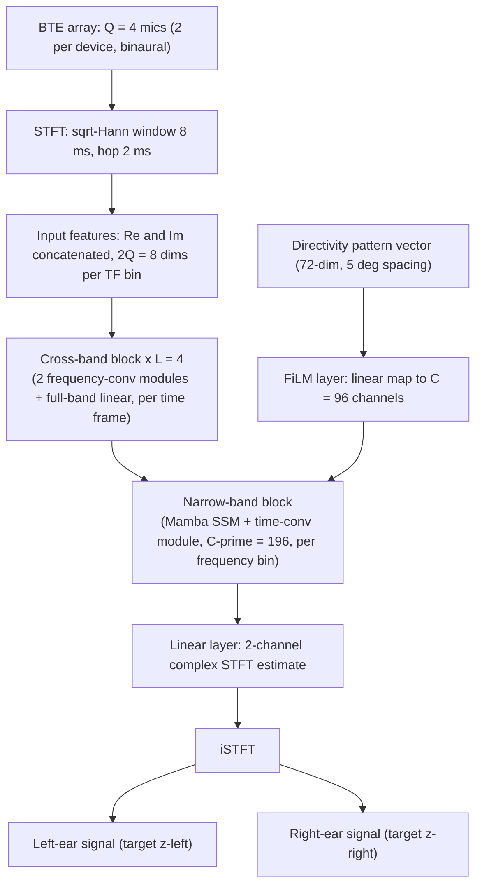

# Uphaus, Merboldt, Hofbauer & Gerkmann 2026: Directivity-Conditioned Low-Latency Neural Filtering

- **Authors**: [[entities/lennart-uphaus|Lennart Uphaus]], [[entities/andre-merboldt|André Merboldt]], [[entities/markus-hofbauer|Markus Hofbauer]], [[entities/timo-gerkmann|Timo Gerkmann]]
- **Affiliation**: Signal Processing Group, University of Hamburg, Germany; Audatic GmbH, Berlin, Germany; Sonova, Stäfa, Switzerland
- **Venue**: arXiv preprint 2609.15760
- **Year**: 2026
- **Type**: Preprint
- **DOI**: [10.48550/arXiv.2609.15760](https://doi.org/10.48550/arXiv.2609.15760)
- **Zotero**: [Open in Zotero](zotero://select/items/0_MW2M5I7N)
- **Audio examples**: [project webpage](https://sp-uhh.github.io/film-osn/)

## Summary

Existing [[concepts/neural-directional-filtering|neural directional filtering (NDF)]] methods can adapt directivity patterns at inference but disregard real-world hearing-device constraints: dynamic scenarios, microphone positions varying with head diameter and hearing-aid placement, head shadow, and strict latency limits (≤ 10 ms — prior NDF approaches need 40–50 ms). This paper proposes **FiLM-OSN**, a 10 ms-total-latency [[concepts/film-osn|FiLM-conditioned OnlineSpatialNet]] that steers binaural directivity patterns on a behind-the-ear (BTE) 4-microphone setup, and shows that an interaural-phase-difference loss term ([[concepts/ipd-preservation-loss|IPD preservation loss]]) is essential for the network to actually realize the conditioned directivity pattern. FiLM-OSN (700k parameters) matches the 32 ms baseline FiLM-JNF (950k) on quality metrics while exceeding it on ESTOI and SI-SDR.

## Problem Formulation

An acoustic scene has $P$ speakers around a head wearing BTE hearing devices ($Q=4$ microphones, two per device). The $q$-th microphone signal in the time domain is

$$y_{q}(t)=\sum_{p=1}^{P}s_{p}(t)\ast(h_{q,p}^{\mathrm{direct}}(t)+h_{q,p}^{\mathrm{reverb}}(t))=\sum_{p=1}^{P}(x_{q,p}(t)+v_{q,p}(t)),$$

with direct-path signal $x_{q,p}=s_{p}\ast h_{q,p}^{\mathrm{direct}}$ and reverberation $v_{q,p}=s_{p}\ast h_{q,p}^{\mathrm{reverb}}$. Unlike single-channel NDF, the target here is an **anechoic binaural** signal that follows the attenuation of a defined directivity pattern $\Lambda_{t}(\theta)$ applied per speaker DoA $\theta_p$:

$$z_{q}(t)=\sum_{p=1}^{P}\Lambda_{t}(\theta_{p})\,x_{q,p}(t)\quad q=\{0,2\},$$

i.e., the direct paths of the left and right reference microphones, weighted by the (possibly time-varying) directivity pattern. Interferers are reduced, not eliminated, to preserve spatial awareness.

## Methodology

![[raw/papers/uphaus-2026-directivity-low-latency/figures/fig1.png|FiLM-OSN architecture]]

*Figure 1: FiLM-OSN architecture for neural directional beamforming.*

### Model Structure, Inputs, and Outputs

The authors found that naively shortening the STFT window of the FT-JNF-based FiLM-JNF (Huang, Chetupalli & Habets 2025, arXiv:2510.20253) to 8 ms significantly degrades performance — the wide-band LSTM loses frequency resolution/sequence length. FiLM-OSN instead extends the **OnlineSpatialNet (OSN)** (Quan & Li 2024) with a [[concepts/film-layer|FiLM]] conditioning layer: OSN replaces the spectral BiLSTM with cross-band (frequency-convolutional) modules and the temporal LSTM with a [[concepts/mamba|Mamba]] state-space model, both of which degrade more gracefully at short windows.

**FiLM-OSN network specification:**

| Property | Value |
|----------|-------|
| **Structure** | $L=4$ interleaved blocks of [cross-band block → FiLM → narrow-band block], each with output $F\times T\times C$, $C=96$ (SpatialNet-small parameters, FiLM output reduced 512→96); cross-band = 2 frequency-convolution modules + 1 full-band linear module (per time frame); narrow-band = Mamba SSM + time-convolutional module (channel width $C'=196$, per frequency bin); final linear layer → 2-channel STFT |
| **Input** | Complex STFT coefficients of 4 mics, $\sqrt{\mathrm{Hann}}$ window 8 ms / hop 2 ms; real+imag concatenated ($2Q=8$ features per TF bin); plus a 72-dimensional directivity-pattern vector (5° intervals) fed to the FiLM layer |
| **Output** | 2-channel (binaural left/right) complex STFT estimate → iSTFT → time-domain signals; total latency 10 ms (8 ms algorithmic + ≤ 2 ms processing for a 2 ms hop) |
| **Training data** | Simulated 5-speaker scenes from WSJ0 speech and 19 BTE hearing-aid-related transfer functions (HARTFs), 6000/1200/600 BRIRs × 5 directivity patterns each |
| **Role** | Single low-latency network performing binaural neural directional filtering with inference-time-steerable directivity |

### Directivity Pattern Strategy

Prior methods (Wechsler et al. 2024; FiLM-JNF) train toward DMA patterns whose main-lobe width cannot be specified by an angular width. The paper proposes a **cosine-based pattern with configurable main-lobe width $W$ and a limited maximum attenuation $M$** (to preserve spatial awareness):

$$\Lambda(\theta)=\begin{cases}\left|\cos\!\left(\tfrac{\pi}{W}\angle e^{j(\theta-\theta_{d})}\right)\right|,& |\angle e^{j(\theta-\theta_{d})}|\le\tfrac{W}{2}\\[2pt] M,& \text{else}\end{cases}$$

with orientation $\theta_d$ relative to the head; $M=-20$ dB and $W=90°$ in all experiments. See [[concepts/directivity-pattern|Directivity Pattern]].

### Training Losses

Batch-aggregated normalized $\mathcal{L}_1$ (as in FiLM-JNF):

$$\mathcal{L}_{1}=\frac{\sum_{b=1}^{B}\left\lVert z_{l,r}^{b}-\hat{z}_{l,r}^{b}\right\rVert_{1}}{\sum_{b=1}^{B}\left\lVert z_{l,r}^{b}\right\rVert_{1}+\epsilon},$$

plus the proposed [[concepts/ipd-preservation-loss|IPD preservation loss]] penalizing cross-channel phase-difference deviations (cosine distance to avoid phase ambiguity, weighted by the reference-channel magnitude $\left|Y_{0}\right|^{2}$ to de-emphasize low-energy components):

$$\mathcal{L}_{\mathrm{IPD}}=\frac{\sum_{f,t}\left|Y_{0}(f,t)\right|^{2}\left[1-\cos\!\left(\hat{\Phi}(f,t)-\Phi(f,t)\right)\right]}{\sum_{f,t}\left|Y_{0}(f,t)\right|^{2}+\epsilon},$$

combined with weighting $\alpha=0.03$:

$$\mathcal{L}_{1,\text{IPD}}=\mathcal{L}_{1}+\alpha\,\mathcal{L}_{\text{IPD}}.$$

## Experimental Setup

| Item | Value |
|------|-------|
| Speech corpus | WSJ0 |
| Scene | $P=5$ speakers; rooms 3–9 × 2.5–5 × 2.2–3.5 m; $T_{60}$ 0.2–0.5 s |
| Acoustic transfer | 19 HARTFs (4 KEMAR + 15 individual subjects; middle mic of 3 omitted → 2 per device); split 13/5/2 train/val/test |
| Source placement | 72° angular sectors, 1.20 ± 0.20 m from array, ≥ 10° inter-speaker separation, mouth height 1.60 ± 0.08 m, loudness −25 to −20 LUFS |
| BRIRs | 6000 / 1200 / 600 (train/val/test), each scene paired with 5 directivity patterns (source positions) |
| Signal length | 3 s |
| Baseline | FiLM-JNF (Huang et al. 2025) adapted to 2-channel output; 32 ms window / 8 ms hop (upper limit) and 8 ms / 2 ms (low latency) |
| Optimization | Max 100 epochs, early stop after 8; batch 6; LR $10^{-3}$ (FiLM-JNF 8 ms: $10^{-4}$ for stability); FiLM-OSN exponential decay $\gamma=0.99$; FiLM-JNF plateau scheduler ×0.5 |
| Metrics | [[concepts/pesq\|PESQ]], ESTOI, [[concepts/si-sdr\|SI-SDR]]; directivity patterns via wide-band output-to-target power ratio $\xi(\theta)$ over 50 test speech signals spatialized at 3° intervals (KEMAR HARTF, anechoic) |

## Results

**Speech quality / intelligibility / distortion (test set):**

| Model | Params | PESQ ↑ | ESTOI [%] ↑ | SI-SDR [dB] ↑ |
|-------|--------|--------|-------------|----------------|
| Unprocessed | — | 1.17 ± 0.10 | 0.44 ± 0.08 | −4.88 ± 3.13 |
| FiLM-JNF 32 ms (baseline) | 950 k | 2.10 ± 0.46 | 0.74 ± 0.08 | 4.70 ± 2.91 |
| FiLM-JNF 8 ms | 950 k | 1.72 ± 0.36 | 0.66 ± 0.10 | 2.98 ± 2.98 |
| FiLM-OSN 8 ms, $\mathcal{L}_1$ (ours) | 700 k | 2.04 ± 0.46 | 0.77 ± 0.08 | 5.66 ± 2.77 |
| FiLM-OSN 8 ms, $\mathcal{L}_{1+\text{IPD}}$ (ours) | 700 k | 2.06 ± 0.46 | 0.77 ± 0.08 | 5.72 ± 2.73 |

- **Naive low latency fails for FiLM-JNF**: shortening the window 32→8 ms drops PESQ 2.10→1.72 and SI-SDR 4.70→2.98 dB, attributable to the reduced sequence length of the wide-band LSTM.
- **FiLM-OSN matches the relaxed-latency baseline at 10 ms total latency** with fewer parameters (700k vs 950k), and exceeds it on ESTOI and SI-SDR.
- The IPD loss gives a marginal further increase in PESQ/SI-SDR — but its real effect is on the *pattern*, below.

![[raw/papers/uphaus-2026-directivity-low-latency/figures/fig3.svg|Estimated directivity patterns]]

*Figure 3: Estimated directivity patterns (output-to-target power ratio, averaged over 50 test speech signals spatialized via the KEMAR HARTF). The $\mathcal{L}_1$-only FiLM-OSN entirely disregards the desired pattern; adding the IPD loss reconstructs it.*

**Directivity pattern and binaural cues:**

- Trained with $\mathcal{L}_1$ only, FiLM-OSN achieves the best quality metrics but **entirely disregards the conditioned directivity pattern** (Fig. 3) and exhibits coherence behavior distinct from the target (Fig. 4) — the time-domain loss preserves ITD but neglects cross-channel spectral coherence.
- With the IPD loss, the estimated pattern aligns with the target and the coherence behavior closely matches it; both variants largely preserve the interaural time difference (ITD).
- The model generalizes across head geometries, since training and test sets use different HARTF subjects (various head diameters).

![[raw/papers/uphaus-2026-directivity-low-latency/figures/fig4.svg|ITD and coherence comparison]]

*Figure 4: ITD (top) and coherence (bottom) of FiLM-OSN trained with $\mathcal{L}_{1+\text{IPD}}$ vs $\mathcal{L}_1$ only, against the target. The IPD loss restores cross-channel spectral coherence.*

## Key Contributions

1. **First hearing-aid-grade NDF**: a steerable neural directional filter meeting the ≤ 10 ms total latency constraint of hearing devices (prior NDF: 40–50 ms), on a realistic binaural BTE 4-microphone setup with head shadow and varying microphone positions, producing a binaural (not single-channel) output.
2. **FiLM-OSN architecture**: extends OnlineSpatialNet with a FiLM conditioning layer (72-dim pattern → 96 channels); the Mamba-based OSN backbone is shown to be markedly better suited to short 8 ms STFT windows than the FT-JNF's spectral LSTM.
3. **IPD preservation loss** ($\alpha=0.03$): a magnitude-weighted cosine penalty on cross-channel phase-difference deviations, shown to be *essential* for the network to realize the conditioned directivity pattern — quality metrics alone would not reveal that the $\mathcal{L}_1$-only model ignores the pattern.
4. **Cosine-based directivity pattern** with configurable main-lobe width $W$ and capped maximum attenuation $M$ (spatial awareness), replacing DMA patterns whose main-lobe width cannot be specified angularly.

## Related Concepts

- [[concepts/film-osn|FiLM-OSN]]
- [[concepts/ipd-preservation-loss|IPD Preservation Loss]]
- [[concepts/neural-directional-filtering|Neural Directional Filtering]]
- [[concepts/joint-nonlinear-filtering|Joint Nonlinear Filtering]]
- [[concepts/film-layer|FiLM Layer]]
- [[concepts/mamba|Mamba]]
- [[concepts/directivity-pattern|Directivity Pattern]]
- [[concepts/audio-latency|Audio Latency]]
- [[concepts/cocktail-party-problem|Cocktail-Party Problem]]

## Related Synthesis

- [[synthesis/deep-speech-enhancement|Deep Speech Enhancement]] — FiLM-OSN as a data point on the low-latency/low-parameter multi-channel frontier
- [[synthesis/multi-channel-speech-enhancement|Multi-Channel Speech Enhancement]] — conditioning-based neural directional filtering under hearing-aid constraints
- [[synthesis/joint-multitask-ultra-low-latency-se|Joint Multi-Task SE & Ultra-Low-Latency Paradigm]] — 10 ms latency tier for hearing devices
