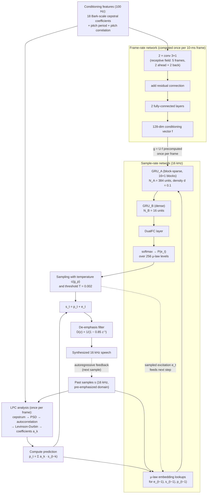

# Valin & Skoglund 2018: LPCNet

| Field | Value |
|-------|-------|
| **Authors** | [[entities/jean-marc-valin\|Jean-Marc Valin]], [[entities/jan-skoglund\|Jan Skoglund]] |
| **Institution** | Mozilla, Mountain View, CA, USA (Valin); Google LLC, San Francisco, CA, USA (Skoglund) |
| **Published** | arXiv:1810.11846 (28 Oct 2018; v2 19 Feb 2019); Proc. ICASSP 2019, Brighton, UK, pp. 5891–5895 |
| **Type** | Conference Paper |
| **arXiv** | [1810.11846](https://arxiv.org/abs/1810.11846) |
| **DOI** | 10.48550/arXiv.1810.11846 |
| **Zotero** | [ZGSNBWFM](zotero://select/items/0_ZGSNBWFM) |
| **Code** | [github.com/mozilla/LPCNet](https://github.com/mozilla/LPCNet/) (evaluation based on commit 0ddcda0) |
| **Samples** | [people.xiph.org/~jm/demo/lpcnet](https://people.xiph.org/~jm/demo/lpcnet/) |

## Summary

This paper introduces **LPCNet**, a [[concepts/wavernn|WaveRNN]] variant that combines classical [[concepts/linear-prediction|linear prediction]] with a recurrent neural network so that the network only has to model the spectrally flat *excitation* of speech while a cheap all-pole LPC filter produces the spectral envelope (vocal-tract response). This division of labor lets LPCNet match state-of-the-art neural synthesis quality with far fewer neurons: high-quality **speaker-independent** synthesis at under 3 GFLOPS, making real-time neural vocoding feasible on a single core of an Apple A8 (iPhone 6) or on 20% of a 2.4 GHz Intel Broadwell core. Alongside the LPC hybridization, the paper contributes pre-emphasis before $\mu$-law quantization, a dual fully-connected (DualFC) output layer, precomputed input embeddings, an improved sampling rule, and a $\mu$-domain training noise-injection scheme.

## Problem Formulation

Neural speech synthesizers (WaveNet-class) produce high-quality speech for text-to-speech and low-bitrate coding, but require tens of GFLOPS — practical only with high-end GPUs. The target is end-user hardware (mobile phones, embedded systems) with no powerful GPU and limited battery.

The key observation is a division of the speech production model:

- The **spectral envelope** (vocal-tract response) is *easy*: a simple all-pole linear filter represents it reasonably well — this is exactly what low-bitrate vocoders have done since the 1970s.
- The **excitation** (glottal pulses + noise) is *hard*: no simple model exists for it, and it is where classical vocoders fail.

So instead of having the network model the entire speech production process (as WaveNet/WaveRNN/SampleRNN do), LPCNet removes the spectral-envelope burden from the network: the network predicts the **prediction residual** $e_t$, and the LPC filter $1/(1 - P(z))$ shapes it into speech. Because the residual is spectrally flat, the same network capacity goes much further.

## Methodology

### Combining Linear Prediction with WaveRNN

Starting from WaveRNN (a GRU + two fully-connected layers + softmax that autoregressively predicts $P(s_t)$ from $s_{t-1}$ and conditioning $\mathbf{f}$), LPCNet makes the network predict the excitation instead of the sample. The prediction is

$$
p_{t}=\sum_{k=1}^{M}a_{k}s_{t-k},
$$

where $a_{k}$ are the $M$-th order LPC coefficients for the current frame. The prediction coefficients are derived **from the conditioning features themselves** — the 18-band Bark-frequency cepstrum is converted to a linear-frequency power spectral density, then to an auto-correlation via inverse FFT, and the Levinson-Durbin algorithm computes the predictor. This means no additional information needs to be transmitted (coding) or synthesized (TTS). Although this LPC analysis is less accurate than one computed on the input signal (low cepstral resolution), the network learns to compensate — an advantage over *open-loop* filtering approaches.

The network inputs are the previously sampled excitation $e_{t-1}$, the past signal $s_{t-1}$, and the prediction $p$ (indexed $p_{t-1}$ in Eq. 2, described as the *current* prediction $p_t$ in the prose). Open-loop synthesis based only on $e_{t-1}$ produces bad-quality speech, so $s_{t-1}$ and the prediction are kept as inputs. The synthesized sample is reconstructed as $s_t = p_t + e_t$.

![[raw/papers/valin-2018-lpcnet/figures/overview.svg|LPCNet architecture: frame-rate network (left) and sample-rate network (right)]]

*Figure 1: Overview of the LPCNet algorithm. The left part of the network (yellow) is computed once per frame and its result is held constant throughout the frame for the sample-rate network on the right (blue). The compute-prediction block predicts the sample at time $t$ from previous samples and the linear prediction coefficients. The de-emphasis filter is applied to the output $s_t$.*

### Model Structure, Inputs, and Outputs

The model splits into a **frame-rate network** (once per 10-ms frame) and a **sample-rate network** (16 kHz), mirroring the two time scales of speech. Data flow at inference:

**1. Frame-rate network**

| Item | Specification |
|------|---------------|
| **Structure** | 2 convolutional layers with 3×1 filters (receptive field of 5 frames: two frames ahead, two back) → output added to a residual connection → 2 fully-connected layers |
| **Input** | 20 features per 10-ms frame: 18 [[concepts/bark-scale-spectral-features\|Bark-scale]] cepstral coefficients + pitch period + pitch correlation, at 100 Hz |
| **Output** | 128-dimensional conditioning vector $\mathbf{f}$, held constant for the duration of each frame |
| **Training data** | 4 hours of speech, NTT Multi-Lingual Speech Database for Telephonometry (21 languages), test speakers excluded |
| **Role** | Converts the slowly-varying acoustic features into a per-frame conditioning vector for the sample-rate network |

**2. Sample-rate network**

| Item | Specification |
|------|---------------|
| **Structure** | $\mathrm{GRU_{A}}$ (block-sparse, 16×1 non-zero blocks + diagonal terms, $N_A = 384$ units at density $d = 0.1$; evaluated at 192/384/640) → $\mathrm{GRU_{B}}$ (dense, $N_B = 16$) → [[concepts/dual-fc-layer\|DualFC]] → softmax |
| **Input** | $\mu$-law embeddings of $e_{t-1}$, $s_{t-1}$, $p_{t-1}$ (256 levels each) + per-frame contributions $\mathbf{g}^{(\cdot)} = \mathbf{U}^{(\cdot)}\mathbf{f}$, at 16 kHz |
| **Output** | Probability distribution $P(e_t)$ over 256 $\mu$-law excitation levels, one per 16 kHz sample; the sampled $e_t$ yields $s_t = p_t + e_t$, de-emphasized to produce the output signal |
| **Training data** | Same 4 hours as the frame-rate network |
| **Role** | Autoregressively models the spectrally flat excitation; the LPC filter (not learned) supplies the spectral envelope |

The two rates are bridged by precomputing, once per frame, the products $\mathbf{g}^{(\cdot)} = \mathbf{U}^{(\cdot)}\mathbf{f}$ — the contribution of the conditioning vector to every GRU gate — so the per-sample cost of the conditioning input is a single vector add.

### Pre-emphasis and Quantization

WaveNet-style models quantize to 8-bit $\mu$-law, but for 16 kHz speech the $\mu$-law white quantization noise is audible at high frequencies (speech energy concentrates at low frequencies, and 16 kHz signals have a stronger spectral tilt). Instead of going to 16 bits (as WaveRNN does), LPCNet applies a first-order **pre-emphasis** filter to the training data,

$$
E(z)=1-\alpha z^{-1},\qquad \alpha=0.85,
$$

and inverts it at the output with the de-emphasis filter $D(z)=1/(1-\alpha z^{-1})$. This shapes the quantization noise so that its power at the Nyquist frequency is reduced by **16 dB**, making 8-bit $\mu$-law output viable for high-quality synthesis and keeping a single 256-value output distribution (which itself reduces complexity versus 16-bit WaveRNN).

### DualFC Output Layer

To compute output probabilities without inflating the preceding layer, the two fully-connected layers of WaveRNN are replaced by an element-wise weighted sum of two tanh layers (the **dual fully-connected**, DualFC):

$$
\mathrm{dual\_fc}(\mathbf{x})=\mathbf{a}_{1}\circ\tanh\left(\mathbf{W}_{1}\mathbf{x}\right)+\mathbf{a}_{2}\circ\tanh\left(\mathbf{W}_{2}\mathbf{x}\right),
$$

with weight matrices $\mathbf{W}_{1},\mathbf{W}_{2}$ and weighting vectors $\mathbf{a}_{1},\mathbf{a}_{2}$. The intuition: deciding whether a value falls within a $\mu$-law quantization interval takes two comparisons, and each tanh layer implements the equivalent of one comparison — visualizing trained weights supports this. DualFC slightly improves quality over a regular fully-connected layer at equivalent complexity, and its output feeds the softmax over $P(e_t)$.

### Sparse Matrices and Embedding Algebra

- **Block sparsity**: the largest GRU ($\mathrm{GRU_{A}}$) uses [[concepts/structured-sparsity|structured sparsity]] with non-zero blocks of size 16×1 (chosen for vectorization-friendly products), trained by progressively zeroing the lowest-magnitude blocks from a dense start. All **diagonal terms** are kept even though they are not aligned with the blocks — an element-wise multiply makes them cheap, and it avoids wasting a whole 16×1 block on one diagonal element.
- **$\mu$-law embeddings**: instead of scaling the scalar sample values into a fixed range, each of the 256 $\mu$-law levels maps to a learned embedding vector (in effect, a learned set of non-linear functions of the $\mu$-law value — inspection of trained embeddings confirms the $\mu$-law-to-linear conversion is learned). Because the embedding feeds the GRU directly, the products of the embedding matrices with the GRU's non-recurrent weight submatrices can be **precomputed**: $\mathbf{V}^{(u,s)}=\mathbf{U}^{(u,s)}\mathbf{E}$, giving 9 precomputed matrices (3 gates × 3 embedded inputs $s, p, e$). The per-sample embedding contribution then collapses to one add per gate per embedded input, and since only one row of each embedding matrix is used per sample, cache pressure from these large matrices is a non-issue.
- **Simplified GRU**: with these simplifications, the sample-rate GRU becomes

$$
\mathbf{u}_{t}=\sigma\left(\mathbf{W}_{u}\mathbf{h}_{t}+\mathbf{v}_{s_{t-1}}^{(u,s)}+\mathbf{v}_{p_{t-1}}^{(u,p)}+\mathbf{v}_{e_{t-1}}^{(u,e)}+\mathbf{g}^{(u)}\right)
$$

$$
\mathbf{r}_{t}=\sigma\left(\mathbf{W}_{r}\mathbf{h}_{t}+\mathbf{v}_{s_{t-1}}^{(r,s)}+\mathbf{v}_{p_{t-1}}^{(r,p)}+\mathbf{v}_{e_{t-1}}^{(r,e)}+\mathbf{g}^{(r)}\right)
$$

$$
\widetilde{\mathbf{h}}_{t}=\tanh\left(\mathbf{r}_{t}\circ\left(\mathbf{W}_{h}\mathbf{h}_{t}\right)+\mathbf{v}_{s_{t-1}}^{(h,s)}+\mathbf{v}_{p_{t-1}}^{(h,p)}+\mathbf{v}_{e_{t-1}}^{(h,e)}+\mathbf{g}^{(h)}\right)
$$

$$
\mathbf{h}_{t}=\mathbf{u}_{t}\circ\mathbf{h}_{t-1}+\left(1-\mathbf{u}_{t}\right)\circ\widetilde{\mathbf{h}}_{t},\qquad
P\left(e_{t}\right)=\mathrm{softmax}\left(\mathrm{dual\_fc}\left(\mathrm{GRU_{B}}\left(\mathbf{h}_{t}\right)\right)\right),
$$

where the $\mathbf{v}_{i}^{(\cdot,\cdot)}$ are row lookups into the precomputed $\mathbf{V}^{(\cdot,\cdot)}$ matrices, and $\mathrm{GRU_{B}}$ replaces WaveRNN's fully-connected ReLU layer. (Equation reproduced as published; the recurrent terms carry the paper's $\mathbf{h}_{t}$ indexing.)

### Sampling from the Probability Distribution

Direct sampling from the output distribution sometimes causes excessive noise. Earlier work multiplied logits by a constant $c = 2$ for voiced sounds (binary voicing decision). LPCNet instead uses a **continuous temperature** driven by the pitch correlation $g_p$ ($0 < g_p < 1$):

$$
c=1+\max\left(0,\,1.5\,g_{p}-0.5\right),
$$

and additionally **subtracts a threshold** so that any probability below $T$ becomes zero, preventing impulse noise from low-probability tails:

$$
P^{\prime}\left(e_{t}\right)=\mathcal{R}\left(\max\left[\mathcal{R}\left(\left[P\left(e_{t}\right)\right]^{c}\right)-T,0\right]\right),
$$

where $\mathcal{R}(\cdot)$ renormalizes the distribution to unity (both between the two steps and on the result). $T=0.002$ provides a good trade-off between reducing impulse noise and preserving naturalness.

### Training Noise Injection

At synthesis time the network consumes its own (imperfect) samples, while training uses clean data — a mismatch that can amplify into distortion. Following prior work, noise is added to the network input during training, but the **placement matters** because of the LPC loop:

- Injecting noise in the signal while training on the *clean* excitation produces artifacts reminiscent of pre-analysis-by-synthesis vocoders — the noise takes the shape of the synthesis filter $1/(1-P(z))$.
- Instead, the prediction filter $P(z)=\sum_{k=1}^{M}a_{k}z^{-k}$ is applied to the **noisy, quantized** input, and the excitation target is computed as the difference between the **clean, unquantized** input and that prediction. The network then effectively minimizes the error in the *signal* domain — an effect similar to analysis-by-synthesis in CELP — which greatly reduces synthesis artifacts.

![[raw/papers/valin-2018-lpcnet/figures/training_noise2.svg|LPCNet training noise injection diagram]]

*Figure 2: Noise injection during training, with $Q$ denoting $\mu$-law quantization and $Q^{-1}$ the conversion back to linear. The prediction filter $P(z)$ is applied to the noisy, quantized input; the excitation target is the difference between the clean, unquantized input and the prediction. The noise is added in the $\mu$-law domain.*

To keep the injected noise proportional to the signal amplitude, it is injected directly in the **$\mu$-law domain**, with the distribution varied across the training data from no noise up to a uniform distribution over $[-3, 3]$.

### Training Losses

The paper specifies the training procedure (AMSGrad, noise injection, 120 epochs) but does not spell out the loss function; as a WaveRNN-class model with a softmax over 256 $\mu$-law levels, the network is trained with the standard **categorical cross-entropy** between the predicted distribution $P(e_t)$ and the one-hot target excitation level — a single standard loss, applied jointly to the frame-rate and sample-rate networks (they are trained together as one model, with features computed from the clean training audio). No auxiliary loss terms or coefficients are reported.

## Experimental Setup

| Aspect | Configuration |
|--------|---------------|
| **Task** | Speaker-independent speech synthesis; features computed directly from recorded speech (isolates the vocoder itself) |
| **Training data** | 4 hours, NTT Multi-Lingual Speech Database for Telephonometry (21 languages); all test-speaker samples excluded |
| **Training schedule** | 120 epochs (230k updates), batch size 64, sequences of 15 10-ms frames |
| **Optimizer** | AMSGrad (Adam variant) with step size $\alpha=\alpha_{0}/(1+\delta\cdot b)$, $\alpha_{0}=0.001$, $\delta=5\times10^{-5}$, $b$ = batch number; Keras/TensorFlow with CuDNN GRU on an Nvidia GPU |
| **Input features** | 18 Bark-scale cepstral coefficients (band layout as Valin, MMSP 2018) + pitch period + pitch correlation (open-loop cross-correlation pitch search) |
| **Model sizes** | $\mathrm{GRU_{A}}$ ∈ {192, 384, 640} units at density $d=0.1$ (non-zero weight counts equal to dense GRUs of 61/122/203 units, matching the "equivalent" sizes of the WaveRNN paper); $\mathrm{GRU_{B}}$ = 16 units |
| **Baseline** | **WaveRNN+** — all Section 3 improvements *except* LPC (predicts $s_t$ from $s_{t-1}$ and conditioning only) |
| **Upper bound** | $\mu$-law quantization with pre-emphasis (no synthesis) — bounds the achievable quality |
| **Subjective test** | MUSHRA-derived methodology (ITU-R BS.1534-1); 8 utterances (2 male + 2 female speakers), 100 participants each |
| **Real-time hardware** | Single core of Apple A8 (iPhone 6); 20% of a 2.4 GHz Intel Broadwell core |

## Results

### Complexity

The complexity is dominated by the two GRUs and the DualFC layer (two operations per weight per output sample):

$$
C=\left(3dN_{A}^{2}+3N_{B}\left(N_{A}+N_{B}\right)+2N_{B}Q\right)\cdot 2F_{s},
$$

with $N_A$, $N_B$ the GRU sizes, $d$ the sparse-GRU density, $Q$ the number of $\mu$-law levels, and $F_s$ the sampling rate. For $N_{A}=384$, $N_{B}=16$, $Q=256$, $F_{s}=16\,\mathrm{kHz}$ — plus ≈0.5 GFLOPS for neglected terms (biases, conditioning network, activations) — the total is **≈2.8 GFLOPS**.

| Model | Complexity | Notes |
|-------|-----------:|-------|
| SampleRNN | ~50 GFLOPS (est.) | Estimate from the paper (1024-unit MLP layers dominate) |
| FFTNet | ~16 GFLOPS | Speaker-dependent; claims lower complexity than WaveNet |
| WaveRNN | ~10 GFLOPS (est.) | Interpretation of the sparse mobile version; speaker-dependent |
| **LPCNet** | **≈2.8 GFLOPS** | Speaker-independent |

### Subjective Quality (MUSHRA)

Results are reported as MUSHRA curves versus the dense-equivalent number of $\mathrm{GRU_{A}}$ units (Figure 3); the paper discusses them qualitatively:

- **LPCNet significantly exceeds WaveRNN+ quality at equal complexity** — equivalently, the same quality is reached at significantly *reduced* complexity.
- The upper-bound condition confirms that with pre-emphasis, **$\mu$-law quantization noise is negligible** compared to synthesis artifacts, validating 8-bit output.
- The main audible artifact of both WaveRNN+ and LPCNet is **roughness from noise between pitch harmonics**; the authors suggest (but did not investigate) post-denoising as a remedy.

![[raw/papers/valin-2018-lpcnet/figures/mushra_line.svg|MUSHRA subjective quality results versus dense-equivalent GRU_A size]]

*Figure 3: Subjective quality (MUSHRA) as a function of the dense-equivalent number of units in $\mathrm{GRU_{A}}$.*

## Key Contributions

1. **LPC/WaveRNN hybridization** — takes spectral-envelope modeling away from the neural network (a classical all-pole LPC filter computed from the conditioning cepstrum via PSD → autocorrelation → Levinson-Durbin), so nearly all network capacity models the spectrally flat excitation. The network predicts the residual $e_t$ rather than the sample $s_t$, which also slightly reduces $\mu$-law quantization noise.
2. **Pre-emphasis before $\mu$-law quantization** — a first-order filter $E(z)=1-0.85z^{-1}$ on the training data (inverted at the output) shapes quantization noise for a 16 dB power reduction at Nyquist, making 8-bit $\mu$-law viable for high-quality 16 kHz synthesis and halving the output distribution size versus 16-bit WaveRNN.
3. **DualFC output layer** — two tanh fully-connected layers combined by element-wise weighted sum, each implementing roughly one "comparison" for $\mu$-law interval membership; slightly better quality than a regular FC layer at equal complexity.
4. **Embedding + algebraic simplifications** — learned $\mu$-law embeddings with 9 precomputed $\mathbf{V}^{(\cdot,\cdot)}=\mathbf{U}^{(\cdot,\cdot)}\mathbf{E}$ matrices turn every non-recurrent GRU input into a single add per gate; per-frame precomputation of $\mathbf{g}^{(\cdot)}=\mathbf{U}^{(\cdot)}\mathbf{f}$ does the same for the conditioning vector.
5. **Improved sampling rule** — a continuous temperature $c=1+\max(0,1.5g_p-0.5)$ driven by pitch correlation (instead of a binary voicing decision), plus a probability threshold $T=0.002$ that zeroes low-probability tails to prevent impulse noise.
6. **CELP-like training noise injection** — noise added in the $\mu$-law domain (amplitude-proportional, up to uniform $[-3,3]$) with the prediction filter applied to the *noisy quantized* input and a *clean* excitation target, so the network effectively minimizes signal-domain error, as in analysis-by-synthesis.
7. **Sub-3-GFLOPS speaker-independent synthesis** — 2.8 GFLOPS total; real-time on a single Apple A8 core (iPhone 6) or 20% of a 2.4 GHz Broadwell core, an order of magnitude below contemporaneous neural vocoders.

## Related Concepts

- [[concepts/lpcnet|LPCNet]] — the model introduced by this paper
- [[concepts/wavernn|WaveRNN]] — the base architecture that LPCNet extends (GRU + sparse matrices + discrete output distribution)
- [[concepts/linear-prediction|Linear Prediction]] — the classical technique supplying the spectral envelope
- [[concepts/dual-fc-layer|DualFC Layer]] — the output layer introduced by this paper
- [[concepts/bark-scale-spectral-features|Bark-Scale Spectral Features]] — the 18-coefficient Bark cepstrum conditioning the synthesis
- [[concepts/gated-recurrent-unit|Gated Recurrent Unit]] — backbone of both network stages
- [[concepts/structured-sparsity|Structured Sparsity]] — 16×1 block-sparse $\mathrm{GRU_{A}}$ with retained diagonal
- [[concepts/pitch-coherence|Pitch Coherence]] — the pitch-correlation conditioning feature also drives the sampling temperature
- [[concepts/percepnet|PercepNet]] — sibling Valin hybrid DSP/DNN real-time system (post-filter rather than vocoder)
- [[concepts/packet-loss-concealment|Packet Loss Concealment]] — later application of LPCNet as a generative PLC backbone (Valin et al. 2022)

## Related Synthesis

(No synthesis pages updated — triage found only thin matches: the two candidates sharing a `real-time` tag are an ANC/MPC comparison and a hearing-aid multitask page, both topical coincidence. This is the first neural-vocoder/synthesis-efficiency paper in the wiki; no existing synthesis page tracks a vocoder complexity frontier.)
