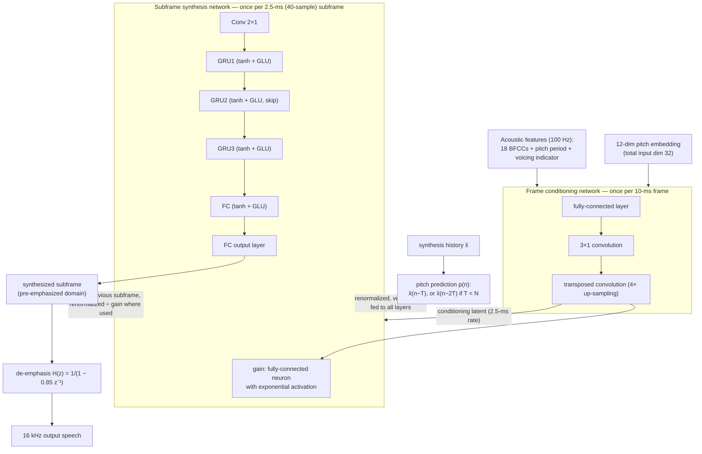

# Valin, Mustafa & Büthe 2024: FARGAN

| Field | Value |
|-------|-------|
| **Authors** | [[entities/jean-marc-valin\|Jean-Marc Valin]], [[entities/ahmed-mustafa\|Ahmed Mustafa]], [[entities/jan-buthe\|Jan Büthe]] |
| **Institution** | Xiph.Org Foundation (Valin); Amazon Web Services (Mustafa, Büthe) |
| **Published** | arXiv:2405.21069 (v1 30 May 2024; v2 5 Aug 2024); IEEE Signal Processing Letters, 2024 |
| **Type** | Journal Paper (IEEE SPL) / preprint |
| **arXiv** | [2405.21069](https://arxiv.org/abs/2405.21069) |
| **DOI** | 10.48550/arXiv.2405.21069 |
| **Zotero** | [832PXENT](zotero://select/items/0_832PXENT) |
| **Code** | [gitlab.xiph.org/xiph/opus, branch `spl_fargan`](https://gitlab.xiph.org/xiph/opus/-/tree/spl_fargan/dnn/torch/fargan) |
| **Samples** | [ahmed-fau.github.io/fargan_demo](https://ahmed-fau.github.io/fargan_demo/) |

## Summary

This paper introduces **FARGAN** (Framewise Autoregressive GAN), a 16 kHz neural vocoder that combines the pitch/phase inductive bias of autoregressive models with adversarial training, using **explicit long-term pitch prediction as a second autoregressive feedback**. The model synthesizes speech in 2.5-ms (40-sample) subframes — small enough to make optimal use of pitch prediction — and, because it generates each subframe in one pass, it avoids teacher forcing entirely by unrolling the model in time during training. The result is a speaker-independent vocoder of 820k parameters and **600 MFLOPS** (0.8% of one i7-8565U core): significantly higher quality than LPCNet, FWGAN and HiFi-GAN v3, and statistically tied with CARGAN and HiFi-GAN v1 at 110× and 64× lower complexity. FARGAN subsequently replaced LPCNet as the vocoder in the DRED redundancy scheme deployed in Opus 1.5, reducing synthesis complexity by a factor of 5.

## Problem Formulation

Autoregressive vocoders based on explicit density estimation (WaveNet, SampleRNN, [[concepts/wavernn|WaveRNN]], [[concepts/lpcnet|LPCNet]]) synthesize waveforms through conditional sampling, which imposes two structural limitations:

1. Their training requires **teacher forcing** — feeding ground-truth samples as autoregressive inputs — causing [[concepts/exposure-bias|exposure bias]], a training/inference domain gap that sometimes limits quality.
2. Density estimation prevents direct signal generation and the use of more advanced loss functions, as employed by GAN vocoders (MelGAN, HiFi-GAN, BigVGAN).

GAN vocoders have neither limitation, but their CNN generators lack the autoregressive inductive bias: per CARGAN (Morrison et al., ICLR 2021), "autoregressive models possess an inductive bias towards learning pitch and phase" — the phase evolution of a periodic signal is analogous to the cumulative-sum problem, which CNNs with finite receptive fields learn poorly. CARGAN reconciles the two by training an autoregressive model adversarially on sufficiently large chunks (512 samples), but retains teacher forcing with respect to its autoregressive component.

FARGAN extends both CARGAN and the authors' previous Framewise WaveGAN (FWGAN, ICASSP 2023) toward the constraints of **real-time speech communications**: algorithmic delay below 20 ms and complexity low enough for continuous operation on a mobile-device CPU without draining the battery. Its answer is to make the autoregressive unit a 2.5-ms subframe and add pitch-based long-term prediction as a second, explicit feedback path.

## Methodology

### Architecture Overview

FARGAN operates on 20-dimensional acoustic features computed at a 10-ms interval on 16 kHz audio — as in LPCNet, these are 18 [[concepts/bark-scale-spectral-features|Bark-frequency cepstral coefficients]] (BFCCs), a pitch period, and a voicing indicator. Each 10-ms frame is subdivided into **4 subframes of 2.5 ms (40 samples)**. In each iteration the model computes an entire subframe from the acoustic features, the previously synthesized subframe, and a long-term (pitch) prediction taken from the synthesis history.

![[raw/papers/valin-2024-fargan/figures/fargan_overview.svg|FARGAN overview: frame conditioning network and autoregressive subframe synthesis network]]

*Figure 1: Overview of FARGAN. The frame conditioning network operates on acoustic features at a 10-ms interval and outputs a conditioning latent representation at 2.5-ms interval for the autoregressive subframe synthesis network.*

The **frame conditioning network** consists of one fully-connected layer, one 3×1 convolutional layer, and one transposed convolution layer performing 4× up-sampling to the subframe rate. It also receives a 12-dimensional embedding of the pitch (as in LPCNet), for a total input dimension of 32.

The **subframe synthesis network** carries the autoregressive property, with two feedback paths:

1. **Previous subframe** — the last generated subframe is fed back directly, ensuring signal continuity. This resembles CARGAN's autoregression but at much smaller durations (40 samples instead of 512).
2. **Pitch prediction** — the input pitch period is not only conditioning: it directly indexes the synthesis history to extract the signal exactly one pitch period earlier. For voiced speech those samples are an accurate prediction of the current subframe. (A consequence: the model cannot easily be adapted to general audio and music.)

### Long-Term Pitch Prediction

To handle pitch periods $T$ shorter than the subframe size $N$, the predicted signal is

$$
p(n)=\begin{cases}\hat{x}(n-T)&T\geq N\\
\hat{x}(n-2T)&\text{otherwise},\end{cases}
$$

where $\hat{x}$ is the already-synthesized signal. Since the highest allowed pitch is 500 Hz ($T=32$), the period can never be shorter than $N/2$, so looking back two periods always reaches far enough. A **gate** computed from the conditioning avoids using the prediction for unvoiced speech.

### Layer Structure, Gains, and Normalization

All layers of the subframe network use a $\tanh()$ activation, and — except the output layer — a **gated linear unit (GLU)** at their output:

$$
G(\mathbf{x})=\mathbf{x}\odot\sigma{\left(\mathbf{Wx}\right)},
$$

with $\odot$ the Hadamard product and $\sigma$ the sigmoid. Per Figure 2, the network stacks **Conv 2×1 → GRU1 → GRU2 → GRU3 → FC → FC**, with a skip connection around GRU2 and a gain multiplication at the output.

**Gain normalization**: for each subframe, a single fully-connected neuron with exponential activation computes a gain from the subframe conditioning. The gain scales the output layer to the full dynamic range; in the autoregressive feedback, the previous subframe and the pitch prediction are *renormalized using the gain of the subframe where they are used* rather than where the speech was generated.

The autoregressive components are fed not only to the input of the subframe network but to **all its other layers** — the authors attribute the need to vanishing gradients; like skip connections, this does not significantly improve final quality but stabilizes and speeds up convergence.

The subframe network's output is **de-emphasized** with the first-order IIR filter $H(z)=1/(1-\alpha z^{-1})$, $\alpha=0.85$ — the mirror of LPCNet's pre-emphasis, and the second half of the 8-bit-quantization story below.

### Computational Considerations

Practical deployment requires reducing both operation count and **model size**: a smaller model reduces cache/memory bandwidth and lets the weights reside in a smaller, faster cache. Reducing weight size from 32-bit floats to **8-bit integers** also computes 4× more operations per SIMD vector length.

- The $\tanh()$/sigmoid activations are chosen because their $\pm1$ bounds make 8-bit quantization easy (unlike unbounded ReLU). Combined with the pre-emphasized domain and gain normalization, **both weights and activations are 8-bit throughout the model**.
- 2.5-ms subframes (versus FWGAN's 10-ms frames) further reduce model size at a given complexity.
- The proposed weights fit in **less than 1 MB** — the L2 cache of newer CPUs, or L3 of older ones.

### Model Structure, Inputs, and Outputs

Data flow at inference:

![[raw/papers/valin-2024-fargan/figures/fargan_subframe.svg|FARGAN subframe synthesis network with its two autoregressive feedback paths]]

*Figure 2: Overview of the FARGAN subframe synthesis network. Multiple inputs to a layer denote concatenation. All gains are computed from a small fully-connected layer using the conditioning as input. The normalization operations apply the inverse of the gain corresponding to the frame where the signal is used.*

**1. Frame conditioning network**

| Item | Specification |
|------|---------------|
| **Structure** | Fully-connected layer → 3×1 convolution → transposed convolution (4× up-sampling); exact widths not stated in the text |
| **Input** | 32 dims per 10-ms frame: 20 acoustic features (18 BFCCs + pitch period + voicing indicator) + 12-dimensional pitch embedding, at 100 Hz on 16 kHz audio |
| **Output** | Conditioning latent representation at the 2.5-ms subframe rate (400 Hz) |
| **Training data** | 205 hours of 16 kHz speech, 9 TTS datasets, 900+ speakers, 34 languages and dialects |
| **Role** | Converts slowly-varying acoustic features into a high-rate conditioning signal for the subframe network |

**2. Subframe synthesis network**

| Item | Specification |
|------|---------------|
| **Structure** | Conv 2×1 → GRU1 → GRU2 (skip connection) → GRU3 → FC → FC → gain multiplication (per Fig. 2; widths not stated in text); every layer tanh, every layer except the output followed by a GLU; both autoregressive inputs additionally fed to all layers |
| **Input** | Conditioning latent (2.5-ms rate) + renormalized previous subframe (40 samples) + renormalized, voicing-gated pitch prediction $p(n)$ (40 samples) |
| **Output** | One 2.5-ms (40-sample) subframe of pre-emphasized speech per pass; de-emphasis filter $1/(1-0.85z^{-1})$ yields the 16 kHz output |
| **Training data** | Same 205 hours as the conditioning network |
| **Role** | The autoregressive generator: synthesizes each subframe from conditioning plus its own two feedback histories; trained adversarially (no teacher forcing) |

**3. STFT discriminator bank** (training only — see Training Losses)

| Item | Specification |
|------|---------------|
| **Structure** | 6 log-magnitude-STFT discriminators $D_k$, each a 2D-CNN on spectrograms from size-$2^{k+5}$ STFTs (75% overlap), with frequency-axis strides and a 2D frequency positional sine-cosine embedding concatenated to every conv layer's input |
| **Input** | Log-magnitude spectrograms of ground-truth and synthesized 60-frame sequences |
| **Output** | Real/fake score per discriminator |
| **Role** | Frequency-domain adversarial supervision; time-domain discriminators (multi-scale/multi-period) failed for this class of block-wise models |

The two generator networks are trained **jointly** as one model (pre-training on the spectral loss, then adversarial fine-tuning with the spectral loss retained).

### Training Losses

FARGAN training **does not use teacher forcing** — by construction it cannot: the subframe network is unrolled in time so that the autoregressive components seen during training are the *synthesized* signal, not the ground truth. The authors report several unsuccessful attempts (their own and others') at adding direct pitch prediction to LPCNet, and identify teacher forcing as a likely culprit. Due to the small model size and framewise generation, training the unrolled model remains fast enough.

**Spectral loss (pre-training).** With $X_L(\ell,k)$ the STFT of $x$ (window size $L$, 75% overlap), define

$$
\mathcal{L}_{L}=\sum_{\ell}\sum_{k}\left||\hat{X}_{L}(\ell,k)|^{\gamma}-|X_{L}(\ell,k)|^{\gamma}\right|,
$$

with $\gamma=0.5$ approximating perceived loudness. Pre-training minimizes the multi-resolution sum

$$
\mathcal{L}^{(S)}=\mathcal{L}_{80}+\mathcal{L}_{160}+\mathcal{L}_{320}+\mathcal{L}_{640}+\mathcal{L}_{1280}+\mathcal{L}_{2560},
$$

a six-resolution instance of the [[concepts/frequency-domain-loss|multi-resolution STFT loss]] family. Pre-training runs 470k updates on 15-frame sequences (10% are 30-frame) with batch size 4096 — about 2.5 days on one Nvidia A100.

**Adversarial loss.** The discriminators follow the UnivNet-style multi-resolution magnitude-STFT design with the modifications of the NoLACE enhancement model: strides along the frequency axis keep the receptive fields' frequency range constant, which increases the ability of high-frequency-resolution discriminators to detect inter-harmonic noise; a 2D frequency positional sine-cosine embedding is concatenated to every 2D-convolutional layer. This frequency-domain choice is deliberate: the popular time-domain discriminators (MelGAN/HiFi-GAN multi-scale and multi-period) failed to improve — in fact degraded — quality on two previous block-wise models (FWGAN and NoLACE), quickly winning against generators that could not remove the (potentially irrelevant) temporal irregularities the discriminators detected; small temporal irregularities are easier to spot in a raw time-domain signal than in a log-magnitude spectrogram.

FARGAN is trained as a **least-squares GAN**. Since $\hat{x}$ depends deterministically on $x$, the generator's adversarial loss is

$$
\mathcal{L}_{\textrm{adv}}(x,\hat{x})=\frac{1}{6}\sum_{k=1}^{6}E_{x}[(1-D_{k}(\hat{x}))^{2}]+\mathcal{L}_{\mathrm{feat}}(D_{k},x,\hat{x}),
$$

where $\mathcal{L}_{\mathrm{feat}}$ is the standard feature-matching loss (mean $L_1$ between hidden-layer outputs for $x$ and $\hat{x}$). The complete generator objective retains the spectral loss,

$$
\mathcal{L}_{\textrm{tot}}(x,\hat{x})=\mathcal{L}_{\textrm{adv}}(x,\hat{x})+\mathcal{L}^{(S)}(x,\hat{x}),
$$

while each discriminator minimizes

$$
\mathcal{L}_{D_{k}}(x,\hat{x})=E_{x}[D_{k}(\hat{x})^{2}+(1-D_{k}(x))^{2}].
$$

Adversarial training runs on 60-frame sequences for 50 epochs at a fixed learning rate of $2\cdot10^{-6}$ and batch size 160 (~380k steps), with Adam ($\beta_1=0.9$, $\beta_2=0.999$) for both generator and discriminators.

## Experimental Setup

| Aspect | Configuration |
|--------|---------------|
| **Task** | Speaker-independent neural vocoding at 16 kHz |
| **Training data** | 205 hours of 16 kHz speech from 9 TTS datasets (including Hi-Fi Multi-Speaker English TTS and multiple low-resource corpora), 900+ speakers, 34 languages and dialects |
| **Models** | FARGAN (820k weights, proposed); FARGAN small (500k weights); ablations of the larger model: **no-pitch** (pitch prediction removed, replaced by a larger history at equal weight count) and **no-AR** (all autoregressive behavior removed) |
| **Baselines** | LPCNet, FWGAN, HiFi-GAN v3 — all retrained on the same data; references: CARGAN, HiFi-GAN v1 (much higher complexity) |
| **Evaluation data** | 192 clean English clips from the NTT Multi-Lingual Speech Database for Telephonometry + 192 clean English clips from PTDB-TUG; no items from these databases in training |
| **Objective metrics** | PESQ, WARP-Q, mean pitch error (MPE) |
| **Subjective test** | ITU-R P.808 crowdsourcing, 9 randomly-selected naive listeners per sample, 95% confidence intervals, $p<0.05$ significance |
| **Pre-training** | 470k updates, batch 4096, 15-frame sequences (10% 30-frame), ~2.5 days on one Nvidia A100 |
| **Adversarial training** | 50 epochs (~380k steps), 60-frame sequences, batch 160, fixed lr $2\cdot10^{-6}$, Adam ($\beta_1=0.9$, $\beta_2=0.999$) |
| **Complexity hardware** | Intel i7-8565U CPU core (percentage for real-time operation) |

## Results

### Objective Evaluation

| Condition | PESQ | WARP-Q | MPE |
|-----------|-----:|-------:|----:|
| **FARGAN** | **3.298** | 0.587 | **4.108** |
| FARGAN small | 3.241 | 0.615 | 4.172 |
| FARGAN no-pitch | 3.174 | 0.608 | 4.239 |
| FARGAN no-AR | 2.859 | 0.655 | 4.457 |
| CARGAN | 3.127 | **0.559** | 4.322 |
| HiFi-GAN v1 | 3.024 | **0.495** | 5.501 |
| HiFi-GAN v3 | 2.373 | 0.651 | 6.715 |
| LPCNet | 2.539 | 0.694 | 5.303 |
| FWGAN | 2.833 | 0.648 | 5.063 |

FARGAN achieves the best pitch accuracy of all vocoders, and all three metrics agree on the effectiveness of the autoregressive components — both the ablation ordering (full > small > no-pitch > no-AR) and the explicit-pitch-prediction benefit (PESQ 3.298 vs 3.174 without). Because PESQ and WARP-Q give *opposite* rankings for FARGAN, HiFi-GAN v1, and CARGAN — a known difficulty when comparing very different algorithm families — a subjective evaluation was required.

### Subjective Quality (P.808 MOS)

![[raw/papers/valin-2024-fargan/figures/mos_results.svg|P.808 MOS results with 95% confidence intervals for FARGAN and comparison vocoders]]

*Figure 3: P.808 mean opinion score (MOS) results including the 95% confidence intervals. FARGAN large, HiFi-GAN v1 and CARGAN are statistically tied and out-perform all other vocoders with $p<0.05$.*

- The **larger FARGAN is statistically tied with CARGAN and HiFi-GAN v1**, and significantly better ($p<0.05$) than LPCNet, FWGAN, and HiFi-GAN v3.
- The **smaller FARGAN is statistically tied with LPCNet and FWGAN**, and significantly better than HiFi-GAN v3.
- Demo samples (clean, singing, and noisy speech — none of the latter two conditions seen in training) show FARGAN generalizes well to unseen conditions.

### Complexity

| Condition | GFLOPS | CPU (%) |
|-----------|-------:|--------:|
| **FARGAN** | **0.6** | **0.8** |
| FARGAN small | 0.35 | 0.5 |
| CARGAN | 65.9 | – |
| HiFi-GAN v1 | 38.1 | – |
| HiFi-GAN v3 | 2.8 | – |
| LPCNet | 2.8 | 4.5 |
| FWGAN | 1.2 | – |

GFLOPS counts one multiply-add as two FLOPS; CPU % is the share of one i7-8565U core needed for real-time operation. FARGAN is ~5× less complex than LPCNet and HiFi-GAN v3 *despite higher quality*, and achieves complexity reductions of **110×** and **64×** versus CARGAN and HiFi-GAN v1 at equivalent quality. With an optimized C implementation, FARGAN synthesizes speech in real time using **less than 1% of a modern laptop or phone CPU core**.

## Key Contributions

1. **Pitch prediction as a second autoregressive feedback** — the pitch period directly indexes the synthesis history (one period back, two if $T<N$), so voiced subframes are largely copied from the signal one pitch period earlier, gated off for unvoiced speech. This is the central quality-and-efficiency mechanism: removing it costs 0.12 PESQ and worsens MPE (3.298→3.174, 4.108→4.239) at equal weight count.
2. **Teacher-forcing-free autoregressive training** — by synthesizing whole 2.5-ms subframes per pass and unrolling the model during training (autoregressive inputs taken from the synthesized signal), FARGAN reconciles autoregression with adversarial losses at a 13× finer granularity than CARGAN's 512-sample chunks. The paper also identifies teacher forcing as the likely reason previous attempts to add pitch prediction to LPCNet failed.
3. **600 MFLOPS / 820k-parameter vocoder with high-complexity quality** — significantly better than LPCNet, FWGAN, and HiFi-GAN v3; statistically tied with CARGAN and HiFi-GAN v1 (110×/64× more complex); real-time on less than 1% of a modern CPU core.
4. **End-to-end 8-bit quantization** — bounded tanh/sigmoid activations, subframe-level gain normalization (with cross-subframe renormalization of the autoregressive feedback), and operation in the pre-emphasized domain allow 8-bit weights *and* activations; the model fits in under 1 MB (L2/L3 cache).
5. **Frequency-domain discriminator design for block-wise generators** — documents the systematic failure of time-domain multi-scale/multi-period discriminators on block-wise models (FWGAN, NoLACE) and the frequency-stride + positional-embedding STFT discriminator bank that works instead.

## Deployment

FARGAN replaced LPCNet as the vocoder of the DRED deep-redundancy scheme in **Opus 1.5**, reducing DRED's synthesis complexity by a factor of 5 (Valin et al., DRED extended version, arXiv:2212.04453v3).

## Related Concepts

- [[concepts/fargan|FARGAN]] — the architecture introduced by this paper
- [[concepts/pitch-prediction|Pitch Prediction]] — long-term prediction as autoregressive feedback
- [[concepts/exposure-bias|Teacher Forcing and Exposure Bias]] — the training/inference gap this paper eliminates
- [[concepts/lpcnet|LPCNet]] — predecessor low-complexity vocoder (same acoustic features); replaced by FARGAN in Opus 1.5
- [[concepts/wavernn|WaveRNN]] — the autoregressive density-estimation lineage FARGAN departs from
- [[concepts/bark-scale-spectral-features|Bark-Scale Spectral Features]] — the 18-BFCC input representation
- [[concepts/frequency-domain-loss|Frequency Domain Loss]] — the multi-resolution spectral loss and STFT discriminators
- [[concepts/linear-prediction|Linear Prediction]] — contrast: FARGAN uses *long-term* (pitch) prediction and no LPC filter
- [[concepts/pitch-coherence|Pitch Coherence]] — the companion periodicity feature line in the Valin-lab systems

Related but not yet ingested as separate pages: CARGAN, FWGAN, HiFi-GAN, MelGAN, BigVGAN, NoLACE, DRED.

## Related Synthesis

- [[synthesis/low-complexity-neural-vocoders|Low-Complexity Neural Vocoders]] — complexity-quality frontier across LPCNet, FWGAN, FARGAN, and the high-complexity references
