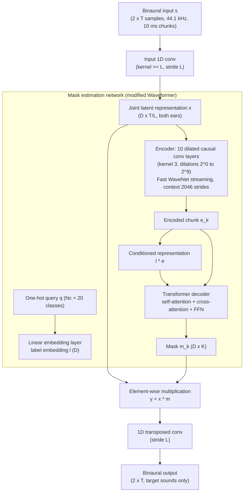

# Veluri, Itani, Chan, Yoshioka & Gollakota 2023: Semantic Hearing: Programming Acoustic Scenes with Binaural Hearables

**Authors**: [[entities/bandhav-veluri|Bandhav Veluri]]*, [[entities/malek-itani|Malek Itani]]* (*co-first), [[entities/justin-chan|Justin Chan]], [[entities/takuya-yoshioka|Takuya Yoshioka]], [[entities/shyamnath-gollakota|Shyamnath Gollakota]]
**Affiliations**: Paul G. Allen School, University of Washington; Microsoft (Yoshioka)
**Venue**: The 36th Annual ACM Symposium on User Interface Software and Technology (UIST '23), October 29 – November 1, 2023, San Francisco, CA, USA
**Type**: Conference paper
**DOI**: [10.1145/3586183.3606779](https://doi.org/10.1145/3586183.3606779)
**Zotero**: [JN3SKC4V](zotero://select/items/0_JN3SKC4V)
**Project page**: <https://semantichearing.cs.washington.edu>

## Summary

This paper introduces **semantic hearing**, a new capability for hearable devices that lets users programmatically attend to or block specific real-world sound classes in real time (e.g., hear bird chirps but block street chatter) while preserving the spatial cues of the kept sounds. The system pairs a noise-canceling headset (blocking everything) with the first neural network for **binaural target sound extraction** — a modified Waveformer that jointly processes both ear channels at 6.56 ms runtime per 10 ms chunk on a smartphone — plus a training methodology (HRTF + reverberant-BRIR data synthesis) that generalizes to unseen users, rooms, and hardware without any real-world training data collection.

## Problem Formulation

Semantic hearing requires programming the output acoustic scene in real time: semantically classify each incoming sound, keep the target classes, suppress everything else, and play the result back — while the target sounds still originate from their correct spatial directions. Three constraints make this hard:

1. **Real-time low-latency operation.** Audio must stay synced with the user's visual senses, requiring end-to-end latency below 20–50 ms (hearing-aid and augmented-audio research). Within that budget, the network must identify and separate target sounds from ≤10 ms audio blocks, process each block in less than its own duration, and run on-device (no cloud round-trip); iOS I/O alone costs ~4 ms.
2. **Binaural processing.** Sounds arrive at the two ears with different delays and attenuations (the head-related transfer function). The output must preserve these [[concepts/interaural-time-difference|interaural time difference (ITD)]] and [[concepts/interaural-level-difference|interaural level difference (ILD)]] cues so targets are perceived from their true directions.
3. **Real-world generalization.** Training purely on synthetic data usually fails to capture real-world reverberation, multipath, and per-user HRTFs; the network must generalize to unseen environments, users, and the hearable hardware itself.

Formally, the network maps a binaural signal $s \in \mathbb{R}^{2 \times T}$ to a binaural output $\hat{s} \in \mathbb{R}^{2 \times T}$ containing only the target sound classes indicated by a one-hot query vector $q \in \{0,1\}^{N_c}$ ($N_c = 20$ classes), preserving interaural cues of the targets.

## Methodology

### High-level binaural extraction framework

The network operates on time-domain binaural signals. A 1D convolution (kernel size $\geq L$, stride $L$) maps $s$ to a joint latent representation $x \in \mathbb{R}^{D \times (T/L)}$ shared by both ears. A mask generator $\mathcal{M}$ estimates an element-wise mask from the latent representation and the query:

$$m = \mathcal{M}(x, q), \quad m \in \mathbb{R}^{D \times (T/L)}$$

$$y = x \odot m$$

A 1D transposed convolution (stride $L$) maps $y$ back to the binaural output $\hat{s}$. Unlike prior binaural speech frameworks that process the two channels in parallel branches with cross-communication (Han et al. 2020), this **dual-channel design** maps both ears into one common representation and uses a single mask estimator — competitive extraction accuracy at roughly half the runtime.

For streaming inference, audio arrives in chunks of $KL$ samples ($K$ strides of the input convolution per buffer). The model is causal at chunk resolution: the mask for chunk $k$ depends on the current and previous chunks only ($m_k = \mathcal{M}(x_k, q, x_{k-1}, x_{k-2}, \ldots)$), giving a 1–1.5 s receptive field from past audio only.

### Model Structure, Inputs, and Outputs

**Mask estimation network (modified Waveformer) spec**

| Property | Value |
|----------|-------|
| **Structure** | Encoder–decoder. Encoder: stack of 10 dilated causal convolution layers, kernel size 3, dilation factors $\{2^0, \ldots, 2^9\}$ (Wavenet-style), streamed via the Fast Wavenet dynamic-programming algorithm (reuses intermediate results; encoder context $\xi_k$ of 2046 strides). Decoder: standard transformer decoder (Vaswani et al. 2017) — self-attention on the label-conditioned representation $\{l \cdot e_{k-1}, l \cdot e_k\}$, cross-attention with the unconditioned encoded representation $\{e_{k-1}, e_k\}$, feed-forward block with residual connections. Unlike the original Waveformer, encoder and decoder share the same dimensionality $D$, eliminating the projection layers and long residual connection. |
| **Input** | Latent representation $x_k \in \mathbb{R}^{D \times K}$ of the current chunk + encoder context $\xi_k$; one-hot query $q$ for the target class, embedded via a linear layer into $l \in \mathbb{R}^D$. |
| **Output** | Mask $m_k \in \mathbb{R}^{D \times K}$ for the current chunk; decoder context is the previous chunk's encoded representation. |
| **Sizes** | $D = 128$: 0.52 M params, 240 MFLOPS. $D = 256$: 1.74 M params. (Vanilla Waveformer across two mics: 357 MFLOPS.) |
| **Role** | Estimates the latent-space mask that selects the target sound class from the binaural mixture. |

**Full system spec**

| Property | Value |
|----------|-------|
| **Input** | Binaural audio, 44.1 kHz, chunks of $KL = 416$ samples (9.4 ms) with $K = 13$, stride $L = 32$; input-conv lookahead $L = 32$ samples (0.7 ms). Algorithmic latency ≈ 10.1 ms; end-to-end system latency ~20 ms. |
| **Output** | Binaural target-sound audio, one chunk per inference step (< 10 ms), 20 selectable sound classes. |
| **Training data** | 100 k synthesized 6 s binaural mixtures (10 k test / 1 k val) — no recordings from the target hardware. |
| **Role** | On-device real-time programming of the acoustic scene on a noise-canceling headset + smartphone. |

### Training for real-world generalization

Because natural recordings lack ground truth and cannot cover many users/rooms, training data is synthesized from multiple datasets:

- **Sound classes**: 20 target classes (alarm clock, baby cry, birds, car horn, cat, rooster, typing, cricket, dog, door knock, glass breaking, gunshot, hammer, music, ocean, singing, siren, speech, thunderstorm, toilet flush) + 141 "other" interfering classes chosen as AudioSet-ontology nodes disconnected from all target classes.
- **Audio sources**: FSD50K (general-purpose), ESC-50 (environmental), MUSDB18 (music/vocals, split into "Singing" and "Melody"), DISCO noise files; urban backgrounds from TAU Urban Acoustic Scenes 2019. Labels standardized to AudioSet classes; 15 s segments, silence discarded.
- **Binaural synthesis**: mono sources convolved with HRTFs from the CIPIC dataset (non-reverberant, per-user) plus measured (SBSBRIR, RRBRIR) and simulated (CATT RIR) binaural room impulse responses for reverberation/multipath; BRIR datasets split 70-20-10 across rooms and listeners with no leakage. Per sample: random dataset, room, participant, and per-source directions.
- **Mixture recipe** (Scaper, on-the-fly): 2 target classes at 5–15 dB SNR + 1–2 other classes at 0–5 dB SNR over a persistent urban background; ground truth binaural targets obtained from the same impulse responses.

### Training Losses

The loss is the **sample- and scale-sensitive SNR loss**, averaged over the two channels:

$$\mathrm{SNR}(\hat{x}, x) = 10 \log \left( \frac{\|x\|^2}{\|x - \hat{x}\|^2} \right)$$

$$\mathcal{L} = -\left( \frac{1}{2} \mathrm{SNR}(\hat{y}_L, y_L) + \frac{1}{2} \mathrm{SNR}(\hat{y}_R, y_R) \right)$$

The scale-sensitive SNR (rather than SI-SNR) is deliberately chosen so the network cannot shrink one channel's gain relative to the other — preserving ILD cues. A causal Conv-TasNet baseline trained with pure SNR loss collapsed to outputting constant zero (sound datasets contain much silence), and the 90% SNR + 10% SI-SNR remedy from prior work caused one channel's amplitude to collapse in the binaural case, making its ΔILD infinite.

Training runs 80 epochs at initial learning rate 5e-4, halving after epoch 40 when validation SNR stops improving for more than 5 epochs.

## Experimental Setup

| Item | Details |
|------|---------|
| **Hardware prototype** | SonicPresence SP15C wired binaural microphones → iPhone 12 (lightning-to-aux + USB hub) → wired noise-canceling headsets (JBL Live 650BTNC, NUBWO); Sony WH-1000XM4 for the ANC-integration experiment |
| **Runtime benchmark** | iPhone 11, models converted to ONNX, ONNX Runtime for iOS; 10 ms output chunk averaged over 100 runs |
| **In-the-wild study** | 5 wearers (3F/2M) collecting data in offices, living rooms, streets, rooftops, parks, restrooms — free head motion, mobile sources; 8 target classes occurred |
| **Listening study** | 22 participants (6F/16M, mean age 34.6), 330+ minutes, binaural-headset pre-screening; MOS (1–5) and noise-suppression (1–5) scales on original vs 128-dim vs 256-dim outputs |
| **Spatial-cue study** | 5 participants seated on a rotating chair at a 70×36 in protractor marked every 22.5°; loudspeaker at 90°; 5 previously unseen reverberant rooms; perceived-direction comparison clean vs system output |
| **Objective benchmark** | 10 000 reverberant binaural mixture/ground-truth pairs synthesized per the training recipe; metrics: SI-SNRi, ΔITD (cross-correlation, ±1 ms limit), ΔILD |
| **Motion evaluation** | Steam Audio SDK simulation, sources at 30/60/90 °/s angular velocity, anechoic (CIPIC) and reverberant (RRBRIR), 250 ms ITD/ILD chunks |
| **UI study** | 10 participants × 10 scenes; Speech, Text (both via ChatGPT API natural-language → class mapping), and Toggle-switch interfaces; accuracy, input time, preference (1–5) |

## Results

**Objective benchmark (10 k mixtures, 20 classes):**

| Binaural framework | Mask estimator | Params (M) | SI-SNRi (dB) | ΔITD (µs) | ΔILD (dB) | Runtime (ms) |
|---|---|---|---|---|---|---|
| Dual-ch | Ours (D=128) | 0.52 | 7.17 | 87.77 | 0.88 | **6.56** |
| Dual-ch | Ours (D=256) | 1.74 | 7.41 | 85.16 | 0.87 | 12.54 |
| Parallel (Han 2020) | Ours (D=128) | 0.86 | 7.24 | 81.72 | 1.08 | 13.35 |
| Parallel | Conv-TasNet | 2.33 | 4.43 | 670.05 | ∞ (collapse) | 15.58 |
| Single-ch ×2 | Ours (D=256) | 1.68 | 7.43 | 79.70 | 1.32 | 22.19 |
| Single-ch ×2 | Vanilla Waveformer (D=256) | 1.69 | 7.37 | 85.33 | 1.27 | 25.85 |

The dual-channel framework matches parallel/single-channel SI-SNRi at ~50% of their runtime and beats them on ΔILD (shared latent representation maintains inter-channel amplitude relations). The D=128 model is the only one meeting the <10 ms real-time budget on a smartphone.

**Latency scaling**: algorithmic latency can drop to 1.4 ms (chunk 32 samples, SI-SNRi 6.59 dB) with graceful degradation to the 10.1 ms default (7.42 dB) — suggesting ultra-low-latency semantic hearing on ASICs (hearing aids).

**In-the-wild listening study**: overall MOS improves from 2.63 (input) to 3.54 (D=128) and 3.80 (D=256); noise-suppression score from 2.01 to 3.61 and 3.84. Failure classes: "Hammer" (music residue during hammer events), "Computer typing" for D=128 (artifacts near a running generator, 0.84 MOS gap to D=256). When speech is the target, extracting and *subtracting* the interfering class (e.g., door knocks) instead of extracting speech directly avoids harsh attenuation dips and gains +0.91 MOS.

**Spatial cues** (5 unseen rooms): mean perceived-direction error rises only from 18° (clean) to 23.25° (system); interpolated median 5°→9°, 90th percentile 38°→42° — spatial cues largely preserved.

**Motion robustness** (simulated 30–90 °/s): SI-SNRi 7.87–8.00 dB and ΔILD 0.43–0.58 dB; motion is even slightly beneficial as the model leverages favorable L/R level differences along the trajectory.

**ANC integration**: end-to-end experiment on Sony WH-1000XM4 (vacuum cleaner active, door knock as target) shows semantic hearing output coexisting with feedforward ANC; door knocks preserved, vacuum suppressed; residual-noise-aware playback adaptation left to future work.

**UI study**: Speech and Text (ChatGPT API) reach 92% agreement with intent, Toggle 93%; input time 5.5 ± 1.0 s (Speech), 6.3 ± 3.3 s (Toggle), 8.3 ± 3.7 s (Text); preference 4.0 / 2.9 / 2.7 — Speech preferred and scaling best with class count.

## Key Contributions

1. **Semantic hearing concept**: first system that programmatically composes the audible acoustic scene by sound class on hearables — cancel everything with ANC, then reintroduce only user-chosen target sounds in real time.
2. **First binaural target sound extraction network**: a dual-channel, jointly-processed, causal, streaming encoder–decoder (modified Waveformer) that runs in 6.56 ms per 10 ms chunk on a smartphone while preserving ITD/ILD spatial cues.
3. **Training methodology for real-world generalization**: HRTF (CIPIC) + measured/simulated BRIR synthesis over 4 audio datasets and AudioSet-ontology class selection, achieving in-the-wild generalization to unseen users, rooms, and hardware with zero real-world training data.
4. **Real-world validation**: in-the-wild, spatial-cue, motion, ANC-coexistence, and UI studies — MOS and noise-suppression gains, 22.5°/45° median/90th-percentile localization errors, and a practical speech-based selection interface.
5. **Open artifacts**: public binaural models and datasets to seed follow-on research.

## Related Concepts

- [[concepts/semantic-hearing|Semantic Hearing]]
- [[concepts/binaural-target-sound-extraction|Binaural Target Sound Extraction]]
- [[concepts/target-sound-extraction|Target Sound Extraction]]
- [[concepts/waveformer|Waveformer]]
- [[concepts/interaural-time-difference|Interaural Time Difference (ITD)]]
- [[concepts/interaural-level-difference|Interaural Level Difference (ILD)]]
- [[concepts/head-related-transfer-function|Head-Related Transfer Function (HRTF)]]
- [[concepts/hearables|Hearables]]
- [[concepts/active-noise-control|Active Noise Control]]
- [[concepts/audio-latency|Audio Latency]]
- [[concepts/cocktail-party-problem|Cocktail-Party Problem]]
- [[concepts/sound-event-detection|Sound Event Detection]]
- [[concepts/device-specific-hrtf|Device-Specific HRTF]]

## Related Synthesis

- [[synthesis/ai-driven-anc|AI-Driven ANC]]
- [[synthesis/deep-speech-enhancement|Deep Speech Enhancement]]
- [[synthesis/modern-headphone-anc-systems|Modern Headphone ANC Systems]]

## Figures

![[raw/papers/veluri-2023-semantic-hearing/figures/93202928dfc2273e516999015504a253fe68a9c024714cf3ea37e494dd3e4884.jpg|Semantic hearing application scenarios]]
*Figure 1: Semantic hearing applications — attend to speech while blocking a vacuum cleaner, block street chatter and hear birds, block construction but hear car honks, or block traffic but hear an alarm clock.*

![[raw/papers/veluri-2023-semantic-hearing/figures/a8a549ce734fd6bb3556176a3e10c112093fdb15a87af8147cc25916c4a9c29c.jpg|Semantic hearing system architecture, part 1]]
![[raw/papers/veluri-2023-semantic-hearing/figures/ec20ca896cbc7283fabd7c53895fadc65b0d5d3769e38b0806ebe157a30dcb15.jpg|Semantic hearing system architecture, part 2]]
*Figure 2: Semantic hearing architecture — binaural input captured at a wired noise-canceling headset, processed by the sound-extraction network on a phone, and played back in real time with targets kept and interference suppressed.*

![[raw/papers/veluri-2023-semantic-hearing/figures/bc9db782681406f70dc9df8c7f0a00d3a83e9df99ac8515173490ac906270a2c.jpg|Latency components in binaural target sound extraction]]
*Figure 5: System requirements — components contributing to end-to-end latency: microphone buffers, network processing, and playback.*

![[raw/papers/veluri-2023-semantic-hearing/figures/dfd312fe1d1bb484883e8f5b8cea6ab6d72794d1ff78f94c12c11832b65978e5.jpg|Binaural target sound extraction network architecture]]
*Figure 6: Network architecture — (a) high-level binaural extraction framework with latent-space masking driven by the query vector; (b) dilated-causal-convolution encoder; (c) transformer decoder conditioned on the label embedding.*

![[raw/papers/veluri-2023-semantic-hearing/figures/7fd9401cd204ff53271acac8572ed35620c055ad6a3b97b39f38c8ae74233656.jpg|In-the-wild MOS results]]
![[raw/papers/veluri-2023-semantic-hearing/figures/e73eb4b68e4b648ee33e8770158ba19aa6d5432fe9fbdc6de1d991409055a835.jpg|In-the-wild noise suppression results]]
*Figure 8: In-the-wild evaluation — (a) mean opinion score and (b) noise suppression across the sound classes encountered in real-world data collection, for the 128- and 256-dimensional models vs the original recording.*

![[raw/papers/veluri-2023-semantic-hearing/figures/da51d6ad1f47fbf52035c691837a2181d6cab062d3ae63ad13aaa835ac2763c3.jpg|Spatial cue evaluation setup]]
![[raw/papers/veluri-2023-semantic-hearing/figures/b48b0bcb2caff2bafdb09dd7fa6d5cc32a86f42ecc53daf17c911ac42e2ca820.jpg|CDF of direction perception error]]
*Figure 11: Spatial cue evaluation — (left) rotating-chair protractor setup; (right) CDF of the error between ground-truth and user-perceived source directions for clean target sounds vs network binaural output.*
