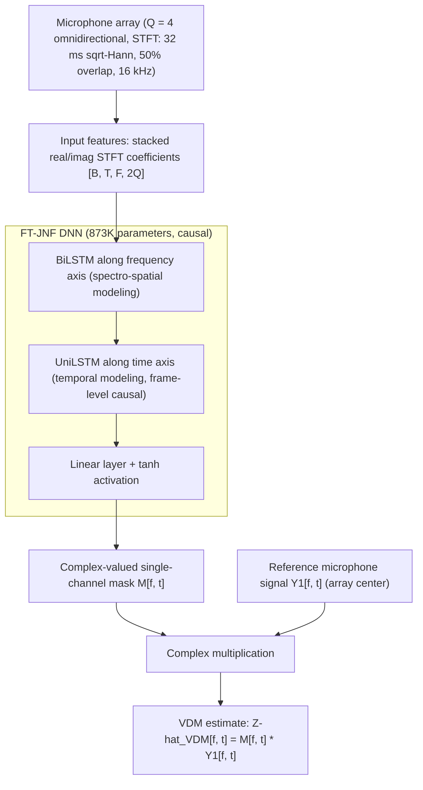

# Wechsler, Chetupalli, Halimeh, Thiergart & Habets 2024: Neural Directional Filtering

**Authors**: [[entities/julian-wechsler|Julian Wechsler]], [[entities/srikanth-raj-chetupalli|Srikanth Raj Chetupalli]], [[entities/mhd-modar-halimeh|Mhd Modar Halimeh]], [[entities/oliver-thiergart|Oliver Thiergart]], [[entities/emanuel-habets|Emanuel A. P. Habets]]
**Institution**: International Audio Laboratories Erlangen, Germany
**Venue**: Proc. International Workshop on Acoustic Signal Enhancement (IWAENC), 2024
**Year**: 2024
**Type**: Conference paper
**DOI**: [10.1109/IWAENC61483.2024.10693965](https://doi.org/10.1109/IWAENC61483.2024.10693965)
**Zotero**: [Zotero Link](zotero://select/items/0_46JP7NVK)

## Summary

This is the founding paper on [[concepts/neural-directional-filtering|neural directional filtering]] (NDF): a DNN-based approach to directional filtering that dispenses with explicit signal models. A small DNN estimates a single-channel complex mask from the signals of a compact microphone array; the mask is applied to a reference microphone to render a signal exhibiting a desired, time-invariant [[concepts/directivity-pattern|directivity pattern]] — a [[concepts/virtual-directional-microphone|virtual directional microphone]] (VDM). The method approximates the desired pattern closely and realizes higher-order patterns (a 3rd-order DMA pattern that would require six microphones as a circular DMA) using only four microphones, surpassing both parametric and fixed beamforming baselines.

## Problem Formulation

A small array of $Q$ omnidirectional microphones captures an anechoic scene with $N$ far-field sources. In the STFT domain, the $q$-th microphone signal is

$$
Y_{q}[f,t] = \sum_{n=1}^{N} X_{q,n}[f,t] + V_{q}[f,t], \quad q \in \{1,2,\dots,Q\},
$$

where $X_{q,n}[f,t] = H_{\mathbf{p}_q,n}[f]\, X_{n}[f,t]$ with $H_{\mathbf{p}_q,n}[f]$ the direct-path transfer function (DPTF) between the $n$-th source and the microphone at position $\mathbf{p}_q$, and $V_q$ spatially uncorrelated sensor noise.

The goal of directional filtering is to capture the sources at a position $\mathbf{p}_{\mathrm{VDM}}$ with a specific directivity pattern $S[\vartheta, f]$, i.e., to estimate the VDM signal

$$
Z_{\mathrm{VDM}}[f,t] = \sum_{n=1}^{N} S[\vartheta_n, f]\, H_{\mathbf{p}_{\mathrm{VDM}},n}[f]\, X_n[f,t].
$$

The formulation is restricted to two-dimensional (azimuth-only) pattern learning. Parametric alternatives estimate a per-bin DOA $\vartheta[f,t]$ and scale the reference microphone by a real-valued gain $G[f,t] = S[\vartheta[f,t]]$, but their effectiveness hinges on the W-disjoint orthogonality assumption and DOA-estimation accuracy — both of which fail in multi-source scenes. This paper instead estimates $Z_{\mathrm{VDM}}[f,t]$ directly with a DNN.

## Methodology

### Model Structure, Inputs, and Outputs

The paper adopts the FT-JNF architecture of [[sources/tesch-2023-insights-deep-nonlinear-filters|Tesch & Gerkmann 2023]] (see [[concepts/joint-nonlinear-filtering|joint nonlinear filtering]]) due to its similarity with the directional filtering task. The real and imaginary parts of the $Q$ microphone STFT coefficients are stacked along the channel dimension and processed by a frequency-axis BiLSTM, then a causal (unidirectional) time-axis LSTM, then a linear layer with tanh activation that produces a complex-valued single-channel mask $\mathcal{M}[f,t]$. The mask is applied to the reference (center) microphone signal:

$$
\widehat{Z}_{\mathrm{VDM}}[f,t] = \mathcal{M}[f,t]\, Y_1[f,t].
$$

| Spec | Value |
|------|-------|
| **Structure** | BiLSTM (frequency axis) → UniLSTM (time axis, causal) → linear layer + tanh; 873K parameters, independent of speaker count (depends only on input channels) |
| **Input** | Real/imaginary STFT coefficients of $Q=4$ microphones stacked along channels, $[B,T,F,2Q]$; 32 ms frames, sqrt-Hann window, 50% overlap, 16 kHz sampling |
| **Output** | Single-channel complex mask $\mathcal{M}[f,t]$ at STFT resolution; applied to reference mic $Y_1$ to yield the VDM estimate |
| **Training data** | Simulated anechoic multi-speaker scenes from LibriSpeech (train-clean-360), 10,000 samples of 4 s, up to $N_{\mathrm{train}}$ concurrent speakers |
| **Role** | Implicitly learns the directivity pattern $S[\vartheta]$; replaces explicit DOA estimation + gain application of parametric filtering |

### Training Losses

The loss is the source-aggregated and regularized thresholded SDR (SA-ε-tSDR, von Neumann et al. 2022) computed between the time-domain estimate $\widehat{z}_{\mathrm{VDM}}$ and target $z_{\mathrm{VDM}}$. It was chosen because the mask can require a high dynamic range (e.g., strong attenuation when all speakers sit near pattern nulls), which makes plain SDR gradients unstable; SA-ε-tSDR is well-defined for both perfect reconstruction and silence. Hyperparameters: threshold 30 dB, $\varepsilon = 1.2 \cdot 10^{-7}$.

### Training Strategy and Simulations

The learned pattern depends on the number and placement of speakers in the training data. The authors hypothesize (and confirm) that the training set must contain **multi-speaker scenes with speaker positions densely sampling the desired pattern**: speaker positions are restricted to a circle of diameter $d_{\mathrm{activity}} = 3$ m, concentric and coplanar with the array. Scenes are simulated by (i) randomly selecting $N$ DOAs (minimum angular separation 10°), (ii) simulating DPTFs with the RIR generator (reflection order zero), and (iii) summing per (1); the VDM target scales each source by the desired direction-dependent gain per (2).

## Experimental Setup

### Target Directivity Patterns

Two patterns investigable as [[concepts/differential-microphone-array|differential microphone arrays]] (DMAs) are studied. An $R$-th order DMA pattern steered to $\vartheta_0$ is

$$
S[\vartheta, f] = \sum_{r=0}^{R} a_r \cos^{r}(\vartheta - \vartheta_0) \quad \forall f,
$$

i.e., frequency-invariant by construction. Both patterns use $\vartheta_0 = 0$.

| Pattern | Coefficients | Classical realization |
|---------|--------------|----------------------|
| 1st-order cardioid | $a_0 = \frac{1}{2},\ a_1 = \frac{1}{2}$ | Circular DMA (CDMA) with 3 microphones |
| 3rd-order DMA | $a_0 = 0,\ a_1 = \frac{1}{6},\ a_2 = \frac{1}{2},\ a_3 = \frac{1}{3}$ | CDMA with 6 microphones |

![[raw/papers/wechsler-2024-neural-directional-filtering/figures/f6636982e11414dd3dd01e00d02a0dfa403766f0d2266de1c587062e0aa1c3a0.jpg|Fig. 1: Logarithmic polar plots of the DMA patterns considered in this study.]]

*Figure 1: Logarithmic polar plots of the DMA patterns considered in this study.*

### Array Geometry and Datasets

| Parameter | Value |
|-----------|-------|
| Array | $Q=4$: 3-microphone UCA (3 cm diameter, spatial aliasing at 11.4 kHz) + center microphone ($q=1$, reference) |
| VDM position | Array center ($\mathbf{p}_1$) |
| Speaker positions | 144 equidistant DOAs on a 3 m circle; position-disjoint splits: training 36 (10° steps), validation 36 (5°, 15°, …), testing 72 (2.5°, 7.5°, …) |
| Speech data | LibriSpeech train-clean-360 / dev-clean / test-clean; 4 s segments (zero-padded), min. angular separation 10° |
| Training scenes | $N_{\mathrm{train}} \in \{1,\dots,6\}$ max concurrent speakers, chosen uniformly at random; 10,000 train / 3,000 val / 3,000 test samples |
| Loudness | Normalized to $[-33, -25]$ LUFS after RIR convolution |
| Sensor noise | Spatio-temporal white Gaussian at 30 dB SNR w.r.t. speaker mixture; VDM target noise-free |
| Training | 6 models per pattern (one per $N_{\mathrm{train}}$ max), 250 epochs, batch size 10, lr 0.001; best epoch by validation loss (negative SDR) |

### Performance Metrics

Since signal-dependent single-channel masking has no conventional directivity pattern, the proxy metric is the **SDR between $Z_{\mathrm{VDM}}$ and $\widehat{Z}_{\mathrm{VDM}}$**. Additionally, the realized pattern is visualized by applying the mask separately to each individual direct-path source signal $X_{1,n}$ and computing the per-direction attenuation as the square root of the power ratio before/after masking, summed over frequency (Eq. 6) — possible only in simulation, since the direct sound is unobservable in practice.

## Results

Baselines: (i) a **parametric baseline** with oracle per-bin DOAs (power-weighted average of active-source DOAs, mimicking a real DOA estimator) and pattern gains applied to the center microphone; (ii) a fixed, signal-independent **least-squares beamformer** (LS BF) optimized per pattern at a minimum white noise gain of −15 dB.

### Cardioid Experiment (SDR [dB])

| Method | $N_{\text{train}}$ | 1 spk | 2 spk | 3 spk | 4 spk | 5 spk | 6 spk | av. |
|--------|-----------|-------|-------|-------|-------|-------|-------|-----|
| Reference microphone | — | −1.8 | −0.3 | −0.2 | 0.0 | 0.1 | 0.0 | −0.4 |
| LS beamformer | — | 6.3 | 10.9 | 12.0 | 12.5 | 12.7 | 12.8 | 11.2 |
| Parametric baseline | — | **27.7** | 18.7 | 15.5 | 14.0 | 12.9 | 12.0 | 16.8 |
| FT-JNF | 1 | 32.2 | 13.5 | 10.0 | 8.8 | 8.1 | 7.6 | 13.4 |
| FT-JNF | 2 | 32.2 | 27.9 | 25.1 | 23.8 | 23.0 | 22.3 | 25.7 |
| FT-JNF | 3 | 30.9 | 27.8 | 26.0 | 25.0 | 24.2 | 23.5 | 26.2 |
| FT-JNF | 4 | 30.3 | 27.8 | 26.1 | 25.1 | 24.3 | 23.6 | 26.2 |
| FT-JNF (best) | 5 | 30.2 | 27.8 | 26.2 | 25.2 | 24.4 | **23.8** | **26.2** |
| FT-JNF | 6 | 29.2 | 27.3 | 25.8 | 25.0 | 24.2 | 23.6 | 25.8 |

### 3rd-Order DMA Experiment (SDR [dB])

| Method | $N_{\text{train}}$ | 1 spk | 2 spk | 3 spk | 4 spk | 5 spk | 6 spk | av. |
|--------|-----------|-------|-------|-------|-------|-------|-------|-----|
| Reference microphone | — | −21.5 | −15.8 | −12.0 | −9.7 | −8.3 | −7.6 | −12.5 |
| LS beamformer | — | −16.4 | −9.0 | −5.0 | −2.7 | −1.4 | −0.7 | −5.9 |
| Parametric baseline | — | **25.6** | 14.1 | 10.9 | 9.5 | 8.5 | 7.8 | 12.7 |
| FT-JNF | 1 | 17.3 | 7.9 | 5.5 | 4.6 | 4.0 | 3.5 | 7.1 |
| FT-JNF | 2 | 21.1 | 20.1 | 16.3 | 14.0 | 12.4 | 11.4 | 15.9 |
| FT-JNF | 3 | 18.3 | 19.2 | 18.9 | 17.8 | 16.5 | 15.2 | 17.7 |
| FT-JNF | 4 | 18.8 | 19.4 | 19.3 | 18.6 | 17.6 | 16.5 | 18.3 |
| FT-JNF (best) | 5 | 18.6 | 19.5 | 19.3 | 18.6 | 17.7 | 16.7 | **18.4** |
| FT-JNF | 6 | 17.4 | 19.2 | 19.3 | 18.8 | 17.9 | 17.0 | 18.2 |

### Analysis

- **Training-set composition is decisive**: models trained on single-speaker data excel with one speaker (32.2 dB cardioid) but collapse with two or more; training on ≥2 speakers generalizes up to six; beyond three speakers brings no significant further gain. Best model: $N_{\mathrm{train}} \le 5$ (mean SDR 26.2 dB cardioid, 18.4 dB 3rd-order).
- **LS beamformer** approximates the cardioid accurately but is limited by white-noise amplification; it cannot approximate the 3rd-order pattern at all with 4 microphones (negative SDRs).
- **Parametric baseline** is strongest with a single speaker (25.6 dB for 3rd-order, beating everything in that column) but degrades sharply with ≥2 speakers, limited by DOA accuracy and the single-plane-wave model.
- **Angular dependence** (Fig. 2): SDR is best when both test sources lie near the look direction $\vartheta_0 = 0°$ (where the omnidirectional reference is already close to the target) and worst near pattern nulls (180° for the cardioid; 90°/120°/180°/240°/270° for the 3rd-order DMA), where the DNN must process the signal strongly and the SDR is additionally ill-conditioned for low-power targets.

![[raw/papers/wechsler-2024-neural-directional-filtering/figures/873b67318fc6341f2170934cad78a7b974916708e0471a78a81765968eaf448c.jpg|Fig. 2a: Cardioid SDR distribution]]

(a) Cardioid target.

![[raw/papers/wechsler-2024-neural-directional-filtering/figures/3501e5549966487f1fa1909fc1811b3545fed786d85316066c898cece3dd89ae.jpg|Fig. 2b: 3rd-order DMA SDR distribution]]

(b) 3rd-order DMA target.

*Figure 2: Distributions of SDR values when testing the best model with two concurrently active sources. DOAs of the two sources are given on the axes; missing combinations are cubic-interpolated.*

- **Realized patterns** (Fig. 3): the DNN estimate follows the cardioid target with minimal deviation up to −7.5 dB attenuation and the 3rd-order target up to −15 dB; deviations grow for higher attenuation, but the spatial null stays within one standard deviation of the mean. The left semi-circle of the 3rd-order estimate is attenuated by around −22.5 dB.

![[raw/papers/wechsler-2024-neural-directional-filtering/figures/832749ba8263a4491ccb5532c6eee98591e4b297583044a1378949ba31a7b633.jpg|Fig. 3a: Estimate of the cardioid]]

(a) Estimate of the cardioid.

![[raw/papers/wechsler-2024-neural-directional-filtering/figures/2cea3ac836302a257d23e63a75bef3159c114f877d8540d479034a9e642e9491.jpg|Fig. 3b: Estimate of the 3rd-order DMA]]

(b) Estimate of the 3rd-order DMA.

*Figure 3: Polar plot of the two VDM targets and their corresponding DNN estimate (best model, two concurrent sources). The gray area illustrates the standard deviation.*

## Key Contributions

1. **Formalization of neural directional filtering**: casts far-field directivity control as learning a VDM signal via a DNN-estimated single-channel complex mask applied to a reference microphone — removing explicit signal models, DOA estimation, and W-disjoint orthogonality assumptions.
2. **Training-dataset composition insights**: shows experimentally that the training data must contain multi-speaker scenes with speaker positions densely sampling the desired pattern; single-speaker training fails to generalize, and ≥3 speakers saturates the benefit.
3. **Higher-order patterns with fewer microphones**: demonstrates a 3rd-order DMA pattern (classically requiring a 6-microphone CDMA) realized with only 4 microphones, outperforming LS beamforming and parametric filtering in the mean (18.4 dB vs. −5.9 / 12.7 dB SDR).

## Related Concepts

- [[concepts/neural-directional-filtering|Neural Directional Filtering]]
- [[concepts/virtual-directional-microphone|Virtual Directional Microphone]]
- [[concepts/joint-nonlinear-filtering|Joint Nonlinear Filtering]] (FT-JNF backbone)
- [[concepts/directivity-pattern|Directivity Pattern]]
- [[concepts/differential-microphone-array|Differential Microphone Array]]
- [[concepts/fixed-beamformer|Fixed Beamformer]] (LS baseline)

## Related Synthesis

- [[synthesis/multi-channel-speech-enhancement|Multi-Channel Speech Enhancement]]

## Related Sources

- [[sources/tesch-2023-insights-deep-nonlinear-filters|Tesch & Gerkmann 2023]] — origin of the FT-JNF architecture adopted here
- [[sources/huang-2026-ndf-joint-neural-directional-filtering|Huang et al. 2026: NDF+]] — extends this NDF approach with dual masks for joint coherent/diffuse estimation
- [[sources/zaidel-2026-linearly-constrained-deep-beamformer|Zaidel et al. 2026]] — alternative neural approach to directivity control via linearly constrained deep beamforming
