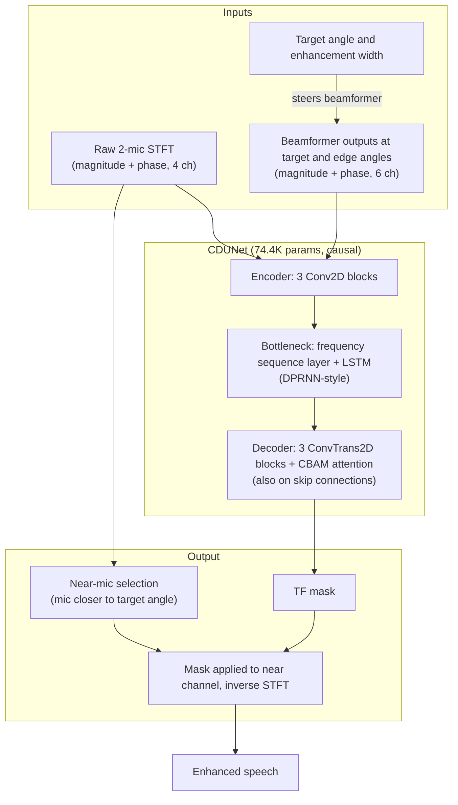

# Wen, Zhou, Xi, Li, Gong & Yu 2025: Neural Directed Speech Enhancement with Dual Microphone Array in High Noise Scenario

**Authors**: [[entities/wen-wen|Wen Wen]], [[entities/qiang-zhou|Qiang Zhou]], [[entities/yu-xi|Yu Xi]], [[entities/haoyu-li|Haoyu Li]], [[entities/ziqi-gong|Ziqi Gong]], [[entities/kai-yu|Kai Yu]]
**Affiliations**: MoE Key Lab of Artificial Intelligence, AI Institute, X-LANCE Lab, Shanghai Jiao Tong University; AISpeech Ltd, Suzhou
**Venue**: ICASSP 2025
**Year**: 2025
**Type**: Conference paper
**DOI**: [10.1109/ICASSP49660.2025.10889345](https://doi.org/10.1109/ICASSP49660.2025.10889345)
**Zotero**: [75V6G22B](zotero://select/items/0_75V6G22B)
**arXiv**: [2412.18141](https://arxiv.org/abs/2412.18141)

## Summary

This paper proposes **CDUNet** (causal-directed U-Net), a 74.4K-parameter dual-microphone speech enhancement model that integrates classical beamforming with a U-Net through a novel **triple-steering spatial selection method**: three steering vectors — one at the target direction and two at the edges of an input **enhancement width** $\varphi_{width}$ — let the model steer toward the target and dynamically size the enhancement region according to the target–interference angular separation. CDUNet is the first directed enhancement model to take the enhancement width as an explicit input parameter, operates causally in real time, and outperforms both classical beamformers and neural baselines in speech quality and downstream ASR accuracy under SNRs as low as 0 dB.

## Problem Formulation

The paper targets the [[concepts/cocktail-party-problem|cocktail-party problem]] with a dual-microphone array: extract the target speaker's speech from interfering speech arriving from a different direction. The signal captured by the $i$-th microphone is

$$y_i(t) = s(t;\mu_1) + i(t;\mu_2) + n(t),$$

where $s(t)$ is the target speech at azimuth $\mu_1$, $i(t)$ the interfering speech at azimuth $\mu_2$, and $n(t)$ background noise. A DNN $f_\theta$ estimates the enhanced signal:

$$\hat{s} = f(y_{1\sim 2}, \mu_1; \theta).$$

The authors identify three limitations of prior multi-channel SE: (1) methods such as GSENet, BASNet, and DSENet predefine the target region instead of taking spatial information at inference; (2) most neural approaches (Multi-pass extraction, JNF, JNF-SSF) assume three or more microphones, impractical for resource-constrained on-device systems; (3) prior work optimizes speech-quality metrics while ignoring downstream tasks.

## Methodology

### Triple-Steering Spatial Selection

The core idea of the [[concepts/triple-steering-spatial-selection|triple-steering spatial selection method]] is to generate **three steering vectors** for the beamformer:

1. one at the target angle $\varphi_{target}$;
2. two at the **edge angles** $\varphi_{target} \pm \varphi_{width}$, where $\varphi_{width}$ is an input parameter specifying the desired enhancement width.

The network receives the frequency-domain representations of both raw microphone signals plus the three beamformer outputs. Comparing the edge-angle beamformer outputs with the target output lets the model discern the spatial distribution of interferers and adjust the enhancement range: when $\varphi_{width}$ is smaller than the target–interference separation, the width acts as a discriminative boundary separating target from interference.

### Model Structure, Inputs, and Outputs

The [[concepts/cdunet|CDUNet]] is a convolutional U-Net that integrates beamforming outputs into a causal encoder–decoder with skip connections.

| Component | Specification |
|:----------|:--------------|
| **Structure** | Encoder: 3 Conv2D blocks → bottleneck: frequency sequence layer + LSTM layer following the [[concepts/dprnn|DPRNN]] framework → decoder: 3 ConvTrans2D blocks; [[concepts/attention-mechanism|CBAM]] (channel + spatial attention) applied in decoder and skip connections to recalibrate TF feature maps; causal (unidirectional in time) |
| **Input** | 10-channel frequency-domain input: magnitude and phase of the 2 raw microphone signals plus magnitude and phase of the 3 beamformer outputs (target angle, two edge angles); STFT window 512, hop 256 |
| **Output** | TF mask applied to the **near microphone channel** (the mic closer to the target direction: channel 1 if $\varphi_{target} < 90^\circ$, else channel 2), then inverse STFT |
| **Training data** | 250,000 simulated mixtures per dataset from LibriSpeech + internal corpora (see Experimental Setup) |
| **Role** | Non-linear spatial filter flexibly steered to the target direction with a tunable enhancement region |
| **Parameters** | **74.4K** (vs. ~1M for JNF) |

### Training Losses

The total loss combines multi-resolution STFT and SI-SNR terms:

$$\mathcal{L}(\mathbf{s}, \hat{\mathbf{s}}) = \alpha_1 \sum_{i \in I} \mathcal{L}^{(i)}_{\text{MR-STFT}} + \alpha_2 \mathcal{L}_{\text{SI-SNR}}(\mathbf{s}, \hat{\mathbf{s}}),$$

where $I$ is the set of STFT resolutions. SI-SNR alone stabilizes learning but causes excessive suppression of low-frequency components; adding the MR-STFT loss mitigates this bias (coefficient values $\alpha_1$, $\alpha_2$ are not stated).

## Experimental Setup

| Item | Configuration |
|:-----|:--------------|
| Corpora | LibriSpeech + internal corpora (target and interference utterances) |
| Rooms | Width 2.5–5 m, length 3–9 m, height 2.2–3.5 m, T60 0.2–0.5 s (aligned with the JNF benchmark) |
| Array | Dual microphones, 30 mm spacing |
| Training | 250,000 samples per dataset; SNR −5 to 10 dB; ground truth = early-reverberated target (150 ms reverb delay) |
| Fixed-target dataset | Target direction 85°–95° (for baselines without angle input) |
| Variable-target dataset | Random target direction; interference fixed 15° from target |
| Fixed-target eval | $\varphi_{target} = 90^\circ$, interference $0^\circ$–$180^\circ$ in 15° steps; 500 utterances each at 0 dB and 5 dB |
| Variable-target eval | 500 utterances at 0 dB, target $0^\circ$–$90^\circ$ (symmetric for a 2-mic array) |
| Metrics | [[concepts/pesq|PESQ]] for quality; WER with a pre-trained NeMo ASR for downstream performance |
| Baselines | DAS, [[concepts/gsc-beamformer|GSC]], JNF (3-mic circular array); U-Net, IPD U-Net, BF U-Net (beamformer output without width input) |

## Results

**Fixed target, varied interference (Table I, avg. PESQ)**:

| Model | 0 dB | 5 dB |
|:------|:-----|:-----|
| Noisy speech | 2.08 | 2.38 |
| DAS | 2.09 | 2.39 |
| GSC | 2.12 | 2.42 |
| JNF | 2.09 | 2.40 |
| U-Net | 2.43 | 2.75 |
| IPD U-Net | 2.33 | 2.64 |
| BF U-Net | 2.38 | 2.69 |
| **CDUNet (fixed)** | **2.50** | **2.82** |
| CDUNet (varied) | 2.41 | 2.73 |

- U-Net-based models clearly outperform beamformers; adding IPD *degrades* performance, while beamformer output has only a modest effect.
- CDUNet (fixed) gains +0.07 PESQ over the plain U-Net at both SNRs with the width input as the only difference.
- Notably, CDUNet trained on the **variable**-target dataset still reaches fixed-U-Net-level performance (2.41 vs. 2.43 at 0 dB) — one model learns all 180 directional filters with ~1400 training examples per direction (vs. ~250,000 for a fixed-direction U-Net), and with 74.4K parameters versus JNF's ~1M.
- All models drop sharply when the interferer coincides with the target (90° column: ~2.1–2.45 vs. 2.4–2.9 elsewhere), an inherent limit of spatial-only separation.

**Width ablation (Table II, 0 dB, avg. PESQ over interference $0^\circ$–$75^\circ$)**: optimal at $\varphi_{width} = 7^\circ$ (2.54). Below 15° the width acts as a valid discriminative boundary (the dataset's minimal target–interference separation is 15°); at 3° the edge beams carry little new information (2.49), and beyond 15° the boundary no longer separates target from interference (2.45 at 20°, 2.38 at 60°). In practice the width can be tuned to the expected interference layout.

**Variable target (Table III, 0 dB, avg. PESQ over target $0^\circ$–$90^\circ$)**:

| Model | Avg. PESQ |
|:------|:----------|
| Noisy | 2.08 |
| DAS | 2.11 |
| GSC | 2.05 |
| JNF | 2.09 |
| U-Net | 1.56 |
| IPD U-Net | 1.53 |
| BF U-Net | 2.06 |
| **CDUNet** | **2.52** |

Models trained for a fixed target area collapse when the target moves (U-Net falls to 1.56), requiring per-direction retraining; CDUNet stays consistent (2.47–2.60 across directions) because the steering inputs relocate the enhancement region at inference.

**Downstream ASR (Table IV, WER % with a NeMo model, fixed target)**:

| SNR | Clean ref. | Noisy | DAS | GSC | JNF | IPD U-Net | U-Net | CDUNet |
|:----|:-----------|:------|:----|:----|:----|:----------|:------|:-------|
| 0 dB | 2.20 | 6.65 | 6.39 | 5.36 | 6.97 | 5.07 | 4.70 | **4.35** |
| 5 dB | 2.20 | 3.93 | 3.84 | 3.46 | 4.14 | 3.46 | 3.37 | **3.11** |

CDUNet gives the lowest WER at both SNRs, confirming that the quality gains transfer to downstream recognition.

## Key Contributions

1. **Triple-steering spatial selection**: a method that integrates three steering vectors (target + two width-derived edge angles) with a U-Net to determine both the target direction and the enhancement scope.
2. **Width as an input parameter** — the first directed enhancement model to accept the enhancement width at inference, letting one model flexibly adapt its enhancement region to the application context instead of retraining per region.
3. **Extreme compactness with dual microphones**: CDUNet (74.4K params, causal) beats classical beamformers and larger neural baselines on front-end PESQ in both fixed and variable target directions, and on downstream ASR WER — targeting low-latency on-device streaming.

## Limitations and Caveats

- Evaluation is on simulated dual-microphone data (LibriSpeech + internal corpora); no real-recorded validation is reported.
- When target and interferer are co-located (90°), all methods including CDUNet fall back toward noisy-speech PESQ — spatial-only separation cannot resolve overlapping directions.
- Loss coefficients $\alpha_1$, $\alpha_2$ and exact optimizer settings are not stated.

![[raw/papers/wen-2025-neural-directed-speech-enhancement/figures/fig1.png|CDUNet architecture]]

*Figure 1: Illustration of the CDUNet architecture. The beamformer output incorporates both the target direction and the width input, capturing the spatial-area information crucial for enhancement. $\varphi_{width}$ denotes the extent of the target region to be enhanced, and $\varphi_{target}$ specifies the orientation of the target speaker. The "Near Mic. Selection" operation selects the microphone signal closer to the target speaker.*

## Related Concepts

- [[concepts/cdunet|CDUNet]]
- [[concepts/triple-steering-spatial-selection|Triple-Steering Spatial Selection]]
- [[concepts/multi-channel-speech-enhancement|Multi-Channel Speech Enhancement]]
- [[concepts/beamforming|Beamforming]]
- [[concepts/neural-beamforming|Neural Beamforming]]
- [[concepts/spatially-selective-nonlinear-filter|Spatially Selective Non-Linear Filter]]
- [[concepts/joint-nonlinear-filtering|Joint Nonlinear Filtering]]
- [[concepts/target-speaker-extraction|Target Speaker Extraction]]
- [[concepts/u-net-post-filter|U-Net Post Filter]]
- [[concepts/gsc-beamformer|GSC Beamformer]]
- [[concepts/dprnn|DPRNN]]
- [[concepts/cocktail-party-problem|Cocktail-Party Problem]]
- [[concepts/pesq|PESQ]]
- [[concepts/causality|Causality]]

## Related Synthesis

- [[synthesis/multi-channel-speech-enhancement|Multi-Channel Speech Enhancement Synthesis]]
- [[synthesis/deep-speech-enhancement|Deep Speech Enhancement Synthesis]]
