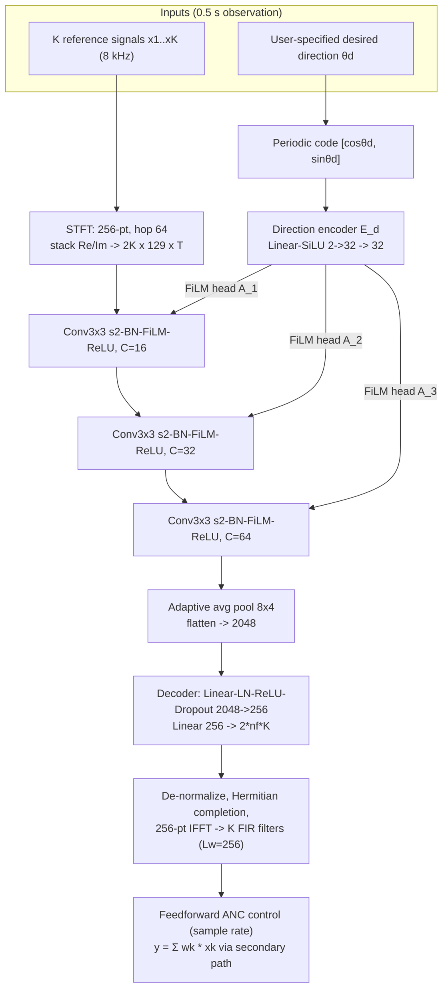

# Yang, Luo, Wang, Zhang & Gan 2026: Direction-Preserving Active Noise Control with a Conditional Control-Filter Estimation Network

**Authors**: [[entities/ziyi-yang|Ziyi Yang]], [[entities/zhengding-luo|Zhengding Luo]] (corresponding), [[entities/boxiang-wang|Boxiang Wang]], [[entities/libin-zhang|Libin Zhang]], [[entities/woon-seng-gan|Woon-Seng Gan]]
**Affiliation**: Smart Nation TRANS Lab, School of EEE, Nanyang Technological University, Singapore
**Venue**: arXiv preprint 2609.07173 (eess.AS), 7 Sep 2026
**Type**: Preprint
**Funding**: MOE Singapore Academic Research Fund Tier 2, MOE-T2EP20224-0010
**Demo/Code**: https://yzyzieee.github.io/DP-ANC-Demo/ , https://github.com/yzyzieee/DP-ANC
**DOI**: arXiv:2609.07173

## Summary

This paper formulates direction-preserving ANC (DP-ANC) as a direction-conditioned cancellation–preservation optimization: a component-separated objective jointly penalizes residual noise energy and the control response induced by the desired-direction component, with a scalar weight $\lambda$ continuously trading cancellation against preservation. A convolutional network conditioned on the desired direction via FiLM estimates the complete multichannel FIR control-filter bank from a 0.5 s mixed-reference observation in a single forward pass, replacing the per-observation matrix solve that analytical spatially selective ANC requires.

## Problem Formulation

A feedforward ANC system with $K$ reference microphones, one secondary source, and one error microphone uses stacked control filters $\mathbf{w} \in \mathbb{R}^{KL_w}$; the residual is $\mathbf{e} = \mathbf{d} + \tilde{\mathbf{X}}\mathbf{w}$, where $\tilde{\mathbf{X}}$ stacks secondary-path-filtered reference vectors. Conventional ANC minimizes $\|\mathbf{d} + \tilde{\mathbf{X}}\mathbf{w}\|_2^2$, cancelling everything — including sound the user wants to hear.

**Directional decomposition**: with one desired source at $\theta_d$ and one noise source at $\theta_n$, linearity splits the residual into

$$\mathbf{e} = \underbrace{(\mathbf{d}_n + \tilde{\mathbf{X}}_n \mathbf{w})}_{\text{residual noise}} + \underbrace{(\mathbf{d}_d + \tilde{\mathbf{X}}_d \mathbf{w})}_{\text{desired after control}},$$

so noise cancellation requires $\mathbf{d}_n + \tilde{\mathbf{X}}_n\mathbf{w} \approx 0$ while preservation requires $\tilde{\mathbf{X}}_d\mathbf{w} \approx 0$ — the same filter bank must cancel the noise while staying nearly silent toward the desired component.

**Component-separated objective**: after per-component energy normalization ($\bar{\mathbf{d}}_n = \mathbf{d}_n/\sqrt{\alpha_n}$, etc.), the DP-ANC training objective is

$$\mathcal{L}_{\mathrm{DP}}(\mathbf{w}) = \underbrace{\|\bar{\mathbf{d}}_n + \bar{\mathbf{X}}_n\mathbf{w}\|_2^2}_{\mathcal{L}_{\mathrm{NR}}} + \lambda \underbrace{\|\bar{\mathbf{X}}_d\mathbf{w}\|_2^2}_{\mathcal{L}_{\mathrm{PR}}}, \qquad \lambda \ge 0 .$$

Unlike analytical [[concepts/spatially-selective-anc|SSANC]], the preservation term penalizes the **desired-induced control response itself** rather than deviation from a prescribed desired-direction response — no target response, delay, or relative-impulse-response model is imposed. A regularized closed-form counterpart ($+\mu\|\mathbf{w}\|^2$) shows the preservation term acts as a direction-dependent quadratic regularizer: $\mathbf{w}^\star_\lambda = -(\bar{\mathbf{X}}_n^T\bar{\mathbf{X}}_n + \lambda\bar{\mathbf{X}}_d^T\bar{\mathbf{X}}_d + \mu\mathbf{I})^{-1}\bar{\mathbf{X}}_n^T\bar{\mathbf{d}}_n$. Direct evaluation needs separated components and a fresh normal-equation solve per observation — precisely what the learned estimator avoids.

## Methodology

### Model Structure, Inputs, and Outputs

The estimation network $\hat{\mathbf{W}} = \mathcal{F}_\Theta(\mathbf{X}, \theta_d) \in \mathbb{R}^{K \times L_w}$ maps a mixed-reference observation and the desired direction to the complete FIR control-filter bank. At runtime the estimated filters feed a **conventional feedforward ANC path**: $y(n) = \sum_k \hat{\mathbf{w}}_k^T \mathbf{x}_k(n)$. Neither separated components nor the noise direction are needed at deployment.

**Estimation network spec** (main configuration, 956,540 parameters total):

| Stage | Structure | Input | Output | Role |
|:------|:----------|:------|:-------|:-----|
| STFT front-end | 256-point transform, hop 64 | $K$ time-domain reference channels, 0.5 s | $\mathbf{X}_{\mathrm{in}} \in \mathbb{R}^{2K \times 129 \times T}$ (Re/Im stacked) | Preserve inter-microphone phase for directional discrimination |
| Direction encoder $E_d$ | Linear–SiLU 2→32; Linear–SiLU 32→32 (≈3.3k + 1.1k params) | Periodic code $\mathbf{c}(\theta_d) = [\cos\theta_d, \sin\theta_d]^T$ | $\mathbf{z}_\theta \in \mathbb{R}^{32}$ | Embed the desired direction |
| Acoustic encoder | 3 × (Conv 3×3 stride 2 → BN → FiLM → ReLU), $C_\ell$ = 16/32/64 (2.8k/6.8k/22.8k params incl. FiLM heads) | $\mathbf{X}_{\mathrm{in}}$ | pooled 64×8×4 → flatten $\mathbf{z}_x \in \mathbb{R}^{2048}$ | Extract spatial-spectral structure of the mixture |
| FiLM heads $A_\ell$ | per-block linear maps $\mathbf{z}_\theta \mapsto (\gamma_\ell, \beta_\ell) \in \mathbb{R}^{C_\ell} \times \mathbb{R}^{C_\ell}$, zero-initialized | $\mathbf{z}_\theta$ | channel-wise scale/bias, broadcast over freq–time | Condition each conv block on the desired direction: $h_\ell = \mathrm{ReLU}[(1+\gamma_\ell)\odot u_\ell + \beta_\ell]$ |
| Decoder $D_w$ | Linear–LN–ReLU–Dropout($p$=0.15) 2048→256 (525k); Linear 256→$2 n_f K$ (398k) | $\mathbf{z}_x$ | normalized Re/Im coefficients of $K$ one-sided spectra | Produce all filter coefficients |
| Reconstruction | de-normalization, Hermitian completion, 256-pt IFFT | $2 n_f K$ coefficients | $\hat{\mathbf{w}}_k \in \mathbb{R}^{256}$, $k=1..K$ | Time-domain FIR bank, no truncation |

Frequency-domain estimation is only a **compact filter parameterization**; runtime control is time-domain feedforward convolution. The adaptive pooling lets the same model accept different observation durations. DOA estimation is not part of the network — the desired direction is an external input.

### Training Losses

Total objective: $\mathcal{L}_{\mathrm{DP}} = \mathcal{L}_{\mathrm{NR}} + \lambda\,\mathcal{L}_{\mathrm{PR}}$ (equations above; $\mu = 0$ for direct training), where the estimated filters are evaluated through a **differentiable secondary-path-aware forward model**: the vectorized $\hat{\mathbf{w}}$ is applied to $\tilde{\mathbf{X}}_n$ and $\tilde{\mathbf{X}}_d$ built from *independent* signal realizations, and gradients propagate through the control filters and secondary path back into the network.

**Independent-signal protocol**: each training sample uses realization A (mixed observation) for filter estimation and realization B (same directions/paths, independent waveforms) for loss evaluation — forcing the estimated filters to generalize beyond the estimation waveforms. This protocol is used in training, validation, and evaluation.

Separate network instances are trained for $\lambda \in \{0, 0.03, 0.1, 0.3, 1\}$; the representative operating point $\lambda = 0.1$ is chosen by min–max-normalized Euclidean distance to the ideal $(\mathrm{NR}, -D_{\mathrm{des}})$ point.

## Experimental Setup

| Item | Setting |
|:-----|:--------|
| Array geometry (main) | $K = 6$ uniform circle, $r = 0.20$ m, error mic at center; secondary source at 210°, 0.06 m |
| Acoustic model | Horizontal plane waves, fractional-delay FIR propagation; anechoic |
| Sampling / band | 8 kHz, 20–2500 Hz |
| Filters | $L_w = 256$ taps/channel; secondary path 16-tap, known and fixed |
| Observation | 0.5 s mixed-reference block per filter estimate |
| Sensor noise | Independent per channel, 30 dB sensor SNR |
| Training scenes | 1 desired + 1 noise source; azimuths ~ $\mathcal{U}[0°, 360°)$; pre-control SNR ~ $\mathcal{U}[-15, 5]$ dB |
| Source content | Desired: band-limited Gaussian; Noise: Gaussian or UrbanSound8K (disjoint splits) |
| Optimization | AdamW, lr $2\times10^{-4}$ cosine decay, weight decay $5\times10^{-4}$, batch 128, grad clip 0.5, validation 1024 scenes |
| Evaluation | 3300 cases, 11 content groups (FSD50K noise categories, LibriSpeech speech desired); −10 dB pre-control SNR; $\Delta\theta \ge 15°$; metrics on independent 0.5 s realizations |
| Baselines | ANC off; conventional Wiener; beamformer hear-through (384-tap LS beamformer, 4.0 ms target delay); analytical SSANC ([14],[20] = Xiao et al., $r_\beta = 10^4$, $r_f$ swept 2–50 000) |
| Measured validation | Hearpiece database (KEMAR, 48 azimuths), 4 reference mics (concha + entrance, right ear), eardrum error position, minimum-phase secondary path; training SNR $\mathcal{U}[-10,10]$ dB, $\lambda = 0.1$ |

Metrics: noise reduction $\mathrm{NR} = 10\log_{10}(\sum d_n^2 / \sum e_n^2)$; desired-signal distortion $D_{\mathrm{des}} = 10\log_{10}(\sum (e_d - d_d)^2 / \sum d_d^2)$ (energy of the desired-induced control response, not a perceptual score); output SNR.

## Results

**Main evaluation (3300 cases, −10 dB pre-control SNR):**

| Method | NR (dB) ↑ | $D_{\mathrm{des}}$ (dB) ↓ | SNR$_{\mathrm{out}}$ (dB) ↑ |
|:-------|:---------|:-----------|:------------|
| ANC off | 0.00 | – | −10.00 |
| Conventional Wiener | 24.86 ± 2.43 | −0.32 ± 0.65 | −6.91 ± 5.51 |
| Beamformer hear-through | 15.19 ± 4.04 | +1.35 ± 1.10 | 1.13 ± 4.22 (≈4.1 ms delay) |
| Analytical SSANC ($r_\beta = r_f = 10^4$) | 18.28 ± 3.64 | −19.14 ± 4.12 | 7.94 ± 3.55 |
| **DP-ANC ($\lambda = 0.1$)** | **22.82 ± 2.68** | **−11.41 ± 3.67** | **12.52 ± 3.36** |

Key findings:

1. **Frontier dominance**: across five $\lambda$ settings, DP-ANC achieves 0.68–3.06 dB higher mean NR than analytical SSANC at matched mean $D_{\mathrm{des}}$; it also attains the highest output SNR of all methods.
2. **$\lambda$ sweeps the trade-off**: mean NR falls 25.1 → 18.8 dB while $D_{\mathrm{des}}$ improves −2.2 → −20.1 dB as $\lambda$ goes 0 → 1.
3. **Angular resolution is array-bound**: performance vs. $\Delta\theta \in [0°, 90°]$ follows the circular-array manifold coherence $\eta(f, \Delta\theta) \approx |J_0(2\kappa r \sin(\Delta\theta/2))|$; both learned and analytical designs degrade as directions merge. For $r = 0.2$ m the half-power criterion gives ≈36°/18°/12°/9° at 0.5/1/1.5/2 kHz.
4. **Direction steering**: fixing the observation and sweeping only the *specified* desired direction continuously redistributes cancellation/preservation between two physical sources (aligned source ≈ −10 dB $D_{\mathrm{des}}$, other attenuated >24 dB).
5. **Measured paths**: the separately trained 4-mic Hearpiece (KEMAR) model achieves 16.6 dB broadband NR with −7.7 dB $D_{\mathrm{des}}$ across 48 noise azimuths.
6. **Cost**: one filter bank costs 0.00946 GMACs for DP-ANC vs. ≈29.4 GMACs for the analytical SSANC solve (≈3000× cheaper), excluding the common sample-rate FIR filtering.

## Key Contributions

1. **DP-ANC formulation**: recasts direction-preserving ANC as a direction-conditioned cancellation–preservation optimization with a scalar trade-off weight, penalizing the desired-induced control response instead of imposing a prescribed desired-direction response (no target response, delay, or ReIR model).
2. **Conditional control-filter estimation network**: a FiLM-conditioned convolutional network that maps a short mixed observation plus the desired direction directly to the complete multichannel FIR control-filter bank in one forward pass, while retaining the conventional feedforward ANC signal path — no per-observation matrix solve, predesigned filter bank, or desired-signal reconstruction.
3. **Cancellation–preservation region characterization**: shows the achievable frontier is shaped by the reference array's spatial separability, with consistent trends for learned and analytical filter designs in simulated and measured configurations.

## Limitations and Caveats

- Static single-desired + single-noise scenes only; multi-source and time-varying extensions are future work.
- Main configuration is anechoic (measured primary paths only in the Hearpiece validation); reverberation, moving sources, secondary-path mismatch, and closed-loop hardware remain untested.
- 0.5 s block operation; no streaming updates. Trained per microphone geometry (no cross-device adaptation yet).
- $D_{\mathrm{des}}$ measures control-response energy, not perceptual fidelity; it must be read jointly with SNR$_{\mathrm{out}}$.

## Related Concepts

- [[concepts/direction-preserving-anc|Direction-Preserving ANC (DP-ANC)]]
- [[concepts/spatially-selective-anc|Spatially Selective ANC (SSANC)]]
- [[concepts/active-noise-control|Active Noise Control]]
- [[concepts/feedforward-anc|Feedforward ANC]]
- [[concepts/generative-fixed-filter-anc|Generative Fixed-Filter ANC (GFANC)]]
- [[concepts/selective-fixed-filter-anc|Selective Fixed-Filter ANC]]
- [[concepts/film-layer|FiLM Layer]]
- [[concepts/end-to-end-differentiable-anc|End-to-End Differentiable ANC]]
- [[concepts/secondary-path-modeling|Secondary Path Modeling]]

## Related Synthesis

*(none yet — no synthesis page covers direction-conditioned ANC)*
