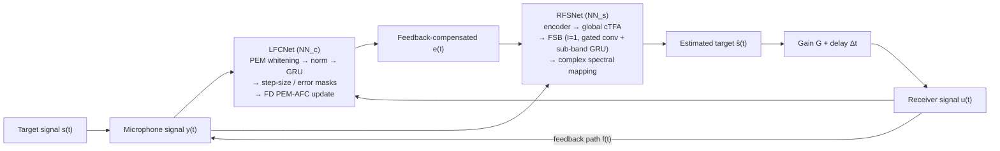

# Zhan, Moore, Li & Zheng 2026: JointDFC — Joint Deep Feedback Control for Hearing Aids

**Authors**: [[entities/xiaofan-zhan|Xiaofan Zhan]], [[entities/brian-c-j-moore|Brian C. J. Moore]], [[entities/xiaodong-li|Xiaodong Li]], [[entities/chengshi-zheng|Chengshi Zheng]]
**Institutions**: Laboratory of Noise and Audio Research, Institute of Acoustics, Chinese Academy of Sciences; University of Chinese Academy of Sciences; Cambridge Hearing Group, University of Cambridge
**Published**: ICASSP 2026
**Type**: Conference Paper
**DOI**: [10.1109/ICASSP55912.2026.11463154](https://doi.org/10.1109/ICASSP55912.2026.11463154)
**URL**: https://ieeexplore.ieee.org/abstract/document/11463154
**Zotero**: [LIM45NG2](zotero://select/items/0_LIM45NG2)

## Summary

JointDFC is the first deep learning framework to jointly optimize adaptive feedback cancellation and residual feedback suppression for hearing aids. It cascades two stages: a Linear Feedback Cancellation network (LFCNet, a deep PEM-AFC following DeepPEM-AFC) that removes most linear feedback, and a Residual Feedback Suppression network (RFSNet, a full-sub-band recurrent model with global causal time-frequency attention) that suppresses residual feedback and noise via complex spectral mapping. A three-step training strategy (closed-loop pre-training of LFCNet, open-loop training of RFSNet on LFCNet-generated parallel data, joint closed-loop fine-tuning) overcomes closed-loop training difficulties. JointDFC outperforms DeepPEM-AFC and DeepAFS baselines in high-gain and feedback-path-changing scenarios at 0.396M parameters, 0.227 G MACs/s, and 8 ms algorithmic latency.

## Problem Formulation

Acoustic feedback in hearing aids arises from receiver-microphone coupling, creating a closed loop in which the microphone signal contains the target plus a feedback component:

$$y(t) = u(t) * f(t) + s(t) = G \cdot y(t - \Delta t) * f(t) + s(t)$$

where $u(t)$ is the receiver signal, $f(t)$ the feedback path, $G$ a linear gain with delay $\Delta t$. Without control, this limits the [[concepts/maximum-stable-gain|maximum stable gain (MSG)]]. Both traditional and deep AFC can improve MSG by over 10 dB at steady state, but the **convergence/re-convergence process when the acoustic environment changes** severely degrades practical performance.

The paper organizes learning-based feedback control into two complementary paradigms:

- **DeepAFS** — direct suppression: a network maps the desired signal from the feedback-contaminated microphone signal, $\hat{s}(t) = \mathrm{NN}(y(t))$ (DeepMFC / acoustic howling suppression lineage). Effective on nonlinear artifacts and whistling, but computationally heavy and weak at high gain.
- **DeepAFC** — enhance traditional AFC: networks optimize the adaptive update, $\hat{f}(t) = \hat{f}(t-1) + \mathrm{NN}(\cdot)$ (step-size control or direct coefficient prediction). Cheap and accurate at steady state, but struggles during convergence/re-convergence and with rapid path changes.

Their limitations are complementary, motivating a hybrid — analogous to hybrid cancellation+suppression frameworks in acoustic echo cancellation and to traditional feedback control, where cancellation and suppression are routinely combined. JointDFC is the first deep learning instantiation of this joint paradigm.

![[raw/papers/zhan-2026-joint-afc-rfs/figures/2a1622169e0ac7088eee2eac7ffcdcd7fe7eb9b4250d977294b0303da4de431a.jpg|Fig. 1(a): hearing aid system without feedback control]]

![[raw/papers/zhan-2026-joint-afc-rfs/figures/b1b19359a3fa60674727c859001f06eb7b387c3997900127f58c2b07a25ca0cd.jpg|Fig. 1(b): hearing aid system with JointDFC]]

*Figure 1: Flow of a hearing aid system: (a) without any feedback control method, (b) with the proposed JointDFC method.*

## Methodology

JointDFC splits feedback control into two sequential subtasks — linear feedback cancellation (LFC) and residual feedback suppression (RFS):

$$e(t) = u(t) * \big(f(t) - \mathrm{NN}_c(u(t), e^*(t), y(t))\big) + s(t)$$

$$\hat{s}(t) = \mathrm{NN}_s(e(t), y(t))$$

where $\mathrm{NN}_c$ is LFCNet, $\mathrm{NN}_s$ is RFSNet, and $e^*(t)$ is the prior error signal.

### Stage 1: LFCNet (Deep PEM-AFC)

LFCNet is the deep learning-based PEM-AFC of [[sources/zhan-2025-deeppem-afc|Zhan et al. 2025 (DeepPEM-AFC)]], operating in the frequency domain (the paper's Section 3.2 heading "LPCNet" is a typo for LFCNet):

1. **PEM whitening** of the input signals to reduce the closed-loop estimation bias ([[concepts/prediction-error-method|prediction error method]])
2. **Online mean normalization** and dimension reduction to $H_c$
3. **Stacked GRU** (hidden dimension $H_c$) modeling the convergence state of the adaptive filter
4. **Step-size mask matrix** $\mathbf{M}^{\mu}$ and **error-signal mask matrix** $\mathbf{M}^{\mathbf{E}_a}$ derive the optimal step size per time-frequency bin
5. Filter coefficients updated by reapplying the frequency-domain PEM-AFC update equation (Bernardi et al. 2015)

### Stage 2: RFSNet (Full-Sub-Band Suppression)

RFSNet adopts a **full-sub band (FSB) cascaded recursive structure** (Wang et al. 2023) estimating the target via [[concepts/complex-spectral-mapping|complex spectral mapping]] from the compressed real/imaginary components of the feedback-compensated signal $e(t)$ stacked with the microphone signal $y(t)$. To fit hearing-aid compute budgets and integrate with LFCNet, the authors modify the backbone:

- **Global causal time-frequency attention (cTFA)** (from UL-UNAS, Rong et al. 2025) applied to the encoded features along two parallel time/frequency paths — characterizes the spectro-temporal state after the first-stage cancellation so residual feedback is targeted without over-suppressing the desired signal
- **Single FSB layer** ($I=1$) with **GRU** temporal modeling (instead of the 2-layer baseline)
- **Gated convolution unit** in the full-band path and a **point-wise convolution** after the sub-band GRU to compensate for the reduced depth

![[raw/papers/zhan-2026-joint-afc-rfs/figures/4a6e947808adcceb0c3f37093f6d80aef5dadbea5f24c980c57b4ecad01241ec.jpg|Fig. 2: Overall model structure of JointDFC]]

*Figure 2: Overall model structure of the proposed JointDFC, including the residual feedback suppression network (RFSNet) and the linear feedback cancellation network (LFCNet).*

### Three-Step Training Strategy

Direct closed-loop training of joint models is suboptimal (as shown for DeepAFS in prior work). JointDFC uses:

1. **LFCNet pre-training (closed-loop)** with a frozen pre-trained denoising network (structurally identical to RFSNet) processing the post-cancellation signal
2. **Parallel-data generation**: the frozen pre-trained LFCNet runs in the closed loop to generate (residual feedback + noise, clean) signal pairs; RFSNet is trained open-loop on these pairs
3. **Joint closed-loop fine-tuning** of both modules to enhance coordination

This extends the [[concepts/closed-loop-fine-tuning|closed-loop fine-tuning]] pattern from single suppression networks to a two-module cascade.

## Model Structure, Inputs, and Outputs

### LFCNet Specification

| Aspect | Detail |
|:-------|:-------|
| Structure | PEM whitening → online mean normalization → dim reduction to $H_c$ → stacked GRU (hidden $H_c$) → step-size mask $\mathbf{M}^{\mu}$ + error mask $\mathbf{M}^{\mathbf{E}_a}$ → frequency-domain PEM-AFC update (settings identical to DeepPEM-AFC) |
| Inputs | Receiver signal $u(t)$, prior error signal $e^*(t)$, microphone signal $y(t)$ (PEM-whitened, normalized) |
| Output | Per-T-F-bin optimal step sizes → cancellation filter coefficients → feedback-cancelled signal $e(t)$ |
| Frame length | $M_c = 8$ ms |
| Training data | Closed-loop simulation (LibriSpeech + DNS noise + simulated 64-tap feedback paths) |
| Role | Remove the linear, path-modeled feedback component; fast convergence, preserves target signal |

### RFSNet Specification

| Aspect | Detail |
|:-------|:-------|
| Structure | Encoder ($D=16$) → global causal T-F attention (parallel time/frequency paths) → FSB module, $I=1$ layer (full-band gated conv unit, $D_1=4$, $H_1=128$; sub-band GRU, $D_2=32$, $H_2=32$ + point-wise conv) → decoder |
| Inputs | Compressed RI components of $e(t)$ and $y(t)$, stacked |
| Output | Estimated target spectrum via complex spectral mapping → $\hat{s}(t)$ |
| Frame length / shift | $M_s = 20$ ms, common shift $R = 4$ ms (regular analysis window, short synthesis window, modified overlap-add) |
| Training data | Open-loop pairs generated by the frozen pre-trained LFCNet, then joint closed-loop fine-tuning |
| Role | Suppress residual feedback and environmental noise; raise achievable MSG and output quality |

### Latency

$M_c = 8$ ms, $M_s = 20$ ms, $R = 4$ ms → **algorithmic latency 8 ms**. With the feedforward-path delay $\Delta t \in \{0, 1, 2\}$ ms, total latency stays **below 10 ms** — suitable for hearing aids.

## Training Losses

The overall loss combines the LFCNet and RFSNet objectives:

$$\mathcal{L} = \lambda_1 \cdot \frac{1}{L} \sum_l \mathrm{NESD}(l) + \lambda_2 \cdot \log\big((1 - c)\,\mathcal{L}_{\mathrm{mag}} + c\,\mathcal{L}_{\mathrm{comp}}\big)$$

- **NESD term** ([[concepts/normalized-euclidean-system-distance|normalized Euclidean system distance]]) supervises the LFCNet cancellation-filter estimates
- **Composite spectral term** for RFSNet: spectral magnitude MSE + complex-spectrum MSE (following Zheng et al. 2022), log-compressed with coefficient $c = 0.5$
- Weighting factors: $\lambda_1 = 0.2$, $\lambda_2 = 5$

## Experimental Setup

| Parameter | Value |
|-----------|-------|
| Training / validation data | LibriSpeech, 30,000 / 3,000 clean 4-s sequences |
| Noise | DNS Challenge, mixed into 80% of sequences at SNR ∈ {10, 15, 20, 25} dB |
| Feedback paths (train) | 10,000 simulated 64-tap paths (modified formula of DeepPEM-AFC), each scaled to MSG ∼ N(15, 3) dB |
| Path changes (train) | 2 random paths per sequence, abrupt transition at a random time in [1, 3] s |
| Gain (train) | G above MSG, varied between −5 dB and +5 dB |
| Test data | 150 unseen 6-s LibriSpeech clips; real measured feedback paths (Sankowsky-Rothe et al. 2015) |
| Test sets | **Set A**: same ear canal, varying acoustic environments (single-user daily usage); **Set B**: different ear canals in free field (inter-user variability, harder) |
| Path changes (test) | 2 random paths per segment, abrupt transition in [2.5, 3.5] s |
| Gains (test) | 5 / 7 / 9 / 11 dB **excess gain over the MSG without a canceler** |
| Baselines | DeepPEM-AFC (same config as Zhan et al. 2025); DeepAFS (same FSB architecture as RFSNet, I = 2, closed-loop fine-tuned) |
| Optimizer | AdamW, lr 10⁻³, 60 epochs, early stopping (10 epochs), lr halved after 2 epochs without improvement |
| Regularization | Gradient clipping (Euclidean norm): 0.2 (LFCNet) / 0.5 (RFSNet); weight decay 10⁻⁷; batch size 128 |
| Metrics | WB-PESQ, eSTOI, SI-SDR |

![[raw/papers/zhan-2026-joint-afc-rfs/figures/0d933a30b249e0fe72087075b0c9898bd7f8179b6d9a4363f38bdb8583a6b8e6.jpg|Fig. 3(a): amplitude responses, varying environments]]

![[raw/papers/zhan-2026-joint-afc-rfs/figures/15ccfc0fc71443b9ba03230a3cb732b1e74be422aac94e200f7f8255ad39f8f1.jpg|Fig. 3(b): amplitude responses, across users]]

*Figure 3: Amplitude responses of acoustic feedback paths for evaluation. (a) Varying environments; (b) Across users.*

## Results

| Set | Method | Param. (M) | MACs (G/s) | WB-PESQ @5/7/9/11 dB | eSTOI(%) @5/7/9/11 dB | SI-SDR(dB) @5/7/9/11 dB |
|:----|:-------|:----------|:----------|:---------------------|:----------------------|:------------------------|
| A | DeepPEM-AFC | 0.240 | 0.060 | 4.32 / 4.23 / 3.71 / 3.11 | 99.24 / 98.84 / 93.64 / 90.87 | 19.03 / 17.79 / 9.80 / −1.85 |
| A | DeepAFS | 0.302 | 0.319 | 4.28 / 4.18 / 3.90 / 3.53 | 98.45 / 97.90 / 96.11 / 93.86 | 17.62 / 16.22 / 14.13 / 11.39 |
| A | **JointDFC** | 0.396 | 0.227 | **4.30 / 4.26 / 4.21 / 4.12** | 98.87 / 98.68 / **98.40 / 98.01** | 18.71 / 17.95 / **17.16 / 16.14** |
| B | DeepPEM-AFC | 0.240 | 0.060 | 4.15 / 4.04 / 3.85 / 3.54 | 98.62 / 98.36 / 97.50 / 96.00 | 16.01 / 14.78 / 11.53 / 6.71 |
| B | DeepAFS | 0.302 | 0.319 | **4.23** / 4.13 / 3.93 / 3.63 | **98.36** / 97.81 / 96.42 / 93.97 | **17.33** / 15.88 / 13.83 / 10.86 |
| B | **JointDFC** | 0.396 | 0.227 | 4.21 / **4.16 / 4.11 / 4.07** | 98.59 / **98.39 / 98.11 / 97.92** | 16.91 / **15.99 / 15.25 / 14.66** |

Key findings:

- **High-gain robustness**: DeepPEM-AFC collapses when excess gain exceeds 9 dB (Set A SI-SDR −1.85 dB at 11 dB); JointDFC degrades minimally and keeps WB-PESQ above 4.0 even at 11 dB excess gain
- **Path-change generalization**: on the harder inter-user Set B, JointDFC is best overall except a minor deficit vs DeepAFS at 5 dB
- **DeepAFS is inefficient here**: the larger 2-layer FSB DeepAFS (0.319 G MACs/s) yields no significant gains over baselines, while the compact 1-layer RFSNet (0.227 G MACs/s) does
- **Cost**: 0.396M params (slightly above baselines, mostly from LFCNet's fully connected layers) at moderate 0.227 G MACs/s — real-time capable

### Ablations

| Variant | Effect |
|:--------|:-------|
| w/o Global cTFA | Degradation across all metrics (up to −0.12 WB-PESQ) — confirms cTFA's role in targeted residual-feedback suppression |
| w/o joint training (separately trained cascade) | Larger degradation, especially at low gain where LFCNet converges faster (SI-SDR drops ~4–5 dB at 5 dB gain) — confirms joint optimization drives inter-module coordination |

## Key Contributions

1. **JointDFC** — the first deep learning framework jointly optimizing feedback cancellation and residual feedback suppression for hearing aids, unifying the DeepAFS and DeepAFC paradigms
2. **RFSNet** — a compact FSB-based suppression network with global causal time-frequency attention adapted to post-cancellation spectro-temporal states
3. **Three-step training strategy** (closed-loop pre-training → parallel-data generation → joint closed-loop fine-tuning) that makes closed-loop training of a two-module cascade tractable
4. Demonstration that the joint framework dominates in **high-gain and feedback-path-changing scenarios** — precisely where each individual paradigm fails — at 8 ms algorithmic latency

## Related Concepts

- [[concepts/jointdfc|JointDFC]] — the proposed two-stage joint framework
- [[concepts/hearing-aid-feedback-cancellation|Hearing Aid Feedback Cancellation]] — application domain and method landscape
- [[concepts/adaptive-feedback-cancellation|Adaptive Feedback Cancellation (AFC)]] — the cancellation stage's algorithmic root
- [[concepts/prediction-error-method|Prediction Error Method]] — decorrelation inside LFCNet
- [[concepts/maximum-stable-gain|Maximum Stable Gain]] — gains are expressed as excess over the canceler-free MSG
- [[concepts/deep-marginal-feedback-cancellation|Deep Marginal Feedback Cancellation]] — the DeepAFS paradigm member used as comparison lineage
- [[concepts/closed-loop-fine-tuning|Closed-Loop Fine Tuning]] — the training paradigm extended by the three-step strategy
- [[concepts/normalized-euclidean-system-distance|Normalized Euclidean System Distance]] — LFCNet loss component
- [[concepts/complex-spectral-mapping|Complex Spectral Mapping]] — RFSNet estimation principle
- [[concepts/acoustic-howling-suppression|Acoustic Howling Suppression]] — the direct-suppression (DeepAFS) task family

## Related Sources

- [[sources/zhan-2025-deeppem-afc|Zhan, Hao, Li & Zheng 2025: DeepPEM-AFC]] — LFCNet is this method, reused as the first stage; also the source of the simulated path-generation scheme
- [[sources/hao-2025-l3c-deepmfc|Hao et al. 2025: L3C-DeepMFC]] — DeepAFS-family low-latency suppression with closed-loop fine tuning; the paper's closest suppression-stage relative
- [[sources/zhang-2024-enhanced-hybrid-ahs|Zhang, Zhang, Yu & Yu 2024: Enhanced Acoustic Howling Suppression]] — hybrid Kalman + deep learning suppression (DeepAFS lineage with recursive training)
- [[sources/vanwaterschoot-2011-fifty-years-afc|van Waterschoot & Moonen 2011]] — taxonomy in which cancellation + suppression hybrids were anticipated to outperform decoupled designs
- [[sources/lydaki-2026-deep-feedback-cancellation-hearing-aids|Lydaki et al. 2026: Deep Feedback Cancellation]] — DeepAFC paradigm member (direct coefficient prediction)
