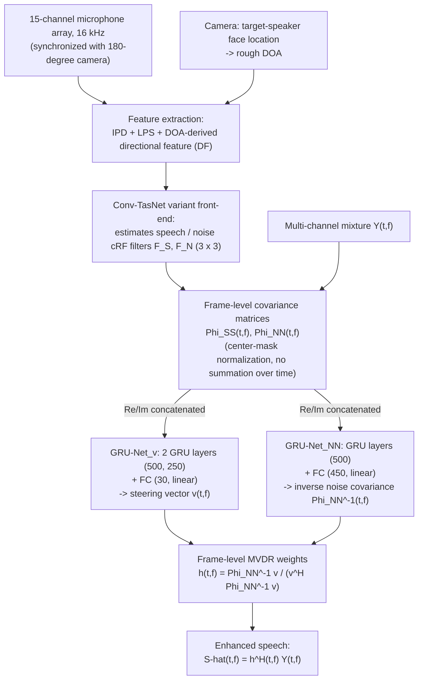

# Zhang, Xu, Yu, Zhang, Chen & Yu 2021: ADL-MVDR — All Deep Learning MVDR Beamformer for Target Speech Separation

**Authors**: [[entities/zhuohuang-zhang|Zhuohuang Zhang]], [[entities/yong-xu|Yong Xu]], [[entities/meng-yu|Meng Yu]], [[entities/shi-xiong-zhang|Shi-Xiong Zhang]], [[entities/lianwu-chen|Lianwu Chen]], [[entities/dong-yu|Dong Yu]]
**Institution**: Indiana University Bloomington, IN, USA; Tencent AI Lab / Tencent America
**Venue**: IEEE ICASSP 2021 (ingested from arXiv preprint 2008.06994v3)
**Type**: Conference paper
**DOI**: [10.48550/arXiv.2008.06994](https://doi.org/10.48550/arXiv.2008.06994)
**Demos**: [zzhang68.github.io/adlmvdr](https://zzhang68.github.io/adlmvdr/)
**Zotero**: [L9747I9N](zotero://select/items/0_L9747I9N)

## Summary

ADL-MVDR replaces the two mathematical operations inside the mask-based MVDR solution — the noise-covariance matrix inversion and the PCA of the speech covariance matrix — with two GRU-based recurrent networks, yielding **frame-level** (rather than utterance-level) beamforming weights that are jointly trained with the front-end filter estimator. This resolves both failure modes of prior art at once: purely neural separators introduce nonlinear distortion that hurts ASR, while conventional mask-based MVDR leaves high residual noise and suffers numerical instability in joint training. On a Mandarin audio-visual corpus with 15-channel arrays, ADL-MVDR achieves the best PESQ (3.42), Si-SNR (14.8 dB), SDR (15.45 dB), and WER (12.73%) against six NN/MVDR baselines.

## Problem Formulation

For an $M$-channel mixture $\mathbf{Y}(t,f)=\mathbf{S}(t,f)+\mathbf{N}(t,f)$ in the T-F domain, the separated speech is $\hat{s}(t,f)=\mathbf{h}^{H}(f)\mathbf{Y}(t,f)$. The MVDR beamformer minimizes output noise power subject to a distortionless constraint:

$$
\mathbf{h}_{\text{MVDR}}=\arg\min_{\mathbf{h}}\mathbf{h}^{H}\mathbf{\Phi}_{\text{NN}}\mathbf{h}\quad\text{s.t.}\quad\mathbf{h}^{H}\boldsymbol{v}=1,
$$

with the steering-vector-based closed form

$$
\mathbf{h}(f)=\frac{\mathbf{\Phi}_{\text{NN}}^{-1}(f)\boldsymbol{v}(f)}{\boldsymbol{v}^{H}(f)\mathbf{\Phi}_{\text{NN}}^{-1}(f)\boldsymbol{v}(f)},
$$

where $\boldsymbol{v}$ is obtained by PCA on the speech covariance matrix $\mathbf{\Phi}_{\text{SS}}$. Three problems motivate the paper:

1. **Nonlinear distortion**: purely NN-based separators (Conv-TasNet-style) score well on objective metrics but distort the target speech, harming ASR.
2. **Residual noise**: conventional mask-based MVDR uses utterance-level weights (covariances summed over the whole utterance), which are suboptimal for per-frame noise reduction.
3. **Numerical instability**: the matrix inversion in the MVDR solution is sometimes unstable when jointly trained with NNs, requiring heuristic [[concepts/diagonal-loading|diagonal loading]].

## Methodology

### Model Structure, Inputs, and Outputs

ADL-MVDR is a three-stage pipeline on a 15-channel mixture synchronized with a 180° camera: a Conv-TasNet-variant front-end estimates speech/noise complex ratio filters (cRF), from which **frame-level** covariance matrices are computed; two GRU-Nets then replace the matrix inversion and PCA to produce frame-wise MVDR weights.

*Figure 1: Network structure of the ADL-MVDR beamformer. The cRF estimation (blue) and the ADL-MVDR blocks — estimation of $\boldsymbol{v}(t,f)$ and $\mathbf{\Phi}_{\text{NN}}^{-1}(t,f)$ (red) — are jointly trained; real and imaginary parts are reshaped and concatenated before entering the GRU networks.*

![[raw/papers/zhang-2021-adl-mvdr/figures/fig1.png|ADL-MVDR network structure]]

**Front-end filter estimator (Conv-TasNet variant)**

| Spec | Value |
|---|---|
| **Structure** | Conv-TasNet variant [Luo & Mesgarani 2019] with audio encoding blocks; input features merged before encoding |
| **Input** | Log-power spectra (LPS) + interaural phase difference (IPD) from the 15-channel mixture, plus a location-guided directional feature (DF) from the camera-estimated DOA; 512-point FFT, 32 ms Hann window, 16 ms step |
| **Output** | Speech and noise complex ratio filters (cRF, 3×3) per T-F bin, applied to the mixture to estimate $\hat{\mathbf{S}}$ and $\hat{\mathbf{N}}$ |
| **Training data** | Mandarin audio-visual YouTube corpus: 205,500 clips (~200 h), simulated 15-channel mixtures with indoor noises, T60 = 0.05–0.7 s |
| **Role** | Produces the filter estimates from which the frame-level covariance matrices are computed |

**GRU-Net$_{\boldsymbol{v}}$ (steering-vector estimator)**

| Spec | Value |
|---|---|
| **Structure** | 2 GRU layers (hidden sizes 500 and 250, tanh) → FC layer (30 units, linear) |
| **Input** | Real and imaginary parts of the frame-level speech covariance $\mathbf{\Phi}_{\text{SS}}(t,f)$, reshaped and concatenated ($2M^2 = 450$ real values per T-F bin) |
| **Output** | Steering-vector estimate $\hat{\boldsymbol{v}}(t,f)$ — $2M = 30$ real values → $M = 15$ complex |
| **Training data** | Same corpus, trained jointly end-to-end |
| **Role** | Replaces the PCA (principal-eigenvector extraction) on $\mathbf{\Phi}_{\text{SS}}$ |

**GRU-Net$_{\text{NN}}$ (inverse-covariance estimator)**

| Spec | Value |
|---|---|
| **Structure** | Similar structure: GRU layers with 500 units → FC layer (450 units, linear) |
| **Input** | Real and imaginary parts of the frame-level noise covariance $\mathbf{\Phi}_{\text{NN}}(t,f)$ |
| **Output** | Inverse noise covariance $\hat{\mathbf{\Phi}}_{\text{NN}}^{-1}(t,f)$ — $2M^2 = 450$ real values → $15\times15$ complex |
| **Training data** | Same corpus, trained jointly end-to-end |
| **Role** | Replaces the matrix inversion of $\mathbf{\Phi}_{\text{NN}}$; exploiting the RNN's temporal structure, it recursively accumulates and updates the covariance over frames without heuristic updating factors |

**cRF-based frame-level covariance estimation.** Instead of a per-bin complex ratio mask (cRM), a complex ratio filter ([[concepts/deep-filtering|deep filtering]] in Mack & Habets' terminology) is applied over a $(2K+1)\times(2L+1)$ neighborhood ($3\times3$, $K=L=1$):

$$
\hat{\mathbf{S}}_{\text{cRF}}(t,f)=\sum_{\tau_1=-L}^{L}\sum_{\tau_2=-K}^{K}\mathbf{F}_{\text{S}}(t+\tau_1,f+\tau_2)*\mathbf{Y}(t+\tau_1,f+\tau_2),
$$

and the frame-level speech covariance uses the center mask for normalization, deliberately **without summation over time** so frame-level temporal information is preserved:

$$
\mathbf{\Phi}_{\text{SS}}(t,f)=\frac{\hat{\mathbf{S}}_{\text{cRF}}(t,f)\hat{\mathbf{S}}_{\text{cRF}}^{H}(t,f)}{\sum_{t=1}^{T}\mathbf{M}_{\text{S}}^{H}(t,f)\mathbf{M}_{\text{S}}(t,f)}.
$$

The frame-level MVDR weights and output are then

$$
\mathbf{h}(t,f)=\frac{\hat{\mathbf{\Phi}}_{\text{NN}}^{-1}(t,f)\hat{\boldsymbol{v}}(t,f)}{\hat{\boldsymbol{v}}^{H}(t,f)\hat{\mathbf{\Phi}}_{\text{NN}}^{-1}(t,f)\hat{\boldsymbol{v}}(t,f)},\qquad
\hat{S}_{\text{ADL-MVDR}}(t,f)=\mathbf{h}^{H}(t,f)\mathbf{Y}(t,f).
$$

Unlike Xiao et al. (CHiME 2016), who directly NN-learned beamforming weights and failed for lack of noise information, ADL-MVDR stays inside the mask-based MVDR framework and explicitly feeds the computed speech/noise covariances into the GRU-Nets.

### Training Losses

Single objective — maximize the time-domain scale-invariant source-to-noise ratio (Si-SNR) between the ADL-MVDR output and the clean target. All components (front-end cRF estimator, both GRU-Nets) are trained **jointly** end-to-end; the RNN-based inversion/PCA replacement is precisely what makes this joint training stable where closed-form matrix operations were not. Adam optimizer, initial learning rate $10^{-3}$, 4 s audio chunks, batch size 12, 60 epochs.

## Experimental Setup

| Item | Setting |
|---|---|
| Corpus | Mandarin audio-visual YouTube corpus, 205,500 clips (~200 h), 16 kHz (to be released) |
| Array | 15-channel microphone array synchronized with 180° camera; DOA roughly estimated from target speaker's face location |
| Simulation | Mixtures of different speakers + random indoor noise cuts; T60 = 0.05–0.7 s; no dereverberation in training |
| STFT | 512-point FFT, 32 ms Hann window, 16 ms step |
| cRF size | 3×3 ($K=L=1$) |
| Training | 4 s chunks, batch 12, Adam (lr $10^{-3}$), Si-SNR objective, 60 epochs |
| GRU-Nets | $\boldsymbol{v}$-net: GRU 500/250 + FC 30; $\mathbf{\Phi}_{\text{NN}}^{-1}$-net: GRU 500 + FC 450 |
| Metrics | PESQ (by angle to closest interferer and by speaker count), Si-SNR, SDR, WER (Tencent commercial Mandarin ASR API) |
| Baselines | NN with cRM; NN with cRF (3×3); MVDR with cRM; MVDR with cRF (3×3); Multi-tap MVDR with cRM (2-tap); Multi-tap MVDR with cRF (2-tap, 3×3) |

## Results

| System | PESQ 0–15° | PESQ 15–45° | PESQ 45–90° | PESQ 90–180° | PESQ 1spk | PESQ 2spk | PESQ 3spk | PESQ Avg. | Si-SNR (dB) | SDR (dB) | WER (%) |
|---|---|---|---|---|---|---|---|---|---|---|---|
| Reverberant clean (ref.) | 4.50 | 4.50 | 4.50 | 4.50 | 4.50 | 4.50 | 4.50 | 4.50 | ∞ | ∞ | 8.26 |
| Noisy mixture | 1.88 | 1.88 | 1.98 | 2.03 | 3.55 | 2.02 | 1.77 | 2.16 | 3.39 | 3.50 | 55.14 |
| NN with cRM | 2.72 | 2.92 | 3.09 | 3.07 | 3.96 | 3.02 | 2.74 | 3.07 | 12.23 | 12.73 | 22.49 |
| NN with cRF (3×3) | 2.75 | 2.95 | 3.12 | 3.09 | 3.98 | 3.06 | 2.76 | 3.10 | 12.50 | 13.01 | 22.07 |
| MVDR with cRM | 2.55 | 2.76 | 2.96 | 2.84 | 3.73 | 2.88 | 2.56 | 2.90 | 10.62 | 12.04 | 16.85 |
| MVDR with cRF (3×3) | 2.55 | 2.77 | 2.96 | 2.89 | 3.82 | 2.90 | 2.55 | 2.92 | 11.31 | 12.58 | 15.91 |
| Multi-tap MVDR, cRM (2-tap) | 2.70 | 2.96 | 3.18 | 3.09 | 3.80 | 3.07 | 2.74 | 3.08 | 12.56 | 14.11 | 13.67 |
| Multi-tap MVDR, cRF (2-tap, 3×3) | 2.67 | 2.95 | 3.15 | 3.10 | 3.92 | 3.06 | 2.72 | 3.08 | 12.66 | 14.04 | 13.52 |
| **ADL-MVDR with cRF (3×3)** | **3.04** | **3.30** | **3.48** | **3.48** | **4.17** | **3.41** | **3.07** | **3.42** | **14.80** | **15.45** | **12.73** |

Key findings:

- **vs. purely NN systems**: ~42% WER improvement over NN with cRF (12.73% vs. 22.07%), with all objective metrics also better (PESQ 3.42 vs. 3.10; Si-SNR 14.80 vs. 12.50 dB; SDR 15.45 vs. 13.01 dB). NN systems score reasonably on objective metrics but fail on ASR due to nonlinear distortion.
- **vs. conventional MVDR**: ~17% PESQ improvement over MVDR with cRF (3.42 vs. 2.92) and a large WER margin (12.73% vs. 15.91%) — conventional MVDR alleviates distortion but leaves substantial residual noise.
- **vs. multi-tap MVDR**: better on all objective metrics (Si-SNR 14.80 vs. 12.66 dB; SDR 15.45 vs. 14.04 dB; +0.34 PESQ); the WER gap narrows (12.73 vs. 13.52%) because the commercial ASR is already robust to mild residual noise.
- **Extreme spatial conditions**: with interfering sources very close to the target (0–15°), PESQ improves by nearly 62% over the noisy mixture (3.04 vs. 1.88).
- **cRF vs. cRM**: cRF consistently outperforms cRM (e.g., Si-SNR 12.50 vs. 12.23 dB for NN systems; WER 22.07 vs. 22.49%), and matters more for ADL-MVDR since frame-level weights are recursively derived from the estimated covariances.

![[raw/papers/zhang-2021-adl-mvdr/figures/fig2.png|Sample spectrograms of evaluated systems]]

*Figure 2: Sample spectrograms of the evaluated systems — purely NN systems show distortion artifacts, conventional MVDR leaves residual noise, and ADL-MVDR removes noise while keeping the target speech undistorted.*

## Key Contributions

1. **First all-deep-learning MVDR solution**: replaces the matrix inversion and eigenvalue decomposition (PCA) inside the MVDR closed form with two GRU-based RNNs — the pioneering study of RNN-derived MVDR solutions.
2. **Frame-level beamforming weights**: utterance-level weights of conventional mask-based MVDR are replaced with recursively predicted frame-wise weights, substantially reducing residual noise.
3. **Stable joint training**: the RNN replacement resolves the numerical instability that matrix operations cause when the MVDR is jointly trained with the front-end NN — no diagonal loading heuristics needed.
4. **cRF-based covariance estimation**: adopts complex ratio filtering (3×3 T-F neighborhood) instead of per-bin cRM, stabilizing joint training and improving frame-level covariance accuracy.
5. **Empirical validation**: best-in-class results across PESQ, Si-SNR, SDR, and ASR WER on a 15-channel Mandarin audio-visual corpus, including extreme conditions (interferers within 0–15° of the target).

## Limitations and Caveats

- Evaluated on the authors' in-house (at the time unreleased) Mandarin audio-visual corpus; WER measured with a commercial black-box ASR API, limiting reproducibility.
- No dereverberation in training; lip features of the multi-modal platform were not used (beamforming focus).
- The claim that GRU-Nets "learn the matrix inversion" is a conjecture supported by end-to-end results, not by an explicit analysis of what function the networks implement.
- A journal extension, "Multi-Channel Multi-Frame ADL-MVDR" (IEEE/ACM TASLP 2021), refines the framework; the wiki's cross-source note: [[concepts/eabnet|EaBNet]] (Li et al. 2022) found that *reinserting* explicit SCM computation into an all-neural beamformer hurts, whereas ADL-MVDR keeps explicit SCMs as GRU-Net inputs and wins — together suggesting the closed-form inversion/eigendecomposition (not the SCM itself) is the unstable or limiting stage.

## Related Concepts

- [[concepts/adl-mvdr|ADL-MVDR]]
- [[concepts/mvdr-beamformer|MVDR Beamformer]]
- [[concepts/neural-beamforming|Neural Beamforming]]
- [[concepts/deep-filtering|Deep Filtering (cRF)]]
- [[concepts/complex-ratio-mask|Complex Ratio Mask (cRM)]]
- [[concepts/spatial-covariance-matrix|Spatial Covariance Matrix]]
- [[concepts/gated-recurrent-unit|Gated Recurrent Unit (GRU)]]
- [[concepts/multi-channel-speech-enhancement|Multi-Channel Speech Enhancement]]
- [[concepts/beamforming|Beamforming]]
- [[concepts/target-speaker-extraction|Target Speaker Extraction]]
- [[concepts/direction-of-arrival-estimation|Direction of Arrival Estimation]]
- [[concepts/diagonal-loading|Diagonal Loading]]
- [[concepts/numerical-stability|Numerical Stability]]
- [[concepts/pesq|PESQ]]

## Related Synthesis

- [[synthesis/multi-channel-speech-enhancement|Multi-Channel Speech Enhancement]]
