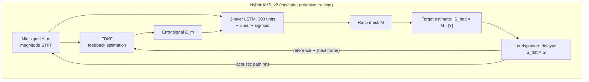
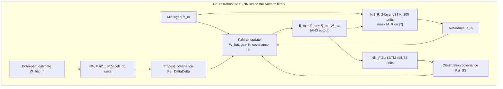

# Zhang, Zhang, Yu & Yu 2024: Enhanced Acoustic Howling Suppression via Hybrid Kalman Filter and Deep Learning

**Authors**: [[entities/hao-zhang|Hao Zhang]], [[entities/yixuan-zhang|Yixuan Zhang]], [[entities/meng-yu|Meng Yu]], [[entities/dong-yu|Dong Yu]]
**Institutions**: Tencent AI Lab, Bellevue, WA, USA (Yixuan Zhang contributed during a Tencent AI Lab internship)
**Published**: IEEE/ACM Transactions on Audio, Speech, and Language Processing, vol. 32, 2024
**Type**: Journal Paper
**DOI**: [10.1109/TASLP.2024.3402565](https://doi.org/10.1109/TASLP.2024.3402565)
**Zotero**: [BFCUSHRY](zotero://select/items/0_BFCUSHRY)

**Relation to prior versions**: this is the extended journal version of the Interspeech 2023 Hybrid AHS paper ([[sources/zhang-2023-hybrid-ahs|Zhang 2023: Hybrid AHS]]). It absorbs the Interspeech 2024 companion ([[sources/zhang-2024-neural-kalman-howling|Zhang 2024: Neural Network Augmented Kalman Filter for AHS]]) as its NeuralKalmanAHS branch, adds the recursive training paradigm with trainability strategies, and replaces the preprint's SARNN backbone with a lightweight 2-layer LSTM (8 ms frames) for deployment feasibility.

---

## Summary

This journal paper presents a comprehensive study of fusing Kalman filtering and deep learning for acoustic howling suppression (AHS), introducing two integration approaches: **HybridAHS**, which cascades a frequency-domain Kalman filter (FDKF) with a neural network, and **NeuralKalmanAHS**, which embeds NN modules inside the Kalman filter for reference-signal and covariance-matrix estimation. Its central methodological contribution is a **recursive training paradigm** that generates training signals adaptively inside the closed acoustic loop — eliminating the training-inference mismatch that plagued all previous NN-based AHS methods — made trainable by howling detection (to halt energy-explosive utterances) and by initializing from the offline-trained model. The best variant, HybridAHS_v2 with a complex ratio mask (cRM2), is the only method achieving positive SDR at gain G=3 (2.11 dB vs −6.32 dB for DeepAHS), while NeuralKalmanAHS trades some suppression power for lower speech distortion (best WER).

---

## Problem Formulation

### Acoustic Howling Model

In a single-channel amplification system, the loudspeaker signal re-enters the microphone through the acoustic path $h(t)$:

$$d(t) = x(t) * h(t), \qquad y(t) = s(t) + d(t)$$

Without AHS, the microphone signal becomes recursive:

$$y(t) = s(t) + [y(t - \Delta t) \cdot G] * h(t)$$

With an AHS module outputting $\hat{s}(t)$:

$$y(t) = s(t) + [\hat{s}(t - \Delta t) \cdot G] * h(t)$$

The AHS vs AEC distinction: in AEC the far-end reference is independent of the near-end target, while in AHS the playback content *is* the target speech (delayed and re-amplified), so any leakage is re-amplified through the loop — suppression without distorting the target is fundamentally harder.

### The Mismatch Problem

All previous NN-based AHS methods train on offline-generated microphone signals:
- **DeepMFC / howling-noise-suppression**: train on (3)-generated signals (no AHS in the loop), at marginally stable gain
- **DeepAHS / HybridAHS_v1**: train on the teacher-forced signal

$$y^{*}(t) = s(t) + [s(t - \Delta t) \cdot G] * h(t)$$

But at inference the real microphone signal follows (4) with the model's own output $\hat{s}(t-\Delta t)$ — the training signal differs from the inference distribution, and residual leakage compounds recursively. Teacher forcing reduces but does not eliminate this mismatch.

![[raw/papers/zhang-2024-enhanced-hybrid-ahs/figures/f79abed2d9e6b758724797889f1ac522982bb7f64ddec22cf04e1c56869f8886.jpg|Configuration of an AHS system]]

*Figure 1: Configuration of an AHS system — the loudspeaker output re-enters the microphone through the acoustic path $h(t)$ with gain $G$ and system delay $\Delta t$.*

### Kalman Filter for AHS (FDKF)

The frequency-domain Kalman filter models the loudspeaker-to-microphone path with a per-bin adaptive filter $\hat{\mathbf{W}}_m$, using the previous loudspeaker signal as reference $\mathbf{R}_m$. Prediction:

$$\mathbf{E}_m = \mathbf{Y}_m - \mathbf{R}_m \hat{\mathbf{W}}_m$$

Update:

$$\hat{\mathbf{W}}_{m+1} = A[\hat{\mathbf{W}}_m + \mathbf{K}_m \mathbf{E}_m]$$

$$\mathbf{K}_m = \mathbf{P}_m \mathbf{R}_m^H [\mathbf{R}_m \mathbf{P}_m \mathbf{R}_m^H + \boldsymbol{\Psi}_{SS,m}]^{-1}$$

$$\mathbf{P}_{m+1} = A^2[\mathbf{I} - \alpha \mathbf{K}_m \mathbf{R}_m]\mathbf{P}_m + \boldsymbol{\Psi}_{\Delta\Delta,m}$$

The noise covariances are approximated by exponential smoothing ($\lambda$) of $|\mathbf{E}_m|^2$ (observation) and $(1-A^2)|\hat{\mathbf{W}}_m|^2$ (process). These approximations presume accurate covariance estimates — inaccurate ones hinder the filter, motivating the learned covariance estimators in NeuralKalmanAHS.

---

## Methodology

### HybridAHS: Concatenation of Kalman Filter and NN

The FDKF first processes the microphone recording; its error output $\mathbf{E}_m$, concatenated with the microphone signal, feeds an NN that estimates the target. Two training variants share the same inference procedure:

**HybridAHS_v1 (offline training)**: the Kalman filter pre-processes the teacher-forced signal $y^*(t)$ offline, and the NN is trained on the pair $(y^*, e)$ — light training burden, and the Kalman-pre-processed input diminishes (but does not remove) the mismatch relative to NN-only methods.

**HybridAHS_v2 (recursive training)**: the NN is inserted into the acoustic loop *during training* — each processed frame recursively generates the next frame's microphone signal via $\mathbf{Y}_{m+1} = \mathbf{S}_{m+1} + \mathbf{X}_m \cdot \mathbf{H}$, preserving the recursive nature of howling; the loss is computed at the utterance level after processing the complete utterance. This eliminates the mismatch entirely at the cost of longer training.

![[raw/papers/zhang-2024-enhanced-hybrid-ahs/figures/c2a8bc1232d0af553491b8eaaa92af5e63e077c39d827f925e9f7f8942445114.jpg|HybridAHS_v1 offline training diagram]]

*Figure 2: HybridAHS_v1 — offline training. Both the teacher-forced microphone signal $\mathbf{Y}^*$ and the Kalman-pre-processed signal $\mathbf{E}$ are generated offline before NN training.*

![[raw/papers/zhang-2024-enhanced-hybrid-ahs/figures/73fe3d2daa9255871f5bd1a3e53bc8587d6a43e235de80970f7ac40be74ff58e.jpg|HybridAHS_v2 recursive training diagram]]

*Figure 3: HybridAHS_v2 — recursive training. The NN module is integrated into the acoustic loop; training signals are generated online, recursively, exactly as at inference.*

### Trainability: Making Recursive Training Converge

Randomly initialized NNs provide no howling suppression, so the recursive loop accumulates energy until values exceed floating-point limits ("NAN"), poisoning gradients for the whole batch. Two strategies fix this:

1. **Howling detection (HD)**: monitor the microphone signal during training; when the amplitude exceeds a threshold for 100 consecutive samples, halt processing of the utterance and compute the loss on the already-processed portion only.
2. **Initialization from HybridAHS_v1**: the pre-trained offline model suppresses howling well enough to prevent energy explosion from the start; recursive training of v2 then acts as a *recursive fine-tuning* of v1.

HD remains essential when no offline pre-trained model is available; v1-initialization accelerates convergence the most.

### NeuralKalmanAHS: NN Modules Inside the Kalman Filter

Rather than cascading, NeuralKalmanAHS embeds three NN modules in the FDKF itself:

- **Reference estimation** (Eq. 12): $\mathbf{R}_m = NN_R(\mathbf{Y}_m, \mathbf{E}_{m-1})$ — a learned ratio mask $\mathbf{M}_R$ applied to the microphone signal yields a refined reference. The conventional reference (previous processed frame) carries strong howling leakage during the convergence period; the learned one removes much of the howling component before it contaminates the weight update. It also implicitly absorbs the nonlinear amplifier/loudspeaker distortion that the linear playback model ignores.
- **Observation covariance** (Eq. 13): $\boldsymbol{\Psi}_{SS,m} = NN_{\Psi 1}(\mathbf{E}_m)$ — replaces the smoothing heuristic of (9).
- **Process covariance** (Eq. 14): $\boldsymbol{\Psi}_{\Delta\Delta,m} = NN_{\Psi 2}(\hat{\mathbf{W}}_m)$ — replaces the heuristic of (10).

No ground truth exists for $\mathbf{R}$, $\Psi_{SS}$, or $\Psi_{\Delta\Delta}$: they are intermediate outputs consumed directly by the Kalman update, and the three modules are trained jointly through the Kalman filter to minimize the final output error. NeuralKalmanAHS also uses recursive training.

![[raw/papers/zhang-2024-enhanced-hybrid-ahs/figures/ab122cd91a582b121ae1aaa52ebb66d69520a52cd58a75f8889330812a9b56cd.jpg|NeuralKalmanAHS overall system]]

![[raw/papers/zhang-2024-enhanced-hybrid-ahs/figures/fa2fccc7d06e874921a698e11e5786f77bdcae19b20528f5c9c5623da7e37161.jpg|NeuralKalmanAHS prediction of adaptive filter W and covariance P]]

*Figure 4: NN augmented Kalman filter (NeuralKalmanAHS): (a) overall system, (b) prediction of the adaptive filter $\hat{\mathbf{W}}$ and (c) prediction of the state estimation error covariance $\mathbf{P}$.*

### Model Structure, Inputs, and Outputs

**Spec tables:**

| | HybridAHS_v1 / v2 NN module |
|:--|:--|
| **Structure** | 2-layer LSTM, 300 units per hidden layer, followed by a linear layer + sigmoid |
| **Input** | Concatenated magnitude spectrograms of microphone $\mathbf{Y}$ and Kalman error $\mathbf{E}$; 8 ms frame / 4 ms shift |
| **Output** | Ratio mask $\mathbf{M}$ per T-F bin, applied to $|\mathbf{Y}|$: $|\hat{\mathbf{S}}| = \mathbf{M} \cdot |\mathbf{Y}|$ (cRM2 variant: complex ratio mask from $[|\mathbf{Y}|, |\mathbf{E}|, \mathbf{Y}_r, \mathbf{Y}_i]$) |
| **Training data** | AISHELL-2 Mandarin speech; 38,000 training utterances; 10,000 simulated RIR pairs; delay 0.15–0.25 s; gain G ∈ [1,3] |
| **Role** | Second-stage enhancement of the Kalman output — direct target-speech estimation |

| | NeuralKalmanAHS $NN_R$ |
|:--|:--|
| **Structure** | Same 2-layer LSTM (300 units) + linear + sigmoid |
| **Input** | Microphone magnitude $|\mathbf{Y}_m|$ and previous Kalman error $|\mathbf{E}_{m-1}|$ |
| **Output** | Mask $\mathbf{M}_R$ applied to $|\mathbf{Y}|$ → refined reference $|\mathbf{R}| = \mathbf{M}_R \cdot |\mathbf{Y}|$ |
| **Role** | Howling-free reference for the Kalman weight update (no ground truth; trained jointly through the filter) |

| | NeuralKalmanAHS $NN_{\Psi1}$ / $NN_{\Psi2}$ |
|:--|:--|
| **Structure** | One LSTM cell with 65 units, each followed by a linear layer and sigmoidal activation |
| **Input** | $NN_{\Psi1}$: Kalman error magnitude $\|\mathbf{E}_m\|$; $NN_{\Psi2}$: echo-path estimate magnitude $\|\hat{\mathbf{W}}_m\|$ |
| **Output** | Observation covariance $\Psi_{SS,m+1}$ and process covariance $\Psi_{\Delta\Delta,m+1}$, consumed directly by the Kalman update |
| **Role** | Replace heuristic covariance smoothing (Eqs. 9–10) with learned, jointly trained estimates |

All networks operate frame-by-frame on the magnitude spectrogram in the frequency domain; the three NeuralKalmanAHS modules are **trained jointly** (never separately) under a single utterance-level loss. Note the lightweight design: the preprint version's self-attentive RNN backbone was replaced by these small LSTMs to keep latency (8 ms frames) deployment-feasible.

### Training Losses

**HybridAHS (v1 and v2)** — mean absolute error on the magnitude spectrogram:

$$Loss = \mathrm{MAE}(|\hat{\mathbf{S}}|, |\mathbf{S}|)$$

**NeuralKalmanAHS** — the three NN modules are trained jointly to minimize the MAE between the *Kalman filter output* and the target magnitude:

$$Loss = \mathrm{MAE}(|\mathbf{E}|, |\mathbf{S}|)$$

No auxiliary losses supervise $\mathbf{R}$, $\Psi_{SS}$, $\Psi_{\Delta\Delta}$ — gradients flow through the Kalman recursion itself. For v2/NeuralKalmanAHS the loss is computed only after the full utterance is processed recursively (utterance-level loss over a frame-recursive forward pass).

---

## Experimental Setup

| Parameter | Value |
|:----------|:------|
| Dataset | AISHELL-2 (Mandarin) |
| Train / val / test | 38,000 / 1,000 / 200 utterances (disjoint utterances and RIRs) |
| RIRs | 10,000 pairs, image method, random rooms, RT60 ∈ [0, 0.6] s |
| System delay $\Delta t$ | 0.15–0.25 s (random) |
| Gain G | 1–3 (random during training; fixed grid at test) |
| Frame / shift | 8 ms / 4 ms |
| Features | Magnitude spectrogram only |
| Metrics | SDR, PESQ; WER via a general-purpose Mandarin ASR API |
| Baselines | Kalman filter (A = 0.9999, α = 0.5, λ = 0.9), DeepMFC, DeepAHS, NNAFC — all NN baselines use the same 2-layer LSTM for fairness |

Robustness conditions: nonlinear distortion (hard clipping at 0.8·max amplitude, then memoryless sigmoidal nonlinearity with randomized parameters), abrupt RIR change at utterance midpoint, and real-world recordings.

---

## Results

### Main Comparison (Table I)

Average SDR / PESQ over 200 test utterances:

| Method | SDR @G=2 | SDR @G=2.5 | SDR @G=3 | PESQ @G=2 | PESQ @G=3 |
|:-------|---------:|-----------:|---------:|----------:|----------:|
| no AHS | −31.86 | −33.10 | −33.21 | — | — |
| Kalman filter | −10.33 | −14.88 | −18.25 | 1.65 | 1.30 |
| DeepMFC | −2.78 | −5.59 | −7.69 | 1.88 | 1.56 |
| DeepAHS | 0.04 | −3.15 | −6.32 | 2.42 | 1.84 |
| NNAFC | 1.63 | −0.46 | −2.50 | 2.14 | 1.80 |
| HybridAHS_v1 | 1.25 | −1.45 | −3.49 | 2.33 | 1.95 |
| HybridAHS_v2 | 1.92 | 1.28 | 0.84 | 2.35 | 2.11 |
| **HybridAHS_v2 (cRM2)** | **3.04** | **2.49** | **2.11** | **2.40** | **2.13** |
| NeuralKalmanAHS | 2.65 | 1.98 | 1.45 | 2.33 | 2.04 |

- At G=3 every baseline has *negative* SDR (howling dominates); only the recursively trained methods stay positive.
- The recursively trained methods exhibit **dramatically lower standard deviations** (e.g. ±1.34 vs ±5.79 at G=2 for v2 vs v1) — the mismatch problem manifests as instability across utterances, and recursive training removes it.

![[raw/papers/zhang-2024-enhanced-hybrid-ahs/figures/85a3f1e1f0ead3fda82694253b0b0d00a5165dccfaf88f5693e471e25f2e142e.jpg|Spectrograms of a test utterance at moderate and severe howling]]

*Figure 5: Spectrograms at G=1.5 and G=3: (a) target, (b) no AHS, (c) Kalman, (d) DeepMFC, (e) DeepAHS, (f) NNAFC, (g) HybridAHS_v1, (h) HybridAHS_v2, (i) HybridAHS_v2 (cRM2), (j) NeuralKalmanAHS. HybridAHS_v2 leaves mild howling (continuous horizontal lines) that the complex-domain cRM2 variant resolves; NeuralKalmanAHS does not exhibit the problem.*

### Convergence of Recursive Training

![[raw/papers/zhang-2024-enhanced-hybrid-ahs/figures/b1c2dcd7f7f1314f92c65f284d08e2536f54799acf52f4935d18a98be5559389.jpg|Convergence of HybridAHS_v2 with recursive training]]

*Figure 6: Validation loss during recursive training — without strategies, convergence is uncertain (NAN issue); HD ensures trainability; v1 initialization substantially accelerates convergence.*

### Masking Strategies

RM, PSM, cRM1 (complex input $[\mathbf{Y}_r, \mathbf{Y}_i, \mathbf{E}_r, \mathbf{E}_i]$), and cRM2 (magnitude + complex input $[|\mathbf{Y}|, |\mathbf{E}|, \mathbf{Y}_r, \mathbf{Y}_i]$) are compared:

![[raw/papers/zhang-2024-enhanced-hybrid-ahs/figures/ed78faa3729049a088ba672325481da924b31ad955127602421933c7f60cbeb9.jpg|SDR and PESQ of HybridAHS_v2 with different masking strategies]]

*Figure 7: Phase enhancement improves SDR at a slight PESQ cost; cRM2 — including magnitude information in the complex-domain input — performs best.*

### Input Configurations (Table II, G=2)

| Inputs | Masked upon | SDR | PESQ |
|:-------|:-----------:|----:|-----:|
| [Kalman, Est] | Kalman | 2.00 | 2.15 |
| [Mic, Kalman] | Mic | 1.92 | 2.35 |
| [Mic, Kalman, Est] | Mic | 1.89 | 2.34 |

Masking the *microphone* signal (not the Kalman output) wins: the Kalman filter can distort the target while suppressing howling, and such distortion is hard to invert, whereas the raw microphone signal preserves the full target component.

### NeuralKalmanAHS Ablation (Table III)

| Configuration | SDR @G=2 | SDR @G=3 |
|:--------------|--------:|---------:|
| Kalman filter | −10.33 | −18.25 |
| Kalman + $NN_{\Psi1}$ + $NN_{\Psi2}$ | 1.38 | 0.60 |
| Kalman + $NN_R$ | 2.28 | 1.04 |
| NeuralKalmanAHS (all three) | **2.65** | **1.45** |

Reference-signal estimation contributes more than covariance estimation; combining both is best.

### HybridAHS vs NeuralKalmanAHS: Suppression vs Distortion

![[raw/papers/zhang-2024-enhanced-hybrid-ahs/figures/5e19fe8b5946496cb07a5baa6556a2a49e86d41f4a14d456e40484cc211ec13b.jpg|WER results of proposed methods in severe howling]]

*Figure 10: WER under severe howling — NeuralKalmanAHS beats HybridAHS (less distortion, better speech quality); cRM2 slightly *worse* than plain RM despite better SDR/PESQ, plausibly because the small network is insufficient for the higher complexity of complex-domain estimation.*

The two integration approaches embody a trade-off: HybridAHS is a speech-enhancement-style direct estimator with stronger suppression but NN artifacts; NeuralKalmanAHS is an AFC-style recursive subtractor with gentler impact on the target speech — reflected in the WER ordering.

### Stability Across Gain (Robustness of Recursive Training)

![[raw/papers/zhang-2024-enhanced-hybrid-ahs/figures/f306692308f7ab446366a2f46794c6277047f761020236393ae227aca3a22264.jpg|AHS performance at different G levels with fixed RIR and delay]]

*Figure 11: With fixed RIR and system delay, the offline-trained v1 collapses beyond G ≈ 2.2 while both recursively trained methods remain robust across the full G ∈ [1,3] sweep.*

### Robustness: Nonlinear Distortion, RIR Change, Real Recordings

| Method | SDR (NL) | SDR (RIR change) | PESQ (NL) | PESQ (RIR change) |
|:-------|---------:|-----------------:|----------:|------------------:|
| HybridAHS_v1 | 0.05 | −1.83 | 1.97 | 2.18 |
| HybridAHS_v2 | 2.38 | 1.74 | 2.18 | 2.28 |
| HybridAHS_v2 (cRM2) | 3.14 | 2.33 | 2.16 | 2.30 |
| NeuralKalmanAHS | 2.67 | 2.12 | 2.13 | 2.19 |

![[raw/papers/zhang-2024-enhanced-hybrid-ahs/figures/b6594519b75781f8c0c39b36f7835926b5bff135de836809b38f41ed1f1957fb.jpg|Spectrograms with real-world recordings]]

*Figure 12: Real-world recordings under severe howling — offline v1 leaves residual howling; the recursively trained methods suppress robustly, validating simulation-only training across delay/gain/room variations.*

---

## Key Contributions

1. **Two complementary Kalman + NN integration topologies**: HybridAHS (cascade — FDKF pre-processes, NN enhances) and NeuralKalmanAHS (embedding — NN modules estimate the reference signal and both covariance matrices inside the Kalman update), with a systematic comparison showing a suppression-vs-distortion trade-off between them.
2. **Recursive training paradigm**: training signals generated adaptively inside the closed acoustic loop, frame-recursively with an utterance-level loss — eliminating (not just reducing) the training-inference mismatch of all previous NN-based AHS methods, verified by order-of-magnitude lower standard deviations and stability across the full gain range.
3. **Trainability strategies for closed-loop training**: howling detection (halt energy-explosive utterances, compute loss on the processed prefix) and initialization from the offline pre-trained model, which together make recursive training converge.
4. **Masking-strategy and input-configuration findings**: complex ratio masking with magnitude inputs (cRM2) best suppresses residual mild howling; masking the raw microphone (not the Kalman output) preserves speech quality better because Kalman distortion is hard to invert.

---

## Related Concepts

- [[concepts/acoustic-howling-suppression|Acoustic Howling Suppression]]
- [[concepts/frequency-domain-kalman-filter|Frequency-Domain Kalman Filter]]
- [[concepts/kalman-filter|Kalman Filter]]
- [[concepts/recursive-training|Recursive Training]]
- [[concepts/teacher-forcing|Teacher Forcing]] — the offline alternative that recursive training supersedes
- [[concepts/closed-loop-fine-tuning|Closed-Loop Fine Tuning]] — the same open-loop-then-closed-loop pattern in hearing-aid DeepMFC
- [[concepts/howling-detection|Howling Detection]] — repurposed here as a trainability guard during recursive training
- [[concepts/complex-ratio-mask|Complex Ratio Mask]] — the cRM2 variant wins the masking comparison
- [[concepts/phase-sensitive-mask|Phase-Sensitive Mask]]
- [[concepts/long-short-term-memory|Long Short-Term Memory]]
- [[concepts/deep-marginal-feedback-cancellation|Deep Marginal Feedback Cancellation]] — baseline
- [[concepts/adaptive-feedback-cancellation|Adaptive Feedback Cancellation]]

## Related Synthesis

- [[synthesis/kalman-filter-theory-and-application|Kalman Filter Theory and Application]]
