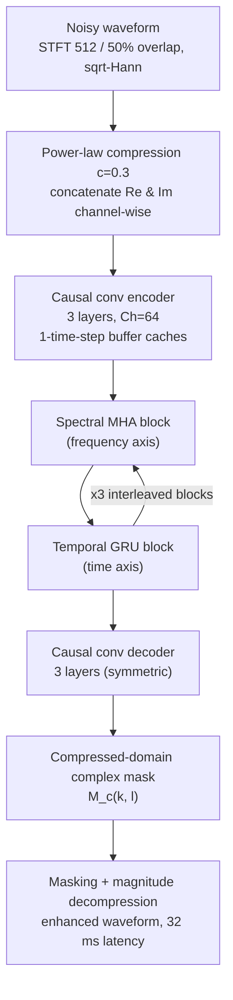

# Zhao & Madhu 2026: Spectrally Adaptive Loss for Streaming Speech Enhancement

**Authors**: [[entities/haixin-zhao|Haixin Zhao]], [[entities/nilesh-madhu|Nilesh Madhu]]
**Institution**: IDLab, Department of Electronics and Information Systems, Ghent University — imec, Ghent, Belgium
**Venue**: arXiv preprint 2608.30739 (2026); audio demos at [aspire.ugent.be/demos/IWAENC2026HZ](https://aspire.ugent.be/demos/IWAENC2026HZ/)
**Year**: 2026
**Type**: Preprint (conference paper)
**DOI**: [10.48550/arXiv.2608.30739](https://doi.org/10.48550/arXiv.2608.30739)
**Zotero**: [JVAXB72F](zotero://select/items/0_JVAXB72F)

## Summary

This paper proposes two spectrally weighted STFT loss functions for lightweight streaming speech enhancement that counteract the [[concepts/magnitude-phase-compensation-effect|magnitude-phase compensation effect]] — the systematic magnitude over-attenuation in mid-to-high frequencies caused by phase-aware losses. The sigmoid-weighted loss applies a fixed frequency-dependent modulation to the phase-aware term, while the signal-dependent spectrally adaptive loss conditions the modulation on the ground-truth log-magnitude spectrogram. To evaluate the objectives, the authors additionally design [[concepts/hyst-net|HyST-Net]], a lightweight U-Net backbone with hybrid MHA (spectral) + GRU (temporal) bottleneck modelling that is 4.77× faster than FTF-Net in frame-by-frame streaming on CPU.

## Problem Formulation

The widely adopted phase-aware compressed STFT loss combines a magnitude term and a phase-aware term:

$$
\mathcal{L}_{\mathrm{Mix}}
=(1-\lambda)\mathcal{L}_{\mathrm{Mag}}+\lambda\mathcal{L}_{\mathrm{Pha}}
=(1-\lambda)\lvert\widehat{S}^{c}-S^{c}\rvert^{2}+\lambda\lvert\widehat{S}^{c}e^{j\phi_{\widehat{S}}}-S^{c}e^{j\phi_{S}}\rvert^{2}
$$

where $S$ and $\widehat{S}$ are the ground-truth and estimated spectrograms, $c=0.3$ is the power-compression factor, and $\lambda$ trades off noise suppression against spectral reconstruction ($\lambda=0.3$ reported optimal by Braun & Tashev).

The [[concepts/magnitude-phase-compensation-effect|compensation effect]] (Wang et al. 2021) makes this trade-off spectrally non-uniform: when phase estimation is unreliable, the phase-aware term is minimised by driving the estimated magnitude toward zero, producing over-attenuation concentrated in mid-to-high frequencies and degrading perceptual brightness. A scalar $\lambda$ cannot capture this spectral variation — a small $\lambda$ under-suppresses noise, a large $\lambda$ over-attenuates.

![[raw/papers/zhao-2026-spectrally-adaptive-loss/figures/fig1.png|Fig. 1]]

*Figure 1: Enhanced spectrograms under varying phase-aware loss weights λ ∈ {0, 0.3, 1}. A larger λ improves noise suppression but causes over-attenuation in mid-to-high frequencies due to the compensation effect.*

## Methodology

### Spectrally Weighted STFT Losses

**Sigmoid-weighted loss** $\mathcal{L}_{\mathrm{Sig}}$ — replaces the scalar $\lambda$ with a smooth frequency-dependent sigmoid weight on the phase-aware term:

$$
\mathcal{L}_{\mathrm{Sig}}=0.7\cdot\mathcal{L}_{\mathrm{Mag}}+\lambda_{\mathrm{sig}}\cdot\sigma(\beta\cdot(f_{\mathrm{n}}-r))\cdot\mathcal{L}_{\mathrm{Pha}}
$$

with $f_n \in [0,1]$ the normalised frequency ($f_n=1$ at Nyquist), cut-off ratio $r=0.4$, weighting coefficient $\lambda_{\mathrm{sig}}=0.5$, and steepness $\beta=-20$. Because $\beta<0$, the weight is large at low frequencies (preserving noise suppression) and smoothly suppressed at mid-to-high frequencies (relieving over-attenuation), avoiding spectral banding artefacts.

**Spectrally adaptive loss** $\mathcal{L}_{\mathrm{Adp}}$ — the key empirical observation (Fig. 2) is that phase estimation accuracy correlates with spectral magnitude: high-magnitude regions yield accurate phase, low-magnitude regions are error-prone. $\mathcal{L}_{\mathrm{Adp}}$ therefore derives a signal-dependent weight from the clean log-magnitude spectrogram:

$$
\mathcal{L}_{\mathrm{Adp}}=0.7\cdot\mathcal{L}_{\mathrm{Mag}}+\lambda_{\mathrm{adp}}\cdot\mathcal{F}_{s}(\mathcal{N}(\sigma(\mathbb{E}_{t}[\log\lvert S\rvert])))\cdot\mathcal{L}_{\mathrm{Pha}}
$$

where $\mathbb{E}_t[\cdot]$ averages along time, $\sigma$ is a sigmoid with steepness 15 and cut-off 0.5 (operating on log-magnitude rather than frequency, hence the gentler steepness than $\mathcal{L}_{\mathrm{Sig}}$), $\mathcal{N}(\cdot)$ is min-max normalisation, $\mathcal{F}_s(\cdot)$ a 1D spectral smoothing operator, and $\lambda_{\mathrm{adp}}=0.6$. The phase-aware contribution is thus up-weighted in time-averaged high-energy frequency regions and suppressed where the signal itself is weak.

![[raw/papers/zhao-2026-spectrally-adaptive-loss/figures/fig2.png|Fig. 2]]

*Figure 2: Phase estimation error and corresponding ground-truth log-magnitude spectrogram of an example utterance — the correlation between the two motivates the signal-dependent weighting of the spectrally adaptive loss.*

### Model Structure, Inputs, and Outputs

[[concepts/hyst-net|HyST-Net]] is a U-Net with a three-layer causal convolutional encoder–decoder configured identically to FTF-Net (bottleneck channel size $Ch=64$), with one-time-step buffer caches in the convolutional layers for streaming inference. The bottleneck applies **three interleaved spectral-temporal blocks**: multi-head attention (MHA) along the frequency axis — all bins of a frame are available simultaneously, so attention's parallelism avoids recurrent spectral latency — and GRUs along the time axis, whose compact recurrent state is cheaper than causal-attention key-value caching for streaming.

| Spec | HyST-Net |
|------|----------|
| **Structure** | U-Net; 3-layer causal conv encoder–decoder (FTF-Net-identical config); bottleneck = 3 interleaved spectral (MHA)–temporal (GRU) blocks; $Ch = 64$ |
| **Input** | Re/Im parts of the power-law compressed ($c=0.3$) noisy complex spectrogram $X(k,l)$, concatenated channel-wise; STFT window 512 samples, 50% overlap (16 kHz wideband) |
| **Output** | Complex-valued ideal ratio mask $\widehat{M}_c(k,l)$ in the compressed domain: $\widehat{M}_c = \lvert S\rvert^c e^{j\phi_S} / (\lvert X\rvert^c e^{j\phi_X} + \gamma)$; applied to $X$ then magnitude-decompressed; 32 ms algorithmic latency, frame-by-frame streaming |
| **Training data** | DNS Challenge: 140 h synthesised wideband speech, SNRs −5 to 20 dB |
| **Role** | Lightweight backbone for evaluating the proposed loss functions under realistic streaming constraints |

### Training Losses

All losses are implemented in a **multi-resolution** form with STFT sizes $\{320, 512, 768\}$ and 50% overlap (denoted $\mathcal{L}_{\mathrm{MR\_Mix}}$, $\mathcal{L}_{\mathrm{MR\_Sig}}$, $\mathcal{L}_{\mathrm{MR\_Adp}}$). Each is $(1-w)\mathcal{L}_{\mathrm{Mag}} + w\cdot\mathcal{L}_{\mathrm{Pha}}$ where $w$ is: scalar $0.3$ (Mix baseline), the fixed sigmoid of frequency (Sig), or the signal-dependent weight derived from the clean log-magnitude (Adp), per the equations above. The magnitude weight 0.7/0.3-style split follows the prior art (Braun & Tashev). Optimiser: AdamW with exponential decay rates $(0.9, 0.99)$.

## Experimental Setup

| Item | Setting |
|------|---------|
| Dataset | DNS Challenge (training: 140 h synthesised wideband, SNR −5…20 dB; eval: public synthetic test set) |
| STFT | 512-sample window, 50% overlap, square-root Hann analysis/synthesis |
| Multi-resolution sizes | 320 / 512 / 768, 50% overlap |
| Optimiser | AdamW, betas (0.9, 0.99) |
| Causality | Fully causal, frame-by-frame streaming, 32 ms algorithmic latency |
| Metrics | DNSMOS P.835, PESQ, ESTOI, SI-SDR (overall); C-RMSE, M-RMSE, LSD, band-passed SI-SDR in MF (2–4 kHz) and HF (4–8 kHz) bands |
| RTF measurement | Single thread of Intel Xeon Silver 4310 CPU, strict frame-by-frame streaming, no block buffering, no ONNX optimisation |

## Results

**Backbone comparison (Table 1, all causal/streaming, trained with $\mathcal{L}_{\mathrm{MR\_Mix}}$):**

| Model | MACs [M/s] | Params [M] | RTF | DNSMOS | PESQ | ESTOI | SI-SDR |
|-------|-----------|-----------|-----|--------|------|-------|--------|
| CRUSE4-64-1×GRU2 | 301.2 | 2.85 | 0.26 | 3.22 | 2.84 | 0.912 | 17.19 |
| FTF-Net | 318.2 | 0.14 | 1.05 | 3.23 | 2.91 | 0.917 | 17.48 |
| **HyST-Net** | **266.4** | **0.11** | **0.22** | 3.23 | 2.86 | 0.914 | 17.41 |

HyST-Net matches FTF-Net's quality with 16.3% fewer MACs, 21% fewer parameters, and RTF 0.22 vs 1.05 (~4.77× faster on CPU — FTF-Net's recurrent spectral bottleneck is the main serialisation cost); vs CRUSE it achieves similar RTF with 96% fewer parameters.

**Loss comparison (Table 2, all on HyST-Net):**

| Loss | Overall: PESQ / ESTOI / SI-SDR | HF (4–8 kHz): C-RMSE / M-RMSE / LSD / SI-SDR | MF (2–4 kHz): C-RMSE / M-RMSE / LSD / SI-SDR |
|------|------------------------------|----------------------------------------------|----------------------------------------------|
| $\mathcal{L}_{\mathrm{MR\_Mix}}$ | 2.86 / 0.914 / 17.41 | 0.0273 / 0.0237 / 8.67 / 13.92 | 0.0539 / 0.0445 / 7.78 / 13.18 |
| $\mathcal{L}_{\mathrm{MR\_Sig}}$ | 2.81 / 0.912 / 17.36 | 0.0247 / 0.0201 / 7.48 / 14.36 | 0.0534 / 0.0452 / 7.88 / 13.24 |
| $\mathcal{L}_{\mathrm{MR\_Adp}}$ | 2.85 / 0.914 / 17.33 | 0.0246 / 0.0200 / 7.49 / 14.35 | **0.0522 / 0.0427 / 7.46 / 13.48** |

Both proposed losses hold overall metrics on par with the baseline while, in the HF band, cutting C-RMSE by ~9.5% and M-RMSE by ~15.2% and gaining 1.18 dB LSD and 0.43 dB SI-SDR. In the MF band only $\mathcal{L}_{\mathrm{MR\_Adp}}$ improves over the baseline across all metrics — the fixed sigmoid of $\mathcal{L}_{\mathrm{Sig}}$ is signal-agnostic and misses frequency-wise energy variation.

![[raw/papers/zhao-2026-spectrally-adaptive-loss/figures/fig3.png|Fig. 4]]

*Figure 4: Enhanced spectrograms under different loss functions. $\mathcal{L}_{\mathrm{MR\_Adp}}$ reconstructs more energy in mid-to-high frequency regions while maintaining effective noise suppression at low frequencies.*

## Key Contributions

1. **Sigmoid-weighted loss** ($\mathcal{L}_{\mathrm{Sig}}$): replaces the scalar phase-aware weight $\lambda$ with a smooth frequency-dependent sigmoid that suppresses the phase-aware term at mid-to-high frequencies, relieving the compensation effect without spectral banding artefacts.
2. **Spectrally adaptive loss** ($\mathcal{L}_{\mathrm{Adp}}$): a signal-dependent frequency-wise weight derived from the time-averaged ground-truth log-magnitude spectrogram, exploiting the empirical correlation between phase-estimation accuracy and spectral magnitude — the only variant that also improves mid-frequency reconstruction.
3. **HyST-Net**: a lightweight streaming backbone (266.4 M MACs/s, 0.11 M params, RTF 0.22, 32 ms latency) that pairs MHA-based spectral modelling with GRU-based temporal modelling, ~4.77× faster than FTF-Net on CPU with comparable quality.
4. **Band-conditional evaluation protocol**: evaluating C-RMSE / M-RMSE / LSD / SI-SDR separately in MF (2–4 kHz) and HF (4–8 kHz) bands, exposing spectral-reconstruction differences that broadband instrumental metrics (dominated by low frequencies) conceal.

## Related Concepts

- [[concepts/spectrally-adaptive-loss|Spectrally Adaptive Loss]]
- [[concepts/hyst-net|HyST-Net]]
- [[concepts/magnitude-phase-compensation-effect|Magnitude-Phase Compensation Effect]]
- [[concepts/frequency-domain-loss|Frequency Domain Loss for Time-Domain Networks]]
- [[concepts/power-law-compression|Power-Law Compression]]
- [[concepts/complex-ratio-mask|Complex Ratio Mask (cRM)]]
- [[concepts/gated-recurrent-unit|Gated Recurrent Unit]]
- [[concepts/dns-challenge|DNS Challenge]]
- [[concepts/attention-mechanism|Attention Mechanism]]

## Related Synthesis

- [[synthesis/deep-speech-enhancement|Deep Speech Enhancement]]
